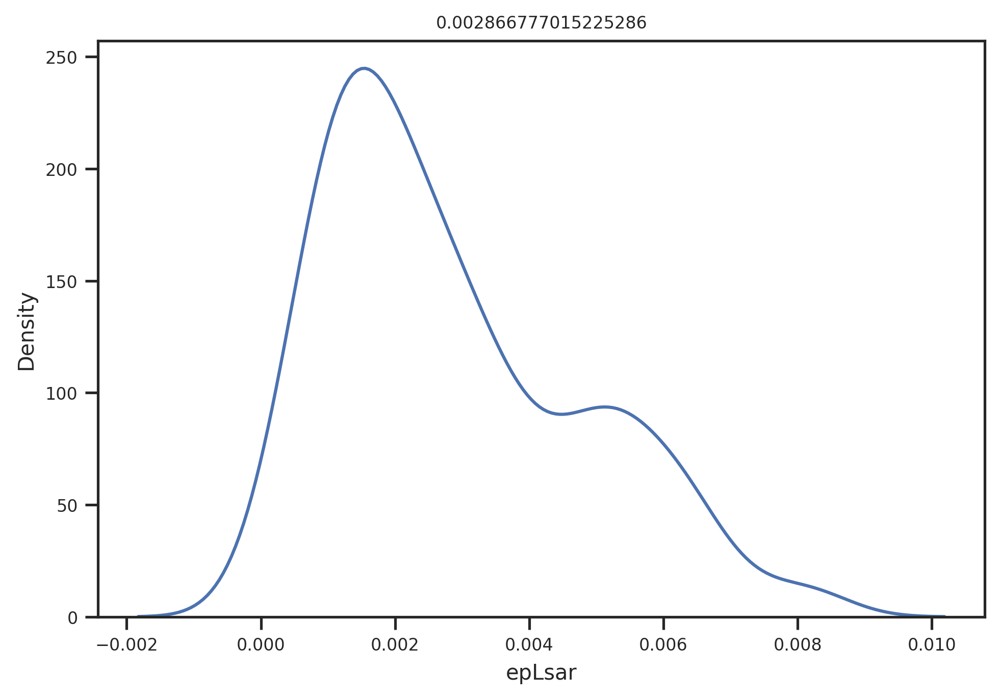
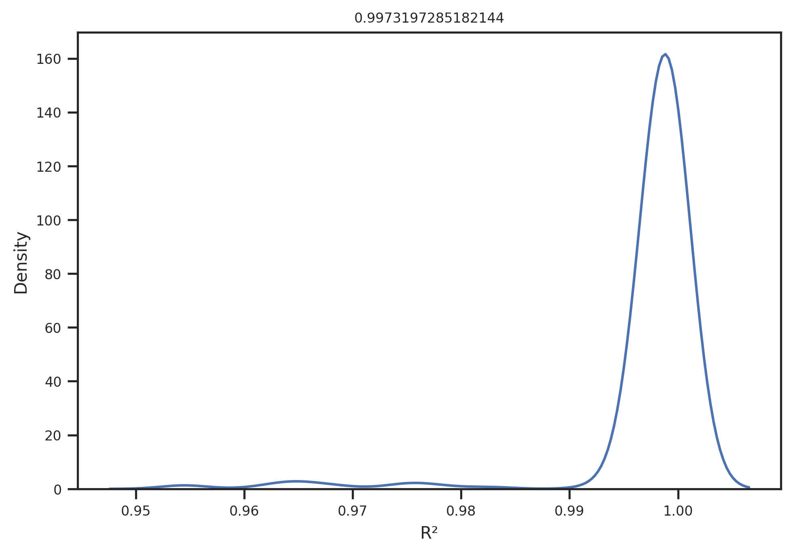
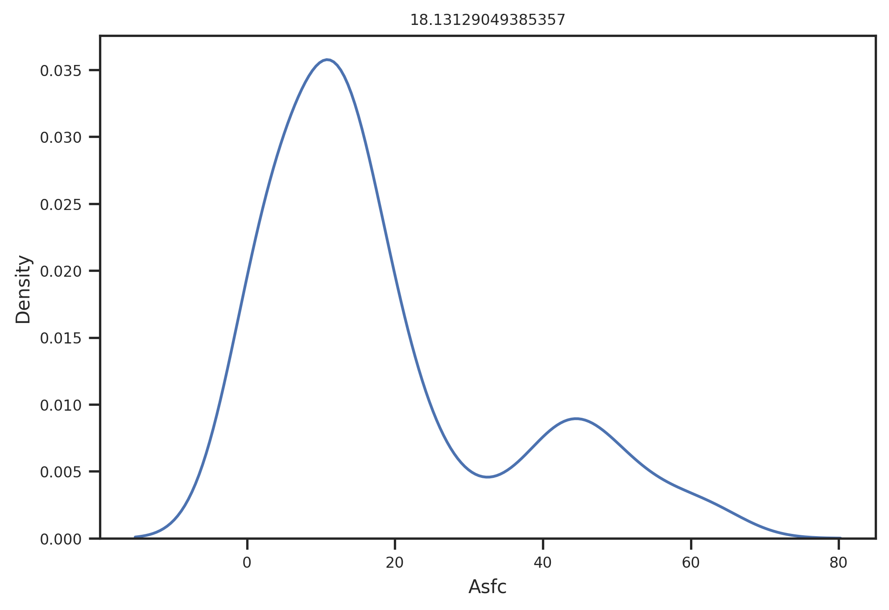
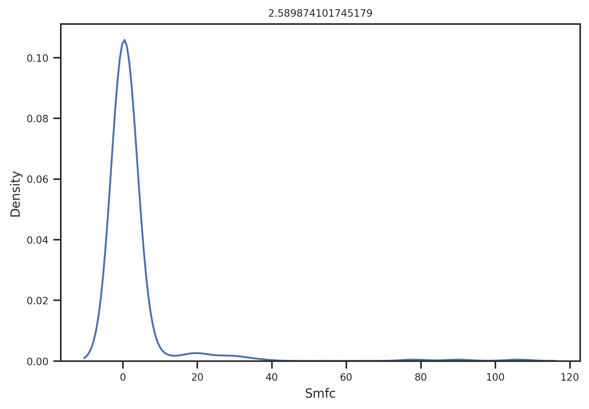
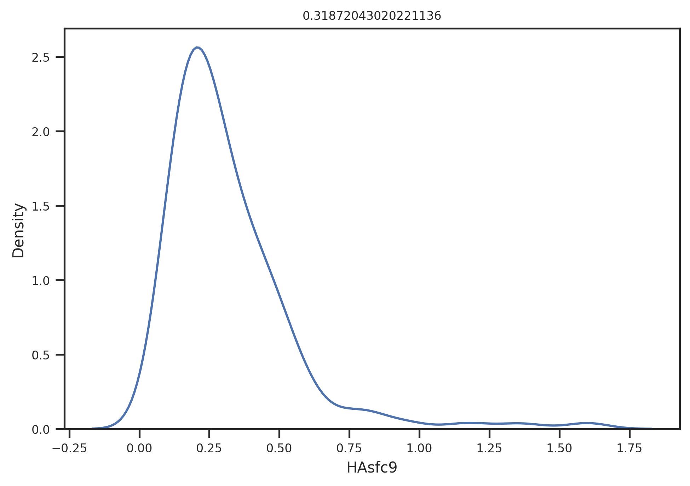
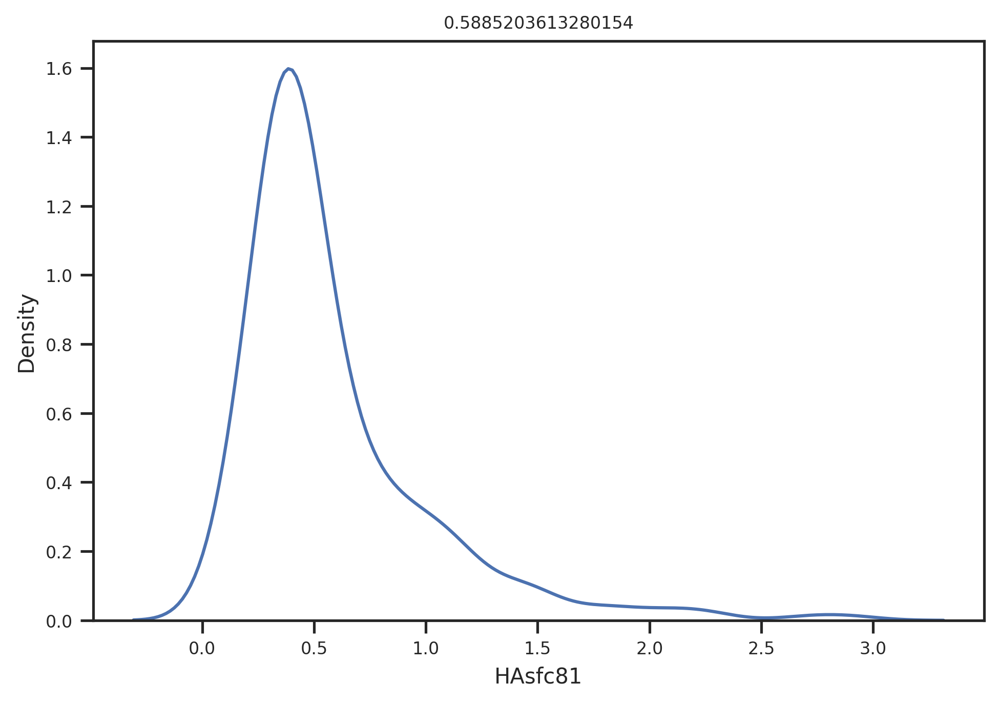

# Analysis for SSFA project: Preprocessing of data

## Table of contents
1. [Used packages](#imports)
1. [Global settings](#settings)
1. [Load data](#load)
1. [Data conversion](#conversion)
1. [Write out](#write)

## Used packages <a name="imports"></a>


```python
import numpy as np
import pandas as pd
import matplotlib.pyplot as plt
import seaborn as sns; sns.set()
import pickle
import arviz as az
import pymc3 as pm
from matplotlib.colors import to_rgb
import scipy.stats as stats 
from IPython.display import display
import matplotlib as mpl
```

    WARNING (theano.tensor.blas): Using NumPy C-API based implementation for BLAS functions.


## Global settings <a name="settings"></a>

#### Plotting


```python
widthMM = 190 
widthInch = widthMM / 25.4
ratio = 0.66666
heigthInch = ratio*widthInch

SMALL_SIZE = 8
MEDIUM_SIZE = 10
BIGGER_SIZE = 12

plt.rc('font', size=SMALL_SIZE)          # controls default text sizes
plt.rc('axes', titlesize=SMALL_SIZE)     # fontsize of the axes title
plt.rc('axes', labelsize=MEDIUM_SIZE)    # fontsize of the x and y labels
plt.rc('xtick', labelsize=SMALL_SIZE)    # fontsize of the tick labels
plt.rc('ytick', labelsize=SMALL_SIZE)    # fontsize of the tick labels
plt.rc('legend', fontsize=SMALL_SIZE)    # legend fontsize
plt.rc('figure', titlesize=BIGGER_SIZE)  # fontsize of the figure title
sns.set_style("ticks")

dpi = 300
```

## Load data <a name="load"></a>


```python
inFile = '../../R_analysis/derived_data/SSFA_all_data.xlsx'
```

#### Verify file
Compute hash sum of loaded file. If it is the same as the one reported below, the file content is the same.


```python
checksum_origin = '1a90206aa7c2daeb8c4054f3fc464b26'
```


```python
from filehash import FileHash
md5hasher = FileHash('md5')
checksum = md5hasher.hash_file(inFile)
checksum
```


    '1a90206aa7c2daeb8c4054f3fc464b26'


```python
checksum == checksum_origin
```


    True


#### Show data


```python
df = pd.read_excel(inFile)
df
```


<div>
<style scoped>
    .dataframe tbody tr th:only-of-type {
        vertical-align: middle;
    }

    .dataframe tbody tr th {
        vertical-align: top;
    }

    .dataframe thead th {
        text-align: right;
    }
</style>
<table border="1" class="dataframe">
  <thead>
    <tr style="text-align: right;">
      <th></th>
      <th>Dataset</th>
      <th>Name</th>
      <th>Software</th>
      <th>Diet</th>
      <th>Treatment</th>
      <th>Before.after</th>
      <th>epLsar</th>
      <th>R²</th>
      <th>Asfc</th>
      <th>Smfc</th>
      <th>HAsfc9</th>
      <th>HAsfc81</th>
      <th>NewEplsar</th>
    </tr>
  </thead>
  <tbody>
    <tr>
      <th>0</th>
      <td>GuineaPigs</td>
      <td>capor_2CC4B1_txP4_#1_1_100xL_1</td>
      <td>ConfoMap</td>
      <td>Dry lucerne</td>
      <td>NaN</td>
      <td>NaN</td>
      <td>0.002067</td>
      <td>0.998010</td>
      <td>10.781595</td>
      <td>0.448467</td>
      <td>0.180602</td>
      <td>0.364572</td>
      <td>0.018464</td>
    </tr>
    <tr>
      <th>1</th>
      <td>GuineaPigs</td>
      <td>capor_2CC4B1_txP4_#1_1_100xL_1</td>
      <td>Toothfrax</td>
      <td>Dry lucerne</td>
      <td>NaN</td>
      <td>NaN</td>
      <td>0.001471</td>
      <td>0.999343</td>
      <td>12.925787</td>
      <td>0.119219</td>
      <td>0.181994</td>
      <td>0.336894</td>
      <td>NaN</td>
    </tr>
    <tr>
      <th>2</th>
      <td>GuineaPigs</td>
      <td>capor_2CC4B1_txP4_#1_1_100xL_2</td>
      <td>ConfoMap</td>
      <td>Dry lucerne</td>
      <td>NaN</td>
      <td>NaN</td>
      <td>0.003812</td>
      <td>0.998425</td>
      <td>10.034063</td>
      <td>0.591396</td>
      <td>0.189600</td>
      <td>0.406517</td>
      <td>0.018962</td>
    </tr>
    <tr>
      <th>3</th>
      <td>GuineaPigs</td>
      <td>capor_2CC4B1_txP4_#1_1_100xL_2</td>
      <td>Toothfrax</td>
      <td>Dry lucerne</td>
      <td>NaN</td>
      <td>NaN</td>
      <td>0.002693</td>
      <td>0.999514</td>
      <td>11.999816</td>
      <td>0.119219</td>
      <td>0.158604</td>
      <td>0.381862</td>
      <td>NaN</td>
    </tr>
    <tr>
      <th>4</th>
      <td>GuineaPigs</td>
      <td>capor_2CC4B1_txP4_#1_1_100xL_3</td>
      <td>ConfoMap</td>
      <td>Dry lucerne</td>
      <td>NaN</td>
      <td>NaN</td>
      <td>0.003271</td>
      <td>0.998493</td>
      <td>10.497850</td>
      <td>0.591396</td>
      <td>0.113779</td>
      <td>0.363315</td>
      <td>0.018756</td>
    </tr>
    <tr>
      <th>...</th>
      <td>...</td>
      <td>...</td>
      <td>...</td>
      <td>...</td>
      <td>...</td>
      <td>...</td>
      <td>...</td>
      <td>...</td>
      <td>...</td>
      <td>...</td>
      <td>...</td>
      <td>...</td>
      <td>...</td>
    </tr>
    <tr>
      <th>275</th>
      <td>Sheeps</td>
      <td>L8-Ovis-90730-lm2sin-a</td>
      <td>Toothfrax</td>
      <td>Grass+dust</td>
      <td>NaN</td>
      <td>NaN</td>
      <td>0.004424</td>
      <td>0.999360</td>
      <td>1.819802</td>
      <td>1.408678</td>
      <td>0.836560</td>
      <td>1.111706</td>
      <td>NaN</td>
    </tr>
    <tr>
      <th>276</th>
      <td>Sheeps</td>
      <td>L8-Ovis-90764-lm2sin-a</td>
      <td>ConfoMap</td>
      <td>Grass+dust</td>
      <td>NaN</td>
      <td>NaN</td>
      <td>0.003403</td>
      <td>0.998228</td>
      <td>2.747241</td>
      <td>0.464115</td>
      <td>0.689143</td>
      <td>1.642896</td>
      <td>0.018978</td>
    </tr>
    <tr>
      <th>277</th>
      <td>Sheeps</td>
      <td>L8-Ovis-90764-lm2sin-a</td>
      <td>Toothfrax</td>
      <td>Grass+dust</td>
      <td>NaN</td>
      <td>NaN</td>
      <td>0.003139</td>
      <td>0.999739</td>
      <td>2.758297</td>
      <td>0.133366</td>
      <td>0.955699</td>
      <td>1.831721</td>
      <td>NaN</td>
    </tr>
    <tr>
      <th>278</th>
      <td>Sheeps</td>
      <td>L8-Ovis-90814-lm2sin-a</td>
      <td>ConfoMap</td>
      <td>Grass+dust</td>
      <td>NaN</td>
      <td>NaN</td>
      <td>0.001220</td>
      <td>0.999135</td>
      <td>1.437607</td>
      <td>1.321398</td>
      <td>0.391293</td>
      <td>0.820430</td>
      <td>0.017498</td>
    </tr>
    <tr>
      <th>279</th>
      <td>Sheeps</td>
      <td>L8-Ovis-90814-lm2sin-a</td>
      <td>Toothfrax</td>
      <td>Grass+dust</td>
      <td>NaN</td>
      <td>NaN</td>
      <td>0.000703</td>
      <td>0.999857</td>
      <td>1.432148</td>
      <td>0.408433</td>
      <td>0.346111</td>
      <td>0.839946</td>
      <td>NaN</td>
    </tr>
  </tbody>
</table>
<p>280 rows × 13 columns</p>
</div>


#### Create unfied column for treatment


```python
df = df.assign(Treatment=df.apply(lambda row: row['Diet'] if str(row['Treatment']) == "nan" else row['Treatment'],axis=1))
df
```


<div>
<style scoped>
    .dataframe tbody tr th:only-of-type {
        vertical-align: middle;
    }

    .dataframe tbody tr th {
        vertical-align: top;
    }

    .dataframe thead th {
        text-align: right;
    }
</style>
<table border="1" class="dataframe">
  <thead>
    <tr style="text-align: right;">
      <th></th>
      <th>Dataset</th>
      <th>Name</th>
      <th>Software</th>
      <th>Diet</th>
      <th>Treatment</th>
      <th>Before.after</th>
      <th>epLsar</th>
      <th>R²</th>
      <th>Asfc</th>
      <th>Smfc</th>
      <th>HAsfc9</th>
      <th>HAsfc81</th>
      <th>NewEplsar</th>
    </tr>
  </thead>
  <tbody>
    <tr>
      <th>0</th>
      <td>GuineaPigs</td>
      <td>capor_2CC4B1_txP4_#1_1_100xL_1</td>
      <td>ConfoMap</td>
      <td>Dry lucerne</td>
      <td>Dry lucerne</td>
      <td>NaN</td>
      <td>0.002067</td>
      <td>0.998010</td>
      <td>10.781595</td>
      <td>0.448467</td>
      <td>0.180602</td>
      <td>0.364572</td>
      <td>0.018464</td>
    </tr>
    <tr>
      <th>1</th>
      <td>GuineaPigs</td>
      <td>capor_2CC4B1_txP4_#1_1_100xL_1</td>
      <td>Toothfrax</td>
      <td>Dry lucerne</td>
      <td>Dry lucerne</td>
      <td>NaN</td>
      <td>0.001471</td>
      <td>0.999343</td>
      <td>12.925787</td>
      <td>0.119219</td>
      <td>0.181994</td>
      <td>0.336894</td>
      <td>NaN</td>
    </tr>
    <tr>
      <th>2</th>
      <td>GuineaPigs</td>
      <td>capor_2CC4B1_txP4_#1_1_100xL_2</td>
      <td>ConfoMap</td>
      <td>Dry lucerne</td>
      <td>Dry lucerne</td>
      <td>NaN</td>
      <td>0.003812</td>
      <td>0.998425</td>
      <td>10.034063</td>
      <td>0.591396</td>
      <td>0.189600</td>
      <td>0.406517</td>
      <td>0.018962</td>
    </tr>
    <tr>
      <th>3</th>
      <td>GuineaPigs</td>
      <td>capor_2CC4B1_txP4_#1_1_100xL_2</td>
      <td>Toothfrax</td>
      <td>Dry lucerne</td>
      <td>Dry lucerne</td>
      <td>NaN</td>
      <td>0.002693</td>
      <td>0.999514</td>
      <td>11.999816</td>
      <td>0.119219</td>
      <td>0.158604</td>
      <td>0.381862</td>
      <td>NaN</td>
    </tr>
    <tr>
      <th>4</th>
      <td>GuineaPigs</td>
      <td>capor_2CC4B1_txP4_#1_1_100xL_3</td>
      <td>ConfoMap</td>
      <td>Dry lucerne</td>
      <td>Dry lucerne</td>
      <td>NaN</td>
      <td>0.003271</td>
      <td>0.998493</td>
      <td>10.497850</td>
      <td>0.591396</td>
      <td>0.113779</td>
      <td>0.363315</td>
      <td>0.018756</td>
    </tr>
    <tr>
      <th>...</th>
      <td>...</td>
      <td>...</td>
      <td>...</td>
      <td>...</td>
      <td>...</td>
      <td>...</td>
      <td>...</td>
      <td>...</td>
      <td>...</td>
      <td>...</td>
      <td>...</td>
      <td>...</td>
      <td>...</td>
    </tr>
    <tr>
      <th>275</th>
      <td>Sheeps</td>
      <td>L8-Ovis-90730-lm2sin-a</td>
      <td>Toothfrax</td>
      <td>Grass+dust</td>
      <td>Grass+dust</td>
      <td>NaN</td>
      <td>0.004424</td>
      <td>0.999360</td>
      <td>1.819802</td>
      <td>1.408678</td>
      <td>0.836560</td>
      <td>1.111706</td>
      <td>NaN</td>
    </tr>
    <tr>
      <th>276</th>
      <td>Sheeps</td>
      <td>L8-Ovis-90764-lm2sin-a</td>
      <td>ConfoMap</td>
      <td>Grass+dust</td>
      <td>Grass+dust</td>
      <td>NaN</td>
      <td>0.003403</td>
      <td>0.998228</td>
      <td>2.747241</td>
      <td>0.464115</td>
      <td>0.689143</td>
      <td>1.642896</td>
      <td>0.018978</td>
    </tr>
    <tr>
      <th>277</th>
      <td>Sheeps</td>
      <td>L8-Ovis-90764-lm2sin-a</td>
      <td>Toothfrax</td>
      <td>Grass+dust</td>
      <td>Grass+dust</td>
      <td>NaN</td>
      <td>0.003139</td>
      <td>0.999739</td>
      <td>2.758297</td>
      <td>0.133366</td>
      <td>0.955699</td>
      <td>1.831721</td>
      <td>NaN</td>
    </tr>
    <tr>
      <th>278</th>
      <td>Sheeps</td>
      <td>L8-Ovis-90814-lm2sin-a</td>
      <td>ConfoMap</td>
      <td>Grass+dust</td>
      <td>Grass+dust</td>
      <td>NaN</td>
      <td>0.001220</td>
      <td>0.999135</td>
      <td>1.437607</td>
      <td>1.321398</td>
      <td>0.391293</td>
      <td>0.820430</td>
      <td>0.017498</td>
    </tr>
    <tr>
      <th>279</th>
      <td>Sheeps</td>
      <td>L8-Ovis-90814-lm2sin-a</td>
      <td>Toothfrax</td>
      <td>Grass+dust</td>
      <td>Grass+dust</td>
      <td>NaN</td>
      <td>0.000703</td>
      <td>0.999857</td>
      <td>1.432148</td>
      <td>0.408433</td>
      <td>0.346111</td>
      <td>0.839946</td>
      <td>NaN</td>
    </tr>
  </tbody>
</table>
<p>280 rows × 13 columns</p>
</div>


```python
df.Treatment.unique()
```


    array(['Dry lucerne', 'Dry grass', 'Dry bamboo', 'BrushDirt', 'RubDirt',
           'Control', 'BrushNoDirt', 'Clover', 'Clover+dust', 'Grass',
           'Grass+dust'], dtype=object)


#### Sort data for later enumeration


```python
df = df.sort_values(["Dataset","Treatment","Name","Software"]).reset_index(drop=True)
df
```


<div>
<style scoped>
    .dataframe tbody tr th:only-of-type {
        vertical-align: middle;
    }

    .dataframe tbody tr th {
        vertical-align: top;
    }

    .dataframe thead th {
        text-align: right;
    }
</style>
<table border="1" class="dataframe">
  <thead>
    <tr style="text-align: right;">
      <th></th>
      <th>Dataset</th>
      <th>Name</th>
      <th>Software</th>
      <th>Diet</th>
      <th>Treatment</th>
      <th>Before.after</th>
      <th>epLsar</th>
      <th>R²</th>
      <th>Asfc</th>
      <th>Smfc</th>
      <th>HAsfc9</th>
      <th>HAsfc81</th>
      <th>NewEplsar</th>
    </tr>
  </thead>
  <tbody>
    <tr>
      <th>0</th>
      <td>GuineaPigs</td>
      <td>capor_2CC6B1_txP4_#1_1_100xL_1</td>
      <td>ConfoMap</td>
      <td>Dry bamboo</td>
      <td>Dry bamboo</td>
      <td>NaN</td>
      <td>0.004586</td>
      <td>0.998684</td>
      <td>8.109445</td>
      <td>0.737898</td>
      <td>0.118870</td>
      <td>0.368635</td>
      <td>0.019529</td>
    </tr>
    <tr>
      <th>1</th>
      <td>GuineaPigs</td>
      <td>capor_2CC6B1_txP4_#1_1_100xL_1</td>
      <td>Toothfrax</td>
      <td>Dry bamboo</td>
      <td>Dry bamboo</td>
      <td>NaN</td>
      <td>0.004721</td>
      <td>0.999560</td>
      <td>10.320730</td>
      <td>0.119219</td>
      <td>0.135471</td>
      <td>0.361833</td>
      <td>NaN</td>
    </tr>
    <tr>
      <th>2</th>
      <td>GuineaPigs</td>
      <td>capor_2CC6B1_txP4_#1_1_100xL_2</td>
      <td>ConfoMap</td>
      <td>Dry bamboo</td>
      <td>Dry bamboo</td>
      <td>NaN</td>
      <td>0.006056</td>
      <td>0.998708</td>
      <td>10.395128</td>
      <td>0.625040</td>
      <td>0.175340</td>
      <td>0.315513</td>
      <td>0.020162</td>
    </tr>
    <tr>
      <th>3</th>
      <td>GuineaPigs</td>
      <td>capor_2CC6B1_txP4_#1_1_100xL_2</td>
      <td>Toothfrax</td>
      <td>Dry bamboo</td>
      <td>Dry bamboo</td>
      <td>NaN</td>
      <td>0.005856</td>
      <td>0.999467</td>
      <td>13.199232</td>
      <td>0.119219</td>
      <td>0.169232</td>
      <td>0.261217</td>
      <td>NaN</td>
    </tr>
    <tr>
      <th>4</th>
      <td>GuineaPigs</td>
      <td>capor_2CC6B1_txP4_#1_1_100xL_3</td>
      <td>ConfoMap</td>
      <td>Dry bamboo</td>
      <td>Dry bamboo</td>
      <td>NaN</td>
      <td>0.005236</td>
      <td>0.998271</td>
      <td>8.497286</td>
      <td>0.591396</td>
      <td>0.221210</td>
      <td>0.391002</td>
      <td>0.019804</td>
    </tr>
    <tr>
      <th>...</th>
      <td>...</td>
      <td>...</td>
      <td>...</td>
      <td>...</td>
      <td>...</td>
      <td>...</td>
      <td>...</td>
      <td>...</td>
      <td>...</td>
      <td>...</td>
      <td>...</td>
      <td>...</td>
      <td>...</td>
    </tr>
    <tr>
      <th>275</th>
      <td>Sheeps</td>
      <td>L8-Ovis-90730-lm2sin-a</td>
      <td>Toothfrax</td>
      <td>Grass+dust</td>
      <td>Grass+dust</td>
      <td>NaN</td>
      <td>0.004424</td>
      <td>0.999360</td>
      <td>1.819802</td>
      <td>1.408678</td>
      <td>0.836560</td>
      <td>1.111706</td>
      <td>NaN</td>
    </tr>
    <tr>
      <th>276</th>
      <td>Sheeps</td>
      <td>L8-Ovis-90764-lm2sin-a</td>
      <td>ConfoMap</td>
      <td>Grass+dust</td>
      <td>Grass+dust</td>
      <td>NaN</td>
      <td>0.003403</td>
      <td>0.998228</td>
      <td>2.747241</td>
      <td>0.464115</td>
      <td>0.689143</td>
      <td>1.642896</td>
      <td>0.018978</td>
    </tr>
    <tr>
      <th>277</th>
      <td>Sheeps</td>
      <td>L8-Ovis-90764-lm2sin-a</td>
      <td>Toothfrax</td>
      <td>Grass+dust</td>
      <td>Grass+dust</td>
      <td>NaN</td>
      <td>0.003139</td>
      <td>0.999739</td>
      <td>2.758297</td>
      <td>0.133366</td>
      <td>0.955699</td>
      <td>1.831721</td>
      <td>NaN</td>
    </tr>
    <tr>
      <th>278</th>
      <td>Sheeps</td>
      <td>L8-Ovis-90814-lm2sin-a</td>
      <td>ConfoMap</td>
      <td>Grass+dust</td>
      <td>Grass+dust</td>
      <td>NaN</td>
      <td>0.001220</td>
      <td>0.999135</td>
      <td>1.437607</td>
      <td>1.321398</td>
      <td>0.391293</td>
      <td>0.820430</td>
      <td>0.017498</td>
    </tr>
    <tr>
      <th>279</th>
      <td>Sheeps</td>
      <td>L8-Ovis-90814-lm2sin-a</td>
      <td>Toothfrax</td>
      <td>Grass+dust</td>
      <td>Grass+dust</td>
      <td>NaN</td>
      <td>0.000703</td>
      <td>0.999857</td>
      <td>1.432148</td>
      <td>0.408433</td>
      <td>0.346111</td>
      <td>0.839946</td>
      <td>NaN</td>
    </tr>
  </tbody>
</table>
<p>280 rows × 13 columns</p>
</div>


## Data conversion <a name="conversion"></a>
#### Map categories to numerical identifiers
The model needs to address the different levels by integer codes.


```python
df["TreatmentNumber"] = df.Treatment.astype('category').cat.codes
df["SoftwareNumber"] = df.Software.astype('category').cat.codes
df["DatasetNumber"] = df.Dataset.astype('category').cat.codes
df["NameNumber"] = df.Name.astype('category').cat.codes
df
```


<div>
<style scoped>
    .dataframe tbody tr th:only-of-type {
        vertical-align: middle;
    }

    .dataframe tbody tr th {
        vertical-align: top;
    }

    .dataframe thead th {
        text-align: right;
    }
</style>
<table border="1" class="dataframe">
  <thead>
    <tr style="text-align: right;">
      <th></th>
      <th>Dataset</th>
      <th>Name</th>
      <th>Software</th>
      <th>Diet</th>
      <th>Treatment</th>
      <th>Before.after</th>
      <th>epLsar</th>
      <th>R²</th>
      <th>Asfc</th>
      <th>Smfc</th>
      <th>HAsfc9</th>
      <th>HAsfc81</th>
      <th>NewEplsar</th>
      <th>TreatmentNumber</th>
      <th>SoftwareNumber</th>
      <th>DatasetNumber</th>
      <th>NameNumber</th>
    </tr>
  </thead>
  <tbody>
    <tr>
      <th>0</th>
      <td>GuineaPigs</td>
      <td>capor_2CC6B1_txP4_#1_1_100xL_1</td>
      <td>ConfoMap</td>
      <td>Dry bamboo</td>
      <td>Dry bamboo</td>
      <td>NaN</td>
      <td>0.004586</td>
      <td>0.998684</td>
      <td>8.109445</td>
      <td>0.737898</td>
      <td>0.118870</td>
      <td>0.368635</td>
      <td>0.019529</td>
      <td>5</td>
      <td>0</td>
      <td>0</td>
      <td>116</td>
    </tr>
    <tr>
      <th>1</th>
      <td>GuineaPigs</td>
      <td>capor_2CC6B1_txP4_#1_1_100xL_1</td>
      <td>Toothfrax</td>
      <td>Dry bamboo</td>
      <td>Dry bamboo</td>
      <td>NaN</td>
      <td>0.004721</td>
      <td>0.999560</td>
      <td>10.320730</td>
      <td>0.119219</td>
      <td>0.135471</td>
      <td>0.361833</td>
      <td>NaN</td>
      <td>5</td>
      <td>1</td>
      <td>0</td>
      <td>116</td>
    </tr>
    <tr>
      <th>2</th>
      <td>GuineaPigs</td>
      <td>capor_2CC6B1_txP4_#1_1_100xL_2</td>
      <td>ConfoMap</td>
      <td>Dry bamboo</td>
      <td>Dry bamboo</td>
      <td>NaN</td>
      <td>0.006056</td>
      <td>0.998708</td>
      <td>10.395128</td>
      <td>0.625040</td>
      <td>0.175340</td>
      <td>0.315513</td>
      <td>0.020162</td>
      <td>5</td>
      <td>0</td>
      <td>0</td>
      <td>117</td>
    </tr>
    <tr>
      <th>3</th>
      <td>GuineaPigs</td>
      <td>capor_2CC6B1_txP4_#1_1_100xL_2</td>
      <td>Toothfrax</td>
      <td>Dry bamboo</td>
      <td>Dry bamboo</td>
      <td>NaN</td>
      <td>0.005856</td>
      <td>0.999467</td>
      <td>13.199232</td>
      <td>0.119219</td>
      <td>0.169232</td>
      <td>0.261217</td>
      <td>NaN</td>
      <td>5</td>
      <td>1</td>
      <td>0</td>
      <td>117</td>
    </tr>
    <tr>
      <th>4</th>
      <td>GuineaPigs</td>
      <td>capor_2CC6B1_txP4_#1_1_100xL_3</td>
      <td>ConfoMap</td>
      <td>Dry bamboo</td>
      <td>Dry bamboo</td>
      <td>NaN</td>
      <td>0.005236</td>
      <td>0.998271</td>
      <td>8.497286</td>
      <td>0.591396</td>
      <td>0.221210</td>
      <td>0.391002</td>
      <td>0.019804</td>
      <td>5</td>
      <td>0</td>
      <td>0</td>
      <td>118</td>
    </tr>
    <tr>
      <th>...</th>
      <td>...</td>
      <td>...</td>
      <td>...</td>
      <td>...</td>
      <td>...</td>
      <td>...</td>
      <td>...</td>
      <td>...</td>
      <td>...</td>
      <td>...</td>
      <td>...</td>
      <td>...</td>
      <td>...</td>
      <td>...</td>
      <td>...</td>
      <td>...</td>
      <td>...</td>
    </tr>
    <tr>
      <th>275</th>
      <td>Sheeps</td>
      <td>L8-Ovis-90730-lm2sin-a</td>
      <td>Toothfrax</td>
      <td>Grass+dust</td>
      <td>Grass+dust</td>
      <td>NaN</td>
      <td>0.004424</td>
      <td>0.999360</td>
      <td>1.819802</td>
      <td>1.408678</td>
      <td>0.836560</td>
      <td>1.111706</td>
      <td>NaN</td>
      <td>9</td>
      <td>1</td>
      <td>2</td>
      <td>51</td>
    </tr>
    <tr>
      <th>276</th>
      <td>Sheeps</td>
      <td>L8-Ovis-90764-lm2sin-a</td>
      <td>ConfoMap</td>
      <td>Grass+dust</td>
      <td>Grass+dust</td>
      <td>NaN</td>
      <td>0.003403</td>
      <td>0.998228</td>
      <td>2.747241</td>
      <td>0.464115</td>
      <td>0.689143</td>
      <td>1.642896</td>
      <td>0.018978</td>
      <td>9</td>
      <td>0</td>
      <td>2</td>
      <td>52</td>
    </tr>
    <tr>
      <th>277</th>
      <td>Sheeps</td>
      <td>L8-Ovis-90764-lm2sin-a</td>
      <td>Toothfrax</td>
      <td>Grass+dust</td>
      <td>Grass+dust</td>
      <td>NaN</td>
      <td>0.003139</td>
      <td>0.999739</td>
      <td>2.758297</td>
      <td>0.133366</td>
      <td>0.955699</td>
      <td>1.831721</td>
      <td>NaN</td>
      <td>9</td>
      <td>1</td>
      <td>2</td>
      <td>52</td>
    </tr>
    <tr>
      <th>278</th>
      <td>Sheeps</td>
      <td>L8-Ovis-90814-lm2sin-a</td>
      <td>ConfoMap</td>
      <td>Grass+dust</td>
      <td>Grass+dust</td>
      <td>NaN</td>
      <td>0.001220</td>
      <td>0.999135</td>
      <td>1.437607</td>
      <td>1.321398</td>
      <td>0.391293</td>
      <td>0.820430</td>
      <td>0.017498</td>
      <td>9</td>
      <td>0</td>
      <td>2</td>
      <td>53</td>
    </tr>
    <tr>
      <th>279</th>
      <td>Sheeps</td>
      <td>L8-Ovis-90814-lm2sin-a</td>
      <td>Toothfrax</td>
      <td>Grass+dust</td>
      <td>Grass+dust</td>
      <td>NaN</td>
      <td>0.000703</td>
      <td>0.999857</td>
      <td>1.432148</td>
      <td>0.408433</td>
      <td>0.346111</td>
      <td>0.839946</td>
      <td>NaN</td>
      <td>9</td>
      <td>1</td>
      <td>2</td>
      <td>53</td>
    </tr>
  </tbody>
</table>
<p>280 rows × 17 columns</p>
</div>


Prepare dictionaries to be able to remap to names later


```python
dictTreatment = dict( zip( df['Treatment'].astype('category').cat.codes, df['Treatment'] ) )
dictTreatment
```


    {5: 'Dry bamboo',
     6: 'Dry grass',
     7: 'Dry lucerne',
     0: 'BrushDirt',
     1: 'BrushNoDirt',
     4: 'Control',
     10: 'RubDirt',
     2: 'Clover',
     3: 'Clover+dust',
     8: 'Grass',
     9: 'Grass+dust'}


```python
dictSoftware = dict( zip( df['Software'].astype('category').cat.codes, df['Software'] ) )
dictSoftware
```


    {0: 'ConfoMap', 1: 'Toothfrax'}


```python
dictDataset = dict( zip( df['Dataset'].astype('category').cat.codes, df['Dataset'] ) )
dictDataset
```


    {0: 'GuineaPigs', 1: 'Lithics', 2: 'Sheeps'}


```python
dictName = dict( zip( df['Name'].astype('category').cat.codes, df['Name'] ) )
dictName
```


    {116: 'capor_2CC6B1_txP4_#1_1_100xL_1',
     117: 'capor_2CC6B1_txP4_#1_1_100xL_2',
     118: 'capor_2CC6B1_txP4_#1_1_100xL_3',
     119: 'capor_2CC6B1_txP4_#1_1_100xL_4',
     120: 'capor_2CC6B2_txP4_#1_1_100xL_1',
     121: 'capor_2CC6B2_txP4_#1_1_100xL_2',
     122: 'capor_2CC6B2_txP4_#1_1_100xL_3',
     123: 'capor_2CC6B2_txP4_#1_1_100xL_4',
     124: 'capor_2CC6G1_txP4_#1_1_100xL_1',
     125: 'capor_2CC6G1_txP4_#1_1_100xL_2',
     126: 'capor_2CC6G1_txP4_#1_1_100xL_3',
     127: 'capor_2CC6G1_txP4_#1_1_100xL_4',
     128: 'capor_2CC6G2_txP4_#1_1_100xL_1',
     129: 'capor_2CC6G2_txP4_#1_1_100xL_2',
     130: 'capor_2CC6G2_txP4_#1_1_100xL_3',
     131: 'capor_2CC6G2_txP4_#1_1_100xL_4',
     132: 'capor_2CC6R1_txP4_#1_1_100xL_1',
     133: 'capor_2CC6R1_txP4_#1_1_100xL_2',
     134: 'capor_2CC6R1_txP4_#1_1_100xL_3',
     135: 'capor_2CC6R1_txP4_#1_1_100xL_4',
     136: 'capor_2CC6R2_txP4_#1_1_100xL_1',
     137: 'capor_2CC6R2_txP4_#1_1_100xL_2',
     138: 'capor_2CC6R2_txP4_#1_1_100xL_3',
     139: 'capor_2CC6R2_txP4_#1_1_100xL_4',
     94: 'capor_2CC5B1_txP4_#1_1_100xL_1',
     95: 'capor_2CC5B1_txP4_#1_1_100xL_2',
     96: 'capor_2CC5B1_txP4_#1_1_100xL_3',
     97: 'capor_2CC5B1_txP4_#1_1_100xL_4',
     98: 'capor_2CC5B2_txP4_#1_1_100xL_1',
     99: 'capor_2CC5B2_txP4_#1_1_100xL_2',
     100: 'capor_2CC5B2_txP4_#1_1_100xL_3',
     101: 'capor_2CC5B2_txP4_#1_1_100xL_4',
     102: 'capor_2CC5G1_txP4_#1_1_100xL_1',
     103: 'capor_2CC5G1_txP4_#1_1_100xL_2',
     104: 'capor_2CC5G1_txP4_#1_1_100xL_3',
     105: 'capor_2CC5G2_txP4_#1_1_100xL_1',
     106: 'capor_2CC5G2_txP4_#1_1_100xL_2',
     107: 'capor_2CC5G2_txP4_#1_1_100xL_3',
     108: 'capor_2CC5R1_txP4_#1_1_100xL_1',
     109: 'capor_2CC5R1_txP4_#1_1_100xL_2',
     110: 'capor_2CC5R1_txP4_#1_1_100xL_3',
     111: 'capor_2CC5R1_txP4_#1_1_100xL_4',
     112: 'capor_2CC5R2_txP4_#1_1_100xL_1',
     113: 'capor_2CC5R2_txP4_#1_1_100xL_2',
     114: 'capor_2CC5R2_txP4_#1_1_100xL_3',
     115: 'capor_2CC5R2_txP4_#1_1_100xL_4',
     70: 'capor_2CC4B1_txP4_#1_1_100xL_1',
     71: 'capor_2CC4B1_txP4_#1_1_100xL_2',
     72: 'capor_2CC4B1_txP4_#1_1_100xL_3',
     73: 'capor_2CC4B1_txP4_#1_1_100xL_4',
     74: 'capor_2CC4B2_txP4_#1_1_100xL_1',
     75: 'capor_2CC4B2_txP4_#1_1_100xL_2',
     76: 'capor_2CC4B2_txP4_#1_1_100xL_3',
     77: 'capor_2CC4B2_txP4_#1_1_100xL_4',
     78: 'capor_2CC4G1_txP4_#1_1_100xL_1',
     79: 'capor_2CC4G1_txP4_#1_1_100xL_2',
     80: 'capor_2CC4G1_txP4_#1_1_100xL_3',
     81: 'capor_2CC4G1_txP4_#1_1_100xL_4',
     82: 'capor_2CC4G2_txP4_#1_1_100xL_1',
     83: 'capor_2CC4G2_txP4_#1_1_100xL_2',
     84: 'capor_2CC4G2_txP4_#1_1_100xL_3',
     85: 'capor_2CC4G2_txP4_#1_1_100xL_4',
     86: 'capor_2CC4R1_txP4_#1_1_100xL_1',
     87: 'capor_2CC4R1_txP4_#1_1_100xL_2',
     88: 'capor_2CC4R1_txP4_#1_1_100xL_3',
     89: 'capor_2CC4R1_txP4_#1_1_100xL_4',
     90: 'capor_2CC4R2_txP4_#1_1_100xL_1',
     91: 'capor_2CC4R2_txP4_#1_1_100xL_2',
     92: 'capor_2CC4R2_txP4_#1_1_100xL_3',
     93: 'capor_2CC4R2_txP4_#1_1_100xL_4',
     0: 'FLT3-10_LSM2_50x-0.95_20190731_Area1_Topo',
     1: 'FLT3-10_LSM2_50x-0.95_20190731_Area2_Topo',
     2: 'FLT3-10_LSM_50x-0.95_20190328_Area1_Topo',
     3: 'FLT3-10_LSM_50x-0.95_20190328_Area2_Topo',
     54: 'QTZ3-13_LSM2_50x-0.95_20190822_Area1_Topo',
     55: 'QTZ3-13_LSM2_50x-0.95_20190822_Area2_Topo',
     56: 'QTZ3-13_LSM_50x-0.95_20190815_Area1_Topo',
     57: 'QTZ3-13_LSM_50x-0.95_20190815_Area2_Topo',
     10: 'FLT3-9_LSM2_50x-0.95_20190801_Area1_Topo',
     11: 'FLT3-9_LSM2_50x-0.95_20190801_Area2_Topo',
     12: 'FLT3-9_LSM_50x-0.95_20190321_Area1_Topo',
     13: 'FLT3-9_LSM_50x-0.95_20190321_Area2_Topo',
     66: 'QTZ3-5_LSM2_50x-0.95_20190731_Area1_Topo',
     67: 'QTZ3-5_LSM2_50x-0.95_20190731_Area2_Topo',
     68: 'QTZ3-5_LSM_50x-0.95_20190418_Area1_Topo',
     69: 'QTZ3-5_LSM_50x-0.95_20190418_Area2_Topo',
     8: 'FLT3-8_LSM2_50x-0.95_20190801_Area2_Topo',
     9: 'FLT3-8_LSM_50x-0.95_20190321_Area2_Topo',
     58: 'QTZ3-2_LSM2_50x-0.95_20190801_Area1_Topo',
     59: 'QTZ3-2_LSM2_50x-0.95_20190801_Area2_Topo',
     60: 'QTZ3-2_LSM_50x-0.95_20190314_Area1_Topo',
     61: 'QTZ3-2_LSM_50x-0.95_20190314_Area2_Topo',
     4: 'FLT3-13_LSM2_50x-0.95_20190730_Area1-trial2_Topo',
     5: 'FLT3-13_LSM2_50x-0.95_20190730_Area2_Topo',
     6: 'FLT3-13_LSM_50x-0.95_20190328_Area1_Topo',
     7: 'FLT3-13_LSM_50x-0.95_20190328_Area2_Topo',
     62: 'QTZ3-3_LSM2_50x-0.95_20190613_Area1_Topo',
     63: 'QTZ3-3_LSM2_50x-0.95_20190613_Area2_Topo',
     64: 'QTZ3-3_LSM_50x-0.95_20190418_Area1_Topo',
     65: 'QTZ3-3_LSM_50x-0.95_20190418_Area2_Topo',
     14: 'L5_Ovis_10098_lm2_sin',
     15: 'L5_Ovis_11723_lm2_sin',
     16: 'L5_Ovis_20939_lm2_sin',
     17: 'L5_Ovis_31042_lm2_sin',
     18: 'L5_Ovis_70519_lm2_sin',
     19: 'L5_Ovis_80140_lm2_sin',
     20: 'L5_Ovis_80307_lm2_sin',
     21: 'L5_Ovis_8045_lm2_sin',
     22: 'L5_Ovis_80729_lm2_sin',
     23: 'L5_Ovis_90287_lm2_sin',
     24: 'L6-Ovis-10106-lm2sin-a',
     25: 'L6-Ovis-11707-lm2sin-a',
     26: 'L6-Ovis-20094-lm2sin-a',
     27: 'L6-Ovis-21376-lm2sin-a',
     28: 'L6-Ovis-70379-lm2sin-a',
     29: 'L6-Ovis-80147-lm2sin-a',
     30: 'L6-Ovis-80288-lm2sin-a',
     31: 'L6-Ovis-80748-lm2sin-a',
     32: 'L6-Ovis-90074-lm2sin-a',
     33: 'L6-Ovis-90206-lm2sin-a',
     34: 'L7_Ovis_10053_lm2_sin',
     35: 'L7_Ovis_11739_lm2_sin',
     36: 'L7_Ovis_20965_lm2_sin',
     37: 'L7_Ovis_31028_lm2_sin',
     38: 'L7_Ovis_70520_lm2_sin',
     39: 'L7_Ovis_7898_lm2_sin',
     40: 'L7_Ovis_80133_lm2_dex',
     41: 'L7_Ovis_80312_lm2_sin',
     42: 'L7_Ovis_80718_lm2_sin',
     43: 'L7_Ovis_90455_lm2_sin',
     44: 'L8-Ovis-00234-lm2sin-a',
     45: 'L8-Ovis-08043-lm2sin-a',
     46: 'L8-Ovis-12772-lm2dex-a',
     47: 'L8-Ovis-80356-lm2sin-a',
     48: 'L8-Ovis-90045-lm2dex-a',
     49: 'L8-Ovis-90256-lm2sin-a',
     50: 'L8-Ovis-90300-lm2sin-a',
     51: 'L8-Ovis-90730-lm2sin-a',
     52: 'L8-Ovis-90764-lm2sin-a',
     53: 'L8-Ovis-90814-lm2sin-a'}


Prepare a dataframe that holds only data suited for computation


```python
dataDF = df[['TreatmentNumber','SoftwareNumber','DatasetNumber','NameNumber','epLsar','R²','Asfc','Smfc','HAsfc9','HAsfc81']].copy()
dataDF
```


<div>
<style scoped>
    .dataframe tbody tr th:only-of-type {
        vertical-align: middle;
    }

    .dataframe tbody tr th {
        vertical-align: top;
    }

    .dataframe thead th {
        text-align: right;
    }
</style>
<table border="1" class="dataframe">
  <thead>
    <tr style="text-align: right;">
      <th></th>
      <th>TreatmentNumber</th>
      <th>SoftwareNumber</th>
      <th>DatasetNumber</th>
      <th>NameNumber</th>
      <th>epLsar</th>
      <th>R²</th>
      <th>Asfc</th>
      <th>Smfc</th>
      <th>HAsfc9</th>
      <th>HAsfc81</th>
    </tr>
  </thead>
  <tbody>
    <tr>
      <th>0</th>
      <td>5</td>
      <td>0</td>
      <td>0</td>
      <td>116</td>
      <td>0.004586</td>
      <td>0.998684</td>
      <td>8.109445</td>
      <td>0.737898</td>
      <td>0.118870</td>
      <td>0.368635</td>
    </tr>
    <tr>
      <th>1</th>
      <td>5</td>
      <td>1</td>
      <td>0</td>
      <td>116</td>
      <td>0.004721</td>
      <td>0.999560</td>
      <td>10.320730</td>
      <td>0.119219</td>
      <td>0.135471</td>
      <td>0.361833</td>
    </tr>
    <tr>
      <th>2</th>
      <td>5</td>
      <td>0</td>
      <td>0</td>
      <td>117</td>
      <td>0.006056</td>
      <td>0.998708</td>
      <td>10.395128</td>
      <td>0.625040</td>
      <td>0.175340</td>
      <td>0.315513</td>
    </tr>
    <tr>
      <th>3</th>
      <td>5</td>
      <td>1</td>
      <td>0</td>
      <td>117</td>
      <td>0.005856</td>
      <td>0.999467</td>
      <td>13.199232</td>
      <td>0.119219</td>
      <td>0.169232</td>
      <td>0.261217</td>
    </tr>
    <tr>
      <th>4</th>
      <td>5</td>
      <td>0</td>
      <td>0</td>
      <td>118</td>
      <td>0.005236</td>
      <td>0.998271</td>
      <td>8.497286</td>
      <td>0.591396</td>
      <td>0.221210</td>
      <td>0.391002</td>
    </tr>
    <tr>
      <th>...</th>
      <td>...</td>
      <td>...</td>
      <td>...</td>
      <td>...</td>
      <td>...</td>
      <td>...</td>
      <td>...</td>
      <td>...</td>
      <td>...</td>
      <td>...</td>
    </tr>
    <tr>
      <th>275</th>
      <td>9</td>
      <td>1</td>
      <td>2</td>
      <td>51</td>
      <td>0.004424</td>
      <td>0.999360</td>
      <td>1.819802</td>
      <td>1.408678</td>
      <td>0.836560</td>
      <td>1.111706</td>
    </tr>
    <tr>
      <th>276</th>
      <td>9</td>
      <td>0</td>
      <td>2</td>
      <td>52</td>
      <td>0.003403</td>
      <td>0.998228</td>
      <td>2.747241</td>
      <td>0.464115</td>
      <td>0.689143</td>
      <td>1.642896</td>
    </tr>
    <tr>
      <th>277</th>
      <td>9</td>
      <td>1</td>
      <td>2</td>
      <td>52</td>
      <td>0.003139</td>
      <td>0.999739</td>
      <td>2.758297</td>
      <td>0.133366</td>
      <td>0.955699</td>
      <td>1.831721</td>
    </tr>
    <tr>
      <th>278</th>
      <td>9</td>
      <td>0</td>
      <td>2</td>
      <td>53</td>
      <td>0.001220</td>
      <td>0.999135</td>
      <td>1.437607</td>
      <td>1.321398</td>
      <td>0.391293</td>
      <td>0.820430</td>
    </tr>
    <tr>
      <th>279</th>
      <td>9</td>
      <td>1</td>
      <td>2</td>
      <td>53</td>
      <td>0.000703</td>
      <td>0.999857</td>
      <td>1.432148</td>
      <td>0.408433</td>
      <td>0.346111</td>
      <td>0.839946</td>
    </tr>
  </tbody>
</table>
<p>280 rows × 10 columns</p>
</div>


#### Scaling values to z-scores

Check if distributions allow meaningful z-scores ans store them


```python
dictMeanStd = dict()
```


```python
variablesList = ['epLsar','R²','Asfc','Smfc','HAsfc9','HAsfc81']
```


```python
for x in variablesList:
    fig = plt.figure(figsize=(widthInch,heigthInch), dpi= 300, facecolor='w');
    sns.kdeplot(dataDF[x]);
    mean = dataDF[x].mean()
    std = dataDF[x].std()
    dictMeanStd[x] = (mean,std)
    plt.title(mean)
    plt.show()
```


    

    


    

    


    

    


    

    


    

    


    

    


Smfc seems to have some extremely high values. All other parameters seem to be usable for conversion to z-scores.

Show values again:


```python
dictMeanStd
```


    {'epLsar': (0.002866777015225286, 0.0019173233323041528),
     'R²': (0.9973197285182144, 0.006745323717352575),
     'Asfc': (16.912804592866785, 16.042490777228107),
     'Smfc': (2.589874101745179, 10.663178442785044),
     'HAsfc9': (0.31872043020221136, 0.22913790943445264),
     'HAsfc81': (0.5885203613280154, 0.42897734163543366)}


Perform conversion to z-scores for better numerical stability and model generality


```python
dataZ = dataDF[['TreatmentNumber','SoftwareNumber','DatasetNumber','NameNumber']].copy().reset_index()
for x in variablesList:
    (mean,std) = dictMeanStd[x]
    dataZ["{}_z".format(x)] = (dataDF[x]-mean)/std    
dataZ
```


<div>
<style scoped>
    .dataframe tbody tr th:only-of-type {
        vertical-align: middle;
    }

    .dataframe tbody tr th {
        vertical-align: top;
    }

    .dataframe thead th {
        text-align: right;
    }
</style>
<table border="1" class="dataframe">
  <thead>
    <tr style="text-align: right;">
      <th></th>
      <th>index</th>
      <th>TreatmentNumber</th>
      <th>SoftwareNumber</th>
      <th>DatasetNumber</th>
      <th>NameNumber</th>
      <th>epLsar_z</th>
      <th>R²_z</th>
      <th>Asfc_z</th>
      <th>Smfc_z</th>
      <th>HAsfc9_z</th>
      <th>HAsfc81_z</th>
    </tr>
  </thead>
  <tbody>
    <tr>
      <th>0</th>
      <td>0</td>
      <td>5</td>
      <td>0</td>
      <td>0</td>
      <td>116</td>
      <td>0.896441</td>
      <td>0.202280</td>
      <td>-0.548753</td>
      <td>-0.173680</td>
      <td>-0.872185</td>
      <td>-0.512580</td>
    </tr>
    <tr>
      <th>1</th>
      <td>1</td>
      <td>5</td>
      <td>1</td>
      <td>0</td>
      <td>116</td>
      <td>0.967089</td>
      <td>0.332122</td>
      <td>-0.410913</td>
      <td>-0.231700</td>
      <td>-0.799735</td>
      <td>-0.528438</td>
    </tr>
    <tr>
      <th>2</th>
      <td>2</td>
      <td>5</td>
      <td>0</td>
      <td>0</td>
      <td>117</td>
      <td>1.663582</td>
      <td>0.205805</td>
      <td>-0.406276</td>
      <td>-0.184263</td>
      <td>-0.625739</td>
      <td>-0.636413</td>
    </tr>
    <tr>
      <th>3</th>
      <td>3</td>
      <td>5</td>
      <td>1</td>
      <td>0</td>
      <td>117</td>
      <td>1.559060</td>
      <td>0.318335</td>
      <td>-0.231484</td>
      <td>-0.231700</td>
      <td>-0.652395</td>
      <td>-0.762985</td>
    </tr>
    <tr>
      <th>4</th>
      <td>4</td>
      <td>5</td>
      <td>0</td>
      <td>0</td>
      <td>118</td>
      <td>1.235447</td>
      <td>0.140997</td>
      <td>-0.524577</td>
      <td>-0.187419</td>
      <td>-0.425552</td>
      <td>-0.460441</td>
    </tr>
    <tr>
      <th>...</th>
      <td>...</td>
      <td>...</td>
      <td>...</td>
      <td>...</td>
      <td>...</td>
      <td>...</td>
      <td>...</td>
      <td>...</td>
      <td>...</td>
      <td>...</td>
      <td>...</td>
    </tr>
    <tr>
      <th>275</th>
      <td>275</td>
      <td>9</td>
      <td>1</td>
      <td>2</td>
      <td>51</td>
      <td>0.812186</td>
      <td>0.302472</td>
      <td>-0.940814</td>
      <td>-0.110773</td>
      <td>2.259947</td>
      <td>1.219611</td>
    </tr>
    <tr>
      <th>276</th>
      <td>276</td>
      <td>9</td>
      <td>0</td>
      <td>2</td>
      <td>52</td>
      <td>0.279516</td>
      <td>0.134624</td>
      <td>-0.883003</td>
      <td>-0.199355</td>
      <td>1.616592</td>
      <td>2.457881</td>
    </tr>
    <tr>
      <th>277</th>
      <td>277</td>
      <td>9</td>
      <td>1</td>
      <td>2</td>
      <td>52</td>
      <td>0.141981</td>
      <td>0.358659</td>
      <td>-0.882314</td>
      <td>-0.230373</td>
      <td>2.779893</td>
      <td>2.898056</td>
    </tr>
    <tr>
      <th>278</th>
      <td>278</td>
      <td>9</td>
      <td>0</td>
      <td>2</td>
      <td>53</td>
      <td>-0.859089</td>
      <td>0.269132</td>
      <td>-0.964638</td>
      <td>-0.118959</td>
      <td>0.316720</td>
      <td>0.540611</td>
    </tr>
    <tr>
      <th>279</th>
      <td>279</td>
      <td>9</td>
      <td>1</td>
      <td>2</td>
      <td>53</td>
      <td>-1.128540</td>
      <td>0.376153</td>
      <td>-0.964978</td>
      <td>-0.204577</td>
      <td>0.119539</td>
      <td>0.586105</td>
    </tr>
  </tbody>
</table>
<p>280 rows × 11 columns</p>
</div>


#### Extract data vectors


```python
x1 = dataZ.SoftwareNumber.values
x2 = dataZ.TreatmentNumber.values
x3 = dataZ.NameNumber.values
x1,x2,x3
```


    (array([0, 1, 0, 1, 0, 1, 0, 1, 0, 1, 0, 1, 0, 1, 0, 1, 0, 1, 0, 1, 0, 1,
            0, 1, 0, 1, 0, 1, 0, 1, 0, 1, 0, 1, 0, 1, 0, 1, 0, 1, 0, 1, 0, 1,
            0, 1, 0, 1, 0, 1, 0, 1, 0, 1, 0, 1, 0, 1, 0, 1, 0, 1, 0, 1, 0, 1,
            0, 1, 0, 1, 0, 1, 0, 1, 0, 1, 0, 1, 0, 1, 0, 1, 0, 1, 0, 1, 0, 1,
            0, 1, 0, 1, 0, 1, 0, 1, 0, 1, 0, 1, 0, 1, 0, 1, 0, 1, 0, 1, 0, 1,
            0, 1, 0, 1, 0, 1, 0, 1, 0, 1, 0, 1, 0, 1, 0, 1, 0, 1, 0, 1, 0, 1,
            0, 1, 0, 1, 0, 1, 0, 1, 0, 1, 0, 1, 0, 1, 0, 1, 0, 1, 0, 1, 0, 1,
            0, 1, 0, 1, 0, 1, 0, 1, 0, 1, 0, 1, 0, 1, 0, 1, 0, 1, 0, 1, 0, 1,
            0, 1, 0, 1, 0, 1, 0, 1, 0, 1, 0, 1, 0, 1, 0, 1, 0, 1, 0, 1, 0, 1,
            0, 1, 0, 1, 0, 1, 0, 1, 0, 1, 0, 1, 0, 1, 0, 1, 0, 1, 0, 1, 0, 1,
            0, 1, 0, 1, 0, 1, 0, 1, 0, 1, 0, 1, 0, 1, 0, 1, 0, 1, 0, 1, 0, 1,
            0, 1, 0, 1, 0, 1, 0, 1, 0, 1, 0, 1, 0, 1, 0, 1, 0, 1, 0, 1, 0, 1,
            0, 1, 0, 1, 0, 1, 0, 1, 0, 1, 0, 1, 0, 1, 0, 1], dtype=int8),
     array([ 5,  5,  5,  5,  5,  5,  5,  5,  5,  5,  5,  5,  5,  5,  5,  5,  5,
             5,  5,  5,  5,  5,  5,  5,  5,  5,  5,  5,  5,  5,  5,  5,  5,  5,
             5,  5,  5,  5,  5,  5,  5,  5,  5,  5,  5,  5,  5,  5,  6,  6,  6,
             6,  6,  6,  6,  6,  6,  6,  6,  6,  6,  6,  6,  6,  6,  6,  6,  6,
             6,  6,  6,  6,  6,  6,  6,  6,  6,  6,  6,  6,  6,  6,  6,  6,  6,
             6,  6,  6,  6,  6,  6,  6,  7,  7,  7,  7,  7,  7,  7,  7,  7,  7,
             7,  7,  7,  7,  7,  7,  7,  7,  7,  7,  7,  7,  7,  7,  7,  7,  7,
             7,  7,  7,  7,  7,  7,  7,  7,  7,  7,  7,  7,  7,  7,  7,  7,  7,
             7,  7,  7,  7,  0,  0,  0,  0,  0,  0,  0,  0,  0,  0,  0,  0,  0,
             0,  0,  0,  1,  1,  1,  1,  1,  1,  1,  1,  1,  1,  1,  1,  1,  1,
             1,  1,  4,  4,  4,  4,  4,  4,  4,  4,  4,  4,  4,  4, 10, 10, 10,
            10, 10, 10, 10, 10, 10, 10, 10, 10, 10, 10, 10, 10,  2,  2,  2,  2,
             2,  2,  2,  2,  2,  2,  2,  2,  2,  2,  2,  2,  2,  2,  2,  2,  3,
             3,  3,  3,  3,  3,  3,  3,  3,  3,  3,  3,  3,  3,  3,  3,  3,  3,
             3,  3,  8,  8,  8,  8,  8,  8,  8,  8,  8,  8,  8,  8,  8,  8,  8,
             8,  8,  8,  8,  8,  9,  9,  9,  9,  9,  9,  9,  9,  9,  9,  9,  9,
             9,  9,  9,  9,  9,  9,  9,  9], dtype=int8),
     array([116, 116, 117, 117, 118, 118, 119, 119, 120, 120, 121, 121, 122,
            122, 123, 123, 124, 124, 125, 125, 126, 126, 127, 127, 128, 128,
            129, 129, 130, 130, 131, 131, 132, 132, 133, 133, 134, 134, 135,
            135, 136, 136, 137, 137, 138, 138, 139, 139,  94,  94,  95,  95,
             96,  96,  97,  97,  98,  98,  99,  99, 100, 100, 101, 101, 102,
            102, 103, 103, 104, 104, 105, 105, 106, 106, 107, 107, 108, 108,
            109, 109, 110, 110, 111, 111, 112, 112, 113, 113, 114, 114, 115,
            115,  70,  70,  71,  71,  72,  72,  73,  73,  74,  74,  75,  75,
             76,  76,  77,  77,  78,  78,  79,  79,  80,  80,  81,  81,  82,
             82,  83,  83,  84,  84,  85,  85,  86,  86,  87,  87,  88,  88,
             89,  89,  90,  90,  91,  91,  92,  92,  93,  93,   0,   0,   1,
              1,   2,   2,   3,   3,  54,  54,  55,  55,  56,  56,  57,  57,
             10,  10,  11,  11,  12,  12,  13,  13,  66,  66,  67,  67,  68,
             68,  69,  69,   8,   8,   9,   9,  58,  58,  59,  59,  60,  60,
             61,  61,   4,   4,   5,   5,   6,   6,   7,   7,  62,  62,  63,
             63,  64,  64,  65,  65,  14,  14,  15,  15,  16,  16,  17,  17,
             18,  18,  19,  19,  20,  20,  21,  21,  22,  22,  23,  23,  24,
             24,  25,  25,  26,  26,  27,  27,  28,  28,  29,  29,  30,  30,
             31,  31,  32,  32,  33,  33,  34,  34,  35,  35,  36,  36,  37,
             37,  38,  38,  39,  39,  40,  40,  41,  41,  42,  42,  43,  43,
             44,  44,  45,  45,  46,  46,  47,  47,  48,  48,  49,  49,  50,
             50,  51,  51,  52,  52,  53,  53], dtype=int16))


### Write out  <a name="write"></a>
Write data to disk so that it is usable for all analysis steps later without the need to run this notebook.


```python
data = [x1,x2,x3,df,dataZ,dictMeanStd,dictTreatment,dictSoftware]
```


```python
datafile = "../derived_data/preprocessing/preprocessed.dat"
```


```python
with open(datafile, "wb") as f:
    pickle.dump(data, f)
```

## Export to html and markdown


```python
!jupyter nbconvert --to html Preprocessing.ipynb
```


```python
!jupyter nbconvert --to markdown Preprocessing.ipynb
```


```python

```
