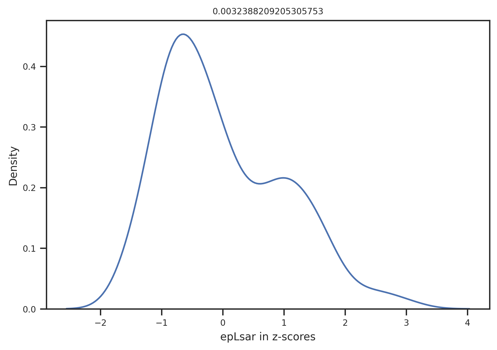
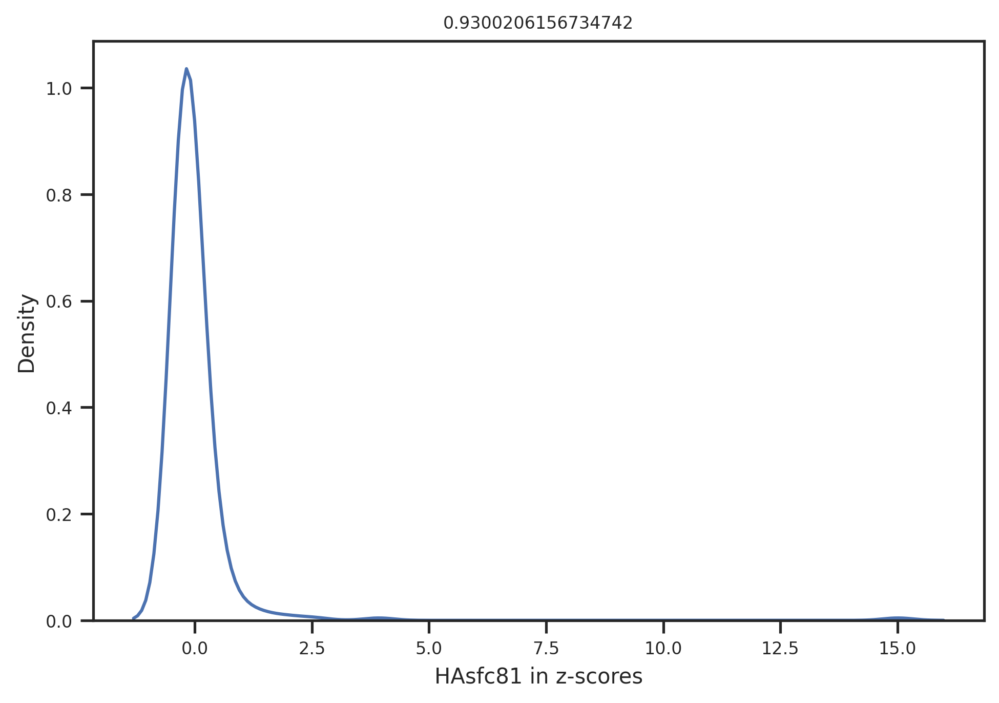

# Analysis for SSFA project: Preprocessing of data
# Filtered for < 20% NMP

## Table of contents
1. [Used packages](#imports)
1. [Global settings](#settings)
1. [Load data](#load)
1. [Data conversion](#conversion)
1. [Write out](#write)

## Used packages <a name="imports"></a>


```python
import numpy as np
import pandas as pd
import matplotlib.pyplot as plt
import seaborn as sns; sns.set()
import pickle
import arviz as az
import pymc3 as pm
from matplotlib.colors import to_rgb
import scipy.stats as stats 
from IPython.display import display
import matplotlib as mpl
```

## Global settings <a name="settings"></a>

#### Plotting


```python
widthMM = 190 
widthInch = widthMM / 25.4
ratio = 0.66666
heigthInch = ratio*widthInch

SMALL_SIZE = 8
MEDIUM_SIZE = 10
BIGGER_SIZE = 12

plt.rc('font', size=SMALL_SIZE)          # controls default text sizes
plt.rc('axes', titlesize=SMALL_SIZE)     # fontsize of the axes title
plt.rc('axes', labelsize=MEDIUM_SIZE)    # fontsize of the x and y labels
plt.rc('xtick', labelsize=SMALL_SIZE)    # fontsize of the tick labels
plt.rc('ytick', labelsize=SMALL_SIZE)    # fontsize of the tick labels
plt.rc('legend', fontsize=SMALL_SIZE)    # legend fontsize
plt.rc('figure', titlesize=BIGGER_SIZE)  # fontsize of the figure title
sns.set_style("ticks")

dpi = 300
```

## Load data <a name="load"></a>


```python
inFile = '../../R_analysis/derived_data/SSFA_all_data.xlsx'
```

#### Show data


```python
df = pd.read_excel(inFile)
df
```


<div>
<style scoped>
    .dataframe tbody tr th:only-of-type {
        vertical-align: middle;
    }

    .dataframe tbody tr th {
        vertical-align: top;
    }

    .dataframe thead th {
        text-align: right;
    }
</style>
<table border="1" class="dataframe">
  <thead>
    <tr style="text-align: right;">
      <th></th>
      <th>Dataset</th>
      <th>Name</th>
      <th>Software</th>
      <th>Diet</th>
      <th>Treatment</th>
      <th>Before.after</th>
      <th>NMP</th>
      <th>NMP_cat</th>
      <th>epLsar</th>
      <th>Rsquared</th>
      <th>Asfc</th>
      <th>Smfc</th>
      <th>HAsfc9</th>
      <th>HAsfc81</th>
      <th>NewEplsar</th>
    </tr>
  </thead>
  <tbody>
    <tr>
      <th>0</th>
      <td>GuineaPigs</td>
      <td>capor_2CC4B1_txP4_#1_1_100xL_1</td>
      <td>ConfoMap</td>
      <td>Dry lucerne</td>
      <td>NaN</td>
      <td>NaN</td>
      <td>1.896275</td>
      <td>0-5%</td>
      <td>0.001960</td>
      <td>0.996718</td>
      <td>16.007166</td>
      <td>0.330369</td>
      <td>0.178590</td>
      <td>0.390893</td>
      <td>0.018424</td>
    </tr>
    <tr>
      <th>1</th>
      <td>GuineaPigs</td>
      <td>capor_2CC4B1_txP4_#1_1_100xL_1</td>
      <td>Toothfrax</td>
      <td>Dry lucerne</td>
      <td>NaN</td>
      <td>NaN</td>
      <td>1.896275</td>
      <td>0-5%</td>
      <td>0.001471</td>
      <td>0.999343</td>
      <td>12.925787</td>
      <td>0.119219</td>
      <td>0.181994</td>
      <td>0.336894</td>
      <td>NaN</td>
    </tr>
    <tr>
      <th>2</th>
      <td>GuineaPigs</td>
      <td>capor_2CC4B1_txP4_#1_1_100xL_2</td>
      <td>ConfoMap</td>
      <td>Dry lucerne</td>
      <td>NaN</td>
      <td>NaN</td>
      <td>1.307524</td>
      <td>0-5%</td>
      <td>0.003662</td>
      <td>0.997693</td>
      <td>14.059325</td>
      <td>0.349875</td>
      <td>0.136064</td>
      <td>0.443493</td>
      <td>0.018889</td>
    </tr>
    <tr>
      <th>3</th>
      <td>GuineaPigs</td>
      <td>capor_2CC4B1_txP4_#1_1_100xL_2</td>
      <td>Toothfrax</td>
      <td>Dry lucerne</td>
      <td>NaN</td>
      <td>NaN</td>
      <td>1.307524</td>
      <td>0-5%</td>
      <td>0.002693</td>
      <td>0.999514</td>
      <td>11.999816</td>
      <td>0.119219</td>
      <td>0.158604</td>
      <td>0.381862</td>
      <td>NaN</td>
    </tr>
    <tr>
      <th>4</th>
      <td>GuineaPigs</td>
      <td>capor_2CC4B1_txP4_#1_1_100xL_3</td>
      <td>ConfoMap</td>
      <td>Dry lucerne</td>
      <td>NaN</td>
      <td>NaN</td>
      <td>0.806428</td>
      <td>0-5%</td>
      <td>0.003140</td>
      <td>0.997367</td>
      <td>15.123215</td>
      <td>0.330369</td>
      <td>0.130630</td>
      <td>0.356667</td>
      <td>0.018703</td>
    </tr>
    <tr>
      <th>...</th>
      <td>...</td>
      <td>...</td>
      <td>...</td>
      <td>...</td>
      <td>...</td>
      <td>...</td>
      <td>...</td>
      <td>...</td>
      <td>...</td>
      <td>...</td>
      <td>...</td>
      <td>...</td>
      <td>...</td>
      <td>...</td>
      <td>...</td>
    </tr>
    <tr>
      <th>279</th>
      <td>Lithics</td>
      <td>QTZ3-5_LSM_50x-0.95_20190418_Area2_Topo</td>
      <td>Toothfrax</td>
      <td>NaN</td>
      <td>BrushNoDirt</td>
      <td>Before</td>
      <td>2.646178</td>
      <td>0-5%</td>
      <td>0.002035</td>
      <td>0.998930</td>
      <td>23.258608</td>
      <td>0.058054</td>
      <td>1.013030</td>
      <td>1.465493</td>
      <td>NaN</td>
    </tr>
    <tr>
      <th>280</th>
      <td>Lithics</td>
      <td>QTZ3-5_LSM2_50x-0.95_20190731_Area1_Topo</td>
      <td>ConfoMap</td>
      <td>NaN</td>
      <td>BrushNoDirt</td>
      <td>After</td>
      <td>0.327121</td>
      <td>0-5%</td>
      <td>0.006007</td>
      <td>0.987344</td>
      <td>5.671158</td>
      <td>9.899664</td>
      <td>0.861890</td>
      <td>1.591851</td>
      <td>0.020109</td>
    </tr>
    <tr>
      <th>281</th>
      <td>Lithics</td>
      <td>QTZ3-5_LSM2_50x-0.95_20190731_Area1_Topo</td>
      <td>Toothfrax</td>
      <td>NaN</td>
      <td>BrushNoDirt</td>
      <td>After</td>
      <td>0.327121</td>
      <td>0-5%</td>
      <td>0.005429</td>
      <td>0.995536</td>
      <td>5.658399</td>
      <td>3.051471</td>
      <td>0.553206</td>
      <td>2.171753</td>
      <td>NaN</td>
    </tr>
    <tr>
      <th>282</th>
      <td>Lithics</td>
      <td>QTZ3-5_LSM2_50x-0.95_20190731_Area2_Topo</td>
      <td>ConfoMap</td>
      <td>NaN</td>
      <td>BrushNoDirt</td>
      <td>After</td>
      <td>1.731628</td>
      <td>0-5%</td>
      <td>0.004158</td>
      <td>0.994780</td>
      <td>9.493842</td>
      <td>2.099446</td>
      <td>0.759544</td>
      <td>3.567649</td>
      <td>0.019375</td>
    </tr>
    <tr>
      <th>283</th>
      <td>Lithics</td>
      <td>QTZ3-5_LSM2_50x-0.95_20190731_Area2_Topo</td>
      <td>Toothfrax</td>
      <td>NaN</td>
      <td>BrushNoDirt</td>
      <td>After</td>
      <td>1.731628</td>
      <td>0-5%</td>
      <td>0.004068</td>
      <td>0.995806</td>
      <td>9.415896</td>
      <td>1.048603</td>
      <td>0.648382</td>
      <td>3.790000</td>
      <td>NaN</td>
    </tr>
  </tbody>
</table>
<p>284 rows × 15 columns</p>
</div>


#### Create unfied column for treatment


```python
df = df.assign(Treatment=df.apply(lambda row: row['Diet'] if str(row['Treatment']) == "nan" else row['Treatment'],axis=1))
df
```


<div>
<style scoped>
    .dataframe tbody tr th:only-of-type {
        vertical-align: middle;
    }

    .dataframe tbody tr th {
        vertical-align: top;
    }

    .dataframe thead th {
        text-align: right;
    }
</style>
<table border="1" class="dataframe">
  <thead>
    <tr style="text-align: right;">
      <th></th>
      <th>Dataset</th>
      <th>Name</th>
      <th>Software</th>
      <th>Diet</th>
      <th>Treatment</th>
      <th>Before.after</th>
      <th>NMP</th>
      <th>NMP_cat</th>
      <th>epLsar</th>
      <th>Rsquared</th>
      <th>Asfc</th>
      <th>Smfc</th>
      <th>HAsfc9</th>
      <th>HAsfc81</th>
      <th>NewEplsar</th>
    </tr>
  </thead>
  <tbody>
    <tr>
      <th>0</th>
      <td>GuineaPigs</td>
      <td>capor_2CC4B1_txP4_#1_1_100xL_1</td>
      <td>ConfoMap</td>
      <td>Dry lucerne</td>
      <td>Dry lucerne</td>
      <td>NaN</td>
      <td>1.896275</td>
      <td>0-5%</td>
      <td>0.001960</td>
      <td>0.996718</td>
      <td>16.007166</td>
      <td>0.330369</td>
      <td>0.178590</td>
      <td>0.390893</td>
      <td>0.018424</td>
    </tr>
    <tr>
      <th>1</th>
      <td>GuineaPigs</td>
      <td>capor_2CC4B1_txP4_#1_1_100xL_1</td>
      <td>Toothfrax</td>
      <td>Dry lucerne</td>
      <td>Dry lucerne</td>
      <td>NaN</td>
      <td>1.896275</td>
      <td>0-5%</td>
      <td>0.001471</td>
      <td>0.999343</td>
      <td>12.925787</td>
      <td>0.119219</td>
      <td>0.181994</td>
      <td>0.336894</td>
      <td>NaN</td>
    </tr>
    <tr>
      <th>2</th>
      <td>GuineaPigs</td>
      <td>capor_2CC4B1_txP4_#1_1_100xL_2</td>
      <td>ConfoMap</td>
      <td>Dry lucerne</td>
      <td>Dry lucerne</td>
      <td>NaN</td>
      <td>1.307524</td>
      <td>0-5%</td>
      <td>0.003662</td>
      <td>0.997693</td>
      <td>14.059325</td>
      <td>0.349875</td>
      <td>0.136064</td>
      <td>0.443493</td>
      <td>0.018889</td>
    </tr>
    <tr>
      <th>3</th>
      <td>GuineaPigs</td>
      <td>capor_2CC4B1_txP4_#1_1_100xL_2</td>
      <td>Toothfrax</td>
      <td>Dry lucerne</td>
      <td>Dry lucerne</td>
      <td>NaN</td>
      <td>1.307524</td>
      <td>0-5%</td>
      <td>0.002693</td>
      <td>0.999514</td>
      <td>11.999816</td>
      <td>0.119219</td>
      <td>0.158604</td>
      <td>0.381862</td>
      <td>NaN</td>
    </tr>
    <tr>
      <th>4</th>
      <td>GuineaPigs</td>
      <td>capor_2CC4B1_txP4_#1_1_100xL_3</td>
      <td>ConfoMap</td>
      <td>Dry lucerne</td>
      <td>Dry lucerne</td>
      <td>NaN</td>
      <td>0.806428</td>
      <td>0-5%</td>
      <td>0.003140</td>
      <td>0.997367</td>
      <td>15.123215</td>
      <td>0.330369</td>
      <td>0.130630</td>
      <td>0.356667</td>
      <td>0.018703</td>
    </tr>
    <tr>
      <th>...</th>
      <td>...</td>
      <td>...</td>
      <td>...</td>
      <td>...</td>
      <td>...</td>
      <td>...</td>
      <td>...</td>
      <td>...</td>
      <td>...</td>
      <td>...</td>
      <td>...</td>
      <td>...</td>
      <td>...</td>
      <td>...</td>
      <td>...</td>
    </tr>
    <tr>
      <th>279</th>
      <td>Lithics</td>
      <td>QTZ3-5_LSM_50x-0.95_20190418_Area2_Topo</td>
      <td>Toothfrax</td>
      <td>NaN</td>
      <td>BrushNoDirt</td>
      <td>Before</td>
      <td>2.646178</td>
      <td>0-5%</td>
      <td>0.002035</td>
      <td>0.998930</td>
      <td>23.258608</td>
      <td>0.058054</td>
      <td>1.013030</td>
      <td>1.465493</td>
      <td>NaN</td>
    </tr>
    <tr>
      <th>280</th>
      <td>Lithics</td>
      <td>QTZ3-5_LSM2_50x-0.95_20190731_Area1_Topo</td>
      <td>ConfoMap</td>
      <td>NaN</td>
      <td>BrushNoDirt</td>
      <td>After</td>
      <td>0.327121</td>
      <td>0-5%</td>
      <td>0.006007</td>
      <td>0.987344</td>
      <td>5.671158</td>
      <td>9.899664</td>
      <td>0.861890</td>
      <td>1.591851</td>
      <td>0.020109</td>
    </tr>
    <tr>
      <th>281</th>
      <td>Lithics</td>
      <td>QTZ3-5_LSM2_50x-0.95_20190731_Area1_Topo</td>
      <td>Toothfrax</td>
      <td>NaN</td>
      <td>BrushNoDirt</td>
      <td>After</td>
      <td>0.327121</td>
      <td>0-5%</td>
      <td>0.005429</td>
      <td>0.995536</td>
      <td>5.658399</td>
      <td>3.051471</td>
      <td>0.553206</td>
      <td>2.171753</td>
      <td>NaN</td>
    </tr>
    <tr>
      <th>282</th>
      <td>Lithics</td>
      <td>QTZ3-5_LSM2_50x-0.95_20190731_Area2_Topo</td>
      <td>ConfoMap</td>
      <td>NaN</td>
      <td>BrushNoDirt</td>
      <td>After</td>
      <td>1.731628</td>
      <td>0-5%</td>
      <td>0.004158</td>
      <td>0.994780</td>
      <td>9.493842</td>
      <td>2.099446</td>
      <td>0.759544</td>
      <td>3.567649</td>
      <td>0.019375</td>
    </tr>
    <tr>
      <th>283</th>
      <td>Lithics</td>
      <td>QTZ3-5_LSM2_50x-0.95_20190731_Area2_Topo</td>
      <td>Toothfrax</td>
      <td>NaN</td>
      <td>BrushNoDirt</td>
      <td>After</td>
      <td>1.731628</td>
      <td>0-5%</td>
      <td>0.004068</td>
      <td>0.995806</td>
      <td>9.415896</td>
      <td>1.048603</td>
      <td>0.648382</td>
      <td>3.790000</td>
      <td>NaN</td>
    </tr>
  </tbody>
</table>
<p>284 rows × 15 columns</p>
</div>


```python
df.Treatment.unique()
```


    array(['Dry lucerne', 'Dry grass', 'Dry bamboo', 'Clover', 'Clover+dust',
           'Grass', 'Grass+dust', 'BrushDirt', 'RubDirt', 'Control',
           'BrushNoDirt'], dtype=object)


#### Sort data for later enumeration


```python
df = df.sort_values(["Dataset","Treatment","Name","Software"]).reset_index(drop=True)
df
```


<div>
<style scoped>
    .dataframe tbody tr th:only-of-type {
        vertical-align: middle;
    }

    .dataframe tbody tr th {
        vertical-align: top;
    }

    .dataframe thead th {
        text-align: right;
    }
</style>
<table border="1" class="dataframe">
  <thead>
    <tr style="text-align: right;">
      <th></th>
      <th>Dataset</th>
      <th>Name</th>
      <th>Software</th>
      <th>Diet</th>
      <th>Treatment</th>
      <th>Before.after</th>
      <th>NMP</th>
      <th>NMP_cat</th>
      <th>epLsar</th>
      <th>Rsquared</th>
      <th>Asfc</th>
      <th>Smfc</th>
      <th>HAsfc9</th>
      <th>HAsfc81</th>
      <th>NewEplsar</th>
    </tr>
  </thead>
  <tbody>
    <tr>
      <th>0</th>
      <td>GuineaPigs</td>
      <td>capor_2CC6B1_txP4_#1_1_100xL_1</td>
      <td>ConfoMap</td>
      <td>Dry bamboo</td>
      <td>Dry bamboo</td>
      <td>NaN</td>
      <td>0.717312</td>
      <td>0-5%</td>
      <td>0.004417</td>
      <td>0.998003</td>
      <td>11.656095</td>
      <td>0.294557</td>
      <td>0.135803</td>
      <td>0.363319</td>
      <td>0.019460</td>
    </tr>
    <tr>
      <th>1</th>
      <td>GuineaPigs</td>
      <td>capor_2CC6B1_txP4_#1_1_100xL_1</td>
      <td>Toothfrax</td>
      <td>Dry bamboo</td>
      <td>Dry bamboo</td>
      <td>NaN</td>
      <td>0.717312</td>
      <td>0-5%</td>
      <td>0.004721</td>
      <td>0.999560</td>
      <td>10.320730</td>
      <td>0.119219</td>
      <td>0.135471</td>
      <td>0.361833</td>
      <td>NaN</td>
    </tr>
    <tr>
      <th>2</th>
      <td>GuineaPigs</td>
      <td>capor_2CC6B1_txP4_#1_1_100xL_2</td>
      <td>ConfoMap</td>
      <td>Dry bamboo</td>
      <td>Dry bamboo</td>
      <td>NaN</td>
      <td>1.674215</td>
      <td>0-5%</td>
      <td>0.005866</td>
      <td>0.996198</td>
      <td>15.467083</td>
      <td>0.294557</td>
      <td>0.171903</td>
      <td>0.296292</td>
      <td>0.020079</td>
    </tr>
    <tr>
      <th>3</th>
      <td>GuineaPigs</td>
      <td>capor_2CC6B1_txP4_#1_1_100xL_2</td>
      <td>Toothfrax</td>
      <td>Dry bamboo</td>
      <td>Dry bamboo</td>
      <td>NaN</td>
      <td>1.674215</td>
      <td>0-5%</td>
      <td>0.005856</td>
      <td>0.999467</td>
      <td>13.199232</td>
      <td>0.119219</td>
      <td>0.169232</td>
      <td>0.261217</td>
      <td>NaN</td>
    </tr>
    <tr>
      <th>4</th>
      <td>GuineaPigs</td>
      <td>capor_2CC6B1_txP4_#1_1_100xL_3</td>
      <td>ConfoMap</td>
      <td>Dry bamboo</td>
      <td>Dry bamboo</td>
      <td>NaN</td>
      <td>1.760409</td>
      <td>0-5%</td>
      <td>0.005042</td>
      <td>0.994788</td>
      <td>13.201101</td>
      <td>0.294557</td>
      <td>0.261235</td>
      <td>0.405422</td>
      <td>0.019722</td>
    </tr>
    <tr>
      <th>...</th>
      <td>...</td>
      <td>...</td>
      <td>...</td>
      <td>...</td>
      <td>...</td>
      <td>...</td>
      <td>...</td>
      <td>...</td>
      <td>...</td>
      <td>...</td>
      <td>...</td>
      <td>...</td>
      <td>...</td>
      <td>...</td>
      <td>...</td>
    </tr>
    <tr>
      <th>279</th>
      <td>Sheeps</td>
      <td>L8-Ovis-90730-lm2sin-a</td>
      <td>Toothfrax</td>
      <td>Grass+dust</td>
      <td>Grass+dust</td>
      <td>NaN</td>
      <td>0.000000</td>
      <td>0-5%</td>
      <td>0.004424</td>
      <td>0.999360</td>
      <td>1.819802</td>
      <td>1.408678</td>
      <td>0.836560</td>
      <td>1.111706</td>
      <td>NaN</td>
    </tr>
    <tr>
      <th>280</th>
      <td>Sheeps</td>
      <td>L8-Ovis-90764-lm2sin-a</td>
      <td>ConfoMap</td>
      <td>Grass+dust</td>
      <td>Grass+dust</td>
      <td>NaN</td>
      <td>0.000000</td>
      <td>0-5%</td>
      <td>0.003403</td>
      <td>0.998850</td>
      <td>2.864831</td>
      <td>0.486556</td>
      <td>0.637499</td>
      <td>1.538943</td>
      <td>0.018978</td>
    </tr>
    <tr>
      <th>281</th>
      <td>Sheeps</td>
      <td>L8-Ovis-90764-lm2sin-a</td>
      <td>Toothfrax</td>
      <td>Grass+dust</td>
      <td>Grass+dust</td>
      <td>NaN</td>
      <td>0.000000</td>
      <td>0-5%</td>
      <td>0.003139</td>
      <td>0.999739</td>
      <td>2.758297</td>
      <td>0.133366</td>
      <td>0.955699</td>
      <td>1.831721</td>
      <td>NaN</td>
    </tr>
    <tr>
      <th>282</th>
      <td>Sheeps</td>
      <td>L8-Ovis-90814-lm2sin-a</td>
      <td>ConfoMap</td>
      <td>Grass+dust</td>
      <td>Grass+dust</td>
      <td>NaN</td>
      <td>0.000000</td>
      <td>0-5%</td>
      <td>0.001220</td>
      <td>0.999479</td>
      <td>1.481662</td>
      <td>1.237247</td>
      <td>0.370691</td>
      <td>0.804138</td>
      <td>0.017498</td>
    </tr>
    <tr>
      <th>283</th>
      <td>Sheeps</td>
      <td>L8-Ovis-90814-lm2sin-a</td>
      <td>Toothfrax</td>
      <td>Grass+dust</td>
      <td>Grass+dust</td>
      <td>NaN</td>
      <td>0.000000</td>
      <td>0-5%</td>
      <td>0.000703</td>
      <td>0.999857</td>
      <td>1.432148</td>
      <td>0.408433</td>
      <td>0.346111</td>
      <td>0.839946</td>
      <td>NaN</td>
    </tr>
  </tbody>
</table>
<p>284 rows × 15 columns</p>
</div>


## Data filtering


```python
df = df[df.NMP_cat != "20-100%"].reset_index(drop=True)
df
```


<div>
<style scoped>
    .dataframe tbody tr th:only-of-type {
        vertical-align: middle;
    }

    .dataframe tbody tr th {
        vertical-align: top;
    }

    .dataframe thead th {
        text-align: right;
    }
</style>
<table border="1" class="dataframe">
  <thead>
    <tr style="text-align: right;">
      <th></th>
      <th>Dataset</th>
      <th>Name</th>
      <th>Software</th>
      <th>Diet</th>
      <th>Treatment</th>
      <th>Before.after</th>
      <th>NMP</th>
      <th>NMP_cat</th>
      <th>epLsar</th>
      <th>Rsquared</th>
      <th>Asfc</th>
      <th>Smfc</th>
      <th>HAsfc9</th>
      <th>HAsfc81</th>
      <th>NewEplsar</th>
    </tr>
  </thead>
  <tbody>
    <tr>
      <th>0</th>
      <td>GuineaPigs</td>
      <td>capor_2CC6B1_txP4_#1_1_100xL_1</td>
      <td>ConfoMap</td>
      <td>Dry bamboo</td>
      <td>Dry bamboo</td>
      <td>NaN</td>
      <td>0.717312</td>
      <td>0-5%</td>
      <td>0.004417</td>
      <td>0.998003</td>
      <td>11.656095</td>
      <td>0.294557</td>
      <td>0.135803</td>
      <td>0.363319</td>
      <td>0.019460</td>
    </tr>
    <tr>
      <th>1</th>
      <td>GuineaPigs</td>
      <td>capor_2CC6B1_txP4_#1_1_100xL_1</td>
      <td>Toothfrax</td>
      <td>Dry bamboo</td>
      <td>Dry bamboo</td>
      <td>NaN</td>
      <td>0.717312</td>
      <td>0-5%</td>
      <td>0.004721</td>
      <td>0.999560</td>
      <td>10.320730</td>
      <td>0.119219</td>
      <td>0.135471</td>
      <td>0.361833</td>
      <td>NaN</td>
    </tr>
    <tr>
      <th>2</th>
      <td>GuineaPigs</td>
      <td>capor_2CC6B1_txP4_#1_1_100xL_2</td>
      <td>ConfoMap</td>
      <td>Dry bamboo</td>
      <td>Dry bamboo</td>
      <td>NaN</td>
      <td>1.674215</td>
      <td>0-5%</td>
      <td>0.005866</td>
      <td>0.996198</td>
      <td>15.467083</td>
      <td>0.294557</td>
      <td>0.171903</td>
      <td>0.296292</td>
      <td>0.020079</td>
    </tr>
    <tr>
      <th>3</th>
      <td>GuineaPigs</td>
      <td>capor_2CC6B1_txP4_#1_1_100xL_2</td>
      <td>Toothfrax</td>
      <td>Dry bamboo</td>
      <td>Dry bamboo</td>
      <td>NaN</td>
      <td>1.674215</td>
      <td>0-5%</td>
      <td>0.005856</td>
      <td>0.999467</td>
      <td>13.199232</td>
      <td>0.119219</td>
      <td>0.169232</td>
      <td>0.261217</td>
      <td>NaN</td>
    </tr>
    <tr>
      <th>4</th>
      <td>GuineaPigs</td>
      <td>capor_2CC6B1_txP4_#1_1_100xL_3</td>
      <td>ConfoMap</td>
      <td>Dry bamboo</td>
      <td>Dry bamboo</td>
      <td>NaN</td>
      <td>1.760409</td>
      <td>0-5%</td>
      <td>0.005042</td>
      <td>0.994788</td>
      <td>13.201101</td>
      <td>0.294557</td>
      <td>0.261235</td>
      <td>0.405422</td>
      <td>0.019722</td>
    </tr>
    <tr>
      <th>...</th>
      <td>...</td>
      <td>...</td>
      <td>...</td>
      <td>...</td>
      <td>...</td>
      <td>...</td>
      <td>...</td>
      <td>...</td>
      <td>...</td>
      <td>...</td>
      <td>...</td>
      <td>...</td>
      <td>...</td>
      <td>...</td>
      <td>...</td>
    </tr>
    <tr>
      <th>273</th>
      <td>Sheeps</td>
      <td>L8-Ovis-90730-lm2sin-a</td>
      <td>Toothfrax</td>
      <td>Grass+dust</td>
      <td>Grass+dust</td>
      <td>NaN</td>
      <td>0.000000</td>
      <td>0-5%</td>
      <td>0.004424</td>
      <td>0.999360</td>
      <td>1.819802</td>
      <td>1.408678</td>
      <td>0.836560</td>
      <td>1.111706</td>
      <td>NaN</td>
    </tr>
    <tr>
      <th>274</th>
      <td>Sheeps</td>
      <td>L8-Ovis-90764-lm2sin-a</td>
      <td>ConfoMap</td>
      <td>Grass+dust</td>
      <td>Grass+dust</td>
      <td>NaN</td>
      <td>0.000000</td>
      <td>0-5%</td>
      <td>0.003403</td>
      <td>0.998850</td>
      <td>2.864831</td>
      <td>0.486556</td>
      <td>0.637499</td>
      <td>1.538943</td>
      <td>0.018978</td>
    </tr>
    <tr>
      <th>275</th>
      <td>Sheeps</td>
      <td>L8-Ovis-90764-lm2sin-a</td>
      <td>Toothfrax</td>
      <td>Grass+dust</td>
      <td>Grass+dust</td>
      <td>NaN</td>
      <td>0.000000</td>
      <td>0-5%</td>
      <td>0.003139</td>
      <td>0.999739</td>
      <td>2.758297</td>
      <td>0.133366</td>
      <td>0.955699</td>
      <td>1.831721</td>
      <td>NaN</td>
    </tr>
    <tr>
      <th>276</th>
      <td>Sheeps</td>
      <td>L8-Ovis-90814-lm2sin-a</td>
      <td>ConfoMap</td>
      <td>Grass+dust</td>
      <td>Grass+dust</td>
      <td>NaN</td>
      <td>0.000000</td>
      <td>0-5%</td>
      <td>0.001220</td>
      <td>0.999479</td>
      <td>1.481662</td>
      <td>1.237247</td>
      <td>0.370691</td>
      <td>0.804138</td>
      <td>0.017498</td>
    </tr>
    <tr>
      <th>277</th>
      <td>Sheeps</td>
      <td>L8-Ovis-90814-lm2sin-a</td>
      <td>Toothfrax</td>
      <td>Grass+dust</td>
      <td>Grass+dust</td>
      <td>NaN</td>
      <td>0.000000</td>
      <td>0-5%</td>
      <td>0.000703</td>
      <td>0.999857</td>
      <td>1.432148</td>
      <td>0.408433</td>
      <td>0.346111</td>
      <td>0.839946</td>
      <td>NaN</td>
    </tr>
  </tbody>
</table>
<p>278 rows × 15 columns</p>
</div>


## Data conversion <a name="conversion"></a>
#### Map categories to numerical identifiers
The model needs to address the different levels by integer codes.


```python
df["TreatmentNumber"] = df.Treatment.astype('category').cat.codes
df["SoftwareNumber"] = df.Software.astype('category').cat.codes
df["DatasetNumber"] = df.Dataset.astype('category').cat.codes
df["NameNumber"] = df.Name.astype('category').cat.codes
df
```


<div>
<style scoped>
    .dataframe tbody tr th:only-of-type {
        vertical-align: middle;
    }

    .dataframe tbody tr th {
        vertical-align: top;
    }

    .dataframe thead th {
        text-align: right;
    }
</style>
<table border="1" class="dataframe">
  <thead>
    <tr style="text-align: right;">
      <th></th>
      <th>Dataset</th>
      <th>Name</th>
      <th>Software</th>
      <th>Diet</th>
      <th>Treatment</th>
      <th>Before.after</th>
      <th>NMP</th>
      <th>NMP_cat</th>
      <th>epLsar</th>
      <th>Rsquared</th>
      <th>Asfc</th>
      <th>Smfc</th>
      <th>HAsfc9</th>
      <th>HAsfc81</th>
      <th>NewEplsar</th>
      <th>TreatmentNumber</th>
      <th>SoftwareNumber</th>
      <th>DatasetNumber</th>
      <th>NameNumber</th>
    </tr>
  </thead>
  <tbody>
    <tr>
      <th>0</th>
      <td>GuineaPigs</td>
      <td>capor_2CC6B1_txP4_#1_1_100xL_1</td>
      <td>ConfoMap</td>
      <td>Dry bamboo</td>
      <td>Dry bamboo</td>
      <td>NaN</td>
      <td>0.717312</td>
      <td>0-5%</td>
      <td>0.004417</td>
      <td>0.998003</td>
      <td>11.656095</td>
      <td>0.294557</td>
      <td>0.135803</td>
      <td>0.363319</td>
      <td>0.019460</td>
      <td>5</td>
      <td>0</td>
      <td>0</td>
      <td>115</td>
    </tr>
    <tr>
      <th>1</th>
      <td>GuineaPigs</td>
      <td>capor_2CC6B1_txP4_#1_1_100xL_1</td>
      <td>Toothfrax</td>
      <td>Dry bamboo</td>
      <td>Dry bamboo</td>
      <td>NaN</td>
      <td>0.717312</td>
      <td>0-5%</td>
      <td>0.004721</td>
      <td>0.999560</td>
      <td>10.320730</td>
      <td>0.119219</td>
      <td>0.135471</td>
      <td>0.361833</td>
      <td>NaN</td>
      <td>5</td>
      <td>1</td>
      <td>0</td>
      <td>115</td>
    </tr>
    <tr>
      <th>2</th>
      <td>GuineaPigs</td>
      <td>capor_2CC6B1_txP4_#1_1_100xL_2</td>
      <td>ConfoMap</td>
      <td>Dry bamboo</td>
      <td>Dry bamboo</td>
      <td>NaN</td>
      <td>1.674215</td>
      <td>0-5%</td>
      <td>0.005866</td>
      <td>0.996198</td>
      <td>15.467083</td>
      <td>0.294557</td>
      <td>0.171903</td>
      <td>0.296292</td>
      <td>0.020079</td>
      <td>5</td>
      <td>0</td>
      <td>0</td>
      <td>116</td>
    </tr>
    <tr>
      <th>3</th>
      <td>GuineaPigs</td>
      <td>capor_2CC6B1_txP4_#1_1_100xL_2</td>
      <td>Toothfrax</td>
      <td>Dry bamboo</td>
      <td>Dry bamboo</td>
      <td>NaN</td>
      <td>1.674215</td>
      <td>0-5%</td>
      <td>0.005856</td>
      <td>0.999467</td>
      <td>13.199232</td>
      <td>0.119219</td>
      <td>0.169232</td>
      <td>0.261217</td>
      <td>NaN</td>
      <td>5</td>
      <td>1</td>
      <td>0</td>
      <td>116</td>
    </tr>
    <tr>
      <th>4</th>
      <td>GuineaPigs</td>
      <td>capor_2CC6B1_txP4_#1_1_100xL_3</td>
      <td>ConfoMap</td>
      <td>Dry bamboo</td>
      <td>Dry bamboo</td>
      <td>NaN</td>
      <td>1.760409</td>
      <td>0-5%</td>
      <td>0.005042</td>
      <td>0.994788</td>
      <td>13.201101</td>
      <td>0.294557</td>
      <td>0.261235</td>
      <td>0.405422</td>
      <td>0.019722</td>
      <td>5</td>
      <td>0</td>
      <td>0</td>
      <td>117</td>
    </tr>
    <tr>
      <th>...</th>
      <td>...</td>
      <td>...</td>
      <td>...</td>
      <td>...</td>
      <td>...</td>
      <td>...</td>
      <td>...</td>
      <td>...</td>
      <td>...</td>
      <td>...</td>
      <td>...</td>
      <td>...</td>
      <td>...</td>
      <td>...</td>
      <td>...</td>
      <td>...</td>
      <td>...</td>
      <td>...</td>
      <td>...</td>
    </tr>
    <tr>
      <th>273</th>
      <td>Sheeps</td>
      <td>L8-Ovis-90730-lm2sin-a</td>
      <td>Toothfrax</td>
      <td>Grass+dust</td>
      <td>Grass+dust</td>
      <td>NaN</td>
      <td>0.000000</td>
      <td>0-5%</td>
      <td>0.004424</td>
      <td>0.999360</td>
      <td>1.819802</td>
      <td>1.408678</td>
      <td>0.836560</td>
      <td>1.111706</td>
      <td>NaN</td>
      <td>9</td>
      <td>1</td>
      <td>2</td>
      <td>52</td>
    </tr>
    <tr>
      <th>274</th>
      <td>Sheeps</td>
      <td>L8-Ovis-90764-lm2sin-a</td>
      <td>ConfoMap</td>
      <td>Grass+dust</td>
      <td>Grass+dust</td>
      <td>NaN</td>
      <td>0.000000</td>
      <td>0-5%</td>
      <td>0.003403</td>
      <td>0.998850</td>
      <td>2.864831</td>
      <td>0.486556</td>
      <td>0.637499</td>
      <td>1.538943</td>
      <td>0.018978</td>
      <td>9</td>
      <td>0</td>
      <td>2</td>
      <td>53</td>
    </tr>
    <tr>
      <th>275</th>
      <td>Sheeps</td>
      <td>L8-Ovis-90764-lm2sin-a</td>
      <td>Toothfrax</td>
      <td>Grass+dust</td>
      <td>Grass+dust</td>
      <td>NaN</td>
      <td>0.000000</td>
      <td>0-5%</td>
      <td>0.003139</td>
      <td>0.999739</td>
      <td>2.758297</td>
      <td>0.133366</td>
      <td>0.955699</td>
      <td>1.831721</td>
      <td>NaN</td>
      <td>9</td>
      <td>1</td>
      <td>2</td>
      <td>53</td>
    </tr>
    <tr>
      <th>276</th>
      <td>Sheeps</td>
      <td>L8-Ovis-90814-lm2sin-a</td>
      <td>ConfoMap</td>
      <td>Grass+dust</td>
      <td>Grass+dust</td>
      <td>NaN</td>
      <td>0.000000</td>
      <td>0-5%</td>
      <td>0.001220</td>
      <td>0.999479</td>
      <td>1.481662</td>
      <td>1.237247</td>
      <td>0.370691</td>
      <td>0.804138</td>
      <td>0.017498</td>
      <td>9</td>
      <td>0</td>
      <td>2</td>
      <td>54</td>
    </tr>
    <tr>
      <th>277</th>
      <td>Sheeps</td>
      <td>L8-Ovis-90814-lm2sin-a</td>
      <td>Toothfrax</td>
      <td>Grass+dust</td>
      <td>Grass+dust</td>
      <td>NaN</td>
      <td>0.000000</td>
      <td>0-5%</td>
      <td>0.000703</td>
      <td>0.999857</td>
      <td>1.432148</td>
      <td>0.408433</td>
      <td>0.346111</td>
      <td>0.839946</td>
      <td>NaN</td>
      <td>9</td>
      <td>1</td>
      <td>2</td>
      <td>54</td>
    </tr>
  </tbody>
</table>
<p>278 rows × 19 columns</p>
</div>


Prepare dictionaries to be able to remap to names later


```python
dictTreatment = dict( zip( df['Treatment'].astype('category').cat.codes, df['Treatment'] ) )
for key, value in sorted(dictTreatment.items(), key=lambda x: x[0]): 
    print("{} : {}".format(key, value))
```

    0 : BrushDirt
    1 : BrushNoDirt
    2 : Clover
    3 : Clover+dust
    4 : Control
    5 : Dry bamboo
    6 : Dry grass
    7 : Dry lucerne
    8 : Grass
    9 : Grass+dust
    10 : RubDirt


```python
dictSoftware = dict( zip( df['Software'].astype('category').cat.codes, df['Software'] ) )
dictSoftware
```


    {0: 'ConfoMap', 1: 'Toothfrax'}


```python
dictDataset = dict( zip( df['Dataset'].astype('category').cat.codes, df['Dataset'] ) )
dictDataset
```


    {0: 'GuineaPigs', 1: 'Lithics', 2: 'Sheeps'}


```python
dictName = dict( zip( df['Name'].astype('category').cat.codes, df['Name'] ) )
for key, value in sorted(dictName.items(), key=lambda x: x[0]): 
    print("{} : {}".format(key, value))
```

    0 : FLT3-10_LSM2_50x-0.95_20190731_Area1_Topo
    1 : FLT3-10_LSM2_50x-0.95_20190731_Area2_Topo
    2 : FLT3-10_LSM_50x-0.95_20190328_Area1_Topo
    3 : FLT3-10_LSM_50x-0.95_20190328_Area2_Topo
    4 : FLT3-13_LSM2_50x-0.95_20190730_Area1-trial2_Topo
    5 : FLT3-13_LSM2_50x-0.95_20190730_Area2_Topo
    6 : FLT3-13_LSM_50x-0.95_20190328_Area1_Topo
    7 : FLT3-13_LSM_50x-0.95_20190328_Area2_Topo
    8 : FLT3-8_LSM2_50x-0.95_20190801_Area1_Topo
    9 : FLT3-8_LSM2_50x-0.95_20190801_Area2_Topo
    10 : FLT3-8_LSM_50x-0.95_20190321_Area2_Topo
    11 : FLT3-9_LSM2_50x-0.95_20190801_Area1_Topo
    12 : FLT3-9_LSM2_50x-0.95_20190801_Area2_Topo
    13 : FLT3-9_LSM_50x-0.95_20190321_Area1_Topo
    14 : FLT3-9_LSM_50x-0.95_20190321_Area2_Topo
    15 : L5_Ovis_10098_lm2_sin
    16 : L5_Ovis_11723_lm2_sin
    17 : L5_Ovis_20939_lm2_sin
    18 : L5_Ovis_31042_lm2_sin
    19 : L5_Ovis_70519_lm2_sin
    20 : L5_Ovis_80140_lm2_sin
    21 : L5_Ovis_80307_lm2_sin
    22 : L5_Ovis_8045_lm2_sin
    23 : L5_Ovis_80729_lm2_sin
    24 : L5_Ovis_90287_lm2_sin
    25 : L6-Ovis-10106-lm2sin-a
    26 : L6-Ovis-11707-lm2sin-a
    27 : L6-Ovis-20094-lm2sin-a
    28 : L6-Ovis-21376-lm2sin-a
    29 : L6-Ovis-70379-lm2sin-a
    30 : L6-Ovis-80147-lm2sin-a
    31 : L6-Ovis-80288-lm2sin-a
    32 : L6-Ovis-80748-lm2sin-a
    33 : L6-Ovis-90074-lm2sin-a
    34 : L6-Ovis-90206-lm2sin-a
    35 : L7_Ovis_10053_lm2_sin
    36 : L7_Ovis_11739_lm2_sin
    37 : L7_Ovis_20965_lm2_sin
    38 : L7_Ovis_31028_lm2_sin
    39 : L7_Ovis_70520_lm2_sin
    40 : L7_Ovis_7898_lm2_sin
    41 : L7_Ovis_80133_lm2_dex
    42 : L7_Ovis_80312_lm2_sin
    43 : L7_Ovis_80718_lm2_sin
    44 : L7_Ovis_90455_lm2_sin
    45 : L8-Ovis-00234-lm2sin-a
    46 : L8-Ovis-08043-lm2sin-a
    47 : L8-Ovis-12772-lm2dex-a
    48 : L8-Ovis-80356-lm2sin-a
    49 : L8-Ovis-90045-lm2dex-a
    50 : L8-Ovis-90256-lm2sin-a
    51 : L8-Ovis-90300-lm2sin-a
    52 : L8-Ovis-90730-lm2sin-a
    53 : L8-Ovis-90764-lm2sin-a
    54 : L8-Ovis-90814-lm2sin-a
    55 : QTZ3-13_LSM2_50x-0.95_20190822_Area1_Topo
    56 : QTZ3-13_LSM2_50x-0.95_20190822_Area2_Topo
    57 : QTZ3-2_LSM2_50x-0.95_20190801_Area1_Topo
    58 : QTZ3-2_LSM2_50x-0.95_20190801_Area2_Topo
    59 : QTZ3-2_LSM_50x-0.95_20190314_Area1_Topo
    60 : QTZ3-2_LSM_50x-0.95_20190314_Area2_Topo
    61 : QTZ3-3_LSM2_50x-0.95_20190613_Area1_Topo
    62 : QTZ3-3_LSM2_50x-0.95_20190613_Area2_Topo
    63 : QTZ3-3_LSM_50x-0.95_20190418_Area1_Topo
    64 : QTZ3-3_LSM_50x-0.95_20190418_Area2_Topo
    65 : QTZ3-5_LSM2_50x-0.95_20190731_Area1_Topo
    66 : QTZ3-5_LSM2_50x-0.95_20190731_Area2_Topo
    67 : QTZ3-5_LSM_50x-0.95_20190418_Area1_Topo
    68 : QTZ3-5_LSM_50x-0.95_20190418_Area2_Topo
    69 : capor_2CC4B1_txP4_#1_1_100xL_1
    70 : capor_2CC4B1_txP4_#1_1_100xL_2
    71 : capor_2CC4B1_txP4_#1_1_100xL_3
    72 : capor_2CC4B1_txP4_#1_1_100xL_4
    73 : capor_2CC4B2_txP4_#1_1_100xL_1
    74 : capor_2CC4B2_txP4_#1_1_100xL_2
    75 : capor_2CC4B2_txP4_#1_1_100xL_3
    76 : capor_2CC4B2_txP4_#1_1_100xL_4
    77 : capor_2CC4G1_txP4_#1_1_100xL_1
    78 : capor_2CC4G1_txP4_#1_1_100xL_2
    79 : capor_2CC4G1_txP4_#1_1_100xL_3
    80 : capor_2CC4G1_txP4_#1_1_100xL_4
    81 : capor_2CC4G2_txP4_#1_1_100xL_1
    82 : capor_2CC4G2_txP4_#1_1_100xL_2
    83 : capor_2CC4G2_txP4_#1_1_100xL_3
    84 : capor_2CC4G2_txP4_#1_1_100xL_4
    85 : capor_2CC4R1_txP4_#1_1_100xL_1
    86 : capor_2CC4R1_txP4_#1_1_100xL_2
    87 : capor_2CC4R1_txP4_#1_1_100xL_3
    88 : capor_2CC4R1_txP4_#1_1_100xL_4
    89 : capor_2CC4R2_txP4_#1_1_100xL_1
    90 : capor_2CC4R2_txP4_#1_1_100xL_2
    91 : capor_2CC4R2_txP4_#1_1_100xL_3
    92 : capor_2CC4R2_txP4_#1_1_100xL_4
    93 : capor_2CC5B1_txP4_#1_1_100xL_1
    94 : capor_2CC5B1_txP4_#1_1_100xL_2
    95 : capor_2CC5B1_txP4_#1_1_100xL_3
    96 : capor_2CC5B1_txP4_#1_1_100xL_4
    97 : capor_2CC5B2_txP4_#1_1_100xL_1
    98 : capor_2CC5B2_txP4_#1_1_100xL_2
    99 : capor_2CC5B2_txP4_#1_1_100xL_3
    100 : capor_2CC5B2_txP4_#1_1_100xL_4
    101 : capor_2CC5G1_txP4_#1_1_100xL_1
    102 : capor_2CC5G1_txP4_#1_1_100xL_2
    103 : capor_2CC5G1_txP4_#1_1_100xL_3
    104 : capor_2CC5G2_txP4_#1_1_100xL_1
    105 : capor_2CC5G2_txP4_#1_1_100xL_2
    106 : capor_2CC5G2_txP4_#1_1_100xL_3
    107 : capor_2CC5R1_txP4_#1_1_100xL_1
    108 : capor_2CC5R1_txP4_#1_1_100xL_2
    109 : capor_2CC5R1_txP4_#1_1_100xL_3
    110 : capor_2CC5R1_txP4_#1_1_100xL_4
    111 : capor_2CC5R2_txP4_#1_1_100xL_1
    112 : capor_2CC5R2_txP4_#1_1_100xL_2
    113 : capor_2CC5R2_txP4_#1_1_100xL_3
    114 : capor_2CC5R2_txP4_#1_1_100xL_4
    115 : capor_2CC6B1_txP4_#1_1_100xL_1
    116 : capor_2CC6B1_txP4_#1_1_100xL_2
    117 : capor_2CC6B1_txP4_#1_1_100xL_3
    118 : capor_2CC6B1_txP4_#1_1_100xL_4
    119 : capor_2CC6B2_txP4_#1_1_100xL_1
    120 : capor_2CC6B2_txP4_#1_1_100xL_2
    121 : capor_2CC6B2_txP4_#1_1_100xL_3
    122 : capor_2CC6B2_txP4_#1_1_100xL_4
    123 : capor_2CC6G1_txP4_#1_1_100xL_1
    124 : capor_2CC6G1_txP4_#1_1_100xL_2
    125 : capor_2CC6G1_txP4_#1_1_100xL_3
    126 : capor_2CC6G1_txP4_#1_1_100xL_4
    127 : capor_2CC6G2_txP4_#1_1_100xL_1
    128 : capor_2CC6G2_txP4_#1_1_100xL_2
    129 : capor_2CC6G2_txP4_#1_1_100xL_3
    130 : capor_2CC6G2_txP4_#1_1_100xL_4
    131 : capor_2CC6R1_txP4_#1_1_100xL_1
    132 : capor_2CC6R1_txP4_#1_1_100xL_2
    133 : capor_2CC6R1_txP4_#1_1_100xL_3
    134 : capor_2CC6R1_txP4_#1_1_100xL_4
    135 : capor_2CC6R2_txP4_#1_1_100xL_1
    136 : capor_2CC6R2_txP4_#1_1_100xL_2
    137 : capor_2CC6R2_txP4_#1_1_100xL_3
    138 : capor_2CC6R2_txP4_#1_1_100xL_4


Prepare a dataframe that holds only data suited for computation


```python
dataDF = df[['TreatmentNumber','SoftwareNumber','DatasetNumber','NameNumber','epLsar','Rsquared','Asfc','Smfc','HAsfc9','HAsfc81']].copy()
dataDF
```


<div>
<style scoped>
    .dataframe tbody tr th:only-of-type {
        vertical-align: middle;
    }

    .dataframe tbody tr th {
        vertical-align: top;
    }

    .dataframe thead th {
        text-align: right;
    }
</style>
<table border="1" class="dataframe">
  <thead>
    <tr style="text-align: right;">
      <th></th>
      <th>TreatmentNumber</th>
      <th>SoftwareNumber</th>
      <th>DatasetNumber</th>
      <th>NameNumber</th>
      <th>epLsar</th>
      <th>Rsquared</th>
      <th>Asfc</th>
      <th>Smfc</th>
      <th>HAsfc9</th>
      <th>HAsfc81</th>
    </tr>
  </thead>
  <tbody>
    <tr>
      <th>0</th>
      <td>5</td>
      <td>0</td>
      <td>0</td>
      <td>115</td>
      <td>0.004417</td>
      <td>0.998003</td>
      <td>11.656095</td>
      <td>0.294557</td>
      <td>0.135803</td>
      <td>0.363319</td>
    </tr>
    <tr>
      <th>1</th>
      <td>5</td>
      <td>1</td>
      <td>0</td>
      <td>115</td>
      <td>0.004721</td>
      <td>0.999560</td>
      <td>10.320730</td>
      <td>0.119219</td>
      <td>0.135471</td>
      <td>0.361833</td>
    </tr>
    <tr>
      <th>2</th>
      <td>5</td>
      <td>0</td>
      <td>0</td>
      <td>116</td>
      <td>0.005866</td>
      <td>0.996198</td>
      <td>15.467083</td>
      <td>0.294557</td>
      <td>0.171903</td>
      <td>0.296292</td>
    </tr>
    <tr>
      <th>3</th>
      <td>5</td>
      <td>1</td>
      <td>0</td>
      <td>116</td>
      <td>0.005856</td>
      <td>0.999467</td>
      <td>13.199232</td>
      <td>0.119219</td>
      <td>0.169232</td>
      <td>0.261217</td>
    </tr>
    <tr>
      <th>4</th>
      <td>5</td>
      <td>0</td>
      <td>0</td>
      <td>117</td>
      <td>0.005042</td>
      <td>0.994788</td>
      <td>13.201101</td>
      <td>0.294557</td>
      <td>0.261235</td>
      <td>0.405422</td>
    </tr>
    <tr>
      <th>...</th>
      <td>...</td>
      <td>...</td>
      <td>...</td>
      <td>...</td>
      <td>...</td>
      <td>...</td>
      <td>...</td>
      <td>...</td>
      <td>...</td>
      <td>...</td>
    </tr>
    <tr>
      <th>273</th>
      <td>9</td>
      <td>1</td>
      <td>2</td>
      <td>52</td>
      <td>0.004424</td>
      <td>0.999360</td>
      <td>1.819802</td>
      <td>1.408678</td>
      <td>0.836560</td>
      <td>1.111706</td>
    </tr>
    <tr>
      <th>274</th>
      <td>9</td>
      <td>0</td>
      <td>2</td>
      <td>53</td>
      <td>0.003403</td>
      <td>0.998850</td>
      <td>2.864831</td>
      <td>0.486556</td>
      <td>0.637499</td>
      <td>1.538943</td>
    </tr>
    <tr>
      <th>275</th>
      <td>9</td>
      <td>1</td>
      <td>2</td>
      <td>53</td>
      <td>0.003139</td>
      <td>0.999739</td>
      <td>2.758297</td>
      <td>0.133366</td>
      <td>0.955699</td>
      <td>1.831721</td>
    </tr>
    <tr>
      <th>276</th>
      <td>9</td>
      <td>0</td>
      <td>2</td>
      <td>54</td>
      <td>0.001220</td>
      <td>0.999479</td>
      <td>1.481662</td>
      <td>1.237247</td>
      <td>0.370691</td>
      <td>0.804138</td>
    </tr>
    <tr>
      <th>277</th>
      <td>9</td>
      <td>1</td>
      <td>2</td>
      <td>54</td>
      <td>0.000703</td>
      <td>0.999857</td>
      <td>1.432148</td>
      <td>0.408433</td>
      <td>0.346111</td>
      <td>0.839946</td>
    </tr>
  </tbody>
</table>
<p>278 rows × 10 columns</p>
</div>


#### Scaling values to z-scores

Check if distributions allow meaningful z-scores ans store them


```python
dictMeanStd = dict()
```


```python
variablesList = ['epLsar','Rsquared','Asfc','Smfc','HAsfc9','HAsfc81']
```


```python
for x in variablesList:
    fig = plt.figure(figsize=(widthInch,heigthInch), dpi= 300, facecolor='w');
    
    mean = dataDF[x].mean()
    std = dataDF[x].std()
    dictMeanStd[x] = (mean,std)
    
    sns.kdeplot((dataDF[x]-mean)/std);
    
    plt.xlabel("{} in z-scores".format(x))    
    plt.title(mean)
    plt.show()
```


    

    


    

    


    

    


    

    


    

    


    

    


Although there are some high values for the z-scores, all parameters seem to be usable for conversion to z-scores.

Show values again:


```python
dictMeanStd
```


    {'epLsar': (0.0032388209205305753, 0.0019378273835719989),
     'Rsquared': (0.9974096825435252, 0.007283582118542012),
     'Asfc': (14.919474245449283, 12.47068676838922),
     'Smfc': (1.155270960424856, 7.13503174525663),
     'HAsfc9': (0.44593694325514915, 0.7912033512620836),
     'HAsfc81': (0.9300206156734742, 2.3638534390774013)}


Perform conversion to z-scores for better numerical stability and model generality


```python
dataZ = dataDF[['TreatmentNumber','SoftwareNumber','DatasetNumber','NameNumber']].copy().reset_index()
for x in variablesList:
    (mean,std) = dictMeanStd[x]
    dataZ["{}_z".format(x)] = (dataDF[x]-mean)/std    
dataZ
```


<div>
<style scoped>
    .dataframe tbody tr th:only-of-type {
        vertical-align: middle;
    }

    .dataframe tbody tr th {
        vertical-align: top;
    }

    .dataframe thead th {
        text-align: right;
    }
</style>
<table border="1" class="dataframe">
  <thead>
    <tr style="text-align: right;">
      <th></th>
      <th>index</th>
      <th>TreatmentNumber</th>
      <th>SoftwareNumber</th>
      <th>DatasetNumber</th>
      <th>NameNumber</th>
      <th>epLsar_z</th>
      <th>Rsquared_z</th>
      <th>Asfc_z</th>
      <th>Smfc_z</th>
      <th>HAsfc9_z</th>
      <th>HAsfc81_z</th>
    </tr>
  </thead>
  <tbody>
    <tr>
      <th>0</th>
      <td>0</td>
      <td>5</td>
      <td>0</td>
      <td>0</td>
      <td>115</td>
      <td>0.608031</td>
      <td>0.081494</td>
      <td>-0.261684</td>
      <td>-0.120632</td>
      <td>-0.391977</td>
      <td>-0.239736</td>
    </tr>
    <tr>
      <th>1</th>
      <td>1</td>
      <td>5</td>
      <td>1</td>
      <td>0</td>
      <td>115</td>
      <td>0.764866</td>
      <td>0.295228</td>
      <td>-0.368764</td>
      <td>-0.145206</td>
      <td>-0.392397</td>
      <td>-0.240365</td>
    </tr>
    <tr>
      <th>2</th>
      <td>2</td>
      <td>5</td>
      <td>0</td>
      <td>0</td>
      <td>116</td>
      <td>1.355641</td>
      <td>-0.166422</td>
      <td>0.043912</td>
      <td>-0.120632</td>
      <td>-0.346351</td>
      <td>-0.268091</td>
    </tr>
    <tr>
      <th>3</th>
      <td>3</td>
      <td>5</td>
      <td>1</td>
      <td>0</td>
      <td>116</td>
      <td>1.350574</td>
      <td>0.282460</td>
      <td>-0.137943</td>
      <td>-0.145206</td>
      <td>-0.349727</td>
      <td>-0.282929</td>
    </tr>
    <tr>
      <th>4</th>
      <td>4</td>
      <td>5</td>
      <td>0</td>
      <td>0</td>
      <td>117</td>
      <td>0.930308</td>
      <td>-0.359987</td>
      <td>-0.137793</td>
      <td>-0.120632</td>
      <td>-0.233444</td>
      <td>-0.221925</td>
    </tr>
    <tr>
      <th>...</th>
      <td>...</td>
      <td>...</td>
      <td>...</td>
      <td>...</td>
      <td>...</td>
      <td>...</td>
      <td>...</td>
      <td>...</td>
      <td>...</td>
      <td>...</td>
      <td>...</td>
    </tr>
    <tr>
      <th>273</th>
      <td>273</td>
      <td>9</td>
      <td>1</td>
      <td>2</td>
      <td>52</td>
      <td>0.611602</td>
      <td>0.267769</td>
      <td>-1.050437</td>
      <td>0.035516</td>
      <td>0.493708</td>
      <td>0.076860</td>
    </tr>
    <tr>
      <th>274</th>
      <td>274</td>
      <td>9</td>
      <td>0</td>
      <td>2</td>
      <td>53</td>
      <td>0.084569</td>
      <td>0.197735</td>
      <td>-0.966638</td>
      <td>-0.093723</td>
      <td>0.242115</td>
      <td>0.257597</td>
    </tr>
    <tr>
      <th>275</th>
      <td>275</td>
      <td>9</td>
      <td>1</td>
      <td>2</td>
      <td>53</td>
      <td>-0.051512</td>
      <td>0.319804</td>
      <td>-0.975181</td>
      <td>-0.143224</td>
      <td>0.644288</td>
      <td>0.381453</td>
    </tr>
    <tr>
      <th>276</th>
      <td>276</td>
      <td>9</td>
      <td>0</td>
      <td>2</td>
      <td>54</td>
      <td>-1.041990</td>
      <td>0.284041</td>
      <td>-1.077552</td>
      <td>0.011489</td>
      <td>-0.095103</td>
      <td>-0.053253</td>
    </tr>
    <tr>
      <th>277</th>
      <td>277</td>
      <td>9</td>
      <td>1</td>
      <td>2</td>
      <td>54</td>
      <td>-1.308590</td>
      <td>0.336005</td>
      <td>-1.081522</td>
      <td>-0.104672</td>
      <td>-0.126169</td>
      <td>-0.038105</td>
    </tr>
  </tbody>
</table>
<p>278 rows × 11 columns</p>
</div>


#### Extract data vectors


```python
x1 = dataZ.SoftwareNumber.values
x2 = dataZ.TreatmentNumber.values
x3 = dataZ.NameNumber.values
x1,x2,x3
```


    (array([0, 1, 0, 1, 0, 1, 0, 1, 0, 1, 0, 1, 0, 1, 0, 1, 0, 1, 0, 1, 0, 1,
            0, 1, 0, 1, 0, 1, 0, 1, 0, 1, 0, 1, 0, 1, 0, 1, 0, 1, 0, 1, 0, 1,
            0, 1, 0, 1, 0, 1, 0, 1, 0, 1, 0, 1, 0, 1, 0, 1, 0, 1, 0, 1, 0, 1,
            0, 1, 0, 1, 0, 1, 0, 1, 0, 1, 0, 1, 0, 1, 0, 1, 0, 1, 0, 1, 0, 1,
            0, 1, 0, 1, 0, 1, 0, 1, 0, 1, 0, 1, 0, 1, 0, 1, 0, 1, 0, 1, 0, 1,
            0, 1, 0, 1, 0, 1, 0, 1, 0, 1, 0, 1, 0, 1, 0, 1, 0, 1, 0, 1, 0, 1,
            0, 1, 0, 1, 0, 1, 0, 1, 0, 1, 0, 1, 0, 1, 0, 1, 0, 1, 0, 1, 0, 1,
            0, 1, 0, 1, 0, 1, 0, 1, 0, 1, 0, 1, 0, 1, 0, 1, 0, 1, 0, 1, 0, 1,
            0, 1, 0, 1, 0, 1, 0, 1, 0, 1, 0, 1, 0, 1, 0, 1, 0, 1, 0, 1, 0, 1,
            0, 1, 0, 1, 0, 1, 0, 1, 0, 1, 0, 1, 0, 1, 0, 1, 0, 1, 0, 1, 0, 1,
            0, 1, 0, 1, 0, 1, 0, 1, 0, 1, 0, 1, 0, 1, 0, 1, 0, 1, 0, 1, 0, 1,
            0, 1, 0, 1, 0, 1, 0, 1, 0, 1, 0, 1, 0, 1, 0, 1, 0, 1, 0, 1, 0, 1,
            0, 1, 0, 1, 0, 1, 0, 1, 0, 1, 0, 1, 0, 1], dtype=int8),
     array([ 5,  5,  5,  5,  5,  5,  5,  5,  5,  5,  5,  5,  5,  5,  5,  5,  5,
             5,  5,  5,  5,  5,  5,  5,  5,  5,  5,  5,  5,  5,  5,  5,  5,  5,
             5,  5,  5,  5,  5,  5,  5,  5,  5,  5,  5,  5,  5,  5,  6,  6,  6,
             6,  6,  6,  6,  6,  6,  6,  6,  6,  6,  6,  6,  6,  6,  6,  6,  6,
             6,  6,  6,  6,  6,  6,  6,  6,  6,  6,  6,  6,  6,  6,  6,  6,  6,
             6,  6,  6,  6,  6,  6,  6,  7,  7,  7,  7,  7,  7,  7,  7,  7,  7,
             7,  7,  7,  7,  7,  7,  7,  7,  7,  7,  7,  7,  7,  7,  7,  7,  7,
             7,  7,  7,  7,  7,  7,  7,  7,  7,  7,  7,  7,  7,  7,  7,  7,  7,
             7,  7,  7,  7,  0,  0,  0,  0,  0,  0,  0,  0,  0,  0,  0,  0,  1,
             1,  1,  1,  1,  1,  1,  1,  1,  1,  1,  1,  1,  1,  1,  1,  4,  4,
             4,  4,  4,  4,  4,  4,  4,  4,  4,  4,  4,  4, 10, 10, 10, 10, 10,
            10, 10, 10, 10, 10, 10, 10, 10, 10, 10, 10,  2,  2,  2,  2,  2,  2,
             2,  2,  2,  2,  2,  2,  2,  2,  2,  2,  2,  2,  2,  2,  3,  3,  3,
             3,  3,  3,  3,  3,  3,  3,  3,  3,  3,  3,  3,  3,  3,  3,  3,  3,
             8,  8,  8,  8,  8,  8,  8,  8,  8,  8,  8,  8,  8,  8,  8,  8,  8,
             8,  8,  8,  9,  9,  9,  9,  9,  9,  9,  9,  9,  9,  9,  9,  9,  9,
             9,  9,  9,  9,  9,  9], dtype=int8),
     array([115, 115, 116, 116, 117, 117, 118, 118, 119, 119, 120, 120, 121,
            121, 122, 122, 123, 123, 124, 124, 125, 125, 126, 126, 127, 127,
            128, 128, 129, 129, 130, 130, 131, 131, 132, 132, 133, 133, 134,
            134, 135, 135, 136, 136, 137, 137, 138, 138,  93,  93,  94,  94,
             95,  95,  96,  96,  97,  97,  98,  98,  99,  99, 100, 100, 101,
            101, 102, 102, 103, 103, 104, 104, 105, 105, 106, 106, 107, 107,
            108, 108, 109, 109, 110, 110, 111, 111, 112, 112, 113, 113, 114,
            114,  69,  69,  70,  70,  71,  71,  72,  72,  73,  73,  74,  74,
             75,  75,  76,  76,  77,  77,  78,  78,  79,  79,  80,  80,  81,
             81,  82,  82,  83,  83,  84,  84,  85,  85,  86,  86,  87,  87,
             88,  88,  89,  89,  90,  90,  91,  91,  92,  92,   0,   0,   1,
              1,   2,   2,   3,   3,  55,  55,  56,  56,  11,  11,  12,  12,
             13,  13,  14,  14,  65,  65,  66,  66,  67,  67,  68,  68,   8,
              8,   9,   9,  10,  10,  57,  57,  58,  58,  59,  59,  60,  60,
              4,   4,   5,   5,   6,   6,   7,   7,  61,  61,  62,  62,  63,
             63,  64,  64,  15,  15,  16,  16,  17,  17,  18,  18,  19,  19,
             20,  20,  21,  21,  22,  22,  23,  23,  24,  24,  25,  25,  26,
             26,  27,  27,  28,  28,  29,  29,  30,  30,  31,  31,  32,  32,
             33,  33,  34,  34,  35,  35,  36,  36,  37,  37,  38,  38,  39,
             39,  40,  40,  41,  41,  42,  42,  43,  43,  44,  44,  45,  45,
             46,  46,  47,  47,  48,  48,  49,  49,  50,  50,  51,  51,  52,
             52,  53,  53,  54,  54], dtype=int16))


### Write out  <a name="write"></a>
Write data to disk so that it is usable for all analysis steps later without the need to run this notebook.


```python
data = [x1,x2,x3,df,dataZ,dictMeanStd,dictTreatment,dictSoftware]
```


```python
datafile = "../derived_data/preprocessing/preprocessed_filter_weak.dat"
```


```python
with open(datafile, "wb") as f:
    pickle.dump(data, f)
```

## Export to html and markdown


```python
!jupyter nbconvert --to html Preprocessing_filter_weak.ipynb
```

    [NbConvertApp] Converting notebook Preprocessing_filter_weak.ipynb to html
    [NbConvertApp] Writing 629839 bytes to Preprocessing_filter_weak.html


```python
!jupyter nbconvert --to markdown Preprocessing_filter_weak.ipynb
```

    [NbConvertApp] Converting notebook Preprocessing_filter_weak.ipynb to markdown
    [NbConvertApp] Writing 26117 bytes to Preprocessing_filter_weak.md


```python

```
