# Analysis for SSFA project: NewEplsar model

## Table of contents
1. [Used packages](#imports)
1. [Global settings](#settings)
1. [Load data](#load)
1. [Explore data](#exp)
1. [Model specification](#model)
1. [Inference](#inference)
   1. [NewEplsar](#NewEplsar) 
1. [Summary](#summary)  

## Used packages <a name="imports"></a>


```python
import numpy as np
import pandas as pd
import matplotlib.pyplot as plt
import seaborn as sns; sns.set()
import pickle
import arviz as az
import pymc3 as pm
```

    WARNING (theano.tensor.blas): Using NumPy C-API based implementation for BLAS functions.


```python
from matplotlib.colors import to_rgb
```


```python
import scipy.stats as stats 
```


```python
from IPython.display import display
```


```python
import matplotlib as mpl
```


```python
%load_ext autoreload
%autoreload 2
```


```python
import plotting_lib
```

## Global settings <a name="settings"></a>

#### Output


```python
writeOut = True
outPathPlots = "../plots/statistical_model_neweplsar/"
outPathData = "../derived_data/statistical_model_neweplsar/"
```

#### Plotting


```python
widthMM = 190 
widthInch = widthMM / 25.4
ratio = 0.66666
heigthInch = ratio*widthInch

SMALL_SIZE = 8
MEDIUM_SIZE = 10
BIGGER_SIZE = 12

plt.rc('font', size=SMALL_SIZE)          # controls default text sizes
plt.rc('axes', titlesize=SMALL_SIZE)     # fontsize of the axes title
plt.rc('axes', labelsize=MEDIUM_SIZE)    # fontsize of the x and y labels
plt.rc('xtick', labelsize=SMALL_SIZE)    # fontsize of the tick labels
plt.rc('ytick', labelsize=SMALL_SIZE)    # fontsize of the tick labels
plt.rc('legend', fontsize=SMALL_SIZE)    # legend fontsize
plt.rc('figure', titlesize=BIGGER_SIZE)  # fontsize of the figure title
sns.set_style("ticks")

dpi = 300
```


```python
sizes = [SMALL_SIZE,MEDIUM_SIZE,BIGGER_SIZE]
```

#### Computing


```python
numSamples = 500
numCores = 10
numTune = 1000
numPredSamples = 2000
random_seed=3651456135
```

## Load data <a name="load"></a>


```python
datafile = "../derived_data/preprocessing/preprocessed.dat"
```


```python
with open(datafile, "rb") as f:
    x1,x2,_,df,dataZ,dictMeanStd,dictTreatment,dictSoftware = pickle.load(f)    
```

Show that everything is correct:


```python
display(pd.DataFrame.from_dict({'x1':x1,'x2':x2}))
```


<div>
<style scoped>
    .dataframe tbody tr th:only-of-type {
        vertical-align: middle;
    }

    .dataframe tbody tr th {
        vertical-align: top;
    }

    .dataframe thead th {
        text-align: right;
    }
</style>
<table border="1" class="dataframe">
  <thead>
    <tr style="text-align: right;">
      <th></th>
      <th>x1</th>
      <th>x2</th>
    </tr>
  </thead>
  <tbody>
    <tr>
      <th>0</th>
      <td>0</td>
      <td>5</td>
    </tr>
    <tr>
      <th>1</th>
      <td>1</td>
      <td>5</td>
    </tr>
    <tr>
      <th>2</th>
      <td>0</td>
      <td>5</td>
    </tr>
    <tr>
      <th>3</th>
      <td>1</td>
      <td>5</td>
    </tr>
    <tr>
      <th>4</th>
      <td>0</td>
      <td>5</td>
    </tr>
    <tr>
      <th>...</th>
      <td>...</td>
      <td>...</td>
    </tr>
    <tr>
      <th>275</th>
      <td>1</td>
      <td>9</td>
    </tr>
    <tr>
      <th>276</th>
      <td>0</td>
      <td>9</td>
    </tr>
    <tr>
      <th>277</th>
      <td>1</td>
      <td>9</td>
    </tr>
    <tr>
      <th>278</th>
      <td>0</td>
      <td>9</td>
    </tr>
    <tr>
      <th>279</th>
      <td>1</td>
      <td>9</td>
    </tr>
  </tbody>
</table>
<p>280 rows × 2 columns</p>
</div>


x1 indicates the software used, x2 indicates the treatment applied.


```python
for surfaceParam,(mean,std) in dictMeanStd.items():
    print("Surface parameter {} has mean {} and standard deviation {}".format(surfaceParam,mean,std))
```

    Surface parameter epLsar has mean 0.0028221512571428575 and standard deviation 0.0019000504797019124
    Surface parameter R² has mean 0.998765273042857 and standard deviation 0.0015328558023807836
    Surface parameter Asfc has mean 18.13129049385357 and standard deviation 16.348381888991312
    Surface parameter Smfc has mean 4.938492967075 and standard deviation 38.106353908569346
    Surface parameter HAsfc9 has mean 0.3085220006979256 and standard deviation 0.2211140516395699
    Surface parameter HAsfc81 has mean 0.5639598041398011 and standard deviation 0.40668126467296095


```python
for k,v in dictTreatment.items():
    print("Number {} encodes treatment {}".format(k,v))
```

    Number 5 encodes treatment Dry Bamboo
    Number 6 encodes treatment Dry Grass
    Number 7 encodes treatment Dry Lucerne
    Number 0 encodes treatment BrushDirt
    Number 1 encodes treatment BrushNoDirt
    Number 4 encodes treatment Control
    Number 10 encodes treatment RubDirt
    Number 2 encodes treatment Clover
    Number 3 encodes treatment Clover+Dust
    Number 8 encodes treatment Grass
    Number 9 encodes treatment Grass+Dust


```python
for k,v in dictSoftware.items():
    print("Number {} encodes software {}".format(k,v))
```

    Number 0 encodes software ConfoMap
    Number 1 encodes software Toothfrax


```python
display(dataZ)
```


<div>
<style scoped>
    .dataframe tbody tr th:only-of-type {
        vertical-align: middle;
    }

    .dataframe tbody tr th {
        vertical-align: top;
    }

    .dataframe thead th {
        text-align: right;
    }
</style>
<table border="1" class="dataframe">
  <thead>
    <tr style="text-align: right;">
      <th></th>
      <th>index</th>
      <th>TreatmentNumber</th>
      <th>SoftwareNumber</th>
      <th>DatasetNumber</th>
      <th>NameNumber</th>
      <th>epLsar_z</th>
      <th>R²_z</th>
      <th>Asfc_z</th>
      <th>Smfc_z</th>
      <th>HAsfc9_z</th>
      <th>HAsfc81_z</th>
    </tr>
  </thead>
  <tbody>
    <tr>
      <th>0</th>
      <td>0</td>
      <td>5</td>
      <td>0</td>
      <td>0</td>
      <td>116</td>
      <td>0.839414</td>
      <td>-0.017104</td>
      <td>-0.448128</td>
      <td>-0.120476</td>
      <td>-0.806963</td>
      <td>-0.512247</td>
    </tr>
    <tr>
      <th>1</th>
      <td>1</td>
      <td>5</td>
      <td>1</td>
      <td>0</td>
      <td>116</td>
      <td>0.999368</td>
      <td>0.518462</td>
      <td>-0.477757</td>
      <td>-0.126469</td>
      <td>-0.782634</td>
      <td>-0.497016</td>
    </tr>
    <tr>
      <th>2</th>
      <td>2</td>
      <td>5</td>
      <td>0</td>
      <td>0</td>
      <td>117</td>
      <td>1.601888</td>
      <td>-0.509024</td>
      <td>-0.276513</td>
      <td>-0.119325</td>
      <td>-0.584158</td>
      <td>-0.662886</td>
    </tr>
    <tr>
      <th>3</th>
      <td>3</td>
      <td>5</td>
      <td>1</td>
      <td>0</td>
      <td>117</td>
      <td>1.596720</td>
      <td>0.457791</td>
      <td>-0.301685</td>
      <td>-0.126469</td>
      <td>-0.629947</td>
      <td>-0.744422</td>
    </tr>
    <tr>
      <th>4</th>
      <td>4</td>
      <td>5</td>
      <td>0</td>
      <td>0</td>
      <td>118</td>
      <td>1.168099</td>
      <td>-0.221668</td>
      <td>-0.393502</td>
      <td>-0.121498</td>
      <td>-0.269712</td>
      <td>-0.370958</td>
    </tr>
    <tr>
      <th>...</th>
      <td>...</td>
      <td>...</td>
      <td>...</td>
      <td>...</td>
      <td>...</td>
      <td>...</td>
      <td>...</td>
      <td>...</td>
      <td>...</td>
      <td>...</td>
      <td>...</td>
    </tr>
    <tr>
      <th>275</th>
      <td>275</td>
      <td>9</td>
      <td>1</td>
      <td>2</td>
      <td>51</td>
      <td>0.843056</td>
      <td>0.387986</td>
      <td>-0.997743</td>
      <td>-0.092631</td>
      <td>2.388080</td>
      <td>1.346868</td>
    </tr>
    <tr>
      <th>276</th>
      <td>276</td>
      <td>9</td>
      <td>0</td>
      <td>2</td>
      <td>52</td>
      <td>0.305544</td>
      <td>-0.791837</td>
      <td>-0.967607</td>
      <td>-0.104937</td>
      <td>2.014963</td>
      <td>2.573677</td>
    </tr>
    <tr>
      <th>277</th>
      <td>277</td>
      <td>9</td>
      <td>1</td>
      <td>2</td>
      <td>52</td>
      <td>0.166758</td>
      <td>0.635237</td>
      <td>-0.940337</td>
      <td>-0.126098</td>
      <td>2.926894</td>
      <td>3.117333</td>
    </tr>
    <tr>
      <th>278</th>
      <td>278</td>
      <td>9</td>
      <td>0</td>
      <td>2</td>
      <td>53</td>
      <td>-0.843412</td>
      <td>0.042974</td>
      <td>-1.022523</td>
      <td>-0.085082</td>
      <td>0.280534</td>
      <td>0.543577</td>
    </tr>
    <tr>
      <th>279</th>
      <td>279</td>
      <td>9</td>
      <td>1</td>
      <td>2</td>
      <td>53</td>
      <td>-1.115313</td>
      <td>0.712218</td>
      <td>-1.021455</td>
      <td>-0.118879</td>
      <td>0.169999</td>
      <td>0.678630</td>
    </tr>
  </tbody>
</table>
<p>280 rows × 11 columns</p>
</div>


```python
display(df)
```


<div>
<style scoped>
    .dataframe tbody tr th:only-of-type {
        vertical-align: middle;
    }

    .dataframe tbody tr th {
        vertical-align: top;
    }

    .dataframe thead th {
        text-align: right;
    }
</style>
<table border="1" class="dataframe">
  <thead>
    <tr style="text-align: right;">
      <th></th>
      <th>Dataset</th>
      <th>Name</th>
      <th>Software</th>
      <th>Diet</th>
      <th>Treatment</th>
      <th>Before.after</th>
      <th>epLsar</th>
      <th>R²</th>
      <th>Asfc</th>
      <th>Smfc</th>
      <th>HAsfc9</th>
      <th>HAsfc81</th>
      <th>NewEplsar</th>
      <th>TreatmentNumber</th>
      <th>SoftwareNumber</th>
      <th>DatasetNumber</th>
      <th>NameNumber</th>
    </tr>
  </thead>
  <tbody>
    <tr>
      <th>0</th>
      <td>GuineaPigs</td>
      <td>capor_2CC6B1_txP4_#1_1_100xL_1</td>
      <td>ConfoMap</td>
      <td>Dry Bamboo</td>
      <td>Dry Bamboo</td>
      <td>NaN</td>
      <td>0.004417</td>
      <td>0.998739</td>
      <td>10.805118</td>
      <td>0.347586</td>
      <td>0.130091</td>
      <td>0.355639</td>
      <td>0.019460</td>
      <td>5</td>
      <td>0</td>
      <td>0</td>
      <td>116</td>
    </tr>
    <tr>
      <th>1</th>
      <td>GuineaPigs</td>
      <td>capor_2CC6B1_txP4_#1_1_100xL_1</td>
      <td>Toothfrax</td>
      <td>Dry Bamboo</td>
      <td>Dry Bamboo</td>
      <td>NaN</td>
      <td>0.004721</td>
      <td>0.999560</td>
      <td>10.320730</td>
      <td>0.119219</td>
      <td>0.135471</td>
      <td>0.361833</td>
      <td>NaN</td>
      <td>5</td>
      <td>1</td>
      <td>0</td>
      <td>116</td>
    </tr>
    <tr>
      <th>2</th>
      <td>GuineaPigs</td>
      <td>capor_2CC6B1_txP4_#1_1_100xL_2</td>
      <td>ConfoMap</td>
      <td>Dry Bamboo</td>
      <td>Dry Bamboo</td>
      <td>NaN</td>
      <td>0.005866</td>
      <td>0.997985</td>
      <td>13.610750</td>
      <td>0.391436</td>
      <td>0.179356</td>
      <td>0.294377</td>
      <td>0.020079</td>
      <td>5</td>
      <td>0</td>
      <td>0</td>
      <td>117</td>
    </tr>
    <tr>
      <th>3</th>
      <td>GuineaPigs</td>
      <td>capor_2CC6B1_txP4_#1_1_100xL_2</td>
      <td>Toothfrax</td>
      <td>Dry Bamboo</td>
      <td>Dry Bamboo</td>
      <td>NaN</td>
      <td>0.005856</td>
      <td>0.999467</td>
      <td>13.199232</td>
      <td>0.119219</td>
      <td>0.169232</td>
      <td>0.261217</td>
      <td>NaN</td>
      <td>5</td>
      <td>1</td>
      <td>0</td>
      <td>117</td>
    </tr>
    <tr>
      <th>4</th>
      <td>GuineaPigs</td>
      <td>capor_2CC6B1_txP4_#1_1_100xL_3</td>
      <td>ConfoMap</td>
      <td>Dry Bamboo</td>
      <td>Dry Bamboo</td>
      <td>NaN</td>
      <td>0.005042</td>
      <td>0.998425</td>
      <td>11.698166</td>
      <td>0.308648</td>
      <td>0.248885</td>
      <td>0.413098</td>
      <td>0.019722</td>
      <td>5</td>
      <td>0</td>
      <td>0</td>
      <td>118</td>
    </tr>
    <tr>
      <th>...</th>
      <td>...</td>
      <td>...</td>
      <td>...</td>
      <td>...</td>
      <td>...</td>
      <td>...</td>
      <td>...</td>
      <td>...</td>
      <td>...</td>
      <td>...</td>
      <td>...</td>
      <td>...</td>
      <td>...</td>
      <td>...</td>
      <td>...</td>
      <td>...</td>
      <td>...</td>
    </tr>
    <tr>
      <th>275</th>
      <td>Sheeps</td>
      <td>L8-Ovis-90730-lm2sin-a</td>
      <td>Toothfrax</td>
      <td>Grass+Dust</td>
      <td>Grass+Dust</td>
      <td>NaN</td>
      <td>0.004424</td>
      <td>0.999360</td>
      <td>1.819802</td>
      <td>1.408678</td>
      <td>0.836560</td>
      <td>1.111706</td>
      <td>NaN</td>
      <td>9</td>
      <td>1</td>
      <td>2</td>
      <td>51</td>
    </tr>
    <tr>
      <th>276</th>
      <td>Sheeps</td>
      <td>L8-Ovis-90764-lm2sin-a</td>
      <td>ConfoMap</td>
      <td>Grass+Dust</td>
      <td>Grass+Dust</td>
      <td>NaN</td>
      <td>0.003403</td>
      <td>0.997552</td>
      <td>2.312486</td>
      <td>0.939718</td>
      <td>0.754059</td>
      <td>1.610626</td>
      <td>0.018978</td>
      <td>9</td>
      <td>0</td>
      <td>2</td>
      <td>52</td>
    </tr>
    <tr>
      <th>277</th>
      <td>Sheeps</td>
      <td>L8-Ovis-90764-lm2sin-a</td>
      <td>Toothfrax</td>
      <td>Grass+Dust</td>
      <td>Grass+Dust</td>
      <td>NaN</td>
      <td>0.003139</td>
      <td>0.999739</td>
      <td>2.758297</td>
      <td>0.133366</td>
      <td>0.955699</td>
      <td>1.831721</td>
      <td>NaN</td>
      <td>9</td>
      <td>1</td>
      <td>2</td>
      <td>52</td>
    </tr>
    <tr>
      <th>278</th>
      <td>Sheeps</td>
      <td>L8-Ovis-90814-lm2sin-a</td>
      <td>ConfoMap</td>
      <td>Grass+Dust</td>
      <td>Grass+Dust</td>
      <td>NaN</td>
      <td>0.001220</td>
      <td>0.998831</td>
      <td>1.414701</td>
      <td>1.696316</td>
      <td>0.370552</td>
      <td>0.785022</td>
      <td>0.017498</td>
      <td>9</td>
      <td>0</td>
      <td>2</td>
      <td>53</td>
    </tr>
    <tr>
      <th>279</th>
      <td>Sheeps</td>
      <td>L8-Ovis-90814-lm2sin-a</td>
      <td>Toothfrax</td>
      <td>Grass+Dust</td>
      <td>Grass+Dust</td>
      <td>NaN</td>
      <td>0.000703</td>
      <td>0.999857</td>
      <td>1.432148</td>
      <td>0.408433</td>
      <td>0.346111</td>
      <td>0.839946</td>
      <td>NaN</td>
      <td>9</td>
      <td>1</td>
      <td>2</td>
      <td>53</td>
    </tr>
  </tbody>
</table>
<p>280 rows × 17 columns</p>
</div>


## Exploration <a name="exp"></a>


```python
dfNewAvail = df[~df.NewEplsar.isna()].copy()
```

We look at the overall relationship between both epLsar variants on ConfoMap. 


```python
yrange = [0.015,0.022]
xrange = [ -0.0005 , 0.0085]
```


```python
ax = sns.scatterplot(data=dfNewAvail,x='epLsar',y='NewEplsar');
ax.set_xlim(xrange);
ax.set_ylim(yrange);
```


    
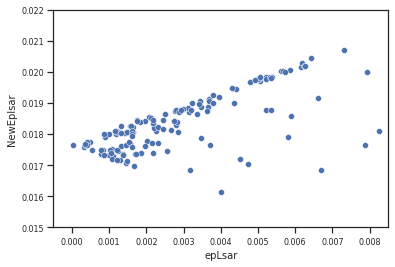
    


Could be linear, but there is also a lot of noise.

Maybe different treatments have different behavior?


```python
ax = sns.scatterplot(data=dfNewAvail,x='epLsar',y='NewEplsar',hue="Treatment");
ax.set_xlim(xrange);
ax.set_ylim(yrange);
```


    
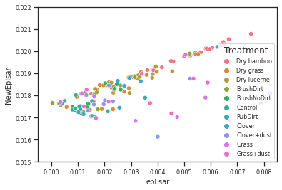
    


Too crowded, let's try it per dataset


```python
ax = sns.scatterplot(data=dfNewAvail[dfNewAvail.Dataset == "Sheeps"],x='epLsar',y='NewEplsar',hue="Treatment");
ax.set_xlim(xrange);
ax.set_ylim(yrange);
```


    
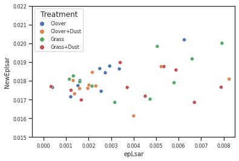
    


```python
ax = sns.scatterplot(data=dfNewAvail[dfNewAvail.Dataset == "GuineaPigs"],x='epLsar',y='NewEplsar',hue="Treatment");
ax.set_xlim(xrange);
ax.set_ylim(yrange);
```


    
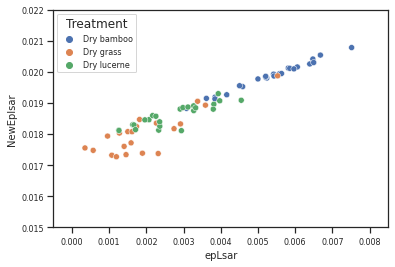
    


```python
ax = sns.scatterplot(data=dfNewAvail[dfNewAvail.Dataset == "Lithics"],x='epLsar',y='NewEplsar',hue="Treatment");
ax.set_xlim(xrange);
ax.set_ylim(yrange);
```


    
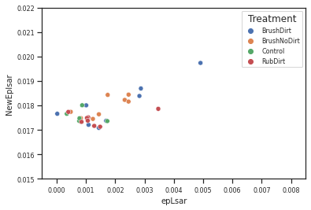
    


### Standardization in z scores


```python
dfNewAvail.NewEplsar
```


    0      0.019460
    2      0.020079
    4      0.019722
    6      0.020694
    8      0.019841
             ...   
    270    0.018765
    272    0.018581
    274    0.017697
    276    0.018978
    278    0.017498
    Name: NewEplsar, Length: 140, dtype: float64


```python
mu = dfNewAvail.NewEplsar.mean()
mu
```


    0.018350751528571425


```python
sig = dfNewAvail.NewEplsar.std()
sig
```


    0.0009354858792128117


```python
dictMeanStd['NewEplsar'] = (mu,sig)
```


```python
newZ = (dfNewAvail.NewEplsar.values-mu) / sig
```


```python
newIndex = df[~df.NewEplsar.isna()].index.values
```

## Model specification <a name="model"></a>


```python
class Model_NewEplsar(pm.Model):
    
    """
    Compute params of priors and hyperpriors.
    """
    def getParams(self,x2,y):
        # get lengths        
        Nx2Lvl = np.unique(x2).size
        
        dims = (Nx2Lvl)
        
        ### get standard deviations
        
        # convert to pandas dataframe to use their logic
        df = pd.DataFrame.from_dict({'x2':x2,'y':y})
        
        s2 = df.groupby('x2').std()['y'].max()
        stdSingle = s2
        
        return (dims, stdSingle)
    
    def printParams(self,x2,y):
        dims, stdSingle= self.getParams(x2,y)
        Nx2Lvl = dims
        s2 = stdSingle
                
        print("The number of levels of the x variables are {}".format(dims))
        print("The standard deviations used for the beta prior is {}".format(stdSingle))        
    
    def __init__(self,name,x2,y,model=None):
        
        # call super's init first, passing model and name
        super().__init__(name, model)
        
        # get parameter of hyperpriors
        dims, stdSingle = self.getParams(x2,y)
        Nx2Lvl  = dims
        s2 = stdSingle
                
        ### hyperpriors ### 
        # observation hyperpriors
        lamY = 1/30.
        muGamma = 0.5
        sigmaGamma = 2.
        
        # prediction hyperpriors
        sigma0 = pm.HalfNormal('sigma0',sd=1)         
        sigma2 = pm.HalfNormal('sigma2',sd=s2, shape=Nx2Lvl)
        
        
        mu_b0 = pm.Normal('mu_b0', mu=0., sd=1)              
        mu_b2 = pm.Normal('mu_b2', mu=0., sd=1, shape=Nx2Lvl)       
        beta2 = 1.5*(np.sqrt(6)*sigma2)/(np.pi)
                                       
        ### priors ### 
        # observation priors        
        nuY = pm.Exponential('nuY',lam=lamY)
        sigmaY = pm.Gamma('sigmaY',mu=muGamma, sigma=sigmaGamma)
        
        # prediction priors
        b0_dist = pm.Normal('b0_dist', mu=0, sd=1)
        b0 = pm.Deterministic("b0", mu_b0 + b0_dist * sigma0)
                        
        b2_beta = pm.HalfNormal('b2_beta', sd=beta2, shape=Nx2Lvl)
        b2_dist = pm.Gumbel('b2_dist', mu=0, beta=1)
        b2 = pm.Deterministic("b2", mu_b2 + b2_beta * b2_dist)
        
        #### prediction ###         
        mu = pm.Deterministic('mu',b0 + b2[x2])
                                        
        ### observation ### 
        y = pm.StudentT('y',nu = nuY, mu=mu, sd=sigmaY, observed=y)
```

## Inference <a name="inference"></a>

### NewEplsar <a name="NewEplsar"></a>


```python
with pm.Model() as model:
    new_epLsarModel = Model_NewEplsar('NewEplsar',x2[newIndex],newZ)
```

#### Verify model settings


```python
new_epLsarModel.printParams(x2[newIndex],newZ)
```

    The number of levels of the x variables are 11
    The standard deviations used for the beta prior is 1.1510253614970998


```python
try:
    graph_new_epLsar = pm.model_to_graphviz(new_epLsarModel)    
except:
    graph_new_epLsar = "Could not make graph"
graph_new_epLsar
```


    
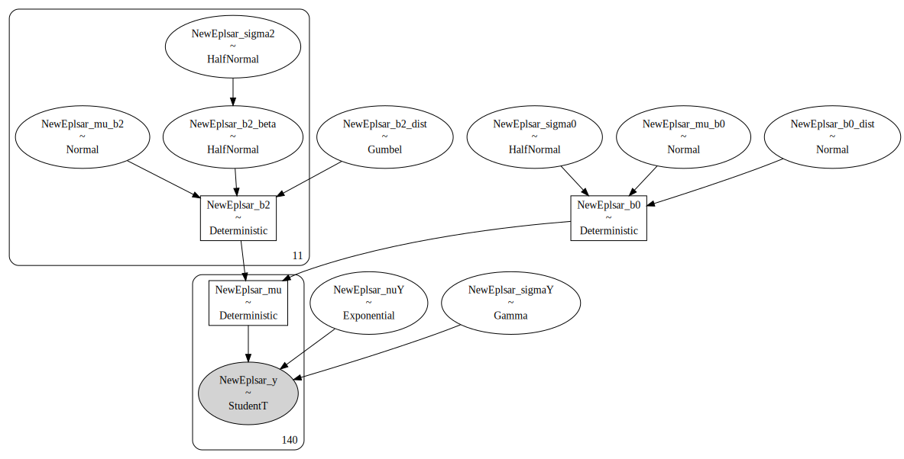
    


#### Check prior choice


```python
with new_epLsarModel as model:
    prior_pred_new_epLsar = pm.sample_prior_predictive(samples=numPredSamples,random_seed=random_seed)
```


```python
plotting_lib.plotPriorPredictive(widthInch,heigthInch,dpi,writeOut,outPathPlots,dfNewAvail.reset_index(),dictMeanStd,prior_pred_new_epLsar,newZ,'NewEplsar')
```


    
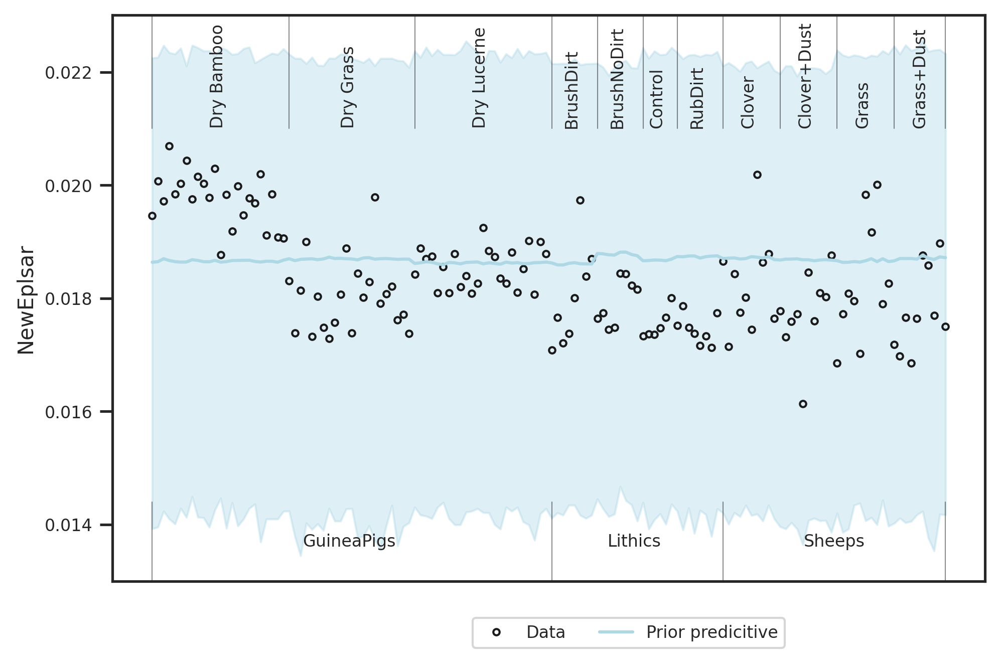
    


Prior choice is as intended: Broad over the data range.

#### Sampling


```python
with new_epLsarModel as model:
    trace_new_epLsar = pm.sample(numSamples,cores=numCores,tune=numTune,max_treedepth=20, init='auto',target_accept=0.99,random_seed=random_seed)
```

    Auto-assigning NUTS sampler...
    Initializing NUTS using jitter+adapt_diag...
    Multiprocess sampling (10 chains in 10 jobs)
    NUTS: [NewEplsar_b2_dist, NewEplsar_b2_beta, NewEplsar_b0_dist, NewEplsar_sigmaY, NewEplsar_nuY, NewEplsar_mu_b2, NewEplsar_mu_b0, NewEplsar_sigma2, NewEplsar_sigma0]


<div>
    <style>
        /* Turns off some styling */
        progress {
            /* gets rid of default border in Firefox and Opera. */
            border: none;
            /* Needs to be in here for Safari polyfill so background images work as expected. */
            background-size: auto;
        }
        .progress-bar-interrupted, .progress-bar-interrupted::-webkit-progress-bar {
            background: #F44336;
        }
    </style>
  <progress value='15000' class='' max='15000' style='width:300px; height:20px; vertical-align: middle;'></progress>
  100.00% [15000/15000 01:44<00:00 Sampling 10 chains, 0 divergences]
</div>


    Sampling 10 chains for 1_000 tune and 500 draw iterations (10_000 + 5_000 draws total) took 106 seconds.
    The number of effective samples is smaller than 25% for some parameters.


```python
with new_epLsarModel as model:
    if writeOut:
        with open(outPathData + 'model_{}.pkl'.format('NewEplsar'), 'wb') as buff:
            pickle.dump({'model':new_epLsarModel, 'trace': trace_new_epLsar}, buff)
```

#### Check sampling


```python
with new_epLsarModel as model:
    dataTrace_new_epLsar = az.from_pymc3(trace=trace_new_epLsar)
```


```python
pm.summary(dataTrace_new_epLsar,hdi_prob=0.95).round(2)
```


<div>
<style scoped>
    .dataframe tbody tr th:only-of-type {
        vertical-align: middle;
    }

    .dataframe tbody tr th {
        vertical-align: top;
    }

    .dataframe thead th {
        text-align: right;
    }
</style>
<table border="1" class="dataframe">
  <thead>
    <tr style="text-align: right;">
      <th></th>
      <th>mean</th>
      <th>sd</th>
      <th>hdi_2.5%</th>
      <th>hdi_97.5%</th>
      <th>mcse_mean</th>
      <th>mcse_sd</th>
      <th>ess_mean</th>
      <th>ess_sd</th>
      <th>ess_bulk</th>
      <th>ess_tail</th>
      <th>r_hat</th>
    </tr>
  </thead>
  <tbody>
    <tr>
      <th>NewEplsar_mu_b0</th>
      <td>-0.21</td>
      <td>0.63</td>
      <td>-1.42</td>
      <td>1.05</td>
      <td>0.01</td>
      <td>0.01</td>
      <td>1973.0</td>
      <td>1973.0</td>
      <td>1943.0</td>
      <td>2814.0</td>
      <td>1.0</td>
    </tr>
    <tr>
      <th>NewEplsar_mu_b2[0]</th>
      <td>-0.18</td>
      <td>0.48</td>
      <td>-1.12</td>
      <td>0.72</td>
      <td>0.01</td>
      <td>0.01</td>
      <td>2369.0</td>
      <td>2369.0</td>
      <td>2375.0</td>
      <td>2973.0</td>
      <td>1.0</td>
    </tr>
    <tr>
      <th>NewEplsar_mu_b2[1]</th>
      <td>-0.13</td>
      <td>0.44</td>
      <td>-1.02</td>
      <td>0.72</td>
      <td>0.01</td>
      <td>0.01</td>
      <td>2180.0</td>
      <td>2180.0</td>
      <td>2126.0</td>
      <td>3004.0</td>
      <td>1.0</td>
    </tr>
    <tr>
      <th>NewEplsar_mu_b2[2]</th>
      <td>0.07</td>
      <td>0.47</td>
      <td>-0.83</td>
      <td>0.96</td>
      <td>0.01</td>
      <td>0.01</td>
      <td>2384.0</td>
      <td>1978.0</td>
      <td>2410.0</td>
      <td>2600.0</td>
      <td>1.0</td>
    </tr>
    <tr>
      <th>NewEplsar_mu_b2[3]</th>
      <td>-0.29</td>
      <td>0.46</td>
      <td>-1.16</td>
      <td>0.61</td>
      <td>0.01</td>
      <td>0.01</td>
      <td>2076.0</td>
      <td>2022.0</td>
      <td>2083.0</td>
      <td>2874.0</td>
      <td>1.0</td>
    </tr>
    <tr>
      <th>...</th>
      <td>...</td>
      <td>...</td>
      <td>...</td>
      <td>...</td>
      <td>...</td>
      <td>...</td>
      <td>...</td>
      <td>...</td>
      <td>...</td>
      <td>...</td>
      <td>...</td>
    </tr>
    <tr>
      <th>NewEplsar_mu[135]</th>
      <td>-0.67</td>
      <td>0.22</td>
      <td>-1.09</td>
      <td>-0.24</td>
      <td>0.00</td>
      <td>0.00</td>
      <td>5740.0</td>
      <td>5636.0</td>
      <td>5753.0</td>
      <td>4350.0</td>
      <td>1.0</td>
    </tr>
    <tr>
      <th>NewEplsar_mu[136]</th>
      <td>-0.67</td>
      <td>0.22</td>
      <td>-1.09</td>
      <td>-0.24</td>
      <td>0.00</td>
      <td>0.00</td>
      <td>5740.0</td>
      <td>5636.0</td>
      <td>5753.0</td>
      <td>4350.0</td>
      <td>1.0</td>
    </tr>
    <tr>
      <th>NewEplsar_mu[137]</th>
      <td>-0.67</td>
      <td>0.22</td>
      <td>-1.09</td>
      <td>-0.24</td>
      <td>0.00</td>
      <td>0.00</td>
      <td>5740.0</td>
      <td>5636.0</td>
      <td>5753.0</td>
      <td>4350.0</td>
      <td>1.0</td>
    </tr>
    <tr>
      <th>NewEplsar_mu[138]</th>
      <td>-0.67</td>
      <td>0.22</td>
      <td>-1.09</td>
      <td>-0.24</td>
      <td>0.00</td>
      <td>0.00</td>
      <td>5740.0</td>
      <td>5636.0</td>
      <td>5753.0</td>
      <td>4350.0</td>
      <td>1.0</td>
    </tr>
    <tr>
      <th>NewEplsar_mu[139]</th>
      <td>-0.67</td>
      <td>0.22</td>
      <td>-1.09</td>
      <td>-0.24</td>
      <td>0.00</td>
      <td>0.00</td>
      <td>5740.0</td>
      <td>5636.0</td>
      <td>5753.0</td>
      <td>4350.0</td>
      <td>1.0</td>
    </tr>
  </tbody>
</table>
<p>191 rows × 11 columns</p>
</div>


```python
az.plot_forest(dataTrace_new_epLsar,var_names=['b0','b2'],filter_vars='like',figsize=(widthInch,5*heigthInch),hdi_prob=0.95,ess=True,r_hat=True);
if writeOut:
    plt.savefig(outPathPlots + "posterior_forest_{}.pdf".format('NewEplsar'),dpi=dpi)
```


    
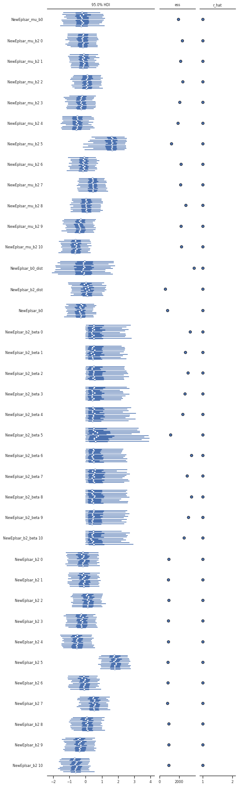
    


```python
with new_epLsarModel as model:
    plotting_lib.plotTracesB(widthInch,heigthInch,dpi,writeOut,outPathPlots,trace_new_epLsar,'NewEplsar')
```


    
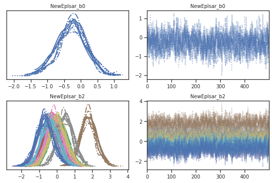
    


```python
with new_epLsarModel as model:
    plotting_lib.pm.energyplot(trace_new_epLsar)
```


    
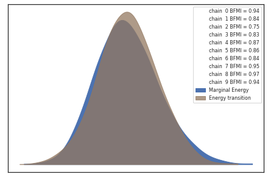
    


#### Posterior predictive distribution


```python
with new_epLsarModel as model:
    posterior_pred_new_epLsar = pm.sample_posterior_predictive(trace_new_epLsar,samples=numPredSamples,random_seed=random_seed)
```

    /home/bob/.local/lib/python3.8/site-packages/pymc3/sampling.py:1707: UserWarning: samples parameter is smaller than nchains times ndraws, some draws and/or chains may not be represented in the returned posterior predictive sample
      warnings.warn(


<div>
    <style>
        /* Turns off some styling */
        progress {
            /* gets rid of default border in Firefox and Opera. */
            border: none;
            /* Needs to be in here for Safari polyfill so background images work as expected. */
            background-size: auto;
        }
        .progress-bar-interrupted, .progress-bar-interrupted::-webkit-progress-bar {
            background: #F44336;
        }
    </style>
  <progress value='2000' class='' max='2000' style='width:300px; height:20px; vertical-align: middle;'></progress>
  100.00% [2000/2000 00:02<00:00]
</div>


```python
plotting_lib.plotPriorPosteriorPredictive(widthInch,heigthInch,dpi,writeOut,outPathPlots,dfNewAvail.reset_index(),dictMeanStd,prior_pred_new_epLsar,posterior_pred_new_epLsar,newZ,'NewEplsar')
```


    
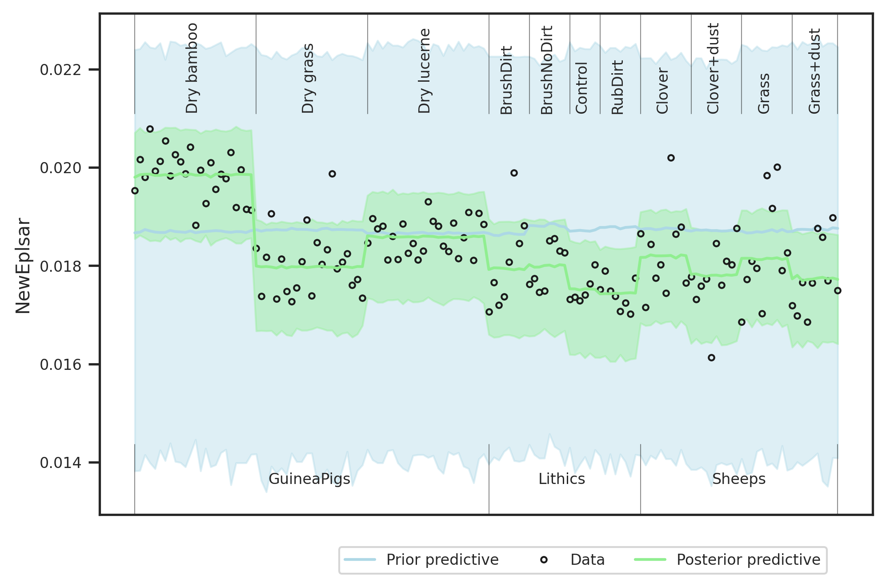
    


### Posterior check


```python
with new_epLsarModel as model:
    pm_data_new_epLsar = az.from_pymc3(trace=trace_new_epLsar,prior=prior_pred_new_epLsar,posterior_predictive=posterior_pred_new_epLsar)
```

    arviz.data.io_pymc3 - WARNING - posterior predictive variable NewEplsar_y's shape not compatible with number of chains and draws. This can mean that some draws or even whole chains are not represented.


```python
plotting_lib.plotPosterior(widthInch,heigthInch,dpi,writeOut,outPathPlots,dictMeanStd,pm_data_new_epLsar,'NewEplsar')
```


    
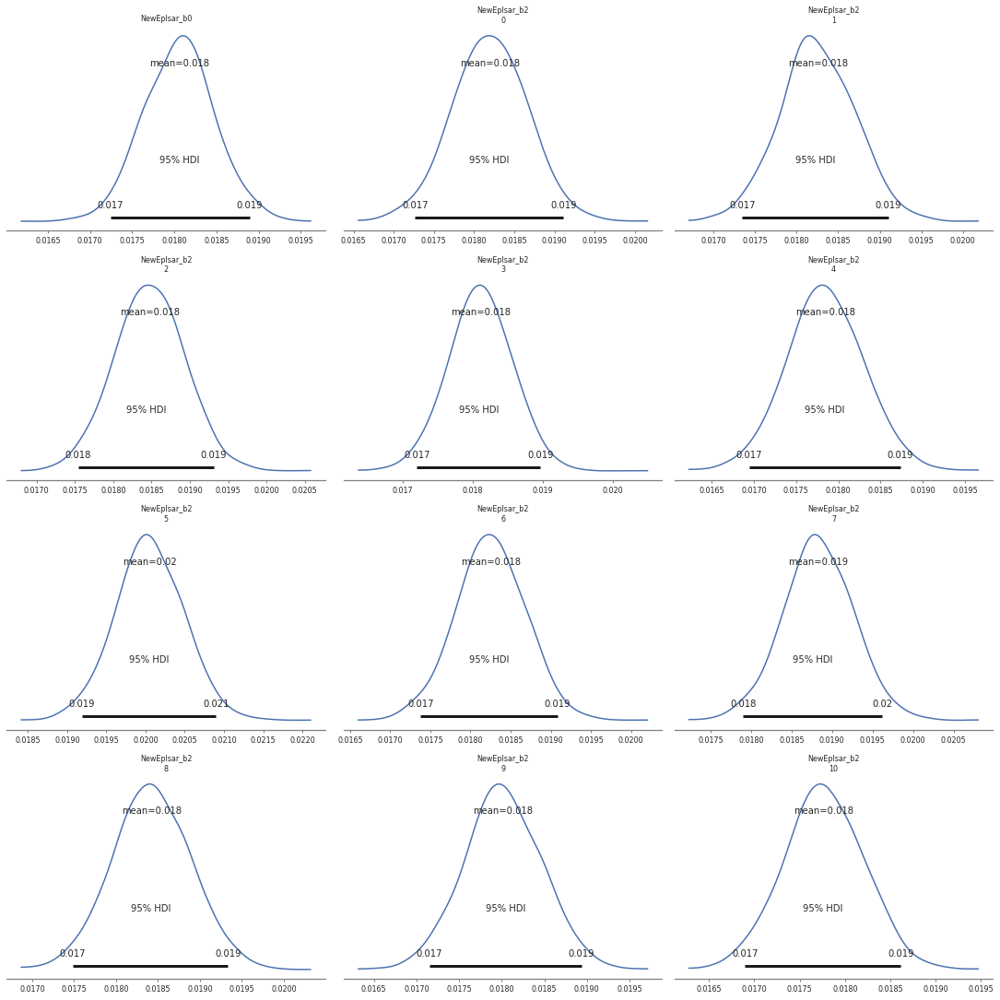
    


### Compare treatment differences with other epLsar values


```python
b1P_Old = np.load("../derived_data/statistical_model_two_factors/epLsar_oldb1.npy")
b2P_Old = np.load("../derived_data/statistical_model_two_factors/epLsar_oldb2.npy")
M12P_Old = np.load("../derived_data/statistical_model_two_factors/epLsar_oldM12.npy")
```


```python
from collections import defaultdict 
```


```python
def plotTreatmentPosterior(widthInch,heigthInch,dpi,sizes,writeOut,path,dictMeanStd,dictTreatment,dictSoftware,trace,yname,x1,x3):
        
    SMALL_SIZE,MEDIUM_SIZE,BIGGER_SIZE = sizes
    
    mu_Val,sig_Val = dictMeanStd[yname]
    
    # get posterior samples    
    b2P = sig_Val*trace['{}_b2'.format(yname)]
    
    # prepare color dict for treatments
    # use groups of 4 colors, as in tab20c
    colorIndex = dict({5:0,6:1,7:2,0:4,1:5,4:6,10:7,2:8,3:9,8:10,9:11})
    
    # prepare dataset dict for treatments   
    dictDataset = dict({5:0,6:0,7:0,0:1,1:1,4:1,10:1,2:2,3:2,8:2,9:2})
    
    # === inverse dict ==== 
    inv_dictDataset = defaultdict(list)                                                                  
  
    # using loop to perform reverse mapping 
    for keys, vals in dictDataset.items():  
        for val in [vals]:  
            inv_dictDataset[val].append(keys) 
    # === 
    
    # get number of datasets    
    numDatasets = len(np.unique(list(dictDataset.values())))
    
    # get number of treatments per dataset
    dictDataset2NumberTreats = dict()
    for numDataset in range(numDatasets):        
        n = len(inv_dictDataset[numDataset])
        dictDataset2NumberTreats[numDataset] = n      
         
    # Get maximum of treatments per dataset
    tmax = np.max(list(dictDataset2NumberTreats.values()))
    
    
    # compute maximal number of pairs 
    maxpair = int(tmax*(tmax-1)/2)
    
    
    fig = plt.subplots(squeeze=False, figsize=(numDatasets*widthInch,maxpair*heigthInch), dpi=dpi);
    
    # store list for hdi
    hdiList = []

    for indexDataset in np.arange(numDatasets):
        # counter for row
        rowCounter = 0
        
        # first treatment 
        for treatmentNum_i,lvl2_i in enumerate(inv_dictDataset[indexDataset]):
            
            # second treatment 
            for treatmentNum_j,lvl2_j in enumerate(inv_dictDataset[indexDataset]):
                
                if treatmentNum_i > treatmentNum_j:
                                       
                    
                    # set subplot                    
                    curr_ax = plt.subplot2grid((maxpair, numDatasets), (rowCounter,indexDataset))
  
                    # compute difference between treatments for each software
                    diffS0 = sig_Val*((M12P_Old[:,0,lvl2_i]+b2P_Old[:,lvl2_i]) -(M12P_Old[:,0,lvl2_j]+b2P_Old[:,lvl2_j]))
                    diffS1 = sig_Val*((M12P_Old[:,1,lvl2_i]+b2P_Old[:,lvl2_i]) -(M12P_Old[:,1,lvl2_j]+b2P_Old[:,lvl2_j]))
                    
                    #plot posterior                    
                    sns.kdeplot(diffS1,ax=curr_ax,label="epLsar on {}".format(dictSoftware[1]),color='gray',alpha=0.3,ls='--');
                    sns.kdeplot(diffS0,ax=curr_ax,label="epLsar on {}".format(dictSoftware[0]),color='gray',alpha=0.3,ls='dotted');                    
                    sns.kdeplot(b2P[:,lvl2_i]-b2P[:,lvl2_j],ax=curr_ax,label="NewEplsar on {}".format(dictSoftware[0]),color='C0',alpha=0.3,ls='dotted');
                                        
                    # plot reference value zero
                    curr_ax.axvline(x=0,color="C1")
                    
                    # get hdi
                    hdi_new = az.hdi(az.convert_to_inference_data(b2P[:,lvl2_i]-b2P[:,lvl2_j]),hdi_prob=0.95)['x'].values
                    hdiS0 = az.hdi(az.convert_to_inference_data(diffS0),hdi_prob=0.95)['x'].values
                    hdiS1 = az.hdi(az.convert_to_inference_data(diffS1),hdi_prob=0.95)['x'].values  
                    
                    isSignificant = lambda x: (x[0] > 0.0) or (x[1] < 0.0)
                    
                    # store hdi
                    hdiList.append([dictTreatment[lvl2_i],dictTreatment[lvl2_j],
                                    hdi_new[0],hdi_new[1],isSignificant(hdi_new),                                 
                                   hdiS0[0],hdiS0[1],isSignificant(hdiS0),
                                    hdiS1[0],hdiS1[1],isSignificant(hdiS1)
                                   ])
                    
                    # set title 
                    nameFirst = dictTreatment[lvl2_i]
                    nameSecond = dictTreatment[lvl2_j]
                    title = "{} vs. {}".format(nameFirst,nameSecond)
                    if isSignificant(hdi_new):
                        title += ": Significant on NewEplsar"

                            
                    curr_ax.set_title(title)
                    
                    # add legend
                    curr_ax.legend()   
                    
                    # set x label
                    curr_ax.set_xlabel('Delta')
                    
                    # remove y label decoration
                    curr_ax.tick_params(left=False)
                    curr_ax.set(yticklabels=[])
                    
                    
                    # increment counter
                    rowCounter += 1
                    
    #plt.suptitle('Estimated differences between treatments on {}'.format(yname))
    
    plt.tight_layout()                
    
    if writeOut:
        plt.savefig(path + "treatment_pairs_{}.pdf".format(yname),dpi=dpi)
    
    plt.show()
    
    # convert hdi to df
    df = pd.DataFrame(hdiList,columns=["Treatment_i","Treatment_j",
                                       "hdi_NewEplsar_2.5%","hdi_NewEplsar_97.5%","isSignificant_NewEplsar","hdi_{}_2.5%".format(dictSoftware[0]),"hdi_{}_97.5%".format(dictSoftware[0]),"isSignificant_on_{}".format(dictSoftware[0]),
                                  "hdi_{}_2.5%".format(dictSoftware[1]),"hdi_{}_97.5%".format(dictSoftware[1]),"isSignificant_on_{}".format(dictSoftware[1])])
    return df
```


```python
dfHDI = plotTreatmentPosterior(widthInch,heigthInch,dpi,sizes,writeOut,outPathPlots,dictMeanStd,dictTreatment,dictSoftware,trace_new_epLsar,'NewEplsar',x1[newIndex],x2[newIndex])
```


    

    


```python
dfHDI
```


<div>
<style scoped>
    .dataframe tbody tr th:only-of-type {
        vertical-align: middle;
    }

    .dataframe tbody tr th {
        vertical-align: top;
    }

    .dataframe thead th {
        text-align: right;
    }
</style>
<table border="1" class="dataframe">
  <thead>
    <tr style="text-align: right;">
      <th></th>
      <th>Treatment_i</th>
      <th>Treatment_j</th>
      <th>hdi_NewEplsar_2.5%</th>
      <th>hdi_NewEplsar_97.5%</th>
      <th>isSignificant_NewEplsar</th>
      <th>hdi_ConfoMap_2.5%</th>
      <th>hdi_ConfoMap_97.5%</th>
      <th>isSignificant_on_ConfoMap</th>
      <th>hdi_Toothfrax_2.5%</th>
      <th>hdi_Toothfrax_97.5%</th>
      <th>isSignificant_on_Toothfrax</th>
    </tr>
  </thead>
  <tbody>
    <tr>
      <th>0</th>
      <td>Dry Grass</td>
      <td>Dry Bamboo</td>
      <td>-0.002142</td>
      <td>-0.001471</td>
      <td>True</td>
      <td>-0.002002</td>
      <td>-0.001351</td>
      <td>True</td>
      <td>-0.001957</td>
      <td>-0.001303</td>
      <td>True</td>
    </tr>
    <tr>
      <th>1</th>
      <td>Dry Lucerne</td>
      <td>Dry Bamboo</td>
      <td>-0.001520</td>
      <td>-0.000917</td>
      <td>True</td>
      <td>-0.001620</td>
      <td>-0.000971</td>
      <td>True</td>
      <td>-0.001706</td>
      <td>-0.001088</td>
      <td>True</td>
    </tr>
    <tr>
      <th>2</th>
      <td>Dry Lucerne</td>
      <td>Dry Grass</td>
      <td>0.000239</td>
      <td>0.000892</td>
      <td>True</td>
      <td>0.000106</td>
      <td>0.000752</td>
      <td>True</td>
      <td>-0.000082</td>
      <td>0.000555</td>
      <td>False</td>
    </tr>
    <tr>
      <th>3</th>
      <td>BrushNoDirt</td>
      <td>BrushDirt</td>
      <td>-0.000522</td>
      <td>0.000663</td>
      <td>False</td>
      <td>-0.000651</td>
      <td>0.000496</td>
      <td>False</td>
      <td>-0.000745</td>
      <td>0.000278</td>
      <td>False</td>
    </tr>
    <tr>
      <th>4</th>
      <td>Control</td>
      <td>BrushDirt</td>
      <td>-0.000967</td>
      <td>0.000241</td>
      <td>False</td>
      <td>-0.001048</td>
      <td>0.000116</td>
      <td>False</td>
      <td>-0.000962</td>
      <td>0.000105</td>
      <td>False</td>
    </tr>
    <tr>
      <th>5</th>
      <td>Control</td>
      <td>BrushNoDirt</td>
      <td>-0.000965</td>
      <td>0.000131</td>
      <td>False</td>
      <td>-0.000850</td>
      <td>0.000188</td>
      <td>False</td>
      <td>-0.000681</td>
      <td>0.000328</td>
      <td>False</td>
    </tr>
    <tr>
      <th>6</th>
      <td>RubDirt</td>
      <td>BrushDirt</td>
      <td>-0.001011</td>
      <td>0.000149</td>
      <td>False</td>
      <td>-0.000843</td>
      <td>0.000264</td>
      <td>False</td>
      <td>-0.000676</td>
      <td>0.000359</td>
      <td>False</td>
    </tr>
    <tr>
      <th>7</th>
      <td>RubDirt</td>
      <td>BrushNoDirt</td>
      <td>-0.000979</td>
      <td>0.000024</td>
      <td>False</td>
      <td>-0.000702</td>
      <td>0.000303</td>
      <td>False</td>
      <td>-0.000446</td>
      <td>0.000526</td>
      <td>False</td>
    </tr>
    <tr>
      <th>8</th>
      <td>RubDirt</td>
      <td>Control</td>
      <td>-0.000593</td>
      <td>0.000470</td>
      <td>False</td>
      <td>-0.000347</td>
      <td>0.000679</td>
      <td>False</td>
      <td>-0.000276</td>
      <td>0.000733</td>
      <td>False</td>
    </tr>
    <tr>
      <th>9</th>
      <td>Clover+Dust</td>
      <td>Clover</td>
      <td>-0.000912</td>
      <td>0.000170</td>
      <td>False</td>
      <td>-0.000529</td>
      <td>0.000561</td>
      <td>False</td>
      <td>-0.000377</td>
      <td>0.000802</td>
      <td>False</td>
    </tr>
    <tr>
      <th>10</th>
      <td>Grass</td>
      <td>Clover</td>
      <td>-0.000695</td>
      <td>0.000519</td>
      <td>False</td>
      <td>-0.000095</td>
      <td>0.001442</td>
      <td>False</td>
      <td>0.000136</td>
      <td>0.001852</td>
      <td>True</td>
    </tr>
    <tr>
      <th>11</th>
      <td>Grass</td>
      <td>Clover+Dust</td>
      <td>-0.000258</td>
      <td>0.000920</td>
      <td>False</td>
      <td>-0.000065</td>
      <td>0.001494</td>
      <td>False</td>
      <td>-0.000046</td>
      <td>0.001692</td>
      <td>False</td>
    </tr>
    <tr>
      <th>12</th>
      <td>Grass+Dust</td>
      <td>Clover</td>
      <td>-0.001025</td>
      <td>0.000078</td>
      <td>False</td>
      <td>0.000259</td>
      <td>0.001605</td>
      <td>True</td>
      <td>0.000421</td>
      <td>0.001720</td>
      <td>True</td>
    </tr>
    <tr>
      <th>13</th>
      <td>Grass+Dust</td>
      <td>Clover+Dust</td>
      <td>-0.000643</td>
      <td>0.000438</td>
      <td>False</td>
      <td>0.000257</td>
      <td>0.001669</td>
      <td>True</td>
      <td>0.000231</td>
      <td>0.001516</td>
      <td>True</td>
    </tr>
    <tr>
      <th>14</th>
      <td>Grass+Dust</td>
      <td>Grass</td>
      <td>-0.000993</td>
      <td>0.000166</td>
      <td>False</td>
      <td>-0.000617</td>
      <td>0.001148</td>
      <td>False</td>
      <td>-0.000891</td>
      <td>0.000924</td>
      <td>False</td>
    </tr>
  </tbody>
</table>
</div>


```python
if writeOut:
    dfHDI.to_csv(outPathData+ 'hdi_{}.csv'.format('NewEplsar'))
```

## Summary<a name="summary"></a>

Show where NewEplsar yields other results then epLsar: 


```python
dfHDI[(dfHDI.isSignificant_NewEplsar != dfHDI.isSignificant_on_ConfoMap) | (dfHDI.isSignificant_NewEplsar != dfHDI.isSignificant_on_Toothfrax) ][["Treatment_i","Treatment_j","isSignificant_NewEplsar","isSignificant_on_Toothfrax","isSignificant_on_ConfoMap","hdi_NewEplsar_2.5%","hdi_NewEplsar_97.5%","hdi_ConfoMap_2.5%","hdi_ConfoMap_97.5%","hdi_Toothfrax_2.5%","hdi_Toothfrax_97.5%"]]
```


<div>
<style scoped>
    .dataframe tbody tr th:only-of-type {
        vertical-align: middle;
    }

    .dataframe tbody tr th {
        vertical-align: top;
    }

    .dataframe thead th {
        text-align: right;
    }
</style>
<table border="1" class="dataframe">
  <thead>
    <tr style="text-align: right;">
      <th></th>
      <th>Treatment_i</th>
      <th>Treatment_j</th>
      <th>isSignificant_NewEplsar</th>
      <th>isSignificant_on_Toothfrax</th>
      <th>isSignificant_on_ConfoMap</th>
      <th>hdi_NewEplsar_2.5%</th>
      <th>hdi_NewEplsar_97.5%</th>
      <th>hdi_ConfoMap_2.5%</th>
      <th>hdi_ConfoMap_97.5%</th>
      <th>hdi_Toothfrax_2.5%</th>
      <th>hdi_Toothfrax_97.5%</th>
    </tr>
  </thead>
  <tbody>
    <tr>
      <th>2</th>
      <td>Dry Lucerne</td>
      <td>Dry Grass</td>
      <td>True</td>
      <td>False</td>
      <td>True</td>
      <td>0.000239</td>
      <td>0.000892</td>
      <td>0.000106</td>
      <td>0.000752</td>
      <td>-0.000082</td>
      <td>0.000555</td>
    </tr>
    <tr>
      <th>10</th>
      <td>Grass</td>
      <td>Clover</td>
      <td>False</td>
      <td>True</td>
      <td>False</td>
      <td>-0.000695</td>
      <td>0.000519</td>
      <td>-0.000095</td>
      <td>0.001442</td>
      <td>0.000136</td>
      <td>0.001852</td>
    </tr>
    <tr>
      <th>12</th>
      <td>Grass+Dust</td>
      <td>Clover</td>
      <td>False</td>
      <td>True</td>
      <td>True</td>
      <td>-0.001025</td>
      <td>0.000078</td>
      <td>0.000259</td>
      <td>0.001605</td>
      <td>0.000421</td>
      <td>0.001720</td>
    </tr>
    <tr>
      <th>13</th>
      <td>Grass+Dust</td>
      <td>Clover+Dust</td>
      <td>False</td>
      <td>True</td>
      <td>True</td>
      <td>-0.000643</td>
      <td>0.000438</td>
      <td>0.000257</td>
      <td>0.001669</td>
      <td>0.000231</td>
      <td>0.001516</td>
    </tr>
  </tbody>
</table>
</div>


### Write out


```python
!jupyter nbconvert --to html Statistical_Model_NewEplsar.ipynb
```

    [NbConvertApp] Converting notebook Statistical_Model_NewEplsar.ipynb to html
    [NbConvertApp] Writing 4920922 bytes to Statistical_Model_NewEplsar.html


```python
!jupyter nbconvert --to markdown Statistical_Model_NewEplsar.ipynb
```

    [NbConvertApp] Converting notebook Statistical_Model_NewEplsar.ipynb to markdown
    [NbConvertApp] Support files will be in Statistical_Model_NewEplsar_files/
    [NbConvertApp] Making directory Statistical_Model_NewEplsar_files
    [NbConvertApp] Making directory Statistical_Model_NewEplsar_files
    [NbConvertApp] Making directory Statistical_Model_NewEplsar_files
    [NbConvertApp] Making directory Statistical_Model_NewEplsar_files
    [NbConvertApp] Making directory Statistical_Model_NewEplsar_files
    [NbConvertApp] Making directory Statistical_Model_NewEplsar_files
    [NbConvertApp] Making directory Statistical_Model_NewEplsar_files
    [NbConvertApp] Making directory Statistical_Model_NewEplsar_files
    [NbConvertApp] Making directory Statistical_Model_NewEplsar_files
    [NbConvertApp] Making directory Statistical_Model_NewEplsar_files
    [NbConvertApp] Making directory Statistical_Model_NewEplsar_files
    [NbConvertApp] Making directory Statistical_Model_NewEplsar_files
    [NbConvertApp] Making directory Statistical_Model_NewEplsar_files
    [NbConvertApp] Writing 41539 bytes to Statistical_Model_NewEplsar.md


```python


```
