# Analysis for SSFA project: Three factor  model

## Table of contents
1. [Used packages](#imports)
1. [Global settings](#settings)
1. [Load data](#load)
1. [Explore data](#exploration)
1. [Model specification](#model)
1. [Inference](#inference)
   1. [epLsar](#epLsar)
   1. [R²](#r)
   1. [Asfc](#Asfc)
   1. [Smfc](#Smfc)
   1. [HAsfc9](#HAsfc9)
   1. [HAsfc81](#HAsfc81)   
1. [Summary](#summary)

## Used packages <a name="imports"></a>


```python
import numpy as np
import pandas as pd
import matplotlib.pyplot as plt
import seaborn as sns; sns.set()
import pickle
import arviz as az
import pymc3 as pm
```

    WARNING (theano.tensor.blas): Using NumPy C-API based implementation for BLAS functions.


```python
from matplotlib.colors import to_rgb
```


```python
import scipy.stats as stats 
```


```python
from IPython.display import display
```


```python
import matplotlib as mpl
```


```python
%load_ext autoreload
%autoreload 2
```


```python
import plotting_lib
```

## Global settings <a name="settings"></a>

#### Output


```python
writeOut = True
outPathPlots = "../plots/statistical_model_three_factors/"
outPathData = "../derived_data/statistical_model_three_factors/"
```

#### Plotting


```python
widthMM = 190 
widthInch = widthMM / 25.4
ratio = 0.66666
heigthInch = ratio*widthInch

SMALL_SIZE = 8
MEDIUM_SIZE = 10
BIGGER_SIZE = 12

plt.rc('font', size=SMALL_SIZE)          # controls default text sizes
plt.rc('axes', titlesize=SMALL_SIZE)     # fontsize of the axes title
plt.rc('axes', labelsize=MEDIUM_SIZE)    # fontsize of the x and y labels
plt.rc('xtick', labelsize=SMALL_SIZE)    # fontsize of the tick labels
plt.rc('ytick', labelsize=SMALL_SIZE)    # fontsize of the tick labels
plt.rc('legend', fontsize=SMALL_SIZE)    # legend fontsize
plt.rc('figure', titlesize=BIGGER_SIZE)  # fontsize of the figure title
sns.set_style("ticks")

dpi = 300
```


```python
sizes = [SMALL_SIZE,MEDIUM_SIZE,BIGGER_SIZE]
```

#### Computing


```python
numSamples = 1000
numCores = 10
numTune = 1000
numPredSamples = 2000
random_seed=36514535
target_accept = 0.99
```

## Load data <a name="load"></a>


```python
datafile = "../derived_data/preprocessing/preprocessed.dat"
```


```python
with open(datafile, "rb") as f:
    x1,x2,x3,df,dataZ,dictMeanStd,dictTreatment,dictSoftware = pickle.load(f)    
```

Show that everything is correct:


```python
display(pd.DataFrame.from_dict({'x1':x1,'x2':x2,'x3':x3}))
```


<div>
<style scoped>
    .dataframe tbody tr th:only-of-type {
        vertical-align: middle;
    }

    .dataframe tbody tr th {
        vertical-align: top;
    }

    .dataframe thead th {
        text-align: right;
    }
</style>
<table border="1" class="dataframe">
  <thead>
    <tr style="text-align: right;">
      <th></th>
      <th>x1</th>
      <th>x2</th>
      <th>x3</th>
    </tr>
  </thead>
  <tbody>
    <tr>
      <th>0</th>
      <td>0</td>
      <td>5</td>
      <td>116</td>
    </tr>
    <tr>
      <th>1</th>
      <td>1</td>
      <td>5</td>
      <td>116</td>
    </tr>
    <tr>
      <th>2</th>
      <td>0</td>
      <td>5</td>
      <td>117</td>
    </tr>
    <tr>
      <th>3</th>
      <td>1</td>
      <td>5</td>
      <td>117</td>
    </tr>
    <tr>
      <th>4</th>
      <td>0</td>
      <td>5</td>
      <td>118</td>
    </tr>
    <tr>
      <th>...</th>
      <td>...</td>
      <td>...</td>
      <td>...</td>
    </tr>
    <tr>
      <th>275</th>
      <td>1</td>
      <td>9</td>
      <td>51</td>
    </tr>
    <tr>
      <th>276</th>
      <td>0</td>
      <td>9</td>
      <td>52</td>
    </tr>
    <tr>
      <th>277</th>
      <td>1</td>
      <td>9</td>
      <td>52</td>
    </tr>
    <tr>
      <th>278</th>
      <td>0</td>
      <td>9</td>
      <td>53</td>
    </tr>
    <tr>
      <th>279</th>
      <td>1</td>
      <td>9</td>
      <td>53</td>
    </tr>
  </tbody>
</table>
<p>280 rows × 3 columns</p>
</div>


x1 indicates the software used, x2 indicates the treatment applied and x3 the sample.


```python
for surfaceParam,(mean,std) in dictMeanStd.items():
    print("Surface parameter {} has mean {} and standard deviation {}".format(surfaceParam,mean,std))
```

    Surface parameter epLsar has mean 0.002866777015225286 and standard deviation 0.0019173233323041528
    Surface parameter R² has mean 0.9973197285182144 and standard deviation 0.006745323717352575
    Surface parameter Asfc has mean 16.912804592866785 and standard deviation 16.042490777228107
    Surface parameter Smfc has mean 2.589874101745179 and standard deviation 10.663178442785044
    Surface parameter HAsfc9 has mean 0.31872043020221136 and standard deviation 0.22913790943445264
    Surface parameter HAsfc81 has mean 0.5885203613280154 and standard deviation 0.42897734163543366


```python
for k,v in dictTreatment.items():
    print("Number {} encodes treatment {}".format(k,v))
```

    Number 5 encodes treatment Dry bamboo
    Number 6 encodes treatment Dry grass
    Number 7 encodes treatment Dry lucerne
    Number 0 encodes treatment BrushDirt
    Number 1 encodes treatment BrushNoDirt
    Number 4 encodes treatment Control
    Number 10 encodes treatment RubDirt
    Number 2 encodes treatment Clover
    Number 3 encodes treatment Clover+dust
    Number 8 encodes treatment Grass
    Number 9 encodes treatment Grass+dust


```python
for k,v in dictSoftware.items():
    print("Number {} encodes software {}".format(k,v))
```

    Number 0 encodes software ConfoMap
    Number 1 encodes software Toothfrax


```python
display(dataZ)
```


<div>
<style scoped>
    .dataframe tbody tr th:only-of-type {
        vertical-align: middle;
    }

    .dataframe tbody tr th {
        vertical-align: top;
    }

    .dataframe thead th {
        text-align: right;
    }
</style>
<table border="1" class="dataframe">
  <thead>
    <tr style="text-align: right;">
      <th></th>
      <th>index</th>
      <th>TreatmentNumber</th>
      <th>SoftwareNumber</th>
      <th>DatasetNumber</th>
      <th>NameNumber</th>
      <th>epLsar_z</th>
      <th>R²_z</th>
      <th>Asfc_z</th>
      <th>Smfc_z</th>
      <th>HAsfc9_z</th>
      <th>HAsfc81_z</th>
    </tr>
  </thead>
  <tbody>
    <tr>
      <th>0</th>
      <td>0</td>
      <td>5</td>
      <td>0</td>
      <td>0</td>
      <td>116</td>
      <td>0.896441</td>
      <td>0.202280</td>
      <td>-0.548753</td>
      <td>-0.173680</td>
      <td>-0.872185</td>
      <td>-0.512580</td>
    </tr>
    <tr>
      <th>1</th>
      <td>1</td>
      <td>5</td>
      <td>1</td>
      <td>0</td>
      <td>116</td>
      <td>0.967089</td>
      <td>0.332122</td>
      <td>-0.410913</td>
      <td>-0.231700</td>
      <td>-0.799735</td>
      <td>-0.528438</td>
    </tr>
    <tr>
      <th>2</th>
      <td>2</td>
      <td>5</td>
      <td>0</td>
      <td>0</td>
      <td>117</td>
      <td>1.663582</td>
      <td>0.205805</td>
      <td>-0.406276</td>
      <td>-0.184263</td>
      <td>-0.625739</td>
      <td>-0.636413</td>
    </tr>
    <tr>
      <th>3</th>
      <td>3</td>
      <td>5</td>
      <td>1</td>
      <td>0</td>
      <td>117</td>
      <td>1.559060</td>
      <td>0.318335</td>
      <td>-0.231484</td>
      <td>-0.231700</td>
      <td>-0.652395</td>
      <td>-0.762985</td>
    </tr>
    <tr>
      <th>4</th>
      <td>4</td>
      <td>5</td>
      <td>0</td>
      <td>0</td>
      <td>118</td>
      <td>1.235447</td>
      <td>0.140997</td>
      <td>-0.524577</td>
      <td>-0.187419</td>
      <td>-0.425552</td>
      <td>-0.460441</td>
    </tr>
    <tr>
      <th>...</th>
      <td>...</td>
      <td>...</td>
      <td>...</td>
      <td>...</td>
      <td>...</td>
      <td>...</td>
      <td>...</td>
      <td>...</td>
      <td>...</td>
      <td>...</td>
      <td>...</td>
    </tr>
    <tr>
      <th>275</th>
      <td>275</td>
      <td>9</td>
      <td>1</td>
      <td>2</td>
      <td>51</td>
      <td>0.812186</td>
      <td>0.302472</td>
      <td>-0.940814</td>
      <td>-0.110773</td>
      <td>2.259947</td>
      <td>1.219611</td>
    </tr>
    <tr>
      <th>276</th>
      <td>276</td>
      <td>9</td>
      <td>0</td>
      <td>2</td>
      <td>52</td>
      <td>0.279516</td>
      <td>0.134624</td>
      <td>-0.883003</td>
      <td>-0.199355</td>
      <td>1.616592</td>
      <td>2.457881</td>
    </tr>
    <tr>
      <th>277</th>
      <td>277</td>
      <td>9</td>
      <td>1</td>
      <td>2</td>
      <td>52</td>
      <td>0.141981</td>
      <td>0.358659</td>
      <td>-0.882314</td>
      <td>-0.230373</td>
      <td>2.779893</td>
      <td>2.898056</td>
    </tr>
    <tr>
      <th>278</th>
      <td>278</td>
      <td>9</td>
      <td>0</td>
      <td>2</td>
      <td>53</td>
      <td>-0.859089</td>
      <td>0.269132</td>
      <td>-0.964638</td>
      <td>-0.118959</td>
      <td>0.316720</td>
      <td>0.540611</td>
    </tr>
    <tr>
      <th>279</th>
      <td>279</td>
      <td>9</td>
      <td>1</td>
      <td>2</td>
      <td>53</td>
      <td>-1.128540</td>
      <td>0.376153</td>
      <td>-0.964978</td>
      <td>-0.204577</td>
      <td>0.119539</td>
      <td>0.586105</td>
    </tr>
  </tbody>
</table>
<p>280 rows × 11 columns</p>
</div>


```python
display(df)
```


<div>
<style scoped>
    .dataframe tbody tr th:only-of-type {
        vertical-align: middle;
    }

    .dataframe tbody tr th {
        vertical-align: top;
    }

    .dataframe thead th {
        text-align: right;
    }
</style>
<table border="1" class="dataframe">
  <thead>
    <tr style="text-align: right;">
      <th></th>
      <th>Dataset</th>
      <th>Name</th>
      <th>Software</th>
      <th>Diet</th>
      <th>Treatment</th>
      <th>Before.after</th>
      <th>epLsar</th>
      <th>R²</th>
      <th>Asfc</th>
      <th>Smfc</th>
      <th>HAsfc9</th>
      <th>HAsfc81</th>
      <th>NewEplsar</th>
      <th>TreatmentNumber</th>
      <th>SoftwareNumber</th>
      <th>DatasetNumber</th>
      <th>NameNumber</th>
    </tr>
  </thead>
  <tbody>
    <tr>
      <th>0</th>
      <td>GuineaPigs</td>
      <td>capor_2CC6B1_txP4_#1_1_100xL_1</td>
      <td>ConfoMap</td>
      <td>Dry bamboo</td>
      <td>Dry bamboo</td>
      <td>NaN</td>
      <td>0.004586</td>
      <td>0.998684</td>
      <td>8.109445</td>
      <td>0.737898</td>
      <td>0.118870</td>
      <td>0.368635</td>
      <td>0.019529</td>
      <td>5</td>
      <td>0</td>
      <td>0</td>
      <td>116</td>
    </tr>
    <tr>
      <th>1</th>
      <td>GuineaPigs</td>
      <td>capor_2CC6B1_txP4_#1_1_100xL_1</td>
      <td>Toothfrax</td>
      <td>Dry bamboo</td>
      <td>Dry bamboo</td>
      <td>NaN</td>
      <td>0.004721</td>
      <td>0.999560</td>
      <td>10.320730</td>
      <td>0.119219</td>
      <td>0.135471</td>
      <td>0.361833</td>
      <td>NaN</td>
      <td>5</td>
      <td>1</td>
      <td>0</td>
      <td>116</td>
    </tr>
    <tr>
      <th>2</th>
      <td>GuineaPigs</td>
      <td>capor_2CC6B1_txP4_#1_1_100xL_2</td>
      <td>ConfoMap</td>
      <td>Dry bamboo</td>
      <td>Dry bamboo</td>
      <td>NaN</td>
      <td>0.006056</td>
      <td>0.998708</td>
      <td>10.395128</td>
      <td>0.625040</td>
      <td>0.175340</td>
      <td>0.315513</td>
      <td>0.020162</td>
      <td>5</td>
      <td>0</td>
      <td>0</td>
      <td>117</td>
    </tr>
    <tr>
      <th>3</th>
      <td>GuineaPigs</td>
      <td>capor_2CC6B1_txP4_#1_1_100xL_2</td>
      <td>Toothfrax</td>
      <td>Dry bamboo</td>
      <td>Dry bamboo</td>
      <td>NaN</td>
      <td>0.005856</td>
      <td>0.999467</td>
      <td>13.199232</td>
      <td>0.119219</td>
      <td>0.169232</td>
      <td>0.261217</td>
      <td>NaN</td>
      <td>5</td>
      <td>1</td>
      <td>0</td>
      <td>117</td>
    </tr>
    <tr>
      <th>4</th>
      <td>GuineaPigs</td>
      <td>capor_2CC6B1_txP4_#1_1_100xL_3</td>
      <td>ConfoMap</td>
      <td>Dry bamboo</td>
      <td>Dry bamboo</td>
      <td>NaN</td>
      <td>0.005236</td>
      <td>0.998271</td>
      <td>8.497286</td>
      <td>0.591396</td>
      <td>0.221210</td>
      <td>0.391002</td>
      <td>0.019804</td>
      <td>5</td>
      <td>0</td>
      <td>0</td>
      <td>118</td>
    </tr>
    <tr>
      <th>...</th>
      <td>...</td>
      <td>...</td>
      <td>...</td>
      <td>...</td>
      <td>...</td>
      <td>...</td>
      <td>...</td>
      <td>...</td>
      <td>...</td>
      <td>...</td>
      <td>...</td>
      <td>...</td>
      <td>...</td>
      <td>...</td>
      <td>...</td>
      <td>...</td>
      <td>...</td>
    </tr>
    <tr>
      <th>275</th>
      <td>Sheeps</td>
      <td>L8-Ovis-90730-lm2sin-a</td>
      <td>Toothfrax</td>
      <td>Grass+dust</td>
      <td>Grass+dust</td>
      <td>NaN</td>
      <td>0.004424</td>
      <td>0.999360</td>
      <td>1.819802</td>
      <td>1.408678</td>
      <td>0.836560</td>
      <td>1.111706</td>
      <td>NaN</td>
      <td>9</td>
      <td>1</td>
      <td>2</td>
      <td>51</td>
    </tr>
    <tr>
      <th>276</th>
      <td>Sheeps</td>
      <td>L8-Ovis-90764-lm2sin-a</td>
      <td>ConfoMap</td>
      <td>Grass+dust</td>
      <td>Grass+dust</td>
      <td>NaN</td>
      <td>0.003403</td>
      <td>0.998228</td>
      <td>2.747241</td>
      <td>0.464115</td>
      <td>0.689143</td>
      <td>1.642896</td>
      <td>0.018978</td>
      <td>9</td>
      <td>0</td>
      <td>2</td>
      <td>52</td>
    </tr>
    <tr>
      <th>277</th>
      <td>Sheeps</td>
      <td>L8-Ovis-90764-lm2sin-a</td>
      <td>Toothfrax</td>
      <td>Grass+dust</td>
      <td>Grass+dust</td>
      <td>NaN</td>
      <td>0.003139</td>
      <td>0.999739</td>
      <td>2.758297</td>
      <td>0.133366</td>
      <td>0.955699</td>
      <td>1.831721</td>
      <td>NaN</td>
      <td>9</td>
      <td>1</td>
      <td>2</td>
      <td>52</td>
    </tr>
    <tr>
      <th>278</th>
      <td>Sheeps</td>
      <td>L8-Ovis-90814-lm2sin-a</td>
      <td>ConfoMap</td>
      <td>Grass+dust</td>
      <td>Grass+dust</td>
      <td>NaN</td>
      <td>0.001220</td>
      <td>0.999135</td>
      <td>1.437607</td>
      <td>1.321398</td>
      <td>0.391293</td>
      <td>0.820430</td>
      <td>0.017498</td>
      <td>9</td>
      <td>0</td>
      <td>2</td>
      <td>53</td>
    </tr>
    <tr>
      <th>279</th>
      <td>Sheeps</td>
      <td>L8-Ovis-90814-lm2sin-a</td>
      <td>Toothfrax</td>
      <td>Grass+dust</td>
      <td>Grass+dust</td>
      <td>NaN</td>
      <td>0.000703</td>
      <td>0.999857</td>
      <td>1.432148</td>
      <td>0.408433</td>
      <td>0.346111</td>
      <td>0.839946</td>
      <td>NaN</td>
      <td>9</td>
      <td>1</td>
      <td>2</td>
      <td>53</td>
    </tr>
  </tbody>
</table>
<p>280 rows × 17 columns</p>
</div>


#### Contrasts
Prepare dicts for contrasts that are of interest later.


```python
x1contrast_dict = {'{}_{}'.format(dictSoftware[0],dictSoftware[1]):[1,-1]}
x1contrast_dict
```


    {'ConfoMap_Toothfrax': [1, -1]}


## Explore data <a name="exploration"></a>

#### Compute raw differences


```python
dfRawDiff = dataZ.groupby(['DatasetNumber','TreatmentNumber','NameNumber']).agg(list).applymap(lambda l : l[0]-l[1]).reset_index()
```


```python
dfRawDiff
```


<div>
<style scoped>
    .dataframe tbody tr th:only-of-type {
        vertical-align: middle;
    }

    .dataframe tbody tr th {
        vertical-align: top;
    }

    .dataframe thead th {
        text-align: right;
    }
</style>
<table border="1" class="dataframe">
  <thead>
    <tr style="text-align: right;">
      <th></th>
      <th>DatasetNumber</th>
      <th>TreatmentNumber</th>
      <th>NameNumber</th>
      <th>index</th>
      <th>SoftwareNumber</th>
      <th>epLsar_z</th>
      <th>R²_z</th>
      <th>Asfc_z</th>
      <th>Smfc_z</th>
      <th>HAsfc9_z</th>
      <th>HAsfc81_z</th>
    </tr>
  </thead>
  <tbody>
    <tr>
      <th>0</th>
      <td>0</td>
      <td>5</td>
      <td>116</td>
      <td>-1</td>
      <td>-1</td>
      <td>-0.070648</td>
      <td>-0.129842</td>
      <td>-0.137839</td>
      <td>0.058020</td>
      <td>-0.072450</td>
      <td>0.015858</td>
    </tr>
    <tr>
      <th>1</th>
      <td>0</td>
      <td>5</td>
      <td>117</td>
      <td>-1</td>
      <td>-1</td>
      <td>0.104522</td>
      <td>-0.112529</td>
      <td>-0.174792</td>
      <td>0.047436</td>
      <td>0.026656</td>
      <td>0.126571</td>
    </tr>
    <tr>
      <th>2</th>
      <td>0</td>
      <td>5</td>
      <td>118</td>
      <td>-1</td>
      <td>-1</td>
      <td>0.239671</td>
      <td>-0.147984</td>
      <td>-0.159759</td>
      <td>0.044281</td>
      <td>0.016639</td>
      <td>0.080289</td>
    </tr>
    <tr>
      <th>3</th>
      <td>0</td>
      <td>5</td>
      <td>119</td>
      <td>-1</td>
      <td>-1</td>
      <td>0.476779</td>
      <td>-0.302235</td>
      <td>-0.168608</td>
      <td>0.050771</td>
      <td>0.103129</td>
      <td>-0.109117</td>
    </tr>
    <tr>
      <th>4</th>
      <td>0</td>
      <td>5</td>
      <td>120</td>
      <td>-1</td>
      <td>-1</td>
      <td>0.236874</td>
      <td>-0.167349</td>
      <td>-0.211669</td>
      <td>0.038471</td>
      <td>0.204357</td>
      <td>0.131015</td>
    </tr>
    <tr>
      <th>...</th>
      <td>...</td>
      <td>...</td>
      <td>...</td>
      <td>...</td>
      <td>...</td>
      <td>...</td>
      <td>...</td>
      <td>...</td>
      <td>...</td>
      <td>...</td>
      <td>...</td>
    </tr>
    <tr>
      <th>135</th>
      <td>2</td>
      <td>9</td>
      <td>49</td>
      <td>-1</td>
      <td>-1</td>
      <td>0.571277</td>
      <td>-0.343614</td>
      <td>0.106248</td>
      <td>-0.005013</td>
      <td>0.221809</td>
      <td>0.418985</td>
    </tr>
    <tr>
      <th>136</th>
      <td>2</td>
      <td>9</td>
      <td>50</td>
      <td>-1</td>
      <td>-1</td>
      <td>1.712439</td>
      <td>-0.337458</td>
      <td>0.006518</td>
      <td>0.013172</td>
      <td>1.765524</td>
      <td>0.968364</td>
    </tr>
    <tr>
      <th>137</th>
      <td>2</td>
      <td>9</td>
      <td>51</td>
      <td>-1</td>
      <td>-1</td>
      <td>-2.132379</td>
      <td>-0.403501</td>
      <td>-0.002979</td>
      <td>0.273535</td>
      <td>-0.015592</td>
      <td>0.324495</td>
    </tr>
    <tr>
      <th>138</th>
      <td>2</td>
      <td>9</td>
      <td>52</td>
      <td>-1</td>
      <td>-1</td>
      <td>0.137536</td>
      <td>-0.224035</td>
      <td>-0.000689</td>
      <td>0.031018</td>
      <td>-1.163301</td>
      <td>-0.440175</td>
    </tr>
    <tr>
      <th>139</th>
      <td>2</td>
      <td>9</td>
      <td>53</td>
      <td>-1</td>
      <td>-1</td>
      <td>0.269451</td>
      <td>-0.107021</td>
      <td>0.000340</td>
      <td>0.085619</td>
      <td>0.197181</td>
      <td>-0.045494</td>
    </tr>
  </tbody>
</table>
<p>140 rows × 11 columns</p>
</div>


#### Show difference between software in raw data


```python
variablesList = ['epLsar','R²','Asfc','Smfc','HAsfc9','HAsfc81']
```


```python
for var in variablesList:
    fig, axes = plt.subplots(1, 2,figsize=(12,6))
    fig.suptitle('{}'.format(var))

    
    sns.stripplot(data=dataZ,x='NameNumber',y='{}_z'.format(var),hue='SoftwareNumber',ax=axes[0]);
    axes[0].set_title('Raw data')

    sns.histplot(data=dfRawDiff,x='{}_z'.format(var),ax=axes[1]);
    axes[1].set_title('Aggegrated difference by software'.format(var))

    plt.show()
```


    
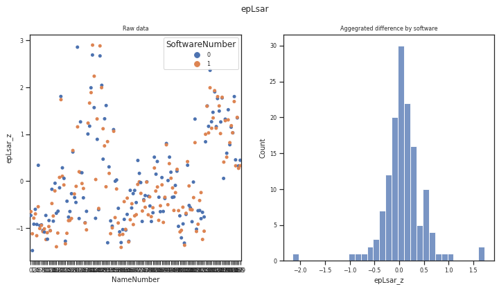
    


    
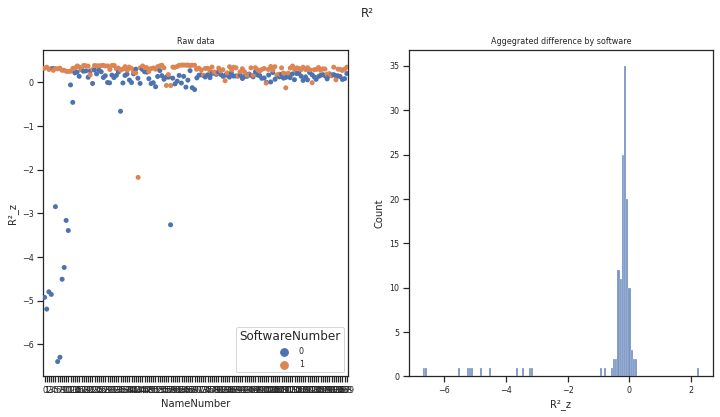
    


    
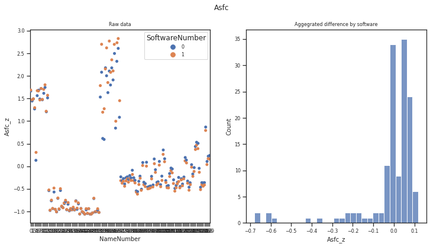
    


    
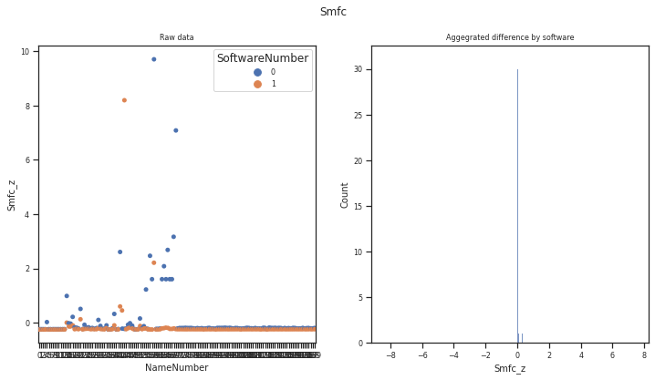
    


    
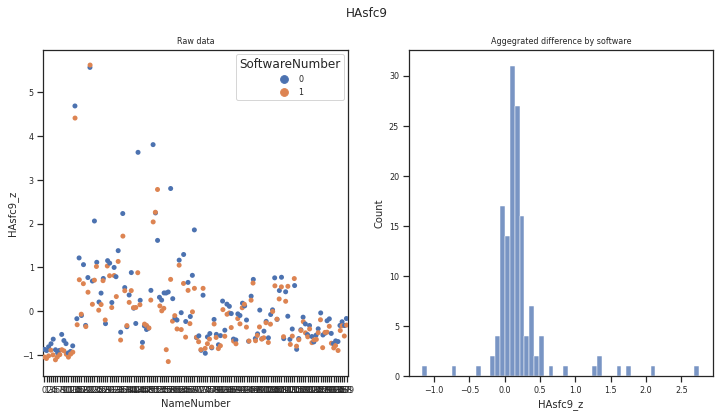
    


    
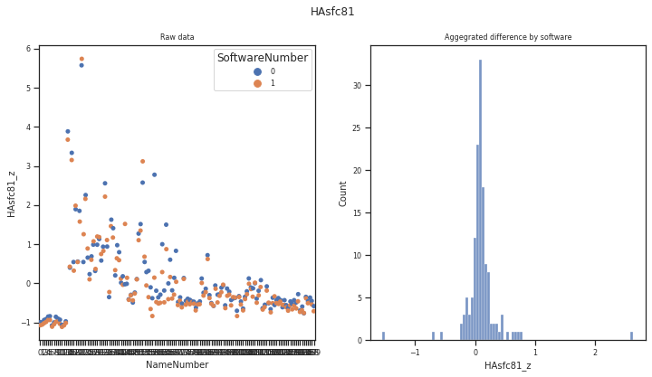
    


## Model specification <a name="model"></a>


```python
class ThreeFactorModel(pm.Model):
    
    """
    Compute params of priors and hyperpriors.
    """
    def getParams(self,x1,x2,x3,y):
        # get lengths
        Nx1Lvl = np.unique(x1).size
        Nx2Lvl = np.unique(x2).size
        Nx3Lvl = np.unique(x3).size        
        
        dims = (Nx1Lvl, Nx2Lvl, Nx3Lvl)
        
        ### get standard deviations
        
        # convert to pandas dataframe to use their logic
        df = pd.DataFrame.from_dict({'x1':x1,'x2':x2,'x3':x3,'y':y})
        
        s1 = df.groupby('x1').std()['y'].max()
        s2 = df.groupby('x2').std()['y'].max()
        s3 = df.groupby('x3').std()['y'].max()
        
        stdSingle = (s1, s2, s3)
        
        return (dims, stdSingle)
    
    def printParams(self,x1,x2,x3,y):
        dims, stdSingle = self.getParams(x1,x2,x3,y)
        Nx1Lvl, Nx2Lvl, Nx3Lvl = dims
        s1, s2, s3 = stdSingle        
        
        print("The number of levels of the x variables are {}".format(dims))
        print("The standard deviations used for the beta priors are {}".format(stdSingle))
            
    def __init__(self,name,x1,x2,x3,y,model=None):
        
        # call super's init first, passing model and name
        super().__init__(name, model)
        
        # get parameter of hyperpriors
        dims, stdSingle = self.getParams(x1,x2,x3,y)
        Nx1Lvl, Nx2Lvl, Nx3Lvl = dims
        s1, s2, s3 = stdSingle        
        
        ### hyperpriors ### 
        # observation hyperpriors
        lamY = 1/30.
        muGamma = 0.5
        sigmaGamma = 2.
        
        # prediction hyperpriors
        sigma0 = pm.HalfNormal('sigma0',sd=1)
        sigma1 = pm.HalfNormal('sigma1',sd=s1, shape=Nx1Lvl)
        sigma2 = pm.HalfNormal('sigma2',sd=s2, shape=Nx2Lvl)
        sigma3 = pm.HalfNormal('sigma3',sd=s3, shape=Nx3Lvl)
                
        mu_b0 = pm.Normal('mu_b0', mu=0., sd=1)
        mu_b1 = pm.Normal('mu_b1', mu=0., sd=1, shape=Nx1Lvl)
        mu_b2 = pm.Normal('mu_b2', mu=0., sd=1, shape=Nx2Lvl)
        mu_b3 = pm.Normal('mu_b3', mu=0., sd=1, shape=Nx3Lvl)       
                                       
        ### priors ### 
        # observation priors        
        nuY = pm.Exponential('nuY',lam=lamY)
        sigmaY = pm.Gamma('sigmaY',mu=muGamma, sigma=sigmaGamma)
        
        # prediction priors
        b0_dist = pm.Normal('b0_dist', mu=0, sd=1)
        b0 = pm.Deterministic("b0", mu_b0 + b0_dist * sigma0)
       
        b1_dist = pm.Normal('b1_dist', mu=0, sd=1)
        b1 = pm.Deterministic("b1", mu_b1 + b1_dist * sigma1)
        
        b2_dist = pm.Normal('b2_dist', mu=0, sd=1)
        b2 = pm.Deterministic("b2", mu_b2 + b2_dist * sigma2)
        
        b3_dist = pm.Normal('b3_dist', mu=0, sd=1)
        b3 = pm.Deterministic("b3", mu_b3 + b3_dist * sigma3)
             
        #### prediction ###      
        mu = pm.Deterministic('mu',b0 + b1[x1] + b2[x2] +  b3[x3])

                                
        ### observation ### 
        y = pm.StudentT('y',nu = nuY, mu=mu, sd=sigmaY, observed=y)
```

## Inference <a name="inference"></a>

### epLsar <a name="epLsar"></a>


```python
with pm.Model() as model:
    epLsarModel = ThreeFactorModel('epLsar',x1,x2,x3,dataZ.epLsar_z.values)
```

#### Verify model settings


```python
epLsarModel.printParams(x1,x2,x3,dataZ.epLsar_z.values)
```

    The number of levels of the x variables are (2, 11, 140)
    The standard deviations used for the beta priors are (1.0100483277420549, 1.278487256789849, 1.5078196766225158)


```python
try:
    graph_epLsar = pm.model_to_graphviz(epLsarModel)    
except:
    graph_epLsar = "Could not make graph"
graph_epLsar
```


    

    


#### Check prior choice


```python
with epLsarModel as model:
    prior_pred_epLsar = pm.sample_prior_predictive(samples=numPredSamples,random_seed=random_seed)
```


```python
plotting_lib.plotPriorPredictive(widthInch,heigthInch,dpi,writeOut,outPathPlots,df,dictMeanStd,prior_pred_epLsar,dataZ.epLsar_z.values,'epLsar')
```


    
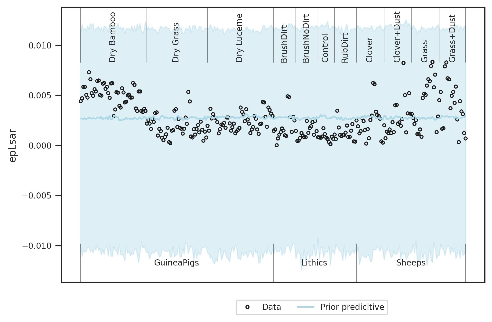
    


Prior choice is as intended: Broad over the data range.

#### Sampling


```python
with epLsarModel as model:
    trace_epLsar = pm.sample(numSamples,cores=numCores,tune=numTune,max_treedepth=20, init='auto',target_accept=target_accept,random_seed=random_seed)
    #fit_epLsar = pm.fit(random_seed=random_seed)
    #trace_epLsar = fit_epLsar.sample(draws=numSamples)
```

    Auto-assigning NUTS sampler...
    Initializing NUTS using jitter+adapt_diag...
    Multiprocess sampling (10 chains in 10 jobs)
    NUTS: [epLsar_b3_dist, epLsar_b2_dist, epLsar_b1_dist, epLsar_b0_dist, epLsar_sigmaY, epLsar_nuY, epLsar_mu_b3, epLsar_mu_b2, epLsar_mu_b1, epLsar_mu_b0, epLsar_sigma3, epLsar_sigma2, epLsar_sigma1, epLsar_sigma0]


<div>
    <style>
        /* Turns off some styling */
        progress {
            /* gets rid of default border in Firefox and Opera. */
            border: none;
            /* Needs to be in here for Safari polyfill so background images work as expected. */
            background-size: auto;
        }
        .progress-bar-interrupted, .progress-bar-interrupted::-webkit-progress-bar {
            background: #F44336;
        }
    </style>
  <progress value='20000' class='' max='20000' style='width:300px; height:20px; vertical-align: middle;'></progress>
  100.00% [20000/20000 20:58<00:00 Sampling 10 chains, 0 divergences]
</div>


    Sampling 10 chains for 1_000 tune and 1_000 draw iterations (10_000 + 10_000 draws total) took 1266 seconds.
    The number of effective samples is smaller than 10% for some parameters.


```python
with epLsarModel as model:
    if writeOut:
        with open(outPathData + 'model_{}.pkl'.format('epLsar'), 'wb') as buff:
            pickle.dump({'model':epLsarModel, 'trace': trace_epLsar}, buff)
```

#### Check sampling


```python
with epLsarModel as model:
    dataTrace_epLsar = az.from_pymc3(trace=trace_epLsar)
```


```python
pm.summary(dataTrace_epLsar,hdi_prob=0.95).round(2)
```


<div>
<style scoped>
    .dataframe tbody tr th:only-of-type {
        vertical-align: middle;
    }

    .dataframe tbody tr th {
        vertical-align: top;
    }

    .dataframe thead th {
        text-align: right;
    }
</style>
<table border="1" class="dataframe">
  <thead>
    <tr style="text-align: right;">
      <th></th>
      <th>mean</th>
      <th>sd</th>
      <th>hdi_2.5%</th>
      <th>hdi_97.5%</th>
      <th>mcse_mean</th>
      <th>mcse_sd</th>
      <th>ess_mean</th>
      <th>ess_sd</th>
      <th>ess_bulk</th>
      <th>ess_tail</th>
      <th>r_hat</th>
    </tr>
  </thead>
  <tbody>
    <tr>
      <th>epLsar_mu_b0</th>
      <td>-0.04</td>
      <td>0.80</td>
      <td>-1.57</td>
      <td>1.59</td>
      <td>0.01</td>
      <td>0.01</td>
      <td>7622.0</td>
      <td>5554.0</td>
      <td>7613.0</td>
      <td>7245.0</td>
      <td>1.00</td>
    </tr>
    <tr>
      <th>epLsar_mu_b1[0]</th>
      <td>0.03</td>
      <td>0.69</td>
      <td>-1.28</td>
      <td>1.48</td>
      <td>0.01</td>
      <td>0.01</td>
      <td>7462.0</td>
      <td>4854.0</td>
      <td>7449.0</td>
      <td>6737.0</td>
      <td>1.00</td>
    </tr>
    <tr>
      <th>epLsar_mu_b1[1]</th>
      <td>-0.07</td>
      <td>0.69</td>
      <td>-1.41</td>
      <td>1.29</td>
      <td>0.01</td>
      <td>0.01</td>
      <td>7114.0</td>
      <td>4883.0</td>
      <td>7145.0</td>
      <td>6557.0</td>
      <td>1.00</td>
    </tr>
    <tr>
      <th>epLsar_mu_b2[0]</th>
      <td>-0.28</td>
      <td>0.52</td>
      <td>-1.28</td>
      <td>0.73</td>
      <td>0.01</td>
      <td>0.00</td>
      <td>4471.0</td>
      <td>4471.0</td>
      <td>4424.0</td>
      <td>5675.0</td>
      <td>1.00</td>
    </tr>
    <tr>
      <th>epLsar_mu_b2[1]</th>
      <td>-0.52</td>
      <td>0.52</td>
      <td>-1.50</td>
      <td>0.51</td>
      <td>0.01</td>
      <td>0.01</td>
      <td>3907.0</td>
      <td>3907.0</td>
      <td>3877.0</td>
      <td>5589.0</td>
      <td>1.00</td>
    </tr>
    <tr>
      <th>...</th>
      <td>...</td>
      <td>...</td>
      <td>...</td>
      <td>...</td>
      <td>...</td>
      <td>...</td>
      <td>...</td>
      <td>...</td>
      <td>...</td>
      <td>...</td>
      <td>...</td>
    </tr>
    <tr>
      <th>epLsar_mu[275]</th>
      <td>0.44</td>
      <td>0.72</td>
      <td>-1.47</td>
      <td>1.11</td>
      <td>0.02</td>
      <td>0.02</td>
      <td>848.0</td>
      <td>848.0</td>
      <td>1775.0</td>
      <td>1849.0</td>
      <td>1.01</td>
    </tr>
    <tr>
      <th>epLsar_mu[276]</th>
      <td>0.28</td>
      <td>0.11</td>
      <td>0.06</td>
      <td>0.52</td>
      <td>0.00</td>
      <td>0.00</td>
      <td>10579.0</td>
      <td>9610.0</td>
      <td>10492.0</td>
      <td>8014.0</td>
      <td>1.00</td>
    </tr>
    <tr>
      <th>epLsar_mu[277]</th>
      <td>0.15</td>
      <td>0.11</td>
      <td>-0.08</td>
      <td>0.39</td>
      <td>0.00</td>
      <td>0.00</td>
      <td>10684.0</td>
      <td>8439.0</td>
      <td>10561.0</td>
      <td>7691.0</td>
      <td>1.00</td>
    </tr>
    <tr>
      <th>epLsar_mu[278]</th>
      <td>-0.91</td>
      <td>0.13</td>
      <td>-1.16</td>
      <td>-0.64</td>
      <td>0.00</td>
      <td>0.00</td>
      <td>10847.0</td>
      <td>10847.0</td>
      <td>10995.0</td>
      <td>7407.0</td>
      <td>1.00</td>
    </tr>
    <tr>
      <th>epLsar_mu[279]</th>
      <td>-1.03</td>
      <td>0.13</td>
      <td>-1.28</td>
      <td>-0.76</td>
      <td>0.00</td>
      <td>0.00</td>
      <td>10794.0</td>
      <td>10794.0</td>
      <td>11021.0</td>
      <td>7493.0</td>
      <td>1.00</td>
    </tr>
  </tbody>
</table>
<p>748 rows × 11 columns</p>
</div>


```python
plotting_lib.plotDiagnostics(widthInch,heigthInch,dpi,writeOut,outPathPlots,trace_epLsar,dataTrace_epLsar,'epLsar')
```

    /home/bob/.local/lib/python3.8/site-packages/arviz/plots/backends/matplotlib/pairplot.py:212: UserWarning: rcParams['plot.max_subplots'] (40) is smaller than the number of resulting pair plots with these variables, generating only a 8x8 grid
      warnings.warn(


    
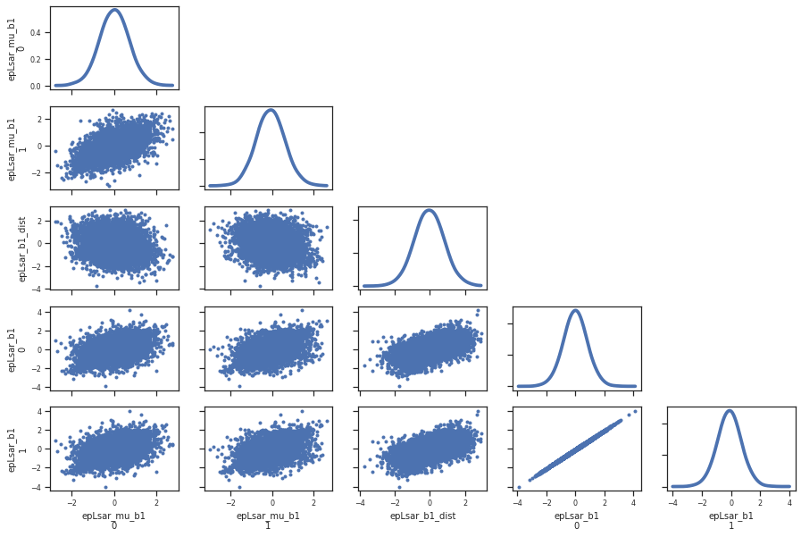
    


    
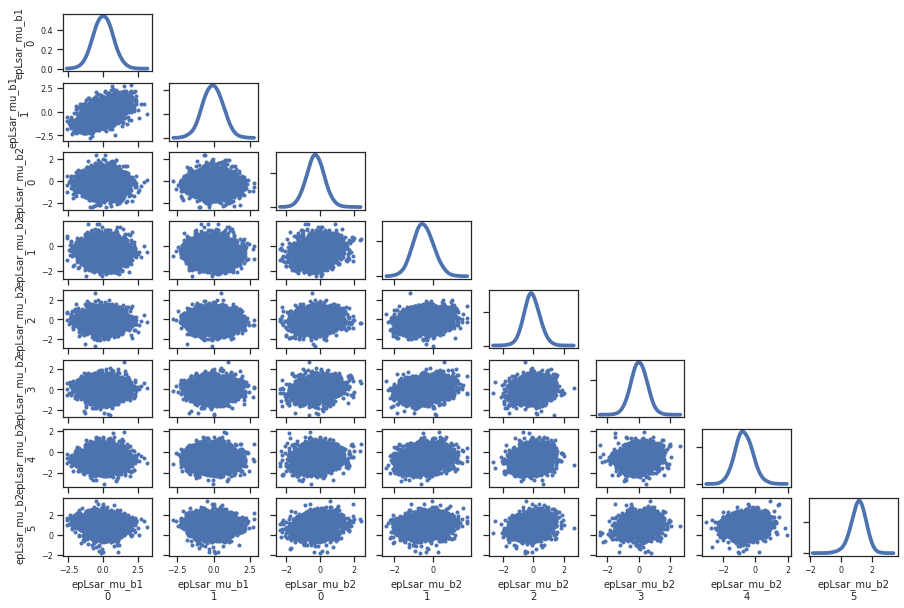
    


    
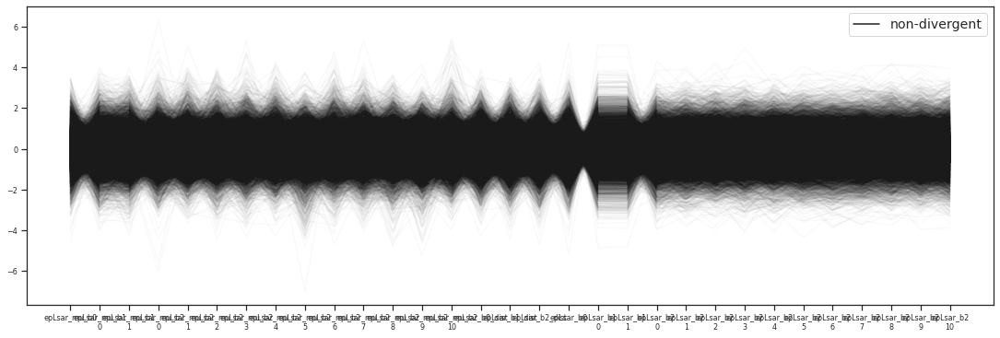
    


    
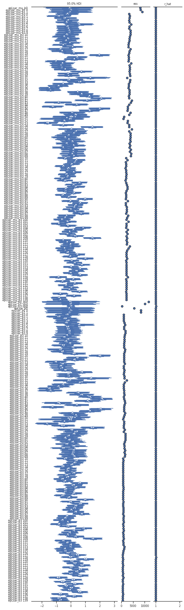
    


```python
with epLsarModel as model:
    plotting_lib.plotTracesB(widthInch,heigthInch,dpi,writeOut,outPathPlots,trace_epLsar,'epLsar')
```


    
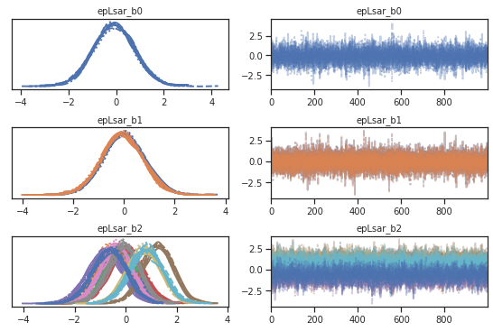
    


```python
with epLsarModel as model:
    plotting_lib.pm.energyplot(trace_epLsar)
```


    
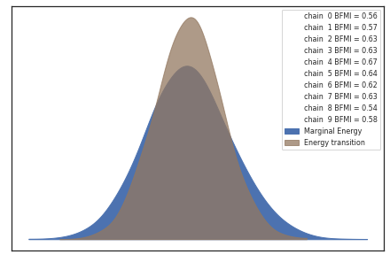
    


#### Posterior predictive distribution


```python
with epLsarModel as model:
    posterior_pred_epLsar = pm.sample_posterior_predictive(trace_epLsar,samples=numPredSamples,random_seed=random_seed)
```

    /home/bob/.local/lib/python3.8/site-packages/pymc3/sampling.py:1707: UserWarning: samples parameter is smaller than nchains times ndraws, some draws and/or chains may not be represented in the returned posterior predictive sample
      warnings.warn(


<div>
    <style>
        /* Turns off some styling */
        progress {
            /* gets rid of default border in Firefox and Opera. */
            border: none;
            /* Needs to be in here for Safari polyfill so background images work as expected. */
            background-size: auto;
        }
        .progress-bar-interrupted, .progress-bar-interrupted::-webkit-progress-bar {
            background: #F44336;
        }
    </style>
  <progress value='2000' class='' max='2000' style='width:300px; height:20px; vertical-align: middle;'></progress>
  100.00% [2000/2000 00:03<00:00]
</div>


```python
plotting_lib.plotPriorPosteriorPredictive(widthInch,heigthInch,dpi,writeOut,outPathPlots,df,dictMeanStd,prior_pred_epLsar,posterior_pred_epLsar,dataZ.epLsar_z.values,'epLsar')
```


    
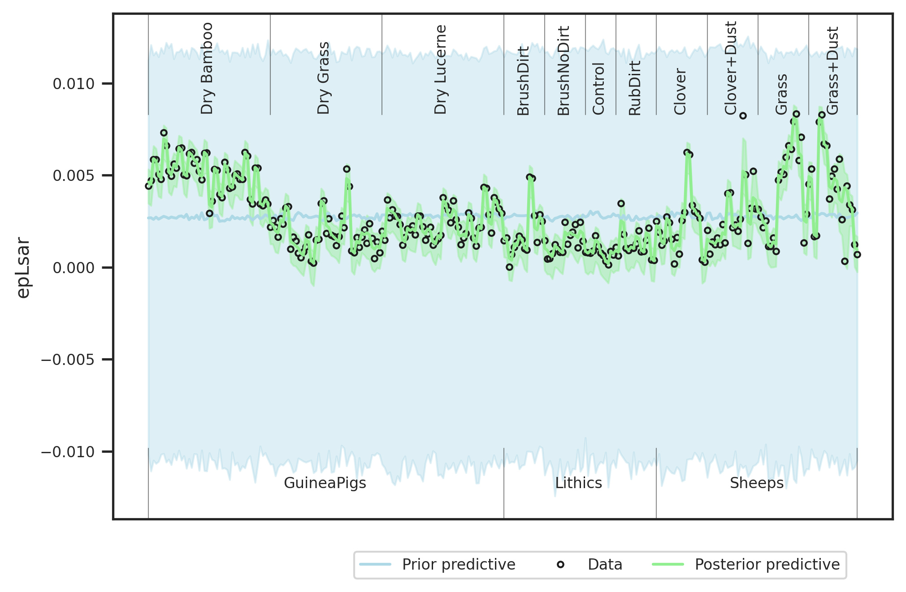
    


#### Compare prior and posterior for model parameters


```python
with epLsarModel as model:
    pm_data_epLsar = az.from_pymc3(trace=trace_epLsar,prior=prior_pred_epLsar,posterior_predictive=posterior_pred_epLsar)
```

    arviz.data.io_pymc3 - WARNING - posterior predictive variable epLsar_y's shape not compatible with number of chains and draws. This can mean that some draws or even whole chains are not represented.


```python
plotting_lib.plotPriorPosteriorB(widthInch,heigthInch,dpi,sizes,writeOut,outPathPlots,dictMeanStd,pm_data_epLsar,'epLsar')
```


    
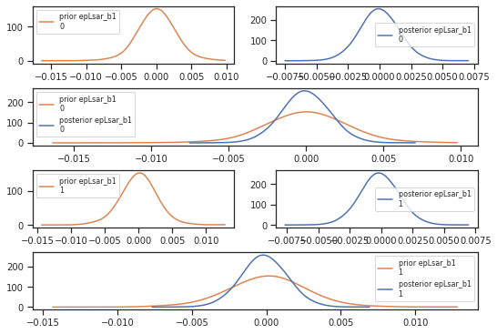
    


#### Posterior and contrasts


```python
plotting_lib.plotPosterior(widthInch,heigthInch,dpi,writeOut,outPathPlots,dictMeanStd,pm_data_epLsar,'epLsar')
```


    
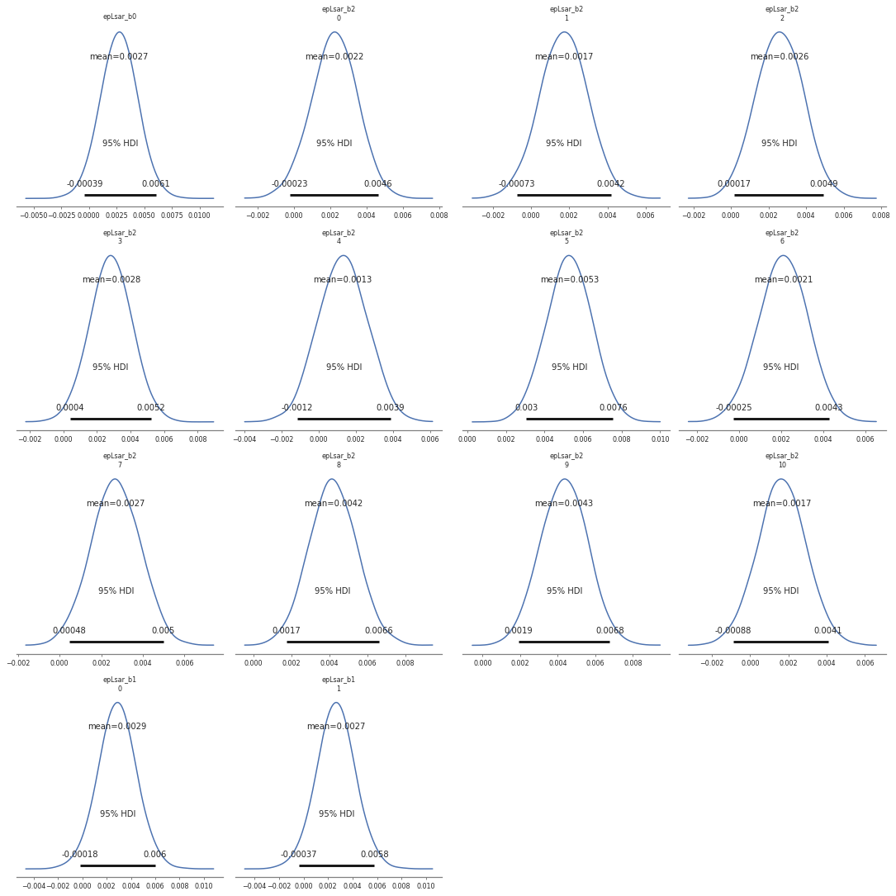
    


```python
plotting_lib.plotContrast(widthInch,heigthInch,dpi,writeOut,outPathPlots,dictMeanStd,x1contrast_dict,trace_epLsar,'epLsar')
```


    
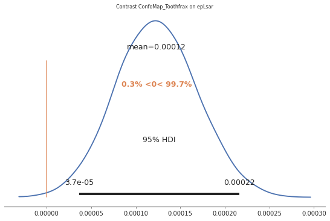
    


### R²<a name="r"></a>


```python
with pm.Model() as model:
    RsquaredModel = ThreeFactorModel('R²',x1,x2,x3,dataZ["R²_z"].values)
```

#### Verify model settings


```python
RsquaredModel.printParams(x1,x2,x3,dataZ["R²_z"].values)
```

    The number of levels of the x variables are (2, 11, 140)
    The standard deviations used for the beta priors are (1.3433087377122408, 2.3171005331515255, 4.743899942874919)


```python
pm.model_to_graphviz(RsquaredModel)
```


    
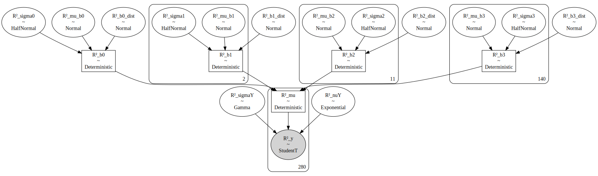
    


#### Check prior choice


```python
with RsquaredModel as model:
    prior_pred_Rsquared = pm.sample_prior_predictive(samples=numPredSamples,random_seed=random_seed)
```


```python
plotting_lib.plotPriorPredictive(widthInch,heigthInch,dpi,writeOut,outPathPlots,df,dictMeanStd,prior_pred_Rsquared,dataZ["R²_z"].values,'R²')
```


    
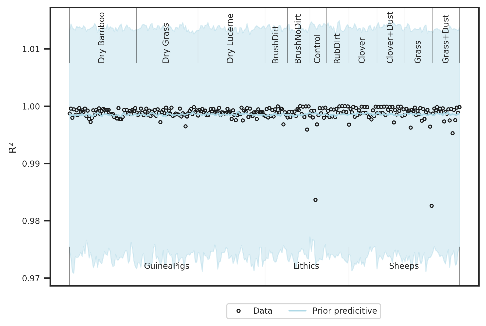
    


#### Sampling


```python
with RsquaredModel as model:
    trace_Rsquared = pm.sample(numSamples,cores=numCores,tune=numTune,max_treedepth=20, init='auto',target_accept=target_accept,random_seed=random_seed)
    #fit_Rsquared = pm.fit(random_seed=random_seed)
    #trace_Rsquared = fit_Rsquared.sample(draws=numSamples)
```

    Auto-assigning NUTS sampler...
    Initializing NUTS using jitter+adapt_diag...
    Multiprocess sampling (10 chains in 10 jobs)
    NUTS: [R²_b3_dist, R²_b2_dist, R²_b1_dist, R²_b0_dist, R²_sigmaY, R²_nuY, R²_mu_b3, R²_mu_b2, R²_mu_b1, R²_mu_b0, R²_sigma3, R²_sigma2, R²_sigma1, R²_sigma0]


<div>
    <style>
        /* Turns off some styling */
        progress {
            /* gets rid of default border in Firefox and Opera. */
            border: none;
            /* Needs to be in here for Safari polyfill so background images work as expected. */
            background-size: auto;
        }
        .progress-bar-interrupted, .progress-bar-interrupted::-webkit-progress-bar {
            background: #F44336;
        }
    </style>
  <progress value='20000' class='' max='20000' style='width:300px; height:20px; vertical-align: middle;'></progress>
  100.00% [20000/20000 1:07:45<00:00 Sampling 10 chains, 0 divergences]
</div>


    Sampling 10 chains for 1_000 tune and 1_000 draw iterations (10_000 + 10_000 draws total) took 4073 seconds.
    The number of effective samples is smaller than 10% for some parameters.


```python
with RsquaredModel as model:
    if writeOut:
        with open(outPathData + 'model_{}.pkl'.format('R²'), 'wb') as buff:
            pickle.dump({'model': RsquaredModel, 'trace': trace_Rsquared}, buff)
```

#### Check sampling


```python
with RsquaredModel as model:
    dataTrace_Rsquared = az.from_pymc3(trace=trace_Rsquared)
```


```python
pm.summary(dataTrace_Rsquared,hdi_prob=0.95).round(2)
```


<div>
<style scoped>
    .dataframe tbody tr th:only-of-type {
        vertical-align: middle;
    }

    .dataframe tbody tr th {
        vertical-align: top;
    }

    .dataframe thead th {
        text-align: right;
    }
</style>
<table border="1" class="dataframe">
  <thead>
    <tr style="text-align: right;">
      <th></th>
      <th>mean</th>
      <th>sd</th>
      <th>hdi_2.5%</th>
      <th>hdi_97.5%</th>
      <th>mcse_mean</th>
      <th>mcse_sd</th>
      <th>ess_mean</th>
      <th>ess_sd</th>
      <th>ess_bulk</th>
      <th>ess_tail</th>
      <th>r_hat</th>
    </tr>
  </thead>
  <tbody>
    <tr>
      <th>R²_mu_b0</th>
      <td>0.08</td>
      <td>0.81</td>
      <td>-1.48</td>
      <td>1.69</td>
      <td>0.01</td>
      <td>0.01</td>
      <td>6762.0</td>
      <td>6163.0</td>
      <td>6757.0</td>
      <td>7576.0</td>
      <td>1.0</td>
    </tr>
    <tr>
      <th>R²_mu_b1[0]</th>
      <td>-0.02</td>
      <td>0.70</td>
      <td>-1.42</td>
      <td>1.30</td>
      <td>0.01</td>
      <td>0.01</td>
      <td>6681.0</td>
      <td>6320.0</td>
      <td>6682.0</td>
      <td>7535.0</td>
      <td>1.0</td>
    </tr>
    <tr>
      <th>R²_mu_b1[1]</th>
      <td>0.10</td>
      <td>0.70</td>
      <td>-1.27</td>
      <td>1.48</td>
      <td>0.01</td>
      <td>0.01</td>
      <td>6703.0</td>
      <td>6116.0</td>
      <td>6708.0</td>
      <td>7195.0</td>
      <td>1.0</td>
    </tr>
    <tr>
      <th>R²_mu_b2[0]</th>
      <td>-0.02</td>
      <td>0.51</td>
      <td>-0.99</td>
      <td>0.99</td>
      <td>0.01</td>
      <td>0.01</td>
      <td>2647.0</td>
      <td>2647.0</td>
      <td>2635.0</td>
      <td>5175.0</td>
      <td>1.0</td>
    </tr>
    <tr>
      <th>R²_mu_b2[1]</th>
      <td>-0.06</td>
      <td>0.50</td>
      <td>-1.02</td>
      <td>0.94</td>
      <td>0.01</td>
      <td>0.01</td>
      <td>2857.0</td>
      <td>2857.0</td>
      <td>2841.0</td>
      <td>5241.0</td>
      <td>1.0</td>
    </tr>
    <tr>
      <th>...</th>
      <td>...</td>
      <td>...</td>
      <td>...</td>
      <td>...</td>
      <td>...</td>
      <td>...</td>
      <td>...</td>
      <td>...</td>
      <td>...</td>
      <td>...</td>
      <td>...</td>
    </tr>
    <tr>
      <th>R²_mu[275]</th>
      <td>0.18</td>
      <td>0.13</td>
      <td>-0.03</td>
      <td>0.40</td>
      <td>0.00</td>
      <td>0.00</td>
      <td>5636.0</td>
      <td>4146.0</td>
      <td>6347.0</td>
      <td>7580.0</td>
      <td>1.0</td>
    </tr>
    <tr>
      <th>R²_mu[276]</th>
      <td>0.17</td>
      <td>0.06</td>
      <td>0.06</td>
      <td>0.27</td>
      <td>0.00</td>
      <td>0.00</td>
      <td>9507.0</td>
      <td>6626.0</td>
      <td>9754.0</td>
      <td>6729.0</td>
      <td>1.0</td>
    </tr>
    <tr>
      <th>R²_mu[277]</th>
      <td>0.32</td>
      <td>0.06</td>
      <td>0.23</td>
      <td>0.43</td>
      <td>0.00</td>
      <td>0.00</td>
      <td>9769.0</td>
      <td>8101.0</td>
      <td>9835.0</td>
      <td>6548.0</td>
      <td>1.0</td>
    </tr>
    <tr>
      <th>R²_mu[278]</th>
      <td>0.25</td>
      <td>0.05</td>
      <td>0.15</td>
      <td>0.33</td>
      <td>0.00</td>
      <td>0.00</td>
      <td>10851.0</td>
      <td>5275.0</td>
      <td>9471.0</td>
      <td>6342.0</td>
      <td>1.0</td>
    </tr>
    <tr>
      <th>R²_mu[279]</th>
      <td>0.40</td>
      <td>0.05</td>
      <td>0.31</td>
      <td>0.49</td>
      <td>0.00</td>
      <td>0.00</td>
      <td>11002.0</td>
      <td>6677.0</td>
      <td>9808.0</td>
      <td>6533.0</td>
      <td>1.0</td>
    </tr>
  </tbody>
</table>
<p>748 rows × 11 columns</p>
</div>


```python
plotting_lib.plotDiagnostics(widthInch,heigthInch,dpi,writeOut,outPathPlots,dataTrace_Rsquared,trace_Rsquared,'R²')
```

    /home/bob/.local/lib/python3.8/site-packages/arviz/data/io_pymc3.py:85: FutureWarning: Using `from_pymc3` without the model will be deprecated in a future release. Not using the model will return less accurate and less useful results. Make sure you use the model argument or call from_pymc3 within a model context.
      warnings.warn(
    /home/bob/.local/lib/python3.8/site-packages/arviz/data/io_pymc3.py:85: FutureWarning: Using `from_pymc3` without the model will be deprecated in a future release. Not using the model will return less accurate and less useful results. Make sure you use the model argument or call from_pymc3 within a model context.
      warnings.warn(
    /home/bob/.local/lib/python3.8/site-packages/arviz/plots/backends/matplotlib/pairplot.py:212: UserWarning: rcParams['plot.max_subplots'] (40) is smaller than the number of resulting pair plots with these variables, generating only a 8x8 grid
      warnings.warn(
    /home/bob/.local/lib/python3.8/site-packages/arviz/data/io_pymc3.py:85: FutureWarning: Using `from_pymc3` without the model will be deprecated in a future release. Not using the model will return less accurate and less useful results. Make sure you use the model argument or call from_pymc3 within a model context.
      warnings.warn(
    /home/bob/.local/lib/python3.8/site-packages/arviz/data/io_pymc3.py:85: FutureWarning: Using `from_pymc3` without the model will be deprecated in a future release. Not using the model will return less accurate and less useful results. Make sure you use the model argument or call from_pymc3 within a model context.
      warnings.warn(


    
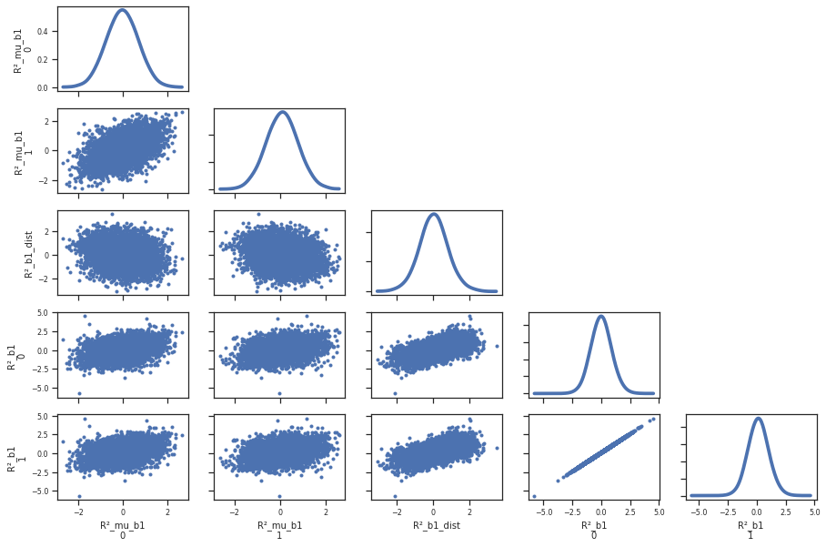
    


    
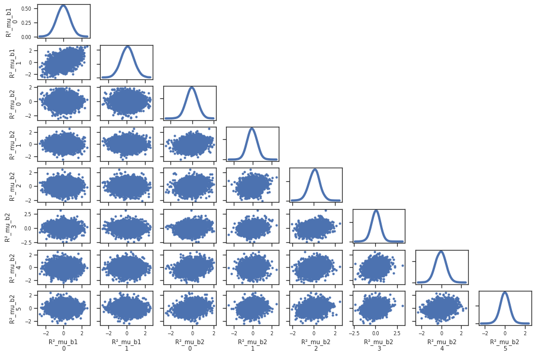
    


    
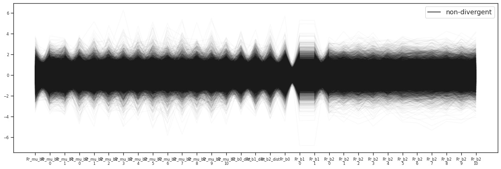
    


    
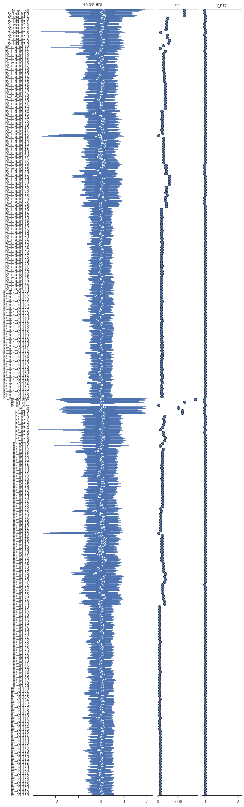
    


```python
with RsquaredModel as model:
    plotting_lib.plotTracesB(widthInch,heigthInch,dpi,writeOut,outPathPlots,trace_Rsquared,'R²')
```


    
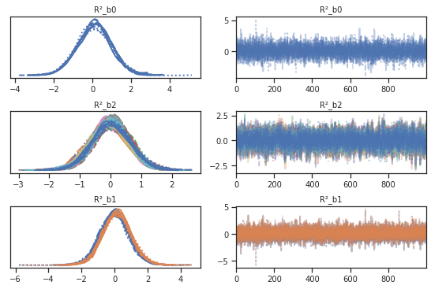
    


```python
with RsquaredModel as model:
    plotting_lib.pm.energyplot(trace_Rsquared)
```


    
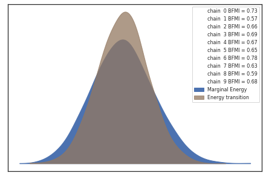
    


#### Posterior predictive distribution


```python
with RsquaredModel as model:
    posterior_pred_Rsquared = pm.sample_posterior_predictive(trace_Rsquared,samples=numPredSamples,random_seed=random_seed)
```

    /home/bob/.local/lib/python3.8/site-packages/pymc3/sampling.py:1707: UserWarning: samples parameter is smaller than nchains times ndraws, some draws and/or chains may not be represented in the returned posterior predictive sample
      warnings.warn(


<div>
    <style>
        /* Turns off some styling */
        progress {
            /* gets rid of default border in Firefox and Opera. */
            border: none;
            /* Needs to be in here for Safari polyfill so background images work as expected. */
            background-size: auto;
        }
        .progress-bar-interrupted, .progress-bar-interrupted::-webkit-progress-bar {
            background: #F44336;
        }
    </style>
  <progress value='2000' class='' max='2000' style='width:300px; height:20px; vertical-align: middle;'></progress>
  100.00% [2000/2000 00:03<00:00]
</div>


```python
plotting_lib.plotPriorPosteriorPredictive(widthInch,heigthInch,dpi,writeOut,outPathPlots,df,dictMeanStd,prior_pred_Rsquared,posterior_pred_Rsquared,dataZ["R²_z"].values,'R²')
```


    
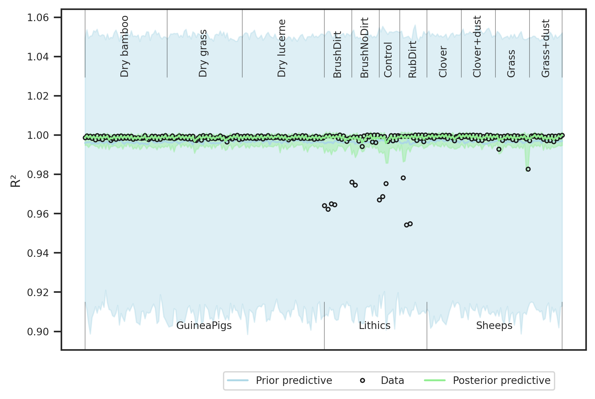
    


#### Compare prior and posterior for model parameters


```python
with RsquaredModel as model:
    pm_data_Rsquared = az.from_pymc3(trace=trace_Rsquared,prior=prior_pred_Rsquared,posterior_predictive=posterior_pred_Rsquared)
```

    arviz.data.io_pymc3 - WARNING - posterior predictive variable R²_y's shape not compatible with number of chains and draws. This can mean that some draws or even whole chains are not represented.


```python
plotting_lib.plotPriorPosteriorB(widthInch,heigthInch,dpi,sizes,writeOut,outPathPlots,dictMeanStd,pm_data_Rsquared,'R²')
```


    
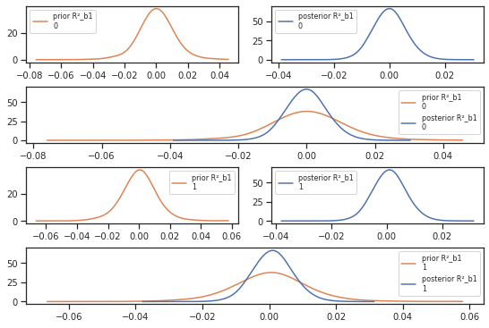
    


#### Posterior and contrasts


```python
plotting_lib.plotPosterior(widthInch,heigthInch,dpi,writeOut,outPathPlots,dictMeanStd,pm_data_Rsquared,'R²')
```


    
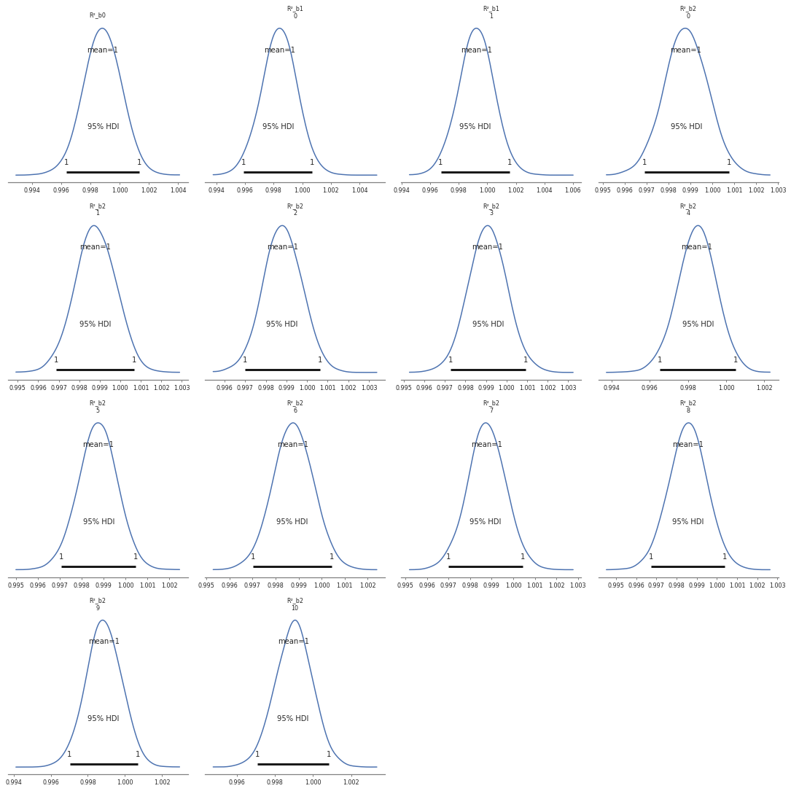
    


```python
plotting_lib.plotContrast(widthInch,heigthInch,dpi,writeOut,outPathPlots,dictMeanStd,x1contrast_dict,trace_Rsquared,'R²')
```


    
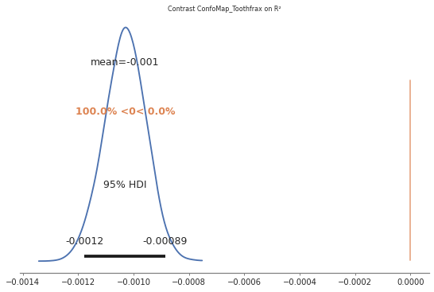
    


### Asfc  <a name="Asfc"></a>


```python
with pm.Model() as model:
    AsfcModel = ThreeFactorModel('Asfc',x1,x2,x3,dataZ["Asfc_z"].values)
```

#### Verify model settings


```python
AsfcModel.printParams(x1,x2,x3,dataZ["Asfc_z"].values)
```

    The number of levels of the x variables are (2, 11, 140)
    The standard deviations used for the beta priors are (1.0620939450667206, 0.7885965314025212, 0.651156614448482)


```python
pm.model_to_graphviz(AsfcModel)
```


    
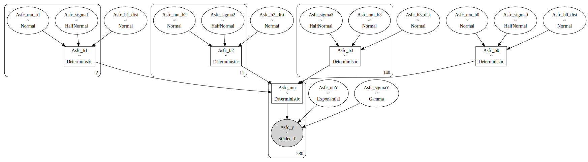
    


#### Check prior choice


```python
with AsfcModel as model:
    prior_pred_Asfc = pm.sample_prior_predictive(samples=numPredSamples,random_seed=random_seed)
```


```python
plotting_lib.plotPriorPredictive(widthInch,heigthInch,dpi,writeOut,outPathPlots,df,dictMeanStd,prior_pred_Asfc,dataZ["Asfc_z"].values,'Asfc')
```


    
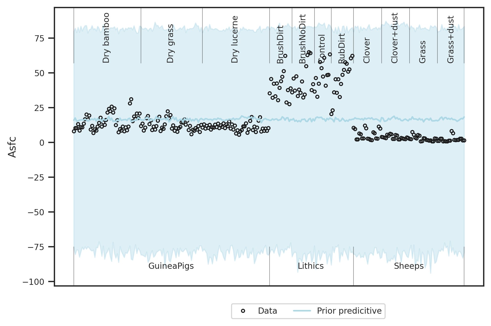
    


Prior choice is as intended: Broad over the data range.

#### Sampling


```python
with AsfcModel as model:
    trace_Asfc = pm.sample(numSamples,cores=numCores,tune=numTune,max_treedepth=20, init='auto',target_accept=target_accept,random_seed=random_seed)
    #fit_Asfc = pm.fit(random_seed=random_seed)
    #trace_Asfc = fit_Asfc.sample(draws=numSamples)
```

    Auto-assigning NUTS sampler...
    Initializing NUTS using jitter+adapt_diag...
    Multiprocess sampling (10 chains in 10 jobs)
    NUTS: [Asfc_b3_dist, Asfc_b2_dist, Asfc_b1_dist, Asfc_b0_dist, Asfc_sigmaY, Asfc_nuY, Asfc_mu_b3, Asfc_mu_b2, Asfc_mu_b1, Asfc_mu_b0, Asfc_sigma3, Asfc_sigma2, Asfc_sigma1, Asfc_sigma0]


<div>
    <style>
        /* Turns off some styling */
        progress {
            /* gets rid of default border in Firefox and Opera. */
            border: none;
            /* Needs to be in here for Safari polyfill so background images work as expected. */
            background-size: auto;
        }
        .progress-bar-interrupted, .progress-bar-interrupted::-webkit-progress-bar {
            background: #F44336;
        }
    </style>
  <progress value='20000' class='' max='20000' style='width:300px; height:20px; vertical-align: middle;'></progress>
  100.00% [20000/20000 46:06<00:00 Sampling 10 chains, 0 divergences]
</div>


    Sampling 10 chains for 1_000 tune and 1_000 draw iterations (10_000 + 10_000 draws total) took 2767 seconds.
    The number of effective samples is smaller than 10% for some parameters.


```python
with AsfcModel as model:
    if writeOut:
        with open(outPathData + 'model_{}.pkl'.format('Asfc'), 'wb') as buff:
            pickle.dump({'model': AsfcModel, 'trace': trace_Asfc}, buff)
```

#### Check sampling


```python
with AsfcModel as model:
    dataTrace_Asfc = az.from_pymc3(trace=trace_Asfc)
```


```python
pm.summary(dataTrace_Asfc,hdi_prob=0.95).round(2)
```


<div>
<style scoped>
    .dataframe tbody tr th:only-of-type {
        vertical-align: middle;
    }

    .dataframe tbody tr th {
        vertical-align: top;
    }

    .dataframe thead th {
        text-align: right;
    }
</style>
<table border="1" class="dataframe">
  <thead>
    <tr style="text-align: right;">
      <th></th>
      <th>mean</th>
      <th>sd</th>
      <th>hdi_2.5%</th>
      <th>hdi_97.5%</th>
      <th>mcse_mean</th>
      <th>mcse_sd</th>
      <th>ess_mean</th>
      <th>ess_sd</th>
      <th>ess_bulk</th>
      <th>ess_tail</th>
      <th>r_hat</th>
    </tr>
  </thead>
  <tbody>
    <tr>
      <th>Asfc_mu_b0</th>
      <td>0.06</td>
      <td>0.83</td>
      <td>-1.59</td>
      <td>1.65</td>
      <td>0.01</td>
      <td>0.01</td>
      <td>8891.0</td>
      <td>5324.0</td>
      <td>8899.0</td>
      <td>7339.0</td>
      <td>1.0</td>
    </tr>
    <tr>
      <th>Asfc_mu_b1[0]</th>
      <td>-0.03</td>
      <td>0.70</td>
      <td>-1.45</td>
      <td>1.29</td>
      <td>0.01</td>
      <td>0.01</td>
      <td>8832.0</td>
      <td>6211.0</td>
      <td>8820.0</td>
      <td>8127.0</td>
      <td>1.0</td>
    </tr>
    <tr>
      <th>Asfc_mu_b1[1]</th>
      <td>0.10</td>
      <td>0.71</td>
      <td>-1.26</td>
      <td>1.50</td>
      <td>0.01</td>
      <td>0.01</td>
      <td>8935.0</td>
      <td>6109.0</td>
      <td>8938.0</td>
      <td>7797.0</td>
      <td>1.0</td>
    </tr>
    <tr>
      <th>Asfc_mu_b2[0]</th>
      <td>0.94</td>
      <td>0.55</td>
      <td>-0.17</td>
      <td>1.98</td>
      <td>0.01</td>
      <td>0.00</td>
      <td>5261.0</td>
      <td>5261.0</td>
      <td>5234.0</td>
      <td>6534.0</td>
      <td>1.0</td>
    </tr>
    <tr>
      <th>Asfc_mu_b2[1]</th>
      <td>1.17</td>
      <td>0.56</td>
      <td>0.08</td>
      <td>2.29</td>
      <td>0.01</td>
      <td>0.01</td>
      <td>4678.0</td>
      <td>4678.0</td>
      <td>4685.0</td>
      <td>6474.0</td>
      <td>1.0</td>
    </tr>
    <tr>
      <th>...</th>
      <td>...</td>
      <td>...</td>
      <td>...</td>
      <td>...</td>
      <td>...</td>
      <td>...</td>
      <td>...</td>
      <td>...</td>
      <td>...</td>
      <td>...</td>
      <td>...</td>
    </tr>
    <tr>
      <th>Asfc_mu[275]</th>
      <td>-0.88</td>
      <td>0.07</td>
      <td>-1.01</td>
      <td>-0.74</td>
      <td>0.00</td>
      <td>0.00</td>
      <td>10206.0</td>
      <td>9471.0</td>
      <td>9696.0</td>
      <td>7353.0</td>
      <td>1.0</td>
    </tr>
    <tr>
      <th>Asfc_mu[276]</th>
      <td>-0.95</td>
      <td>0.07</td>
      <td>-1.09</td>
      <td>-0.81</td>
      <td>0.00</td>
      <td>0.00</td>
      <td>9236.0</td>
      <td>9236.0</td>
      <td>9372.0</td>
      <td>7709.0</td>
      <td>1.0</td>
    </tr>
    <tr>
      <th>Asfc_mu[277]</th>
      <td>-0.82</td>
      <td>0.07</td>
      <td>-0.95</td>
      <td>-0.67</td>
      <td>0.00</td>
      <td>0.00</td>
      <td>9314.0</td>
      <td>9314.0</td>
      <td>9458.0</td>
      <td>7407.0</td>
      <td>1.0</td>
    </tr>
    <tr>
      <th>Asfc_mu[278]</th>
      <td>-1.03</td>
      <td>0.07</td>
      <td>-1.17</td>
      <td>-0.90</td>
      <td>0.00</td>
      <td>0.00</td>
      <td>10064.0</td>
      <td>10064.0</td>
      <td>10103.0</td>
      <td>7744.0</td>
      <td>1.0</td>
    </tr>
    <tr>
      <th>Asfc_mu[279]</th>
      <td>-0.90</td>
      <td>0.07</td>
      <td>-1.04</td>
      <td>-0.77</td>
      <td>0.00</td>
      <td>0.00</td>
      <td>9929.0</td>
      <td>9929.0</td>
      <td>9977.0</td>
      <td>7300.0</td>
      <td>1.0</td>
    </tr>
  </tbody>
</table>
<p>748 rows × 11 columns</p>
</div>


```python
plotting_lib.plotDiagnostics(widthInch,heigthInch,dpi,writeOut,outPathPlots,trace_Asfc,dataTrace_Asfc,'Asfc')
```

    /home/bob/.local/lib/python3.8/site-packages/arviz/plots/backends/matplotlib/pairplot.py:212: UserWarning: rcParams['plot.max_subplots'] (40) is smaller than the number of resulting pair plots with these variables, generating only a 8x8 grid
      warnings.warn(


    
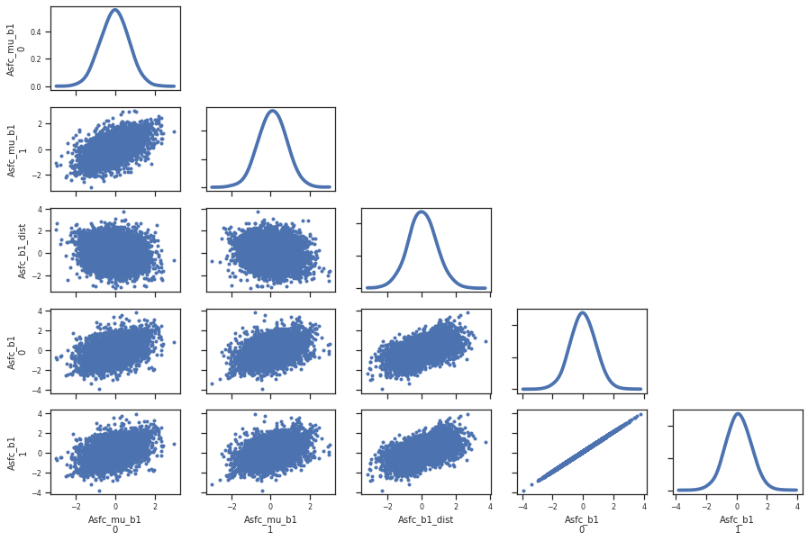
    


    

    


    
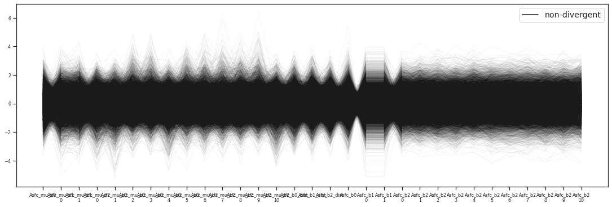
    


    
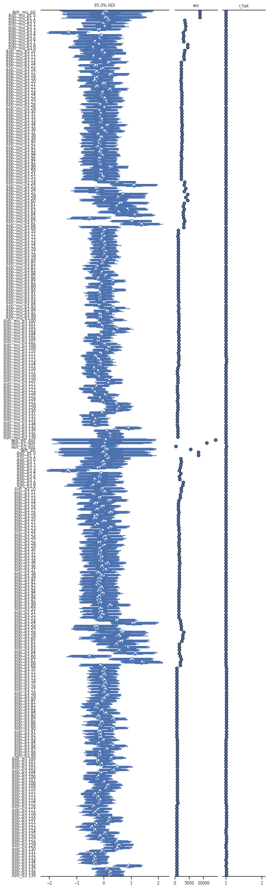
    


```python
with AsfcModel as model:
    plotting_lib.plotTracesB(widthInch,heigthInch,dpi,writeOut,outPathPlots,trace_Asfc,'Asfc')
```


    
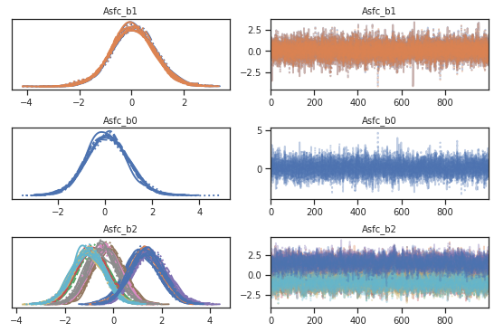
    


```python
with AsfcModel as model:
    plotting_lib.pm.energyplot(trace_Asfc)
```


    
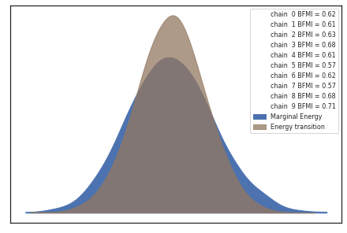
    


#### Posterior predictive distribution


```python
with AsfcModel as model:
    posterior_pred_Asfc = pm.sample_posterior_predictive(trace_Asfc,samples=numPredSamples,random_seed=random_seed)
```

    /home/bob/.local/lib/python3.8/site-packages/pymc3/sampling.py:1707: UserWarning: samples parameter is smaller than nchains times ndraws, some draws and/or chains may not be represented in the returned posterior predictive sample
      warnings.warn(


<div>
    <style>
        /* Turns off some styling */
        progress {
            /* gets rid of default border in Firefox and Opera. */
            border: none;
            /* Needs to be in here for Safari polyfill so background images work as expected. */
            background-size: auto;
        }
        .progress-bar-interrupted, .progress-bar-interrupted::-webkit-progress-bar {
            background: #F44336;
        }
    </style>
  <progress value='2000' class='' max='2000' style='width:300px; height:20px; vertical-align: middle;'></progress>
  100.00% [2000/2000 00:03<00:00]
</div>


```python
plotting_lib.plotPriorPosteriorPredictive(widthInch,heigthInch,dpi,writeOut,outPathPlots,df,dictMeanStd,prior_pred_Asfc,posterior_pred_Asfc,dataZ["Asfc_z"].values,'Asfc')
```


    
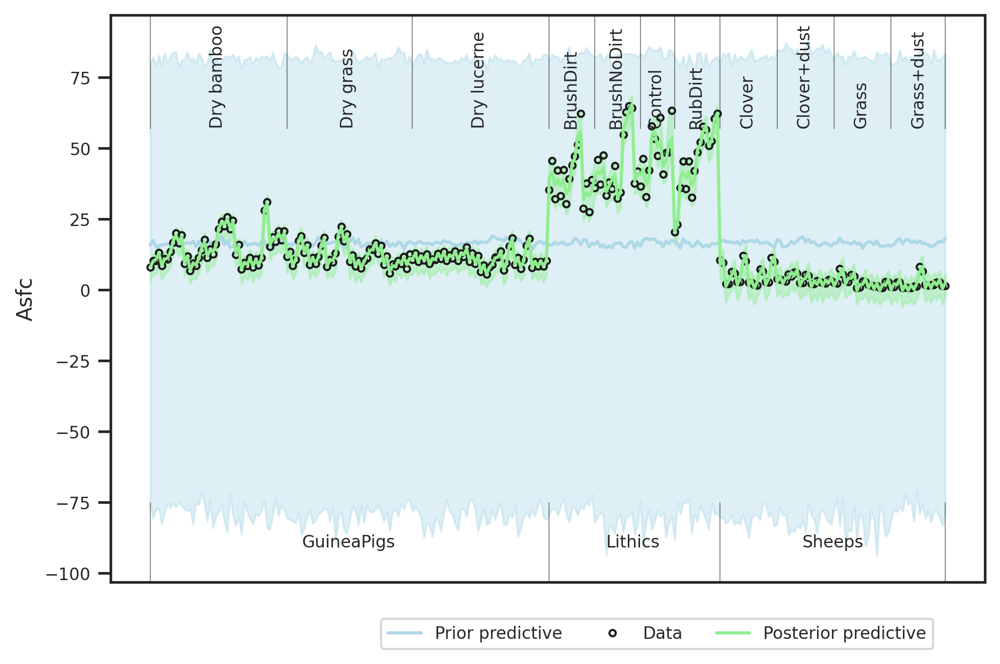
    


#### Compare prior and posterior for model parameters


```python
with AsfcModel as model:
    pm_data_Asfc = az.from_pymc3(trace=trace_Asfc,prior=prior_pred_Asfc,posterior_predictive=posterior_pred_Asfc)
```

    arviz.data.io_pymc3 - WARNING - posterior predictive variable Asfc_y's shape not compatible with number of chains and draws. This can mean that some draws or even whole chains are not represented.


```python
plotting_lib.plotPriorPosteriorB(widthInch,heigthInch,dpi,sizes,writeOut,outPathPlots,dictMeanStd,pm_data_Asfc,'Asfc')
```


    
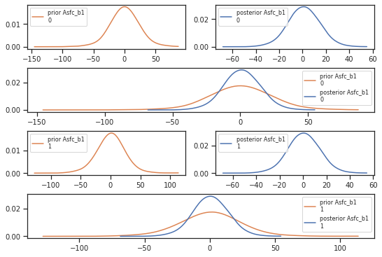
    


#### Posterior and contrasts


```python
plotting_lib.plotPosterior(widthInch,heigthInch,dpi,writeOut,outPathPlots,dictMeanStd,pm_data_Asfc,'Asfc')
```


    
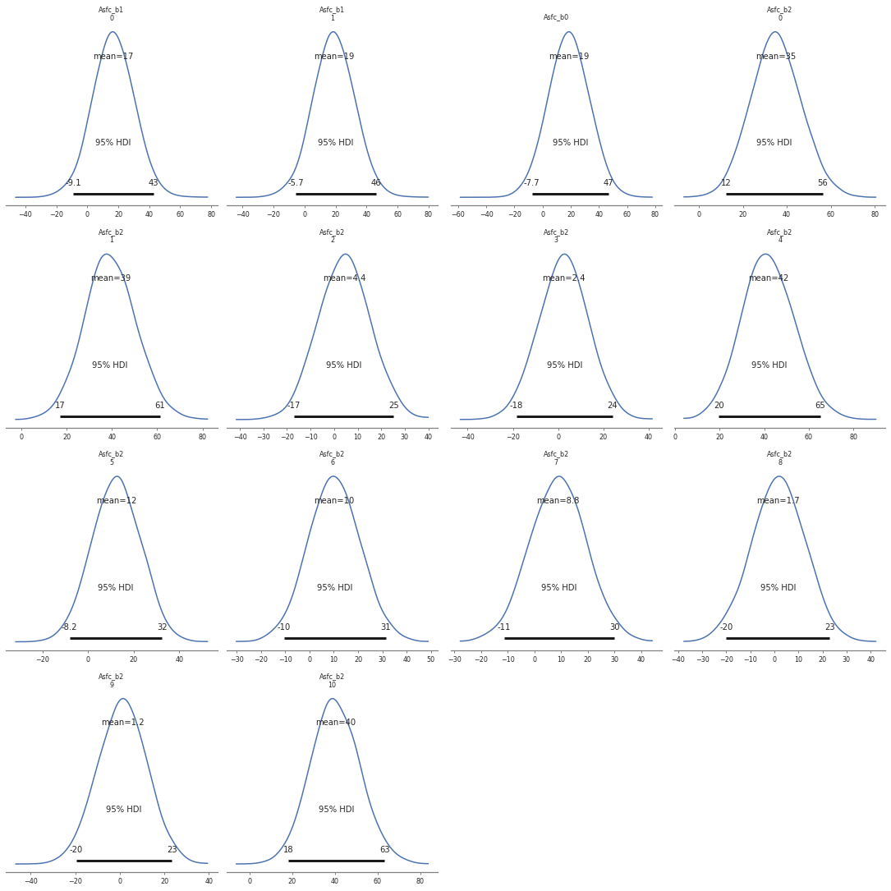
    


```python
plotting_lib.plotContrast(widthInch,heigthInch,dpi,writeOut,outPathPlots,dictMeanStd,x1contrast_dict,trace_Asfc,'Asfc')
```


    
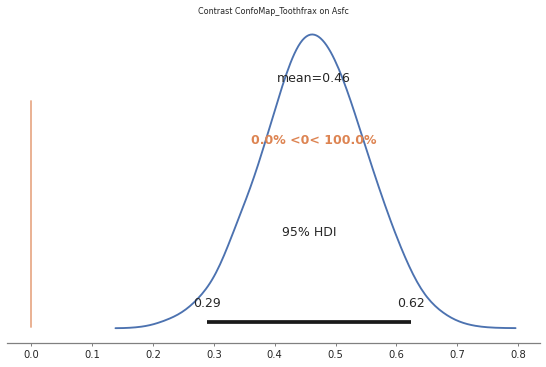
    


### 	Smfc  <a name="Smfc"></a>


```python
with pm.Model() as model:
    SmfcModel = ThreeFactorModel('Smfc',x1,x2,x3,dataZ.Smfc_z.values)
```

#### Verify model settings


```python
SmfcModel.printParams(x1,x2,x3,dataZ.Smfc_z.values)
```

    The number of levels of the x variables are (2, 11, 140)
    The standard deviations used for the beta priors are (1.190539275484547, 2.890262579386322, 5.950218540146849)


```python
pm.model_to_graphviz(SmfcModel)
```


    
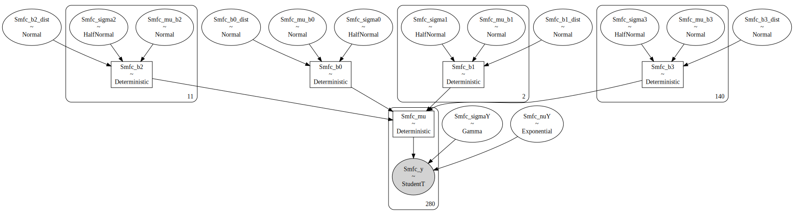
    


#### Check prior choice


```python
with SmfcModel as model:
    prior_pred_Smfc = pm.sample_prior_predictive(samples=numPredSamples,random_seed=random_seed)
```


```python
plotting_lib.plotPriorPredictive(widthInch,heigthInch,dpi,writeOut,outPathPlots,df,dictMeanStd,prior_pred_Smfc,dataZ.Smfc_z.values,'Smfc')
```


    
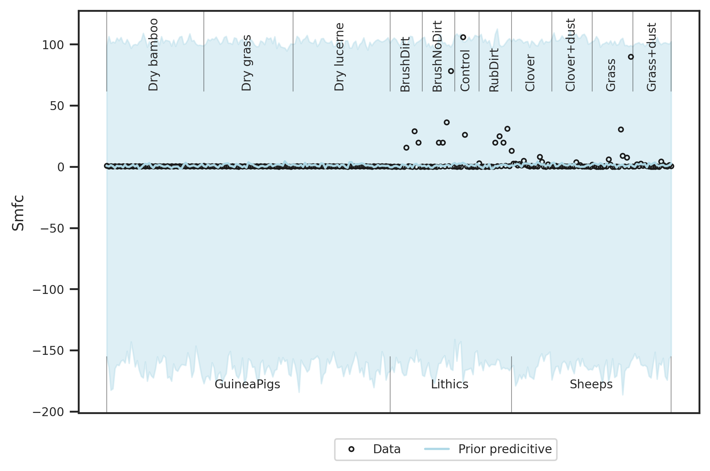
    


Prior choice is as intended: Broad over the data range.

#### Sampling


```python
with SmfcModel as model:
    trace_Smfc = pm.sample(numSamples,cores=numCores,tune=numTune,max_treedepth=20, init='auto',target_accept=0.8,random_seed=random_seed)
    #fit_Smfc = pm.fit(random_seed=random_seed)
    #trace_Smfc = fit_Smfc.sample(draws=numSamples)
```

    Auto-assigning NUTS sampler...
    Initializing NUTS using jitter+adapt_diag...
    Multiprocess sampling (10 chains in 10 jobs)
    NUTS: [Smfc_b3_dist, Smfc_b2_dist, Smfc_b1_dist, Smfc_b0_dist, Smfc_sigmaY, Smfc_nuY, Smfc_mu_b3, Smfc_mu_b2, Smfc_mu_b1, Smfc_mu_b0, Smfc_sigma3, Smfc_sigma2, Smfc_sigma1, Smfc_sigma0]


<div>
    <style>
        /* Turns off some styling */
        progress {
            /* gets rid of default border in Firefox and Opera. */
            border: none;
            /* Needs to be in here for Safari polyfill so background images work as expected. */
            background-size: auto;
        }
        .progress-bar-interrupted, .progress-bar-interrupted::-webkit-progress-bar {
            background: #F44336;
        }
    </style>
  <progress value='20000' class='' max='20000' style='width:300px; height:20px; vertical-align: middle;'></progress>
  100.00% [20000/20000 2:31:29<00:00 Sampling 10 chains, 2,294 divergences]
</div>


    Sampling 10 chains for 1_000 tune and 1_000 draw iterations (10_000 + 10_000 draws total) took 9091 seconds.
    There were 264 divergences after tuning. Increase `target_accept` or reparameterize.
    There were 182 divergences after tuning. Increase `target_accept` or reparameterize.
    There were 124 divergences after tuning. Increase `target_accept` or reparameterize.
    There were 160 divergences after tuning. Increase `target_accept` or reparameterize.
    There were 742 divergences after tuning. Increase `target_accept` or reparameterize.
    The acceptance probability does not match the target. It is 0.3985393735661282, but should be close to 0.8. Try to increase the number of tuning steps.
    There were 211 divergences after tuning. Increase `target_accept` or reparameterize.
    There were 68 divergences after tuning. Increase `target_accept` or reparameterize.
    There were 154 divergences after tuning. Increase `target_accept` or reparameterize.
    The acceptance probability does not match the target. It is 0.7083666219961883, but should be close to 0.8. Try to increase the number of tuning steps.
    There were 76 divergences after tuning. Increase `target_accept` or reparameterize.
    There were 313 divergences after tuning. Increase `target_accept` or reparameterize.
    The rhat statistic is larger than 1.4 for some parameters. The sampler did not converge.
    The estimated number of effective samples is smaller than 200 for some parameters.


Analysis stopped here because sampling did not converge.
As the plot shows, some data points are very far away from the others, which would require the analysis to be based on more heavy-tailed distributions.

### HAsfc9 <a name="HAsfc9"></a>


```python
with pm.Model() as model:
    HAsfc9Model = ThreeFactorModel('HAsfc9',x1,x2,x3,dataZ["HAsfc9_z"].values)
```

#### Verify model settings


```python
HAsfc9Model.printParams(x1,x2,x3,dataZ["HAsfc9_z"].values)
```

    The number of levels of the x variables are (2, 11, 140)
    The standard deviations used for the beta priors are (1.0540496136136044, 2.005676747692769, 1.9447674898721503)


```python
pm.model_to_graphviz(HAsfc9Model)
```


    
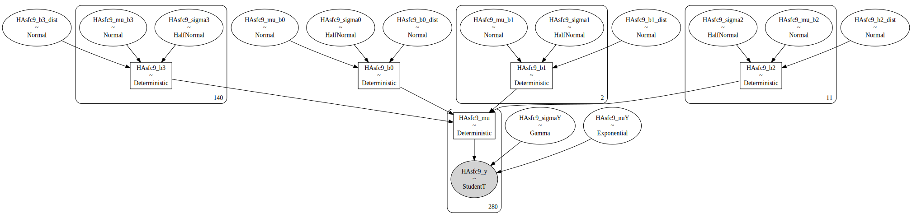
    


#### Check prior choice


```python
with HAsfc9Model as model:
    prior_pred_HAsfc9 = pm.sample_prior_predictive(samples=numPredSamples,random_seed=random_seed)
```


```python
plotting_lib.plotPriorPredictive(widthInch,heigthInch,dpi,writeOut,outPathPlots,df,dictMeanStd,prior_pred_HAsfc9,dataZ["HAsfc9_z"].values,'HAsfc9')
```


    
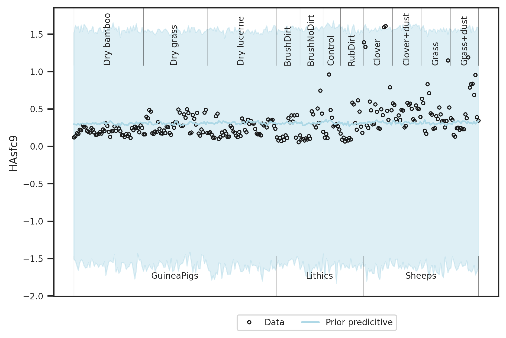
    


Prior choice is as intended: Broad over the data range.

#### Sampling


```python
with HAsfc9Model as model:
    trace_HAsfc9 = pm.sample(numSamples,cores=numCores,tune=numTune,max_treedepth=20, init='auto',target_accept=target_accept,random_seed=random_seed)
    #fit_HAsfc9 = pm.fit(random_seed=random_seed)
    #trace_HAsfc9 = fit_HAsfc9.sample(draws=numSamples)
```

    Auto-assigning NUTS sampler...
    Initializing NUTS using jitter+adapt_diag...
    Multiprocess sampling (10 chains in 10 jobs)
    NUTS: [HAsfc9_b3_dist, HAsfc9_b2_dist, HAsfc9_b1_dist, HAsfc9_b0_dist, HAsfc9_sigmaY, HAsfc9_nuY, HAsfc9_mu_b3, HAsfc9_mu_b2, HAsfc9_mu_b1, HAsfc9_mu_b0, HAsfc9_sigma3, HAsfc9_sigma2, HAsfc9_sigma1, HAsfc9_sigma0]


<div>
    <style>
        /* Turns off some styling */
        progress {
            /* gets rid of default border in Firefox and Opera. */
            border: none;
            /* Needs to be in here for Safari polyfill so background images work as expected. */
            background-size: auto;
        }
        .progress-bar-interrupted, .progress-bar-interrupted::-webkit-progress-bar {
            background: #F44336;
        }
    </style>
  <progress value='20000' class='' max='20000' style='width:300px; height:20px; vertical-align: middle;'></progress>
  100.00% [20000/20000 41:27<00:00 Sampling 10 chains, 0 divergences]
</div>


    Sampling 10 chains for 1_000 tune and 1_000 draw iterations (10_000 + 10_000 draws total) took 2488 seconds.
    The rhat statistic is larger than 1.05 for some parameters. This indicates slight problems during sampling.
    The estimated number of effective samples is smaller than 200 for some parameters.


```python
with HAsfc9Model as model:
    if writeOut:
        with open(outPathData + 'model_{}.pkl'.format('HAsfc9'), 'wb') as buff:
            pickle.dump({'model': HAsfc9Model, 'trace': trace_HAsfc9}, buff)
```

#### Check sampling


```python
with HAsfc9Model as model:
    dataTrace_HAsfc9 = az.from_pymc3(trace=trace_HAsfc9)
```


```python
pm.summary(dataTrace_HAsfc9,hdi_prob=0.95).round(2)
```


<div>
<style scoped>
    .dataframe tbody tr th:only-of-type {
        vertical-align: middle;
    }

    .dataframe tbody tr th {
        vertical-align: top;
    }

    .dataframe thead th {
        text-align: right;
    }
</style>
<table border="1" class="dataframe">
  <thead>
    <tr style="text-align: right;">
      <th></th>
      <th>mean</th>
      <th>sd</th>
      <th>hdi_2.5%</th>
      <th>hdi_97.5%</th>
      <th>mcse_mean</th>
      <th>mcse_sd</th>
      <th>ess_mean</th>
      <th>ess_sd</th>
      <th>ess_bulk</th>
      <th>ess_tail</th>
      <th>r_hat</th>
    </tr>
  </thead>
  <tbody>
    <tr>
      <th>HAsfc9_mu_b0</th>
      <td>0.02</td>
      <td>0.81</td>
      <td>-1.57</td>
      <td>1.60</td>
      <td>0.01</td>
      <td>0.01</td>
      <td>9256.0</td>
      <td>6269.0</td>
      <td>9260.0</td>
      <td>7822.0</td>
      <td>1.00</td>
    </tr>
    <tr>
      <th>HAsfc9_mu_b1[0]</th>
      <td>0.06</td>
      <td>0.69</td>
      <td>-1.29</td>
      <td>1.42</td>
      <td>0.01</td>
      <td>0.01</td>
      <td>9596.0</td>
      <td>6147.0</td>
      <td>9589.0</td>
      <td>7595.0</td>
      <td>1.00</td>
    </tr>
    <tr>
      <th>HAsfc9_mu_b1[1]</th>
      <td>-0.05</td>
      <td>0.70</td>
      <td>-1.44</td>
      <td>1.29</td>
      <td>0.01</td>
      <td>0.01</td>
      <td>10666.0</td>
      <td>5860.0</td>
      <td>10642.0</td>
      <td>7766.0</td>
      <td>1.00</td>
    </tr>
    <tr>
      <th>HAsfc9_mu_b2[0]</th>
      <td>-0.44</td>
      <td>0.53</td>
      <td>-1.47</td>
      <td>0.62</td>
      <td>0.01</td>
      <td>0.01</td>
      <td>4598.0</td>
      <td>4598.0</td>
      <td>4586.0</td>
      <td>6293.0</td>
      <td>1.00</td>
    </tr>
    <tr>
      <th>HAsfc9_mu_b2[1]</th>
      <td>-0.26</td>
      <td>0.53</td>
      <td>-1.28</td>
      <td>0.80</td>
      <td>0.01</td>
      <td>0.01</td>
      <td>4238.0</td>
      <td>4238.0</td>
      <td>4219.0</td>
      <td>6258.0</td>
      <td>1.00</td>
    </tr>
    <tr>
      <th>...</th>
      <td>...</td>
      <td>...</td>
      <td>...</td>
      <td>...</td>
      <td>...</td>
      <td>...</td>
      <td>...</td>
      <td>...</td>
      <td>...</td>
      <td>...</td>
      <td>...</td>
    </tr>
    <tr>
      <th>HAsfc9_mu[275]</th>
      <td>2.17</td>
      <td>0.08</td>
      <td>2.02</td>
      <td>2.33</td>
      <td>0.00</td>
      <td>0.00</td>
      <td>10260.0</td>
      <td>10260.0</td>
      <td>10106.0</td>
      <td>7282.0</td>
      <td>1.00</td>
    </tr>
    <tr>
      <th>HAsfc9_mu[276]</th>
      <td>1.77</td>
      <td>0.42</td>
      <td>1.41</td>
      <td>2.96</td>
      <td>0.02</td>
      <td>0.01</td>
      <td>720.0</td>
      <td>665.0</td>
      <td>1653.0</td>
      <td>1250.0</td>
      <td>1.01</td>
    </tr>
    <tr>
      <th>HAsfc9_mu[277]</th>
      <td>1.64</td>
      <td>0.42</td>
      <td>1.26</td>
      <td>2.82</td>
      <td>0.02</td>
      <td>0.01</td>
      <td>722.0</td>
      <td>664.0</td>
      <td>1691.0</td>
      <td>1345.0</td>
      <td>1.01</td>
    </tr>
    <tr>
      <th>HAsfc9_mu[278]</th>
      <td>0.28</td>
      <td>0.06</td>
      <td>0.17</td>
      <td>0.40</td>
      <td>0.00</td>
      <td>0.00</td>
      <td>10374.0</td>
      <td>9833.0</td>
      <td>10289.0</td>
      <td>8135.0</td>
      <td>1.00</td>
    </tr>
    <tr>
      <th>HAsfc9_mu[279]</th>
      <td>0.15</td>
      <td>0.06</td>
      <td>0.04</td>
      <td>0.26</td>
      <td>0.00</td>
      <td>0.00</td>
      <td>10228.0</td>
      <td>8894.0</td>
      <td>10218.0</td>
      <td>8232.0</td>
      <td>1.00</td>
    </tr>
  </tbody>
</table>
<p>748 rows × 11 columns</p>
</div>


```python
plotting_lib.plotDiagnostics(widthInch,heigthInch,dpi,writeOut,outPathPlots,trace_HAsfc9,dataTrace_HAsfc9,'HAsfc9')
```

    /home/bob/.local/lib/python3.8/site-packages/arviz/plots/backends/matplotlib/pairplot.py:212: UserWarning: rcParams['plot.max_subplots'] (40) is smaller than the number of resulting pair plots with these variables, generating only a 8x8 grid
      warnings.warn(


    
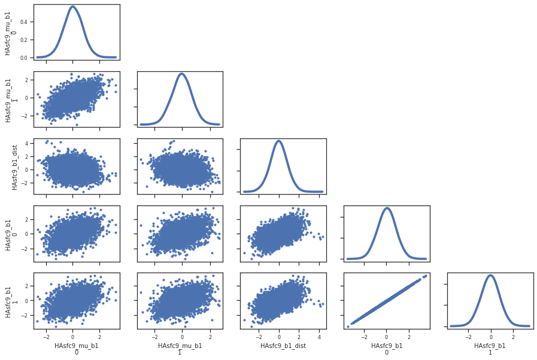
    


    
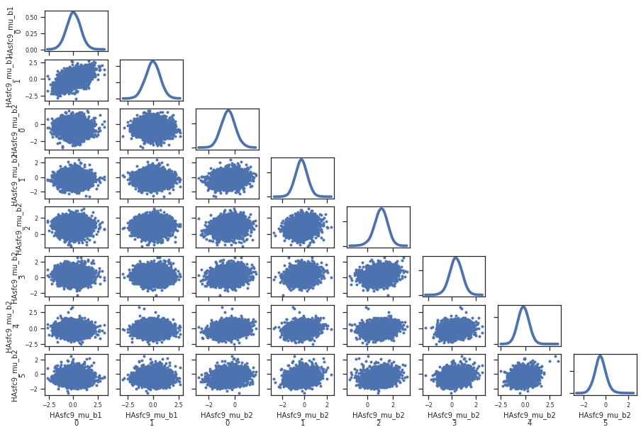
    


    
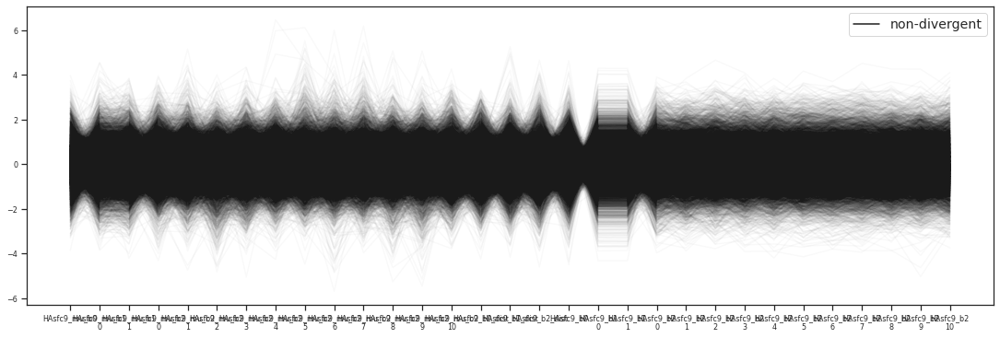
    


    
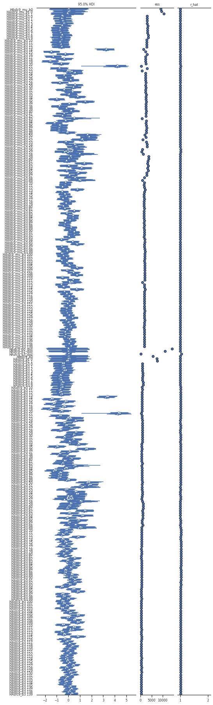
    


```python
with HAsfc9Model as model:
    plotting_lib.plotTracesB(widthInch,heigthInch,dpi,writeOut,outPathPlots,trace_HAsfc9,'HAsfc9')
```


    
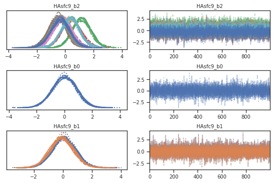
    


```python
with HAsfc9Model as model:
    plotting_lib.pm.energyplot(trace_HAsfc9)
```


    
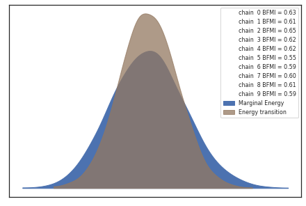
    


#### Posterior predictive distribution


```python
with HAsfc9Model as model:
    posterior_pred_HAsfc9 = pm.sample_posterior_predictive(trace_HAsfc9,samples=numPredSamples,random_seed=random_seed)
```

    /home/bob/.local/lib/python3.8/site-packages/pymc3/sampling.py:1707: UserWarning: samples parameter is smaller than nchains times ndraws, some draws and/or chains may not be represented in the returned posterior predictive sample
      warnings.warn(


<div>
    <style>
        /* Turns off some styling */
        progress {
            /* gets rid of default border in Firefox and Opera. */
            border: none;
            /* Needs to be in here for Safari polyfill so background images work as expected. */
            background-size: auto;
        }
        .progress-bar-interrupted, .progress-bar-interrupted::-webkit-progress-bar {
            background: #F44336;
        }
    </style>
  <progress value='2000' class='' max='2000' style='width:300px; height:20px; vertical-align: middle;'></progress>
  100.00% [2000/2000 00:02<00:00]
</div>


```python
plotting_lib.plotPriorPosteriorPredictive(widthInch,heigthInch,dpi,writeOut,outPathPlots,df,dictMeanStd,prior_pred_HAsfc9,posterior_pred_HAsfc9,dataZ["HAsfc9_z"].values,'HAsfc9')
```


    
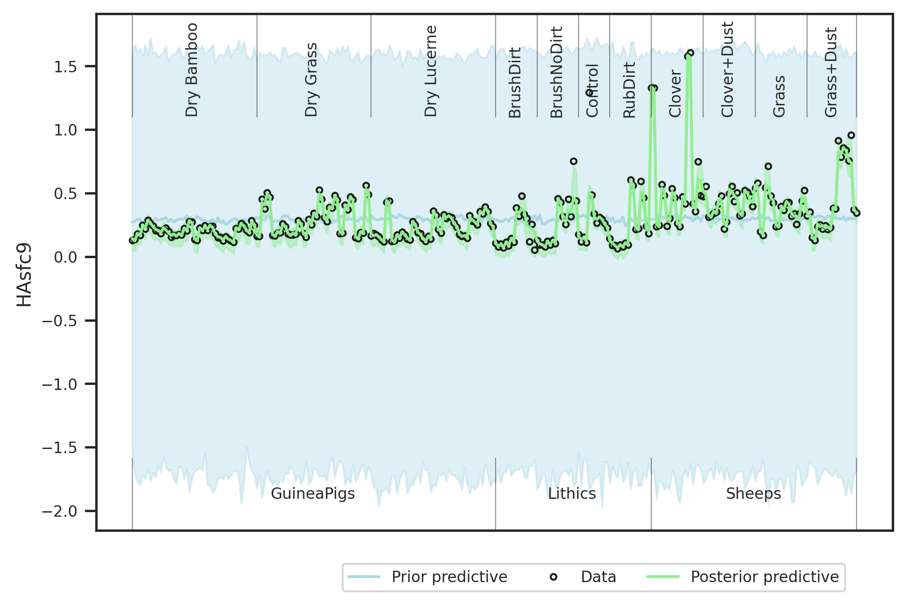
    


#### Compare prior and posterior for model parameters


```python
with HAsfc9Model as model:
    pm_data_HAsfc9 = az.from_pymc3(trace=trace_HAsfc9,prior=prior_pred_HAsfc9,posterior_predictive=posterior_pred_HAsfc9)
```

    arviz.data.io_pymc3 - WARNING - posterior predictive variable HAsfc9_y's shape not compatible with number of chains and draws. This can mean that some draws or even whole chains are not represented.


```python
plotting_lib.plotPriorPosteriorB(widthInch,heigthInch,dpi,sizes,writeOut,outPathPlots,dictMeanStd,pm_data_HAsfc9,'HAsfc9')
```


    
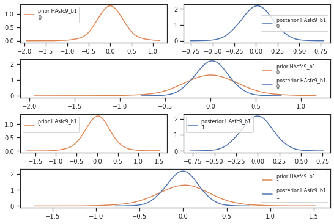
    


#### Posterior and contrasts


```python
plotting_lib.plotPosterior(widthInch,heigthInch,dpi,writeOut,outPathPlots,dictMeanStd,pm_data_HAsfc9,'HAsfc9')
```


    
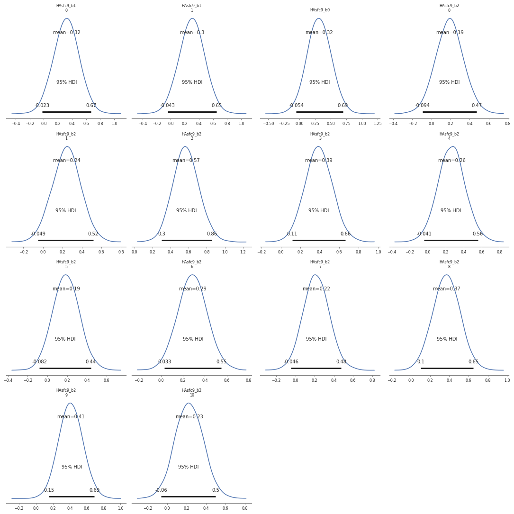
    


```python
plotting_lib.plotContrast(widthInch,heigthInch,dpi,writeOut,outPathPlots,dictMeanStd,x1contrast_dict,trace_HAsfc9,'HAsfc9')
```


    
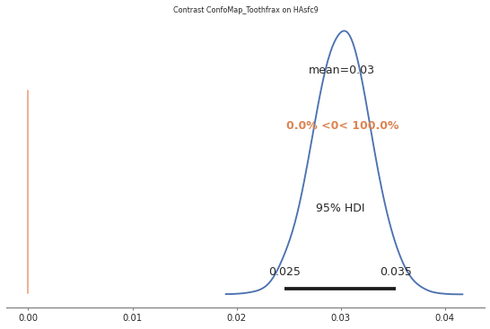
    


### HAsfc81 <a name="HAsfc81"></a>


```python
with pm.Model() as model:
    HAsfc81Model = ThreeFactorModel('HAsfc81',x1,x2,x3,dataZ["HAsfc81_z"].values)
```

#### Verify model settings


```python
HAsfc81Model.printParams(x1,x2,x3,dataZ["HAsfc81_z"].values)
```

    The number of levels of the x variables are (2, 11, 140)
    The standard deviations used for the beta priors are (1.0444803217312628, 1.586983908089902, 1.3271002181181868)


```python
pm.model_to_graphviz(HAsfc81Model)
```


    

    


#### Check prior choice


```python
with HAsfc81Model as model:
    prior_pred_HAsfc81 = pm.sample_prior_predictive(samples=numPredSamples,random_seed=random_seed)
```


```python
plotting_lib.plotPriorPredictive(widthInch,heigthInch,dpi,writeOut,outPathPlots,df,dictMeanStd,prior_pred_HAsfc81,dataZ["HAsfc81_z"].values,'HAsfc81')
```


    
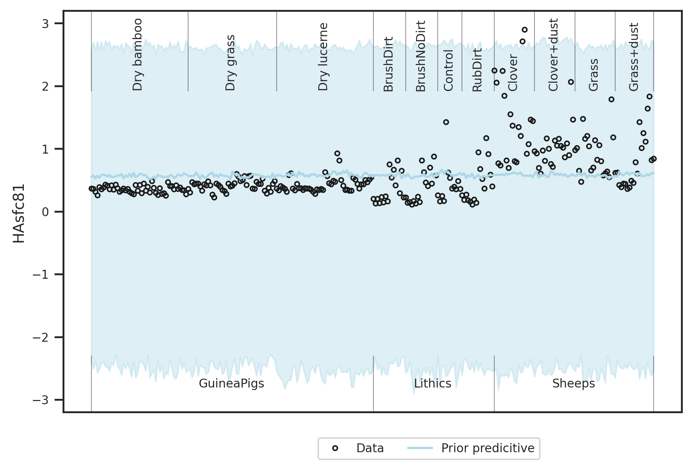
    


Prior choice is as intended: Broad over the data range.

#### Sampling


```python
with HAsfc81Model as model:
    trace_HAsfc81 = pm.sample(numSamples,cores=numCores,tune=numTune,max_treedepth=20, init='auto',target_accept=target_accept,random_seed=random_seed)
    #fit_HAsfc81 = pm.fit(random_seed=random_seed)
    #trace_HAsfc81 = fit_HAsfc81.sample(draws=numSamples)
```

    Auto-assigning NUTS sampler...
    Initializing NUTS using jitter+adapt_diag...
    Multiprocess sampling (10 chains in 10 jobs)
    NUTS: [HAsfc81_b3_dist, HAsfc81_b2_dist, HAsfc81_b1_dist, HAsfc81_b0_dist, HAsfc81_sigmaY, HAsfc81_nuY, HAsfc81_mu_b3, HAsfc81_mu_b2, HAsfc81_mu_b1, HAsfc81_mu_b0, HAsfc81_sigma3, HAsfc81_sigma2, HAsfc81_sigma1, HAsfc81_sigma0]


<div>
    <style>
        /* Turns off some styling */
        progress {
            /* gets rid of default border in Firefox and Opera. */
            border: none;
            /* Needs to be in here for Safari polyfill so background images work as expected. */
            background-size: auto;
        }
        .progress-bar-interrupted, .progress-bar-interrupted::-webkit-progress-bar {
            background: #F44336;
        }
    </style>
  <progress value='20000' class='' max='20000' style='width:300px; height:20px; vertical-align: middle;'></progress>
  100.00% [20000/20000 46:32<00:00 Sampling 10 chains, 0 divergences]
</div>


    Sampling 10 chains for 1_000 tune and 1_000 draw iterations (10_000 + 10_000 draws total) took 2793 seconds.
    The number of effective samples is smaller than 10% for some parameters.


```python
with HAsfc81Model as model:
    if writeOut:
        with open(outPathData + 'model_{}.pkl'.format('HAsfc81'), 'wb') as buff:
            pickle.dump({'model': HAsfc81Model, 'trace': trace_HAsfc81}, buff)
```

#### Check sampling


```python
with HAsfc81Model as model:
    dataTrace_HAsfc81 = az.from_pymc3(trace=trace_HAsfc81)
```


```python
pm.summary(dataTrace_HAsfc81,hdi_prob=0.95).round(2)
```


<div>
<style scoped>
    .dataframe tbody tr th:only-of-type {
        vertical-align: middle;
    }

    .dataframe tbody tr th {
        vertical-align: top;
    }

    .dataframe thead th {
        text-align: right;
    }
</style>
<table border="1" class="dataframe">
  <thead>
    <tr style="text-align: right;">
      <th></th>
      <th>mean</th>
      <th>sd</th>
      <th>hdi_2.5%</th>
      <th>hdi_97.5%</th>
      <th>mcse_mean</th>
      <th>mcse_sd</th>
      <th>ess_mean</th>
      <th>ess_sd</th>
      <th>ess_bulk</th>
      <th>ess_tail</th>
      <th>r_hat</th>
    </tr>
  </thead>
  <tbody>
    <tr>
      <th>HAsfc81_mu_b0</th>
      <td>0.02</td>
      <td>0.82</td>
      <td>-1.61</td>
      <td>1.61</td>
      <td>0.01</td>
      <td>0.01</td>
      <td>9904.0</td>
      <td>5333.0</td>
      <td>9905.0</td>
      <td>7858.0</td>
      <td>1.0</td>
    </tr>
    <tr>
      <th>HAsfc81_mu_b1[0]</th>
      <td>0.08</td>
      <td>0.70</td>
      <td>-1.24</td>
      <td>1.47</td>
      <td>0.01</td>
      <td>0.01</td>
      <td>10595.0</td>
      <td>5672.0</td>
      <td>10574.0</td>
      <td>7773.0</td>
      <td>1.0</td>
    </tr>
    <tr>
      <th>HAsfc81_mu_b1[1]</th>
      <td>-0.04</td>
      <td>0.70</td>
      <td>-1.42</td>
      <td>1.33</td>
      <td>0.01</td>
      <td>0.01</td>
      <td>10887.0</td>
      <td>5476.0</td>
      <td>10904.0</td>
      <td>7653.0</td>
      <td>1.0</td>
    </tr>
    <tr>
      <th>HAsfc81_mu_b2[0]</th>
      <td>-0.49</td>
      <td>0.54</td>
      <td>-1.53</td>
      <td>0.60</td>
      <td>0.01</td>
      <td>0.00</td>
      <td>5378.0</td>
      <td>5378.0</td>
      <td>5358.0</td>
      <td>6343.0</td>
      <td>1.0</td>
    </tr>
    <tr>
      <th>HAsfc81_mu_b2[1]</th>
      <td>-0.44</td>
      <td>0.54</td>
      <td>-1.50</td>
      <td>0.65</td>
      <td>0.01</td>
      <td>0.00</td>
      <td>5367.0</td>
      <td>5367.0</td>
      <td>5348.0</td>
      <td>6651.0</td>
      <td>1.0</td>
    </tr>
    <tr>
      <th>...</th>
      <td>...</td>
      <td>...</td>
      <td>...</td>
      <td>...</td>
      <td>...</td>
      <td>...</td>
      <td>...</td>
      <td>...</td>
      <td>...</td>
      <td>...</td>
      <td>...</td>
    </tr>
    <tr>
      <th>HAsfc81_mu[275]</th>
      <td>1.31</td>
      <td>0.10</td>
      <td>1.12</td>
      <td>1.50</td>
      <td>0.00</td>
      <td>0.00</td>
      <td>9863.0</td>
      <td>9863.0</td>
      <td>9664.0</td>
      <td>7128.0</td>
      <td>1.0</td>
    </tr>
    <tr>
      <th>HAsfc81_mu[276]</th>
      <td>2.59</td>
      <td>0.25</td>
      <td>2.28</td>
      <td>3.10</td>
      <td>0.00</td>
      <td>0.00</td>
      <td>3424.0</td>
      <td>3257.0</td>
      <td>4346.0</td>
      <td>6605.0</td>
      <td>1.0</td>
    </tr>
    <tr>
      <th>HAsfc81_mu[277]</th>
      <td>2.47</td>
      <td>0.25</td>
      <td>2.17</td>
      <td>2.98</td>
      <td>0.00</td>
      <td>0.00</td>
      <td>3406.0</td>
      <td>3227.0</td>
      <td>4273.0</td>
      <td>6371.0</td>
      <td>1.0</td>
    </tr>
    <tr>
      <th>HAsfc81_mu[278]</th>
      <td>0.62</td>
      <td>0.09</td>
      <td>0.46</td>
      <td>0.79</td>
      <td>0.00</td>
      <td>0.00</td>
      <td>10539.0</td>
      <td>10159.0</td>
      <td>10427.0</td>
      <td>8048.0</td>
      <td>1.0</td>
    </tr>
    <tr>
      <th>HAsfc81_mu[279]</th>
      <td>0.50</td>
      <td>0.09</td>
      <td>0.34</td>
      <td>0.66</td>
      <td>0.00</td>
      <td>0.00</td>
      <td>10651.0</td>
      <td>10249.0</td>
      <td>10515.0</td>
      <td>8472.0</td>
      <td>1.0</td>
    </tr>
  </tbody>
</table>
<p>748 rows × 11 columns</p>
</div>


```python
plotting_lib.plotDiagnostics(widthInch,heigthInch,dpi,writeOut,outPathPlots,trace_HAsfc81,dataTrace_HAsfc81,'HAsfc81')
```

    /home/bob/.local/lib/python3.8/site-packages/arviz/plots/backends/matplotlib/pairplot.py:212: UserWarning: rcParams['plot.max_subplots'] (40) is smaller than the number of resulting pair plots with these variables, generating only a 8x8 grid
      warnings.warn(


    

    


    
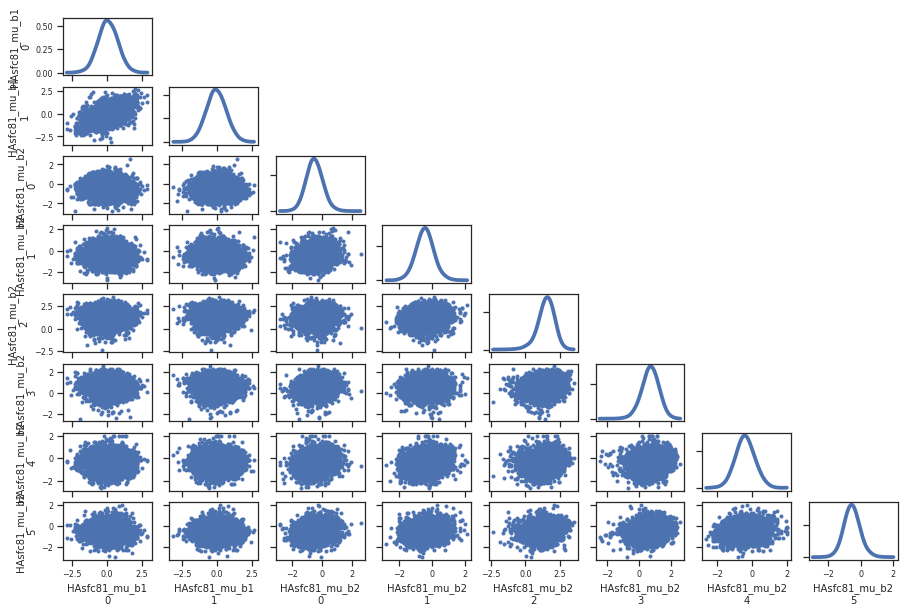
    


    

    


    
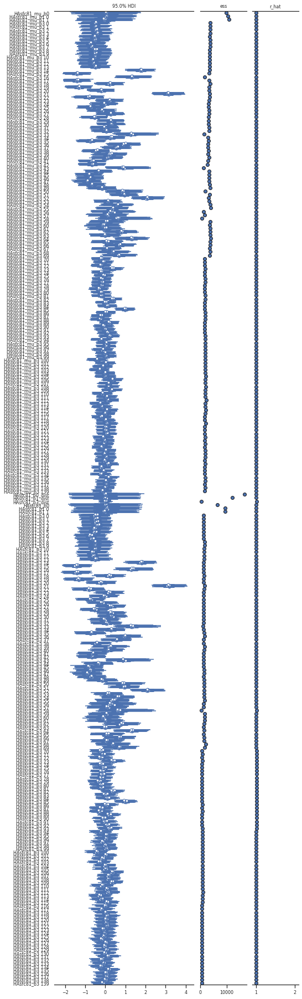
    


```python
with HAsfc81Model as model:
    plotting_lib.plotTracesB(widthInch,heigthInch,dpi,writeOut,outPathPlots,trace_HAsfc81,'HAsfc81')
```


    
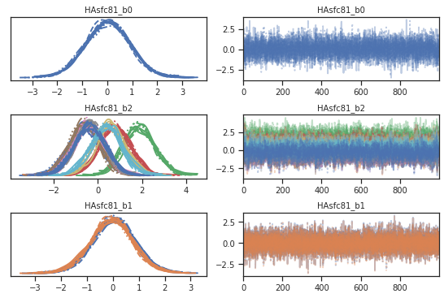
    


```python
with HAsfc81Model as model:
    plotting_lib.pm.energyplot(trace_HAsfc81)
```


    
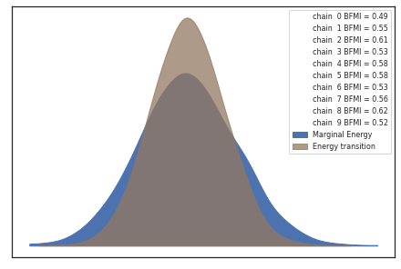
    


#### Posterior predictive distribution


```python
with HAsfc81Model as model:
    posterior_pred_HAsfc81 = pm.sample_posterior_predictive(trace_HAsfc81,samples=numPredSamples,random_seed=random_seed)
```

    /home/bob/.local/lib/python3.8/site-packages/pymc3/sampling.py:1707: UserWarning: samples parameter is smaller than nchains times ndraws, some draws and/or chains may not be represented in the returned posterior predictive sample
      warnings.warn(


<div>
    <style>
        /* Turns off some styling */
        progress {
            /* gets rid of default border in Firefox and Opera. */
            border: none;
            /* Needs to be in here for Safari polyfill so background images work as expected. */
            background-size: auto;
        }
        .progress-bar-interrupted, .progress-bar-interrupted::-webkit-progress-bar {
            background: #F44336;
        }
    </style>
  <progress value='2000' class='' max='2000' style='width:300px; height:20px; vertical-align: middle;'></progress>
  100.00% [2000/2000 00:02<00:00]
</div>


```python
plotting_lib.plotPriorPosteriorPredictive(widthInch,heigthInch,dpi,writeOut,outPathPlots,df,dictMeanStd,prior_pred_HAsfc81,posterior_pred_HAsfc81,dataZ["HAsfc81_z"].values,'HAsfc81')
```


    
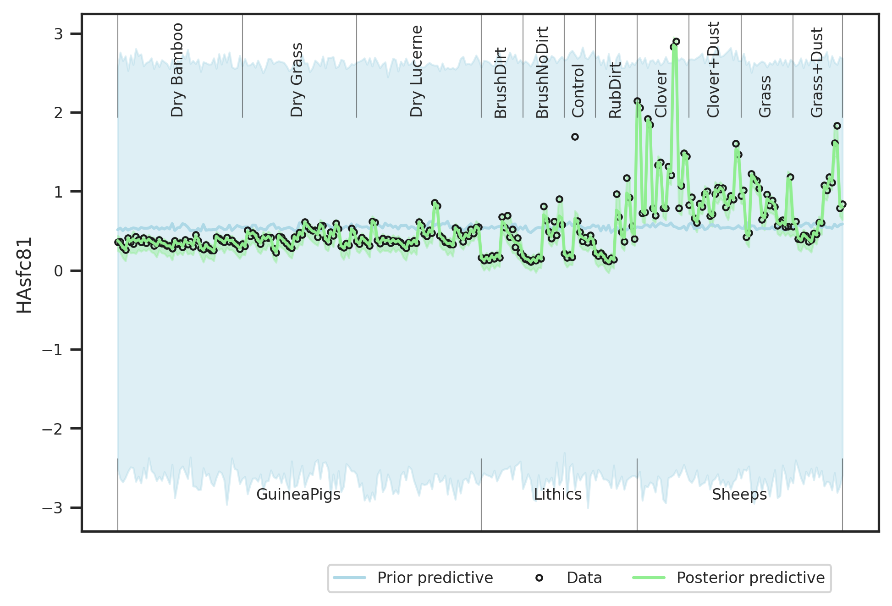
    


#### Compare prior and posterior for model parameters


```python
with HAsfc81Model as model:
    pm_data_HAsfc81 = az.from_pymc3(trace=trace_HAsfc81,prior=prior_pred_HAsfc81,posterior_predictive=posterior_pred_HAsfc81)
```

    arviz.data.io_pymc3 - WARNING - posterior predictive variable HAsfc81_y's shape not compatible with number of chains and draws. This can mean that some draws or even whole chains are not represented.


```python
plotting_lib.plotPriorPosteriorB(widthInch,heigthInch,dpi,sizes,writeOut,outPathPlots,dictMeanStd,pm_data_HAsfc81,'HAsfc81')
```


    
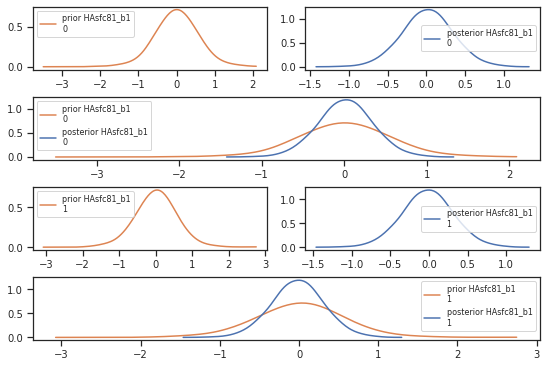
    


#### Posterior and contrasts


```python
plotting_lib.plotPosterior(widthInch,heigthInch,dpi,writeOut,outPathPlots,dictMeanStd,pm_data_HAsfc81,'HAsfc81')
```


    
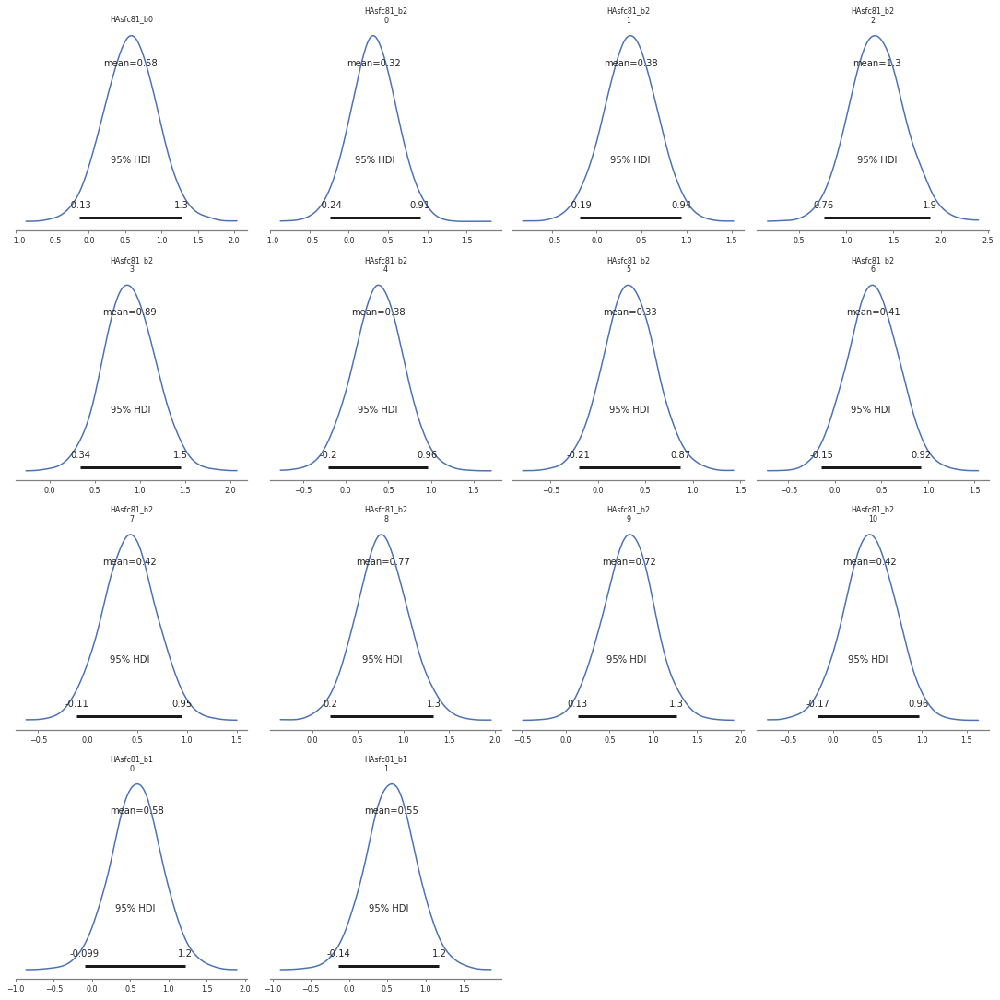
    


```python
plotting_lib.plotContrast(widthInch,heigthInch,dpi,writeOut,outPathPlots,dictMeanStd,x1contrast_dict,trace_HAsfc81,'HAsfc81')
```


    
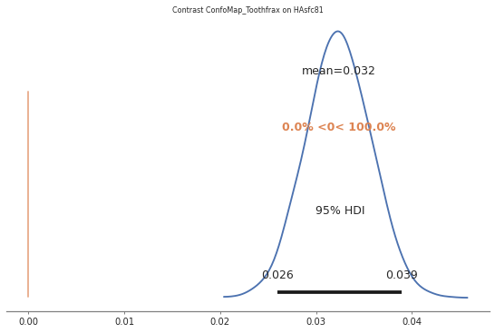
    


## Summary <a name="summary"></a>
The contrast plots between the two software packages are shown below again for each variable except Smfc


```python
plotting_lib.plotContrast(widthInch,heigthInch,dpi,writeOut,outPathPlots,dictMeanStd,x1contrast_dict,trace_epLsar,'epLsar')
```


    

    


```python
plotting_lib.plotContrast(widthInch,heigthInch,dpi,writeOut,outPathPlots,dictMeanStd,x1contrast_dict,trace_Rsquared,'R²')
```


    

    


```python
plotting_lib.plotContrast(widthInch,heigthInch,dpi,writeOut,outPathPlots,dictMeanStd,x1contrast_dict,trace_Asfc,'Asfc')
```


    
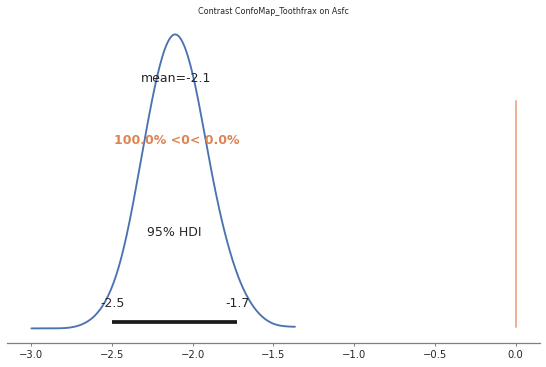
    


```python
plotting_lib.plotContrast(widthInch,heigthInch,dpi,writeOut,outPathPlots,dictMeanStd,x1contrast_dict,trace_HAsfc9,'HAsfc9')
```


    
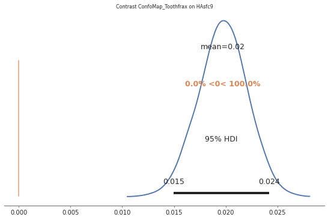
    


```python
plotting_lib.plotContrast(widthInch,heigthInch,dpi,writeOut,outPathPlots,dictMeanStd,x1contrast_dict,trace_HAsfc81,'HAsfc81')
```


    
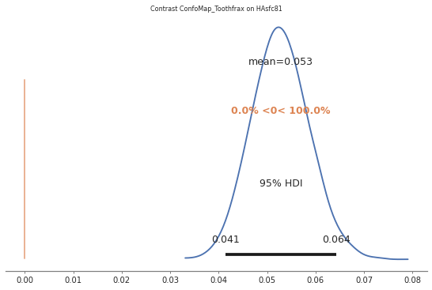
    


### Write out


```python
!jupyter nbconvert --to html Statistical_Model_ThreeFactor.ipynb
```

    [NbConvertApp] Converting notebook Statistical_Model_ThreeFactor.ipynb to html
    [NbConvertApp] Writing 9690517 bytes to Statistical_Model_ThreeFactor.html


```python
!jupyter nbconvert --to markdown Statistical_Model_ThreeFactor.ipynb
```

    [NbConvertApp] Converting notebook Statistical_Model_ThreeFactor.ipynb to markdown
    [NbConvertApp] Support files will be in Statistical_Model_ThreeFactor_files/
    [NbConvertApp] Making directory Statistical_Model_ThreeFactor_files
    [NbConvertApp] Making directory Statistical_Model_ThreeFactor_files
    [NbConvertApp] Making directory Statistical_Model_ThreeFactor_files
    [NbConvertApp] Making directory Statistical_Model_ThreeFactor_files
    [NbConvertApp] Making directory Statistical_Model_ThreeFactor_files
    [NbConvertApp] Making directory Statistical_Model_ThreeFactor_files
    [NbConvertApp] Making directory Statistical_Model_ThreeFactor_files
    [NbConvertApp] Making directory Statistical_Model_ThreeFactor_files
    [NbConvertApp] Making directory Statistical_Model_ThreeFactor_files
    [NbConvertApp] Making directory Statistical_Model_ThreeFactor_files
    [NbConvertApp] Making directory Statistical_Model_ThreeFactor_files
    [NbConvertApp] Making directory Statistical_Model_ThreeFactor_files
    [NbConvertApp] Making directory Statistical_Model_ThreeFactor_files
    [NbConvertApp] Making directory Statistical_Model_ThreeFactor_files
    [NbConvertApp] Making directory Statistical_Model_ThreeFactor_files
    [NbConvertApp] Making directory Statistical_Model_ThreeFactor_files
    [NbConvertApp] Making directory Statistical_Model_ThreeFactor_files
    [NbConvertApp] Making directory Statistical_Model_ThreeFactor_files
    [NbConvertApp] Making directory Statistical_Model_ThreeFactor_files
    [NbConvertApp] Making directory Statistical_Model_ThreeFactor_files
    [NbConvertApp] Making directory Statistical_Model_ThreeFactor_files
    [NbConvertApp] Making directory Statistical_Model_ThreeFactor_files
    [NbConvertApp] Making directory Statistical_Model_ThreeFactor_files
    [NbConvertApp] Making directory Statistical_Model_ThreeFactor_files
    [NbConvertApp] Making directory Statistical_Model_ThreeFactor_files
    [NbConvertApp] Making directory Statistical_Model_ThreeFactor_files
    [NbConvertApp] Making directory Statistical_Model_ThreeFactor_files
    [NbConvertApp] Making directory Statistical_Model_ThreeFactor_files
    [NbConvertApp] Making directory Statistical_Model_ThreeFactor_files
    [NbConvertApp] Making directory Statistical_Model_ThreeFactor_files
    [NbConvertApp] Making directory Statistical_Model_ThreeFactor_files
    [NbConvertApp] Making directory Statistical_Model_ThreeFactor_files
    [NbConvertApp] Making directory Statistical_Model_ThreeFactor_files
    [NbConvertApp] Making directory Statistical_Model_ThreeFactor_files
    [NbConvertApp] Making directory Statistical_Model_ThreeFactor_files
    [NbConvertApp] Making directory Statistical_Model_ThreeFactor_files
    [NbConvertApp] Making directory Statistical_Model_ThreeFactor_files
    [NbConvertApp] Making directory Statistical_Model_ThreeFactor_files
    [NbConvertApp] Making directory Statistical_Model_ThreeFactor_files
    [NbConvertApp] Making directory Statistical_Model_ThreeFactor_files
    [NbConvertApp] Making directory Statistical_Model_ThreeFactor_files
    [NbConvertApp] Making directory Statistical_Model_ThreeFactor_files
    [NbConvertApp] Making directory Statistical_Model_ThreeFactor_files
    [NbConvertApp] Making directory Statistical_Model_ThreeFactor_files
    [NbConvertApp] Making directory Statistical_Model_ThreeFactor_files
    [NbConvertApp] Making directory Statistical_Model_ThreeFactor_files
    [NbConvertApp] Making directory Statistical_Model_ThreeFactor_files
    [NbConvertApp] Making directory Statistical_Model_ThreeFactor_files
    [NbConvertApp] Making directory Statistical_Model_ThreeFactor_files
    [NbConvertApp] Making directory Statistical_Model_ThreeFactor_files
    [NbConvertApp] Making directory Statistical_Model_ThreeFactor_files
    [NbConvertApp] Making directory Statistical_Model_ThreeFactor_files
    [NbConvertApp] Making directory Statistical_Model_ThreeFactor_files
    [NbConvertApp] Making directory Statistical_Model_ThreeFactor_files
    [NbConvertApp] Making directory Statistical_Model_ThreeFactor_files
    [NbConvertApp] Making directory Statistical_Model_ThreeFactor_files
    [NbConvertApp] Making directory Statistical_Model_ThreeFactor_files
    [NbConvertApp] Making directory Statistical_Model_ThreeFactor_files
    [NbConvertApp] Making directory Statistical_Model_ThreeFactor_files
    [NbConvertApp] Making directory Statistical_Model_ThreeFactor_files
    [NbConvertApp] Making directory Statistical_Model_ThreeFactor_files
    [NbConvertApp] Writing 79966 bytes to Statistical_Model_ThreeFactor.md


```python


```
