# Analysis for SSFA project: Two factor model

## Table of contents
1. [Used packages](#imports)
1. [Global settings](#settings)
1. [Load data](#load)
1. [Model specification](#model)
1. [Inference](#inference)
   1. [epLsar](#epLsar)
   1. [R²](#r)
   1. [Asfc](#Asfc)
   1. [Smfc](#Smfc)
   1. [HAsfc9](#HAsfc9)
   1. [HAsfc81](#HAsfc81)
1. [Summary](#summary)

## Used packages <a name="imports"></a>


```python
import numpy as np
import pandas as pd
import matplotlib.pyplot as plt
import seaborn as sns; sns.set()
import pickle
import arviz as az
import pymc3 as pm
```

    WARNING (theano.tensor.blas): Using NumPy C-API based implementation for BLAS functions.


```python
from matplotlib.colors import to_rgb
```


```python
import scipy.stats as stats 
```


```python
from IPython.display import display
```


```python
import matplotlib as mpl
```


```python
%load_ext autoreload
%autoreload 2
```


```python
import plotting_lib
```

## Global settings <a name="settings"></a>

#### Output


```python
writeOut = True
outPathPlots = "../plots/statistical_model_two_factors/"
outPathData = "../derived_data/statistical_model_two_factors/"
```

#### Plotting


```python
widthMM = 190 
widthInch = widthMM / 25.4
ratio = 0.66666
heigthInch = ratio*widthInch

SMALL_SIZE = 8
MEDIUM_SIZE = 10
BIGGER_SIZE = 12

plt.rc('font', size=SMALL_SIZE)          # controls default text sizes
plt.rc('axes', titlesize=SMALL_SIZE)     # fontsize of the axes title
plt.rc('axes', labelsize=MEDIUM_SIZE)    # fontsize of the x and y labels
plt.rc('xtick', labelsize=SMALL_SIZE)    # fontsize of the tick labels
plt.rc('ytick', labelsize=SMALL_SIZE)    # fontsize of the tick labels
plt.rc('legend', fontsize=SMALL_SIZE)    # legend fontsize
plt.rc('figure', titlesize=BIGGER_SIZE)  # fontsize of the figure title
sns.set_style("ticks")

dpi = 300
```


```python
sizes = [SMALL_SIZE,MEDIUM_SIZE,BIGGER_SIZE]
```

#### Computing


```python
numSamples = 500
numCores = 10
numTune = 1000
numPredSamples = 2000
random_seed=3651435
```

## Load data <a name="load"></a>


```python
datafile = "../derived_data/preprocessing/preprocessed.dat"
```


```python
with open(datafile, "rb") as f:
    x1,x2,_,df,dataZ,dictMeanStd,dictTreatment,dictSoftware = pickle.load(f)    
```

Show that everything is correct:


```python
display(pd.DataFrame.from_dict({'x1':x1,'x2':x2}))
```


<div>
<style scoped>
    .dataframe tbody tr th:only-of-type {
        vertical-align: middle;
    }

    .dataframe tbody tr th {
        vertical-align: top;
    }

    .dataframe thead th {
        text-align: right;
    }
</style>
<table border="1" class="dataframe">
  <thead>
    <tr style="text-align: right;">
      <th></th>
      <th>x1</th>
      <th>x2</th>
    </tr>
  </thead>
  <tbody>
    <tr>
      <th>0</th>
      <td>0</td>
      <td>5</td>
    </tr>
    <tr>
      <th>1</th>
      <td>1</td>
      <td>5</td>
    </tr>
    <tr>
      <th>2</th>
      <td>0</td>
      <td>5</td>
    </tr>
    <tr>
      <th>3</th>
      <td>1</td>
      <td>5</td>
    </tr>
    <tr>
      <th>4</th>
      <td>0</td>
      <td>5</td>
    </tr>
    <tr>
      <th>...</th>
      <td>...</td>
      <td>...</td>
    </tr>
    <tr>
      <th>275</th>
      <td>1</td>
      <td>9</td>
    </tr>
    <tr>
      <th>276</th>
      <td>0</td>
      <td>9</td>
    </tr>
    <tr>
      <th>277</th>
      <td>1</td>
      <td>9</td>
    </tr>
    <tr>
      <th>278</th>
      <td>0</td>
      <td>9</td>
    </tr>
    <tr>
      <th>279</th>
      <td>1</td>
      <td>9</td>
    </tr>
  </tbody>
</table>
<p>280 rows × 2 columns</p>
</div>


x1 indicates the software used, x2 indicates the treatment applied.


```python
for surfaceParam,(mean,std) in dictMeanStd.items():
    print("Surface parameter {} has mean {} and standard deviation {}".format(surfaceParam,mean,std))
```

    Surface parameter epLsar has mean 0.002866777015225286 and standard deviation 0.0019173233323041528
    Surface parameter R² has mean 0.9973197285182144 and standard deviation 0.006745323717352575
    Surface parameter Asfc has mean 16.912804592866785 and standard deviation 16.042490777228107
    Surface parameter Smfc has mean 2.589874101745179 and standard deviation 10.663178442785044
    Surface parameter HAsfc9 has mean 0.31872043020221136 and standard deviation 0.22913790943445264
    Surface parameter HAsfc81 has mean 0.5885203613280154 and standard deviation 0.42897734163543366


```python
for k,v in dictTreatment.items():
    print("Number {} encodes treatment {}".format(k,v))
```

    Number 5 encodes treatment Dry bamboo
    Number 6 encodes treatment Dry grass
    Number 7 encodes treatment Dry lucerne
    Number 0 encodes treatment BrushDirt
    Number 1 encodes treatment BrushNoDirt
    Number 4 encodes treatment Control
    Number 10 encodes treatment RubDirt
    Number 2 encodes treatment Clover
    Number 3 encodes treatment Clover+dust
    Number 8 encodes treatment Grass
    Number 9 encodes treatment Grass+dust


```python
for k,v in dictSoftware.items():
    print("Number {} encodes software {}".format(k,v))
```

    Number 0 encodes software ConfoMap
    Number 1 encodes software Toothfrax


```python
display(dataZ)
```


<div>
<style scoped>
    .dataframe tbody tr th:only-of-type {
        vertical-align: middle;
    }

    .dataframe tbody tr th {
        vertical-align: top;
    }

    .dataframe thead th {
        text-align: right;
    }
</style>
<table border="1" class="dataframe">
  <thead>
    <tr style="text-align: right;">
      <th></th>
      <th>index</th>
      <th>TreatmentNumber</th>
      <th>SoftwareNumber</th>
      <th>DatasetNumber</th>
      <th>NameNumber</th>
      <th>epLsar_z</th>
      <th>R²_z</th>
      <th>Asfc_z</th>
      <th>Smfc_z</th>
      <th>HAsfc9_z</th>
      <th>HAsfc81_z</th>
    </tr>
  </thead>
  <tbody>
    <tr>
      <th>0</th>
      <td>0</td>
      <td>5</td>
      <td>0</td>
      <td>0</td>
      <td>116</td>
      <td>0.896441</td>
      <td>0.202280</td>
      <td>-0.548753</td>
      <td>-0.173680</td>
      <td>-0.872185</td>
      <td>-0.512580</td>
    </tr>
    <tr>
      <th>1</th>
      <td>1</td>
      <td>5</td>
      <td>1</td>
      <td>0</td>
      <td>116</td>
      <td>0.967089</td>
      <td>0.332122</td>
      <td>-0.410913</td>
      <td>-0.231700</td>
      <td>-0.799735</td>
      <td>-0.528438</td>
    </tr>
    <tr>
      <th>2</th>
      <td>2</td>
      <td>5</td>
      <td>0</td>
      <td>0</td>
      <td>117</td>
      <td>1.663582</td>
      <td>0.205805</td>
      <td>-0.406276</td>
      <td>-0.184263</td>
      <td>-0.625739</td>
      <td>-0.636413</td>
    </tr>
    <tr>
      <th>3</th>
      <td>3</td>
      <td>5</td>
      <td>1</td>
      <td>0</td>
      <td>117</td>
      <td>1.559060</td>
      <td>0.318335</td>
      <td>-0.231484</td>
      <td>-0.231700</td>
      <td>-0.652395</td>
      <td>-0.762985</td>
    </tr>
    <tr>
      <th>4</th>
      <td>4</td>
      <td>5</td>
      <td>0</td>
      <td>0</td>
      <td>118</td>
      <td>1.235447</td>
      <td>0.140997</td>
      <td>-0.524577</td>
      <td>-0.187419</td>
      <td>-0.425552</td>
      <td>-0.460441</td>
    </tr>
    <tr>
      <th>...</th>
      <td>...</td>
      <td>...</td>
      <td>...</td>
      <td>...</td>
      <td>...</td>
      <td>...</td>
      <td>...</td>
      <td>...</td>
      <td>...</td>
      <td>...</td>
      <td>...</td>
    </tr>
    <tr>
      <th>275</th>
      <td>275</td>
      <td>9</td>
      <td>1</td>
      <td>2</td>
      <td>51</td>
      <td>0.812186</td>
      <td>0.302472</td>
      <td>-0.940814</td>
      <td>-0.110773</td>
      <td>2.259947</td>
      <td>1.219611</td>
    </tr>
    <tr>
      <th>276</th>
      <td>276</td>
      <td>9</td>
      <td>0</td>
      <td>2</td>
      <td>52</td>
      <td>0.279516</td>
      <td>0.134624</td>
      <td>-0.883003</td>
      <td>-0.199355</td>
      <td>1.616592</td>
      <td>2.457881</td>
    </tr>
    <tr>
      <th>277</th>
      <td>277</td>
      <td>9</td>
      <td>1</td>
      <td>2</td>
      <td>52</td>
      <td>0.141981</td>
      <td>0.358659</td>
      <td>-0.882314</td>
      <td>-0.230373</td>
      <td>2.779893</td>
      <td>2.898056</td>
    </tr>
    <tr>
      <th>278</th>
      <td>278</td>
      <td>9</td>
      <td>0</td>
      <td>2</td>
      <td>53</td>
      <td>-0.859089</td>
      <td>0.269132</td>
      <td>-0.964638</td>
      <td>-0.118959</td>
      <td>0.316720</td>
      <td>0.540611</td>
    </tr>
    <tr>
      <th>279</th>
      <td>279</td>
      <td>9</td>
      <td>1</td>
      <td>2</td>
      <td>53</td>
      <td>-1.128540</td>
      <td>0.376153</td>
      <td>-0.964978</td>
      <td>-0.204577</td>
      <td>0.119539</td>
      <td>0.586105</td>
    </tr>
  </tbody>
</table>
<p>280 rows × 11 columns</p>
</div>


```python
display(df)
```


<div>
<style scoped>
    .dataframe tbody tr th:only-of-type {
        vertical-align: middle;
    }

    .dataframe tbody tr th {
        vertical-align: top;
    }

    .dataframe thead th {
        text-align: right;
    }
</style>
<table border="1" class="dataframe">
  <thead>
    <tr style="text-align: right;">
      <th></th>
      <th>Dataset</th>
      <th>Name</th>
      <th>Software</th>
      <th>Diet</th>
      <th>Treatment</th>
      <th>Before.after</th>
      <th>epLsar</th>
      <th>R²</th>
      <th>Asfc</th>
      <th>Smfc</th>
      <th>HAsfc9</th>
      <th>HAsfc81</th>
      <th>NewEplsar</th>
      <th>TreatmentNumber</th>
      <th>SoftwareNumber</th>
      <th>DatasetNumber</th>
      <th>NameNumber</th>
    </tr>
  </thead>
  <tbody>
    <tr>
      <th>0</th>
      <td>GuineaPigs</td>
      <td>capor_2CC6B1_txP4_#1_1_100xL_1</td>
      <td>ConfoMap</td>
      <td>Dry bamboo</td>
      <td>Dry bamboo</td>
      <td>NaN</td>
      <td>0.004586</td>
      <td>0.998684</td>
      <td>8.109445</td>
      <td>0.737898</td>
      <td>0.118870</td>
      <td>0.368635</td>
      <td>0.019529</td>
      <td>5</td>
      <td>0</td>
      <td>0</td>
      <td>116</td>
    </tr>
    <tr>
      <th>1</th>
      <td>GuineaPigs</td>
      <td>capor_2CC6B1_txP4_#1_1_100xL_1</td>
      <td>Toothfrax</td>
      <td>Dry bamboo</td>
      <td>Dry bamboo</td>
      <td>NaN</td>
      <td>0.004721</td>
      <td>0.999560</td>
      <td>10.320730</td>
      <td>0.119219</td>
      <td>0.135471</td>
      <td>0.361833</td>
      <td>NaN</td>
      <td>5</td>
      <td>1</td>
      <td>0</td>
      <td>116</td>
    </tr>
    <tr>
      <th>2</th>
      <td>GuineaPigs</td>
      <td>capor_2CC6B1_txP4_#1_1_100xL_2</td>
      <td>ConfoMap</td>
      <td>Dry bamboo</td>
      <td>Dry bamboo</td>
      <td>NaN</td>
      <td>0.006056</td>
      <td>0.998708</td>
      <td>10.395128</td>
      <td>0.625040</td>
      <td>0.175340</td>
      <td>0.315513</td>
      <td>0.020162</td>
      <td>5</td>
      <td>0</td>
      <td>0</td>
      <td>117</td>
    </tr>
    <tr>
      <th>3</th>
      <td>GuineaPigs</td>
      <td>capor_2CC6B1_txP4_#1_1_100xL_2</td>
      <td>Toothfrax</td>
      <td>Dry bamboo</td>
      <td>Dry bamboo</td>
      <td>NaN</td>
      <td>0.005856</td>
      <td>0.999467</td>
      <td>13.199232</td>
      <td>0.119219</td>
      <td>0.169232</td>
      <td>0.261217</td>
      <td>NaN</td>
      <td>5</td>
      <td>1</td>
      <td>0</td>
      <td>117</td>
    </tr>
    <tr>
      <th>4</th>
      <td>GuineaPigs</td>
      <td>capor_2CC6B1_txP4_#1_1_100xL_3</td>
      <td>ConfoMap</td>
      <td>Dry bamboo</td>
      <td>Dry bamboo</td>
      <td>NaN</td>
      <td>0.005236</td>
      <td>0.998271</td>
      <td>8.497286</td>
      <td>0.591396</td>
      <td>0.221210</td>
      <td>0.391002</td>
      <td>0.019804</td>
      <td>5</td>
      <td>0</td>
      <td>0</td>
      <td>118</td>
    </tr>
    <tr>
      <th>...</th>
      <td>...</td>
      <td>...</td>
      <td>...</td>
      <td>...</td>
      <td>...</td>
      <td>...</td>
      <td>...</td>
      <td>...</td>
      <td>...</td>
      <td>...</td>
      <td>...</td>
      <td>...</td>
      <td>...</td>
      <td>...</td>
      <td>...</td>
      <td>...</td>
      <td>...</td>
    </tr>
    <tr>
      <th>275</th>
      <td>Sheeps</td>
      <td>L8-Ovis-90730-lm2sin-a</td>
      <td>Toothfrax</td>
      <td>Grass+dust</td>
      <td>Grass+dust</td>
      <td>NaN</td>
      <td>0.004424</td>
      <td>0.999360</td>
      <td>1.819802</td>
      <td>1.408678</td>
      <td>0.836560</td>
      <td>1.111706</td>
      <td>NaN</td>
      <td>9</td>
      <td>1</td>
      <td>2</td>
      <td>51</td>
    </tr>
    <tr>
      <th>276</th>
      <td>Sheeps</td>
      <td>L8-Ovis-90764-lm2sin-a</td>
      <td>ConfoMap</td>
      <td>Grass+dust</td>
      <td>Grass+dust</td>
      <td>NaN</td>
      <td>0.003403</td>
      <td>0.998228</td>
      <td>2.747241</td>
      <td>0.464115</td>
      <td>0.689143</td>
      <td>1.642896</td>
      <td>0.018978</td>
      <td>9</td>
      <td>0</td>
      <td>2</td>
      <td>52</td>
    </tr>
    <tr>
      <th>277</th>
      <td>Sheeps</td>
      <td>L8-Ovis-90764-lm2sin-a</td>
      <td>Toothfrax</td>
      <td>Grass+dust</td>
      <td>Grass+dust</td>
      <td>NaN</td>
      <td>0.003139</td>
      <td>0.999739</td>
      <td>2.758297</td>
      <td>0.133366</td>
      <td>0.955699</td>
      <td>1.831721</td>
      <td>NaN</td>
      <td>9</td>
      <td>1</td>
      <td>2</td>
      <td>52</td>
    </tr>
    <tr>
      <th>278</th>
      <td>Sheeps</td>
      <td>L8-Ovis-90814-lm2sin-a</td>
      <td>ConfoMap</td>
      <td>Grass+dust</td>
      <td>Grass+dust</td>
      <td>NaN</td>
      <td>0.001220</td>
      <td>0.999135</td>
      <td>1.437607</td>
      <td>1.321398</td>
      <td>0.391293</td>
      <td>0.820430</td>
      <td>0.017498</td>
      <td>9</td>
      <td>0</td>
      <td>2</td>
      <td>53</td>
    </tr>
    <tr>
      <th>279</th>
      <td>Sheeps</td>
      <td>L8-Ovis-90814-lm2sin-a</td>
      <td>Toothfrax</td>
      <td>Grass+dust</td>
      <td>Grass+dust</td>
      <td>NaN</td>
      <td>0.000703</td>
      <td>0.999857</td>
      <td>1.432148</td>
      <td>0.408433</td>
      <td>0.346111</td>
      <td>0.839946</td>
      <td>NaN</td>
      <td>9</td>
      <td>1</td>
      <td>2</td>
      <td>53</td>
    </tr>
  </tbody>
</table>
<p>280 rows × 17 columns</p>
</div>


## Model specification <a name="model"></a>


```python
class TwoFactorModel(pm.Model):
    
    """
    Compute params of priors and hyperpriors.
    """
    def getParams(self,x1,x2,y):
        # get lengths
        Nx1Lvl = np.unique(x1).size
        Nx2Lvl = np.unique(x2).size
                        
        dims = (Nx1Lvl, Nx2Lvl)
        
        ### get standard deviations
        
        # convert to pandas dataframe to use their logic
        df = pd.DataFrame.from_dict({'x1':x1,'x2':x2,'y':y})
        
        s1 = df.groupby('x1').std()['y'].max()
        s2 = df.groupby('x2').std()['y'].max()
                
        stdSingle = (s1, s2)
        
        prefac = 0.05
        s12 = prefac * np.linalg.norm([s1,s2])
        
        stdMulti = (s12)
        
        return (dims, stdSingle, stdMulti)
    
    def printParams(self,x1,x2,y):
        dims, stdSingle, stdMulti = self.getParams(x1,x2,y)
        Nx1Lvl, Nx2Lvl = dims
        s1, s2 = stdSingle
        s12 = stdMulti
        
        print("The number of levels of the x variables are {}".format(dims))
        print("The standard deviations used for the beta priors are  {}".format(stdSingle))
        print("The standard deviations used for the M12 priors are {}".format(stdMulti))
    
    def __init__(self,name,x1,x2,y,model=None):
        
        # call super's init first, passing model and name
        super().__init__(name, model)
        
        # get parameter of hyperpriors
        dims, stdSingle, stdMulti = self.getParams(x1,x2,y)
        Nx1Lvl, Nx2Lvl = dims
        s1, s2 = stdSingle
        s12 = stdMulti
        
        ### hyperpriors ### 
        # observation hyperpriors
        lamY = 1/30.
        muGamma = 0.5
        sigmaGamma = 2.
        
        # prediction hyperpriors
        sigma0 = pm.HalfNormal('sigma0',sd=1)
        sigma1 = pm.HalfNormal('sigma1',sd=s1, shape=Nx1Lvl)       
        sigma2 = pm.HalfNormal('sigma2',sd=s2, shape=Nx2Lvl)
        beta2 = (np.sqrt(6)*sigma2)/(np.pi)
        
        mu_b0 = pm.Normal('mu_b0', mu=0., sd=1)
        mu_b1 = pm.Normal('mu_b1', mu=0., sd=1, shape=Nx1Lvl)        
        mu_b2 = pm.Normal('mu_b2', mu=0., sd=1, shape=Nx2Lvl)       
        
        sigma12 = pm.HalfNormal('sigma12',sd=s12)
                               
        ### priors ### 
        # observation priors        
        nuY = pm.Exponential('nuY',lam=lamY)
        sigmaY = pm.Gamma('sigmaY',mu=muGamma, sigma=sigmaGamma)
        
        # prediction priors
        b0_dist = pm.Normal('b0_dist', mu=0, sd=1)
        b0 = pm.Deterministic("b0", mu_b0 + b0_dist * sigma0)
       
        b1_dist = pm.Normal('b1_dist', mu=0, sd=1)
        b1 = pm.Deterministic("b1", mu_b1 + b1_dist * sigma1)
                        
        b2_beta = pm.HalfNormal('b2_beta', sd=beta2, shape=Nx2Lvl)
        b2_dist = pm.Gumbel('b2_dist', mu=0, beta=1)
        b2 = pm.Deterministic("b2", mu_b2 + b2_beta * b2_dist)
        
        mu_M12 = pm.Normal('mu_M12', mu=0., sd=1, shape=[Nx1Lvl, Nx2Lvl])
        M12_dist = pm.Normal('M12_dist', mu=0, sd=1)
        M12 = pm.Deterministic("M12", mu_M12 + M12_dist * sigma12)
        
        #### prediction ###         
        mu = pm.Deterministic('mu',b0 + b1[x1]+ b2[x2] +  M12[x1,x2] )
                                        
        ### observation ### 
        y = pm.StudentT('y',nu = nuY, mu=mu, sd=sigmaY, observed=y)
```

## Inference <a name="inference"></a>

### epLsar <a name="epLsar"></a>


```python
with pm.Model() as model:
    epLsarModel = TwoFactorModel('epLsar',x1,x2,dataZ.epLsar_z.values)
```

#### Verify model settings


```python
epLsarModel.printParams(x1,x2,dataZ.epLsar_z.values)
```

    The number of levels of the x variables are (2, 11)
    The standard deviations used for the beta priors are  (1.0100483277420549, 1.278487256789849)
    The standard deviations used for the M12 priors are 0.08146666941376325


```python
try:
    graph_epLsar = pm.model_to_graphviz(epLsarModel)    
except:
    graph_epLsar = "Could not make graph"
graph_epLsar
```


    
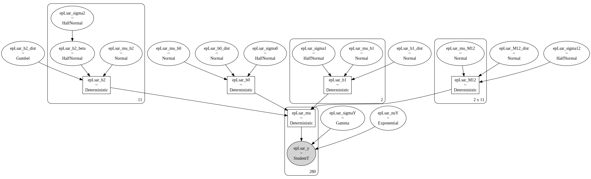
    


#### Check prior choice


```python
with epLsarModel as model:
    prior_pred_epLsar = pm.sample_prior_predictive(samples=numPredSamples,random_seed=random_seed)
```


```python
plotting_lib.plotPriorPredictive(widthInch,heigthInch,dpi,writeOut,outPathPlots,df,dictMeanStd,prior_pred_epLsar,dataZ.epLsar_z.values,'epLsar')
```


    

    


Prior choice is as intended: Broad over the data range.

#### Sampling


```python
with epLsarModel as model:
    trace_epLsar = pm.sample(numSamples,cores=numCores,tune=numTune,max_treedepth=20, init='auto',target_accept=0.95,random_seed=random_seed)
    #fit_epLsar = pm.fit(random_seed=random_seed)
    #trace_epLsar = fit_epLsar.sample(draws=numSamples)
```

    Auto-assigning NUTS sampler...
    Initializing NUTS using jitter+adapt_diag...
    Multiprocess sampling (10 chains in 10 jobs)
    NUTS: [epLsar_M12_dist, epLsar_mu_M12, epLsar_b2_dist, epLsar_b2_beta, epLsar_b1_dist, epLsar_b0_dist, epLsar_sigmaY, epLsar_nuY, epLsar_sigma12, epLsar_mu_b2, epLsar_mu_b1, epLsar_mu_b0, epLsar_sigma2, epLsar_sigma1, epLsar_sigma0]


<div>
    <style>
        /* Turns off some styling */
        progress {
            /* gets rid of default border in Firefox and Opera. */
            border: none;
            /* Needs to be in here for Safari polyfill so background images work as expected. */
            background-size: auto;
        }
        .progress-bar-interrupted, .progress-bar-interrupted::-webkit-progress-bar {
            background: #F44336;
        }
    </style>
  <progress value='15000' class='' max='15000' style='width:300px; height:20px; vertical-align: middle;'></progress>
  100.00% [15000/15000 03:01<00:00 Sampling 10 chains, 0 divergences]
</div>


    Sampling 10 chains for 1_000 tune and 500 draw iterations (10_000 + 5_000 draws total) took 183 seconds.


```python
with epLsarModel as model:
    if writeOut:
        with open(outPathData + 'model_{}.pkl'.format('epLsar'), 'wb') as buff:
            pickle.dump({'model':epLsarModel, 'trace': trace_epLsar}, buff)            
```

##### Save for later comparison


```python
if writeOut:
    np.save('../derived_data/statistical_model_two_factors/epLsar_oldb1', trace_epLsar['epLsar_b1'])
    np.save('../derived_data/statistical_model_two_factors/epLsar_oldb2', trace_epLsar['epLsar_b2'])
    np.save('../derived_data/statistical_model_two_factors/epLsar_oldM12', trace_epLsar['epLsar_M12'])
```

#### Check sampling


```python
with epLsarModel as model:
    dataTrace_epLsar = az.from_pymc3(trace=trace_epLsar)
```


```python
pm.summary(dataTrace_epLsar,hdi_prob=0.95).round(2)
```


<div>
<style scoped>
    .dataframe tbody tr th:only-of-type {
        vertical-align: middle;
    }

    .dataframe tbody tr th {
        vertical-align: top;
    }

    .dataframe thead th {
        text-align: right;
    }
</style>
<table border="1" class="dataframe">
  <thead>
    <tr style="text-align: right;">
      <th></th>
      <th>mean</th>
      <th>sd</th>
      <th>hdi_2.5%</th>
      <th>hdi_97.5%</th>
      <th>mcse_mean</th>
      <th>mcse_sd</th>
      <th>ess_mean</th>
      <th>ess_sd</th>
      <th>ess_bulk</th>
      <th>ess_tail</th>
      <th>r_hat</th>
    </tr>
  </thead>
  <tbody>
    <tr>
      <th>epLsar_mu_b0</th>
      <td>-0.11</td>
      <td>0.81</td>
      <td>-1.67</td>
      <td>1.48</td>
      <td>0.01</td>
      <td>0.01</td>
      <td>5029.0</td>
      <td>2319.0</td>
      <td>5029.0</td>
      <td>3627.0</td>
      <td>1.0</td>
    </tr>
    <tr>
      <th>epLsar_mu_b1[0]</th>
      <td>0.00</td>
      <td>0.73</td>
      <td>-1.48</td>
      <td>1.36</td>
      <td>0.01</td>
      <td>0.01</td>
      <td>4766.0</td>
      <td>3057.0</td>
      <td>4763.0</td>
      <td>3988.0</td>
      <td>1.0</td>
    </tr>
    <tr>
      <th>epLsar_mu_b1[1]</th>
      <td>-0.07</td>
      <td>0.71</td>
      <td>-1.47</td>
      <td>1.34</td>
      <td>0.01</td>
      <td>0.01</td>
      <td>4575.0</td>
      <td>2861.0</td>
      <td>4587.0</td>
      <td>3606.0</td>
      <td>1.0</td>
    </tr>
    <tr>
      <th>epLsar_mu_b2[0]</th>
      <td>-0.25</td>
      <td>0.66</td>
      <td>-1.63</td>
      <td>0.94</td>
      <td>0.01</td>
      <td>0.01</td>
      <td>3705.0</td>
      <td>2967.0</td>
      <td>3733.0</td>
      <td>4054.0</td>
      <td>1.0</td>
    </tr>
    <tr>
      <th>epLsar_mu_b2[1]</th>
      <td>-0.36</td>
      <td>0.67</td>
      <td>-1.64</td>
      <td>0.98</td>
      <td>0.01</td>
      <td>0.01</td>
      <td>4093.0</td>
      <td>3216.0</td>
      <td>4098.0</td>
      <td>3736.0</td>
      <td>1.0</td>
    </tr>
    <tr>
      <th>...</th>
      <td>...</td>
      <td>...</td>
      <td>...</td>
      <td>...</td>
      <td>...</td>
      <td>...</td>
      <td>...</td>
      <td>...</td>
      <td>...</td>
      <td>...</td>
      <td>...</td>
    </tr>
    <tr>
      <th>epLsar_mu[275]</th>
      <td>0.66</td>
      <td>0.27</td>
      <td>0.12</td>
      <td>1.16</td>
      <td>0.00</td>
      <td>0.00</td>
      <td>5124.0</td>
      <td>4919.0</td>
      <td>5132.0</td>
      <td>4303.0</td>
      <td>1.0</td>
    </tr>
    <tr>
      <th>epLsar_mu[276]</th>
      <td>0.68</td>
      <td>0.31</td>
      <td>0.09</td>
      <td>1.30</td>
      <td>0.00</td>
      <td>0.00</td>
      <td>5093.0</td>
      <td>5024.0</td>
      <td>5103.0</td>
      <td>3850.0</td>
      <td>1.0</td>
    </tr>
    <tr>
      <th>epLsar_mu[277]</th>
      <td>0.66</td>
      <td>0.27</td>
      <td>0.12</td>
      <td>1.16</td>
      <td>0.00</td>
      <td>0.00</td>
      <td>5124.0</td>
      <td>4919.0</td>
      <td>5132.0</td>
      <td>4303.0</td>
      <td>1.0</td>
    </tr>
    <tr>
      <th>epLsar_mu[278]</th>
      <td>0.68</td>
      <td>0.31</td>
      <td>0.09</td>
      <td>1.30</td>
      <td>0.00</td>
      <td>0.00</td>
      <td>5093.0</td>
      <td>5024.0</td>
      <td>5103.0</td>
      <td>3850.0</td>
      <td>1.0</td>
    </tr>
    <tr>
      <th>epLsar_mu[279]</th>
      <td>0.66</td>
      <td>0.27</td>
      <td>0.12</td>
      <td>1.16</td>
      <td>0.00</td>
      <td>0.00</td>
      <td>5124.0</td>
      <td>4919.0</td>
      <td>5132.0</td>
      <td>4303.0</td>
      <td>1.0</td>
    </tr>
  </tbody>
</table>
<p>384 rows × 11 columns</p>
</div>


```python
plotting_lib.plotDiagnostics(widthInch,heigthInch,dpi,writeOut,outPathPlots,trace_epLsar,dataTrace_epLsar,'epLsar')
```

    /home/bob/.local/lib/python3.8/site-packages/arviz/plots/backends/matplotlib/pairplot.py:212: UserWarning: rcParams['plot.max_subplots'] (40) is smaller than the number of resulting pair plots with these variables, generating only a 8x8 grid
      warnings.warn(


    
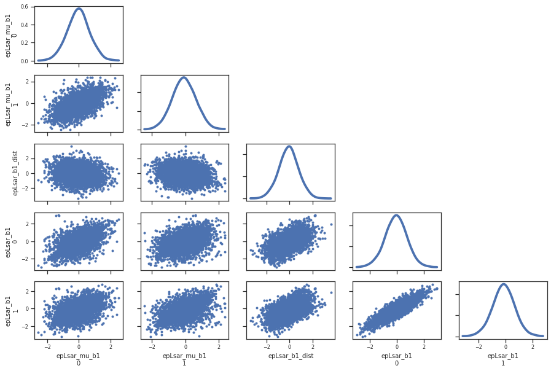
    


    
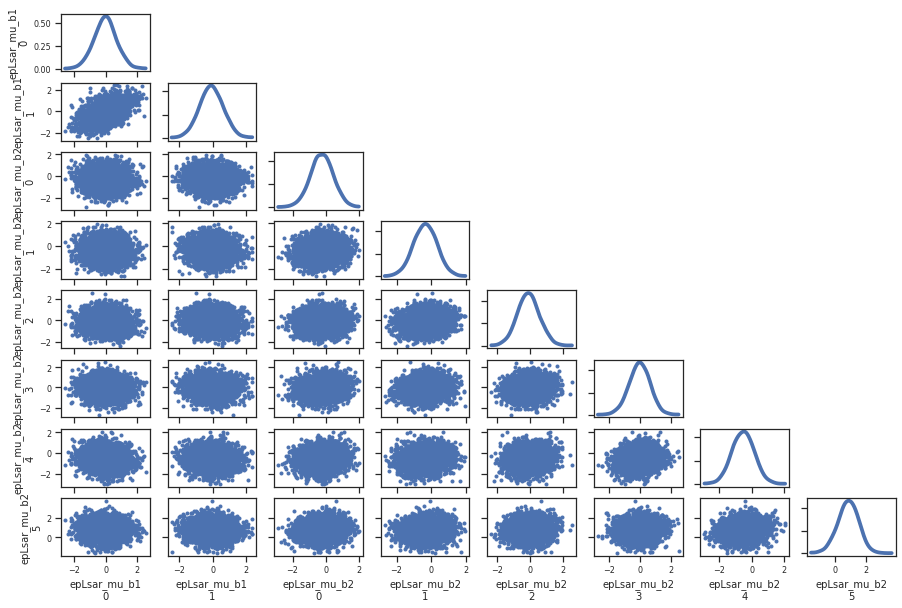
    


    

    


    
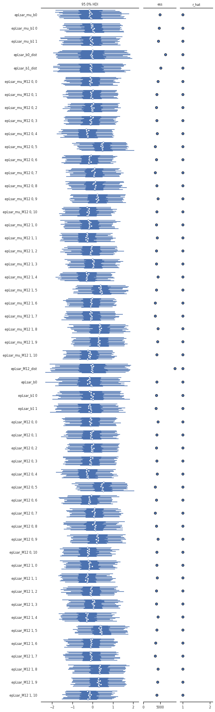
    


```python
with epLsarModel as model:
    plotting_lib.plotTracesB(widthInch,heigthInch,dpi,writeOut,outPathPlots,trace_epLsar,'epLsar')
```


    
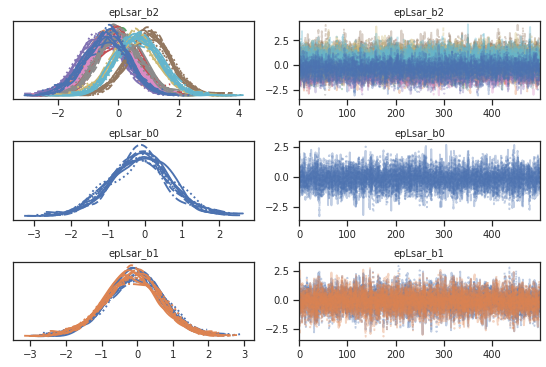
    


```python
with epLsarModel as model:
    plotting_lib.pm.energyplot(trace_epLsar)
```


    
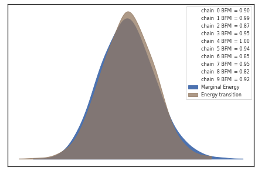
    


#### Posterior predictive distribution


```python
with epLsarModel as model:
    posterior_pred_epLsar = pm.sample_posterior_predictive(trace_epLsar,samples=numPredSamples,random_seed=random_seed)
```

    /home/bob/.local/lib/python3.8/site-packages/pymc3/sampling.py:1707: UserWarning: samples parameter is smaller than nchains times ndraws, some draws and/or chains may not be represented in the returned posterior predictive sample
      warnings.warn(


<div>
    <style>
        /* Turns off some styling */
        progress {
            /* gets rid of default border in Firefox and Opera. */
            border: none;
            /* Needs to be in here for Safari polyfill so background images work as expected. */
            background-size: auto;
        }
        .progress-bar-interrupted, .progress-bar-interrupted::-webkit-progress-bar {
            background: #F44336;
        }
    </style>
  <progress value='2000' class='' max='2000' style='width:300px; height:20px; vertical-align: middle;'></progress>
  100.00% [2000/2000 00:02<00:00]
</div>


```python
plotting_lib.plotPriorPosteriorPredictive(widthInch,heigthInch,dpi,writeOut,outPathPlots,df,dictMeanStd,prior_pred_epLsar,posterior_pred_epLsar,dataZ.epLsar_z.values,'epLsar')
```


    
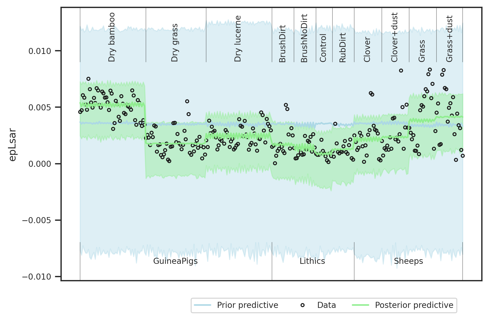
    


#### Level plots


```python
plotting_lib.plotLevels(widthInch,heigthInch,dpi,sizes,writeOut,outPathPlots,dictMeanStd,dictTreatment,dictSoftware,trace_epLsar,'epLsar',x1,x2)
```


    
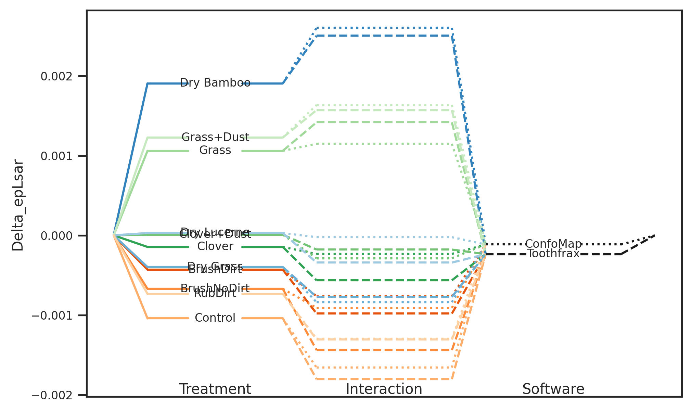
    


```python
plotting_lib.plotLevelsStd(widthInch,heigthInch,dpi,sizes,writeOut,outPathPlots,dictMeanStd,dictTreatment,dictSoftware,trace_epLsar,'epLsar',x1,x2)
```


    
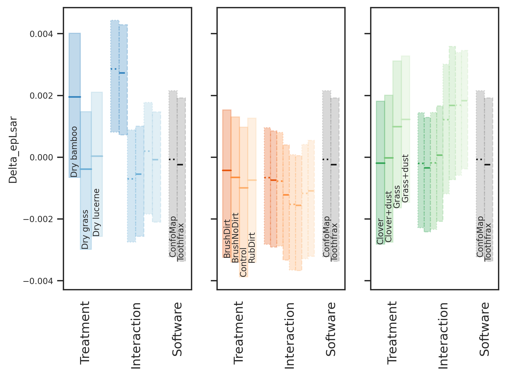
    


#### Posterior and contrasts


```python
df_hdi_epLsar = plotting_lib.plotTreatmentPosterior(widthInch,heigthInch,dpi,sizes,writeOut,outPathPlots,dictMeanStd,dictTreatment,dictSoftware,trace_epLsar,'epLsar',x1,x2)
```


    

    


```python
df_hdi_epLsar
```


<div>
<style scoped>
    .dataframe tbody tr th:only-of-type {
        vertical-align: middle;
    }

    .dataframe tbody tr th {
        vertical-align: top;
    }

    .dataframe thead th {
        text-align: right;
    }
</style>
<table border="1" class="dataframe">
  <thead>
    <tr style="text-align: right;">
      <th></th>
      <th>Treatment_i</th>
      <th>Treatment_j</th>
      <th>hdi_ConfoMap_2.5%</th>
      <th>hdi_ConfoMap_97.5%</th>
      <th>isSignificant_on_ConfoMap</th>
      <th>hdi_Toothfrax_2.5%</th>
      <th>hdi_Toothfrax_97.5%</th>
      <th>isSignificant_on_Toothfrax</th>
    </tr>
  </thead>
  <tbody>
    <tr>
      <th>0</th>
      <td>Dry grass</td>
      <td>Dry bamboo</td>
      <td>-0.004200</td>
      <td>-0.002884</td>
      <td>True</td>
      <td>-0.003967</td>
      <td>-0.002636</td>
      <td>True</td>
    </tr>
    <tr>
      <th>1</th>
      <td>Dry lucerne</td>
      <td>Dry bamboo</td>
      <td>-0.003305</td>
      <td>-0.001994</td>
      <td>True</td>
      <td>-0.003411</td>
      <td>-0.002161</td>
      <td>True</td>
    </tr>
    <tr>
      <th>2</th>
      <td>Dry lucerne</td>
      <td>Dry grass</td>
      <td>0.000228</td>
      <td>0.001524</td>
      <td>True</td>
      <td>-0.000167</td>
      <td>0.001116</td>
      <td>False</td>
    </tr>
    <tr>
      <th>3</th>
      <td>BrushNoDirt</td>
      <td>BrushDirt</td>
      <td>-0.001227</td>
      <td>0.001107</td>
      <td>False</td>
      <td>-0.001528</td>
      <td>0.000527</td>
      <td>False</td>
    </tr>
    <tr>
      <th>4</th>
      <td>Control</td>
      <td>BrushDirt</td>
      <td>-0.002046</td>
      <td>0.000359</td>
      <td>False</td>
      <td>-0.001954</td>
      <td>0.000235</td>
      <td>False</td>
    </tr>
    <tr>
      <th>5</th>
      <td>Control</td>
      <td>BrushNoDirt</td>
      <td>-0.001872</td>
      <td>0.000384</td>
      <td>False</td>
      <td>-0.001414</td>
      <td>0.000676</td>
      <td>False</td>
    </tr>
    <tr>
      <th>6</th>
      <td>RubDirt</td>
      <td>BrushDirt</td>
      <td>-0.001636</td>
      <td>0.000627</td>
      <td>False</td>
      <td>-0.001497</td>
      <td>0.000683</td>
      <td>False</td>
    </tr>
    <tr>
      <th>7</th>
      <td>RubDirt</td>
      <td>BrushNoDirt</td>
      <td>-0.001442</td>
      <td>0.000661</td>
      <td>False</td>
      <td>-0.000890</td>
      <td>0.001130</td>
      <td>False</td>
    </tr>
    <tr>
      <th>8</th>
      <td>RubDirt</td>
      <td>Control</td>
      <td>-0.000753</td>
      <td>0.001508</td>
      <td>False</td>
      <td>-0.000598</td>
      <td>0.001547</td>
      <td>False</td>
    </tr>
    <tr>
      <th>9</th>
      <td>Clover+dust</td>
      <td>Clover</td>
      <td>-0.001140</td>
      <td>0.001047</td>
      <td>False</td>
      <td>-0.000746</td>
      <td>0.001576</td>
      <td>False</td>
    </tr>
    <tr>
      <th>10</th>
      <td>Grass</td>
      <td>Clover</td>
      <td>-0.000153</td>
      <td>0.002973</td>
      <td>False</td>
      <td>0.000293</td>
      <td>0.003795</td>
      <td>True</td>
    </tr>
    <tr>
      <th>11</th>
      <td>Grass</td>
      <td>Clover+dust</td>
      <td>-0.000151</td>
      <td>0.002972</td>
      <td>False</td>
      <td>-0.000175</td>
      <td>0.003389</td>
      <td>False</td>
    </tr>
    <tr>
      <th>12</th>
      <td>Grass+dust</td>
      <td>Clover</td>
      <td>0.000533</td>
      <td>0.003296</td>
      <td>True</td>
      <td>0.000819</td>
      <td>0.003383</td>
      <td>True</td>
    </tr>
    <tr>
      <th>13</th>
      <td>Grass+dust</td>
      <td>Clover+dust</td>
      <td>0.000445</td>
      <td>0.003307</td>
      <td>True</td>
      <td>0.000379</td>
      <td>0.002978</td>
      <td>True</td>
    </tr>
    <tr>
      <th>14</th>
      <td>Grass+dust</td>
      <td>Grass</td>
      <td>-0.001303</td>
      <td>0.002230</td>
      <td>False</td>
      <td>-0.001721</td>
      <td>0.001958</td>
      <td>False</td>
    </tr>
  </tbody>
</table>
</div>


```python
if writeOut:
    df_hdi_epLsar.to_csv(outPathData+ 'hdi_{}.csv'.format('epLsar'))
```

### R²<a name="r"></a>


```python
with pm.Model() as model:
    RsquaredModel = TwoFactorModel('R²',x1,x2,dataZ["R²_z"].values)
```

#### Verify model settings


```python
RsquaredModel.printParams(x1,x2,dataZ["R²_z"].values)
```

    The number of levels of the x variables are (2, 11)
    The standard deviations used for the beta priors are  (1.3433087377122408, 2.3171005331515255)
    The standard deviations used for the M12 priors are 0.13391632877981252


```python
pm.model_to_graphviz(RsquaredModel)
```


    
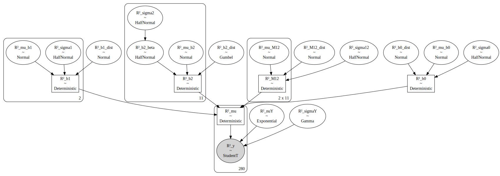
    


#### Check prior choice


```python
with RsquaredModel as model:
    prior_pred_Rsquared = pm.sample_prior_predictive(samples=numPredSamples,random_seed=random_seed)
```


```python
plotting_lib.plotPriorPredictive(widthInch,heigthInch,dpi,writeOut,outPathPlots,df,dictMeanStd,prior_pred_Rsquared,dataZ["R²_z"].values,'R²')
```


    
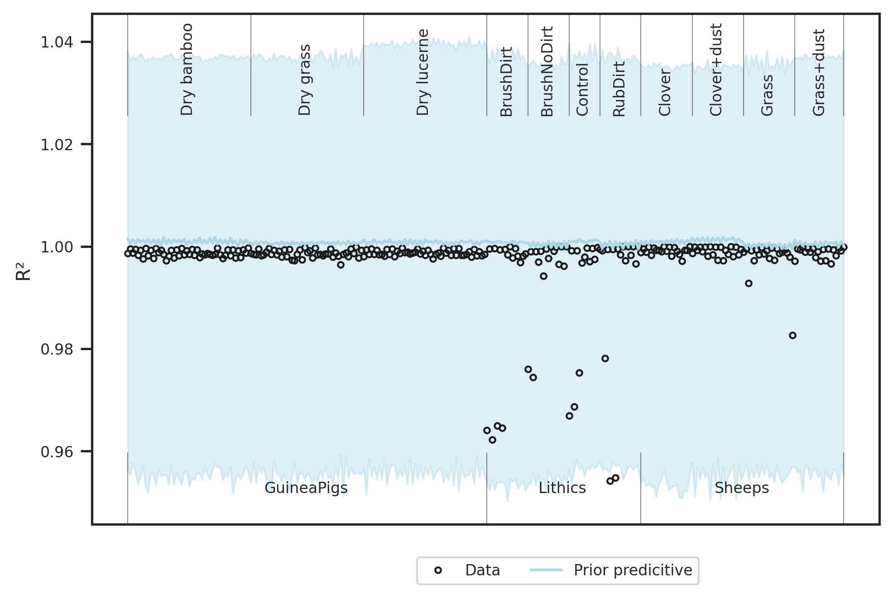
    


#### Sampling


```python
with RsquaredModel as model:
    trace_Rsquared = pm.sample(numSamples,cores=numCores,tune=numTune,max_treedepth=20, init='auto',target_accept=0.99,random_seed=random_seed)
```

    Auto-assigning NUTS sampler...
    Initializing NUTS using jitter+adapt_diag...
    Multiprocess sampling (10 chains in 10 jobs)
    NUTS: [R²_M12_dist, R²_mu_M12, R²_b2_dist, R²_b2_beta, R²_b1_dist, R²_b0_dist, R²_sigmaY, R²_nuY, R²_sigma12, R²_mu_b2, R²_mu_b1, R²_mu_b0, R²_sigma2, R²_sigma1, R²_sigma0]


<div>
    <style>
        /* Turns off some styling */
        progress {
            /* gets rid of default border in Firefox and Opera. */
            border: none;
            /* Needs to be in here for Safari polyfill so background images work as expected. */
            background-size: auto;
        }
        .progress-bar-interrupted, .progress-bar-interrupted::-webkit-progress-bar {
            background: #F44336;
        }
    </style>
  <progress value='15000' class='' max='15000' style='width:300px; height:20px; vertical-align: middle;'></progress>
  100.00% [15000/15000 1:06:10<00:00 Sampling 10 chains, 0 divergences]
</div>


    Sampling 10 chains for 1_000 tune and 500 draw iterations (10_000 + 5_000 draws total) took 3971 seconds.


```python
with RsquaredModel as model:
    if writeOut:
        with open(outPathData + 'model_{}.pkl'.format('R²'), 'wb') as buff:
            pickle.dump({'model': RsquaredModel, 'trace': trace_Rsquared}, buff)
```

#### Check sampling


```python
with RsquaredModel as model:
    dataTrace_Rsquared = az.from_pymc3(trace=trace_Rsquared)
```


```python
pm.summary(dataTrace_Rsquared,hdi_prob=0.95).round(2)
```


<div>
<style scoped>
    .dataframe tbody tr th:only-of-type {
        vertical-align: middle;
    }

    .dataframe tbody tr th {
        vertical-align: top;
    }

    .dataframe thead th {
        text-align: right;
    }
</style>
<table border="1" class="dataframe">
  <thead>
    <tr style="text-align: right;">
      <th></th>
      <th>mean</th>
      <th>sd</th>
      <th>hdi_2.5%</th>
      <th>hdi_97.5%</th>
      <th>mcse_mean</th>
      <th>mcse_sd</th>
      <th>ess_mean</th>
      <th>ess_sd</th>
      <th>ess_bulk</th>
      <th>ess_tail</th>
      <th>r_hat</th>
    </tr>
  </thead>
  <tbody>
    <tr>
      <th>R²_mu_b0</th>
      <td>0.07</td>
      <td>0.83</td>
      <td>-1.55</td>
      <td>1.64</td>
      <td>0.01</td>
      <td>0.01</td>
      <td>7950.0</td>
      <td>2327.0</td>
      <td>7929.0</td>
      <td>4058.0</td>
      <td>1.0</td>
    </tr>
    <tr>
      <th>R²_mu_b1[0]</th>
      <td>-0.05</td>
      <td>0.73</td>
      <td>-1.49</td>
      <td>1.35</td>
      <td>0.01</td>
      <td>0.01</td>
      <td>6903.0</td>
      <td>2379.0</td>
      <td>6902.0</td>
      <td>3964.0</td>
      <td>1.0</td>
    </tr>
    <tr>
      <th>R²_mu_b1[1]</th>
      <td>0.11</td>
      <td>0.72</td>
      <td>-1.23</td>
      <td>1.58</td>
      <td>0.01</td>
      <td>0.01</td>
      <td>7161.0</td>
      <td>2924.0</td>
      <td>7164.0</td>
      <td>4300.0</td>
      <td>1.0</td>
    </tr>
    <tr>
      <th>R²_mu_b2[0]</th>
      <td>-0.01</td>
      <td>0.66</td>
      <td>-1.24</td>
      <td>1.29</td>
      <td>0.01</td>
      <td>0.01</td>
      <td>5941.0</td>
      <td>2544.0</td>
      <td>5938.0</td>
      <td>3984.0</td>
      <td>1.0</td>
    </tr>
    <tr>
      <th>R²_mu_b2[1]</th>
      <td>-0.05</td>
      <td>0.66</td>
      <td>-1.31</td>
      <td>1.29</td>
      <td>0.01</td>
      <td>0.01</td>
      <td>6122.0</td>
      <td>2330.0</td>
      <td>6086.0</td>
      <td>3681.0</td>
      <td>1.0</td>
    </tr>
    <tr>
      <th>...</th>
      <td>...</td>
      <td>...</td>
      <td>...</td>
      <td>...</td>
      <td>...</td>
      <td>...</td>
      <td>...</td>
      <td>...</td>
      <td>...</td>
      <td>...</td>
      <td>...</td>
    </tr>
    <tr>
      <th>R²_mu[275]</th>
      <td>0.34</td>
      <td>0.01</td>
      <td>0.31</td>
      <td>0.36</td>
      <td>0.00</td>
      <td>0.00</td>
      <td>4973.0</td>
      <td>4968.0</td>
      <td>4975.0</td>
      <td>4789.0</td>
      <td>1.0</td>
    </tr>
    <tr>
      <th>R²_mu[276]</th>
      <td>0.11</td>
      <td>0.10</td>
      <td>-0.03</td>
      <td>0.26</td>
      <td>0.00</td>
      <td>0.00</td>
      <td>4537.0</td>
      <td>4387.0</td>
      <td>4704.0</td>
      <td>4535.0</td>
      <td>1.0</td>
    </tr>
    <tr>
      <th>R²_mu[277]</th>
      <td>0.34</td>
      <td>0.01</td>
      <td>0.31</td>
      <td>0.36</td>
      <td>0.00</td>
      <td>0.00</td>
      <td>4973.0</td>
      <td>4968.0</td>
      <td>4975.0</td>
      <td>4789.0</td>
      <td>1.0</td>
    </tr>
    <tr>
      <th>R²_mu[278]</th>
      <td>0.11</td>
      <td>0.10</td>
      <td>-0.03</td>
      <td>0.26</td>
      <td>0.00</td>
      <td>0.00</td>
      <td>4537.0</td>
      <td>4387.0</td>
      <td>4704.0</td>
      <td>4535.0</td>
      <td>1.0</td>
    </tr>
    <tr>
      <th>R²_mu[279]</th>
      <td>0.34</td>
      <td>0.01</td>
      <td>0.31</td>
      <td>0.36</td>
      <td>0.00</td>
      <td>0.00</td>
      <td>4973.0</td>
      <td>4968.0</td>
      <td>4975.0</td>
      <td>4789.0</td>
      <td>1.0</td>
    </tr>
  </tbody>
</table>
<p>384 rows × 11 columns</p>
</div>


```python
plotting_lib.plotDiagnostics(widthInch,heigthInch,dpi,writeOut,outPathPlots,trace_Rsquared,dataTrace_Rsquared,'R²')
```

    /home/bob/.local/lib/python3.8/site-packages/arviz/plots/backends/matplotlib/pairplot.py:212: UserWarning: rcParams['plot.max_subplots'] (40) is smaller than the number of resulting pair plots with these variables, generating only a 8x8 grid
      warnings.warn(


    
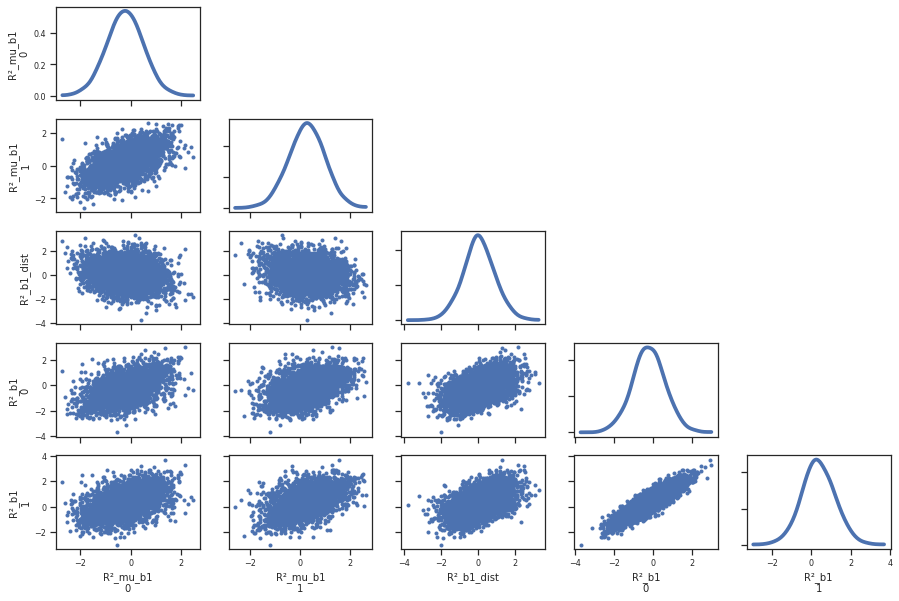
    


    
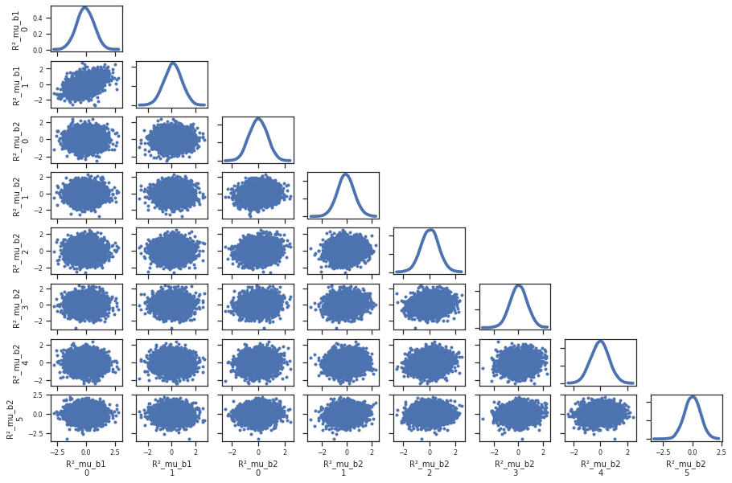
    


    
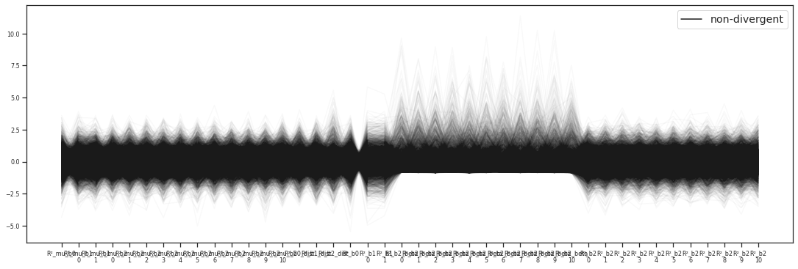
    


    
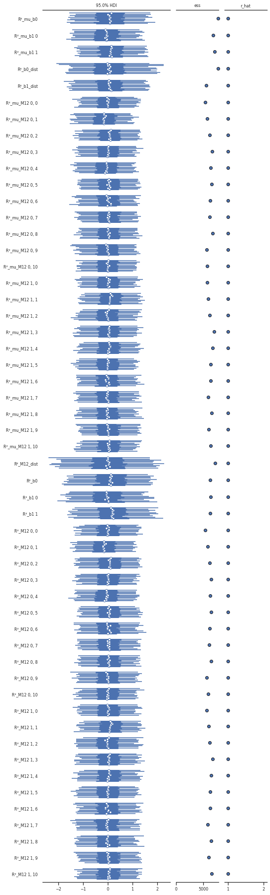
    


```python
with RsquaredModel as model:
    plotting_lib.plotTracesB(widthInch,heigthInch,dpi,writeOut,outPathPlots,trace_Rsquared,'R²')
```


    
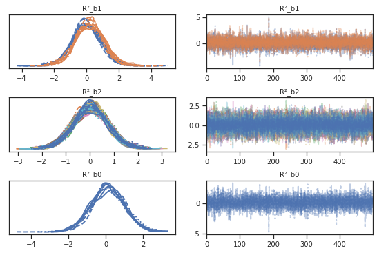
    


```python
with RsquaredModel as model:
    plotting_lib.pm.energyplot(trace_Rsquared)
```


    

    


#### Posterior predictive distribution


```python
with RsquaredModel as model:
    posterior_pred_Rsquared = pm.sample_posterior_predictive(trace_Rsquared,samples=numPredSamples,random_seed=random_seed)
```

    /home/bob/.local/lib/python3.8/site-packages/pymc3/sampling.py:1707: UserWarning: samples parameter is smaller than nchains times ndraws, some draws and/or chains may not be represented in the returned posterior predictive sample
      warnings.warn(


<div>
    <style>
        /* Turns off some styling */
        progress {
            /* gets rid of default border in Firefox and Opera. */
            border: none;
            /* Needs to be in here for Safari polyfill so background images work as expected. */
            background-size: auto;
        }
        .progress-bar-interrupted, .progress-bar-interrupted::-webkit-progress-bar {
            background: #F44336;
        }
    </style>
  <progress value='2000' class='' max='2000' style='width:300px; height:20px; vertical-align: middle;'></progress>
  100.00% [2000/2000 00:02<00:00]
</div>


```python
plotting_lib.plotPriorPosteriorPredictive(widthInch,heigthInch,dpi,writeOut,outPathPlots,df,dictMeanStd,prior_pred_Rsquared,posterior_pred_Rsquared,dataZ["R²_z"].values,'R²')
```


    
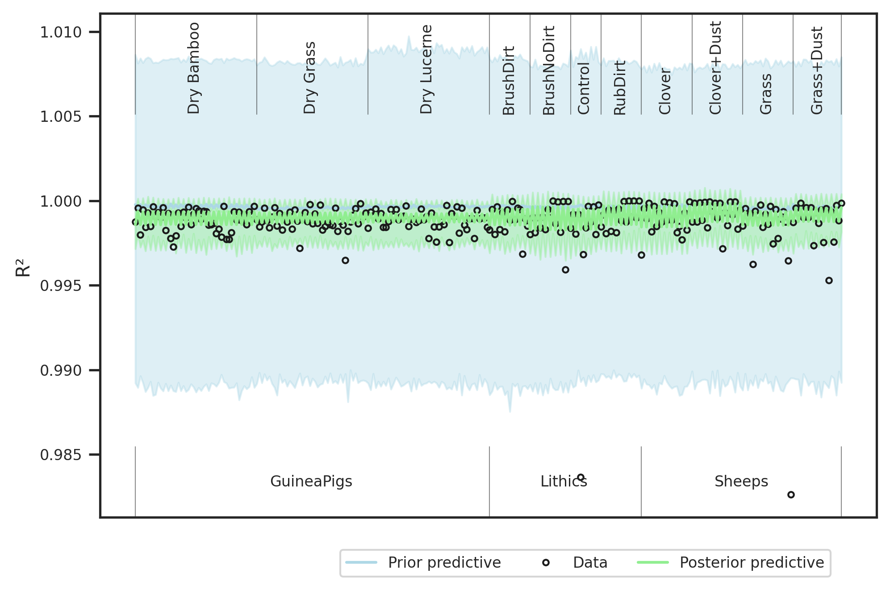
    


#### Compare prior and posterior for model parameters


```python
with RsquaredModel as model:
    pm_data_Rsquared = az.from_pymc3(trace=trace_Rsquared,prior=prior_pred_Rsquared,posterior_predictive=posterior_pred_Rsquared)
```

    arviz.data.io_pymc3 - WARNING - posterior predictive variable R²_y's shape not compatible with number of chains and draws. This can mean that some draws or even whole chains are not represented.


```python
plotting_lib.plotPriorPosteriorB(widthInch,heigthInch,dpi,sizes,writeOut,outPathPlots,dictMeanStd,pm_data_Rsquared,'R²')
```


    
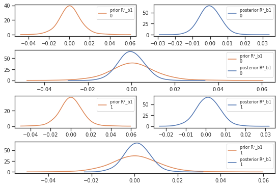
    


```python
plotting_lib.plotLevels(widthInch,heigthInch,dpi,sizes,writeOut,outPathPlots,dictMeanStd,dictTreatment,dictSoftware,trace_Rsquared,'R²',x1,x2)
```


    
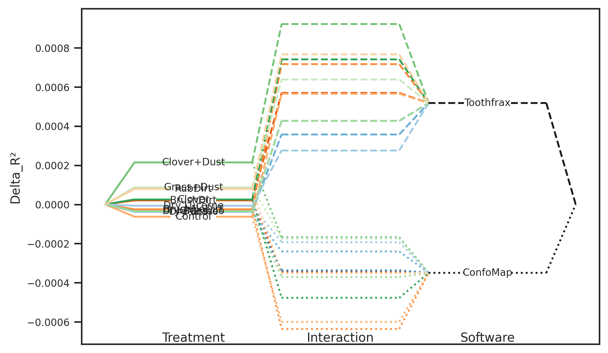
    


```python
plotting_lib.plotLevelsStd(widthInch,heigthInch,dpi,sizes,writeOut,outPathPlots,dictMeanStd,dictTreatment,dictSoftware,trace_Rsquared,'R²',x1,x2)
```


    
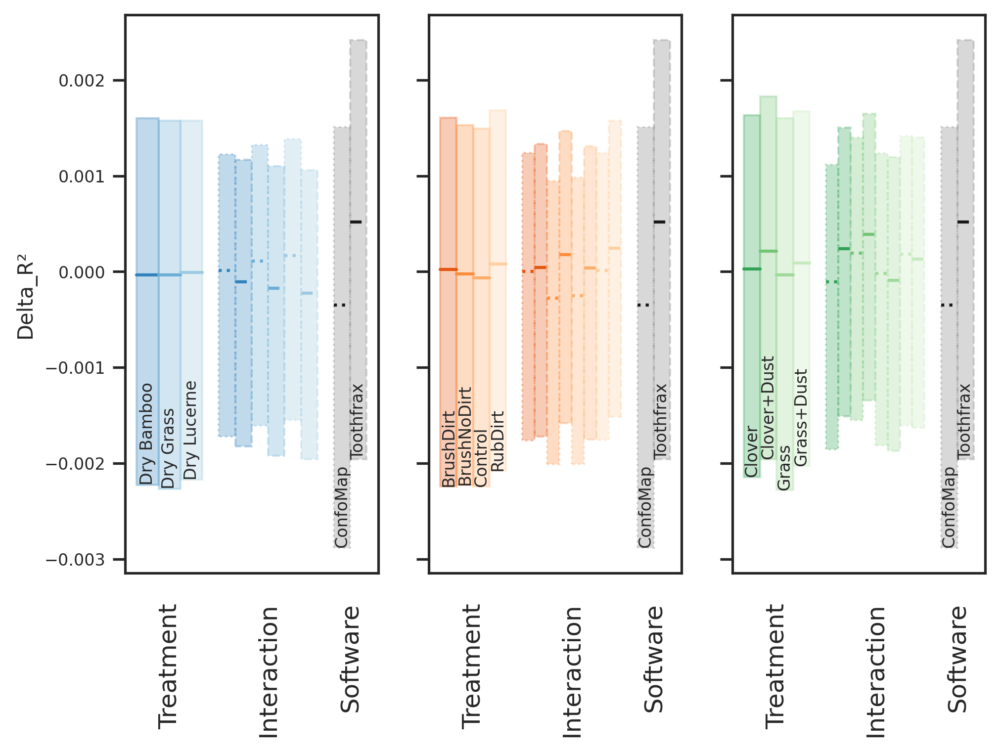
    


#### Posterior and contrasts


```python
plotting_lib.plotPosterior(widthInch,heigthInch,dpi,writeOut,outPathPlots,dictMeanStd,pm_data_Rsquared,'R²')
```


    
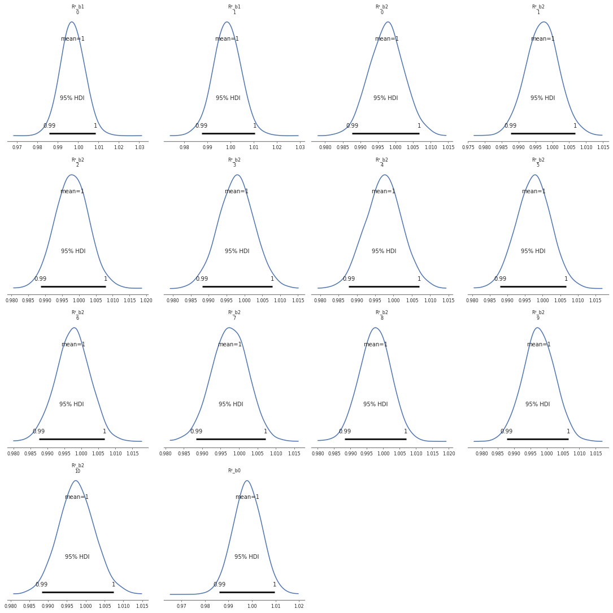
    


```python
df_hdi_R = plotting_lib.plotTreatmentPosterior(widthInch,heigthInch,dpi,sizes,writeOut,outPathPlots,dictMeanStd,dictTreatment,dictSoftware,trace_Rsquared,'R²',x1,x2)
```

    /home/bob/.local/lib/python3.8/site-packages/seaborn/distributions.py:305: UserWarning: Dataset has 0 variance; skipping density estimate.
      warnings.warn(msg, UserWarning)


    

    


```python
df_hdi_R
```


<div>
<style scoped>
    .dataframe tbody tr th:only-of-type {
        vertical-align: middle;
    }

    .dataframe tbody tr th {
        vertical-align: top;
    }

    .dataframe thead th {
        text-align: right;
    }
</style>
<table border="1" class="dataframe">
  <thead>
    <tr style="text-align: right;">
      <th></th>
      <th>Treatment_i</th>
      <th>Treatment_j</th>
      <th>hdi_ConfoMap_2.5%</th>
      <th>hdi_ConfoMap_97.5%</th>
      <th>isSignificant_on_ConfoMap</th>
      <th>hdi_Toothfrax_2.5%</th>
      <th>hdi_Toothfrax_97.5%</th>
      <th>isSignificant_on_Toothfrax</th>
    </tr>
  </thead>
  <tbody>
    <tr>
      <th>0</th>
      <td>Dry grass</td>
      <td>Dry bamboo</td>
      <td>-0.000285</td>
      <td>0.000175</td>
      <td>False</td>
      <td>-0.000257</td>
      <td>0.000188</td>
      <td>False</td>
    </tr>
    <tr>
      <th>1</th>
      <td>Dry lucerne</td>
      <td>Dry bamboo</td>
      <td>-0.000116</td>
      <td>0.000248</td>
      <td>False</td>
      <td>-0.000326</td>
      <td>0.000121</td>
      <td>False</td>
    </tr>
    <tr>
      <th>2</th>
      <td>Dry lucerne</td>
      <td>Dry grass</td>
      <td>-0.000115</td>
      <td>0.000330</td>
      <td>False</td>
      <td>-0.000349</td>
      <td>0.000179</td>
      <td>False</td>
    </tr>
    <tr>
      <th>3</th>
      <td>BrushNoDirt</td>
      <td>BrushDirt</td>
      <td>-0.002096</td>
      <td>-0.000672</td>
      <td>True</td>
      <td>-0.000420</td>
      <td>0.000635</td>
      <td>False</td>
    </tr>
    <tr>
      <th>4</th>
      <td>Control</td>
      <td>BrushDirt</td>
      <td>-0.001249</td>
      <td>0.000041</td>
      <td>False</td>
      <td>-0.000416</td>
      <td>0.000408</td>
      <td>False</td>
    </tr>
    <tr>
      <th>5</th>
      <td>Control</td>
      <td>BrushNoDirt</td>
      <td>-0.000080</td>
      <td>0.001656</td>
      <td>False</td>
      <td>-0.000801</td>
      <td>0.000387</td>
      <td>False</td>
    </tr>
    <tr>
      <th>6</th>
      <td>RubDirt</td>
      <td>BrushDirt</td>
      <td>-0.001154</td>
      <td>0.000799</td>
      <td>False</td>
      <td>-0.000185</td>
      <td>0.000635</td>
      <td>False</td>
    </tr>
    <tr>
      <th>7</th>
      <td>RubDirt</td>
      <td>BrushNoDirt</td>
      <td>0.000181</td>
      <td>0.002386</td>
      <td>True</td>
      <td>-0.000556</td>
      <td>0.000619</td>
      <td>False</td>
    </tr>
    <tr>
      <th>8</th>
      <td>RubDirt</td>
      <td>Control</td>
      <td>-0.000680</td>
      <td>0.001489</td>
      <td>False</td>
      <td>-0.000252</td>
      <td>0.000722</td>
      <td>False</td>
    </tr>
    <tr>
      <th>9</th>
      <td>Clover+dust</td>
      <td>Clover</td>
      <td>-0.001005</td>
      <td>-0.000290</td>
      <td>True</td>
      <td>-0.000138</td>
      <td>0.000401</td>
      <td>False</td>
    </tr>
    <tr>
      <th>10</th>
      <td>Grass</td>
      <td>Clover</td>
      <td>-0.001250</td>
      <td>-0.000102</td>
      <td>True</td>
      <td>-0.000719</td>
      <td>-0.000045</td>
      <td>True</td>
    </tr>
    <tr>
      <th>11</th>
      <td>Grass</td>
      <td>Clover+dust</td>
      <td>-0.000639</td>
      <td>0.000580</td>
      <td>False</td>
      <td>-0.000792</td>
      <td>-0.000199</td>
      <td>True</td>
    </tr>
    <tr>
      <th>12</th>
      <td>Grass+dust</td>
      <td>Clover</td>
      <td>-0.001970</td>
      <td>0.000084</td>
      <td>False</td>
      <td>-0.000435</td>
      <td>0.000140</td>
      <td>False</td>
    </tr>
    <tr>
      <th>13</th>
      <td>Grass+dust</td>
      <td>Clover+dust</td>
      <td>-0.001314</td>
      <td>0.000824</td>
      <td>False</td>
      <td>-0.000515</td>
      <td>-0.000045</td>
      <td>True</td>
    </tr>
    <tr>
      <th>14</th>
      <td>Grass+dust</td>
      <td>Grass</td>
      <td>-0.001536</td>
      <td>0.000874</td>
      <td>False</td>
      <td>-0.000091</td>
      <td>0.000540</td>
      <td>False</td>
    </tr>
  </tbody>
</table>
</div>


```python
if writeOut:
    df_hdi_R.to_csv(outPathData+ 'hdi_{}.csv'.format('R²'))
```

### Asfc  <a name="Asfc"></a>


```python
with pm.Model() as model:
    AsfcModel = TwoFactorModel('Asfc',x1,x2,dataZ["Asfc_z"].values)
```

#### Verify model settings


```python
AsfcModel.printParams(x1,x2,dataZ["Asfc_z"].values)
```

    The number of levels of the x variables are (2, 11)
    The standard deviations used for the beta priors are  (1.0620939450667206, 0.7885965314025212)
    The standard deviations used for the M12 priors are 0.06614242279897746


```python
pm.model_to_graphviz(AsfcModel)
```


    
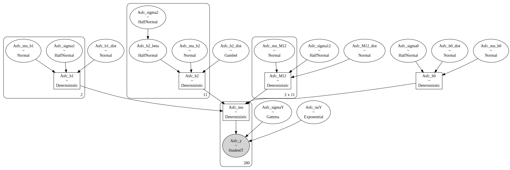
    


#### Check prior choice


```python
with AsfcModel as model:
    prior_pred_Asfc = pm.sample_prior_predictive(samples=numPredSamples,random_seed=random_seed)
```


```python
plotting_lib.plotPriorPredictive(widthInch,heigthInch,dpi,writeOut,outPathPlots,df,dictMeanStd,prior_pred_Asfc,dataZ["Asfc_z"].values,'Asfc')
```


    
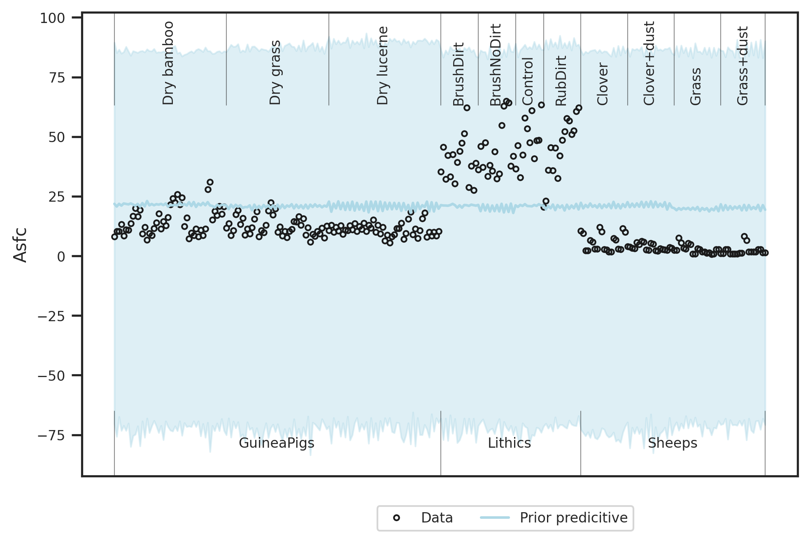
    


Prior choice is as intended: Broad over the data range.

#### Sampling


```python
with AsfcModel as model:
    trace_Asfc = pm.sample(numSamples,cores=numCores,tune=numTune,max_treedepth=20, init='auto',target_accept=0.99,random_seed=random_seed)
```

    Auto-assigning NUTS sampler...
    Initializing NUTS using jitter+adapt_diag...
    Multiprocess sampling (10 chains in 10 jobs)
    NUTS: [Asfc_M12_dist, Asfc_mu_M12, Asfc_b2_dist, Asfc_b2_beta, Asfc_b1_dist, Asfc_b0_dist, Asfc_sigmaY, Asfc_nuY, Asfc_sigma12, Asfc_mu_b2, Asfc_mu_b1, Asfc_mu_b0, Asfc_sigma2, Asfc_sigma1, Asfc_sigma0]


<div>
    <style>
        /* Turns off some styling */
        progress {
            /* gets rid of default border in Firefox and Opera. */
            border: none;
            /* Needs to be in here for Safari polyfill so background images work as expected. */
            background-size: auto;
        }
        .progress-bar-interrupted, .progress-bar-interrupted::-webkit-progress-bar {
            background: #F44336;
        }
    </style>
  <progress value='15000' class='' max='15000' style='width:300px; height:20px; vertical-align: middle;'></progress>
  100.00% [15000/15000 17:10<00:00 Sampling 10 chains, 0 divergences]
</div>


    Sampling 10 chains for 1_000 tune and 500 draw iterations (10_000 + 5_000 draws total) took 1032 seconds.


```python
with AsfcModel as model:
    if writeOut:
        with open(outPathData + 'model_{}.pkl'.format('Asfc'), 'wb') as buff:
            pickle.dump({'model': AsfcModel, 'trace': trace_Asfc}, buff)
```

#### Check sampling


```python
with AsfcModel as model:
    dataTrace_Asfc = az.from_pymc3(trace=trace_Asfc)
```


```python
pm.summary(dataTrace_Asfc,hdi_prob=0.95).round(2)
```


<div>
<style scoped>
    .dataframe tbody tr th:only-of-type {
        vertical-align: middle;
    }

    .dataframe tbody tr th {
        vertical-align: top;
    }

    .dataframe thead th {
        text-align: right;
    }
</style>
<table border="1" class="dataframe">
  <thead>
    <tr style="text-align: right;">
      <th></th>
      <th>mean</th>
      <th>sd</th>
      <th>hdi_2.5%</th>
      <th>hdi_97.5%</th>
      <th>mcse_mean</th>
      <th>mcse_sd</th>
      <th>ess_mean</th>
      <th>ess_sd</th>
      <th>ess_bulk</th>
      <th>ess_tail</th>
      <th>r_hat</th>
    </tr>
  </thead>
  <tbody>
    <tr>
      <th>Asfc_mu_b0</th>
      <td>0.03</td>
      <td>0.79</td>
      <td>-1.54</td>
      <td>1.57</td>
      <td>0.01</td>
      <td>0.01</td>
      <td>7171.0</td>
      <td>2541.0</td>
      <td>7170.0</td>
      <td>3979.0</td>
      <td>1.0</td>
    </tr>
    <tr>
      <th>Asfc_mu_b1[0]</th>
      <td>-0.08</td>
      <td>0.70</td>
      <td>-1.44</td>
      <td>1.28</td>
      <td>0.01</td>
      <td>0.01</td>
      <td>6377.0</td>
      <td>2385.0</td>
      <td>6384.0</td>
      <td>3933.0</td>
      <td>1.0</td>
    </tr>
    <tr>
      <th>Asfc_mu_b1[1]</th>
      <td>0.11</td>
      <td>0.71</td>
      <td>-1.33</td>
      <td>1.47</td>
      <td>0.01</td>
      <td>0.01</td>
      <td>6789.0</td>
      <td>2647.0</td>
      <td>6777.0</td>
      <td>4089.0</td>
      <td>1.0</td>
    </tr>
    <tr>
      <th>Asfc_mu_b2[0]</th>
      <td>0.67</td>
      <td>0.68</td>
      <td>-0.75</td>
      <td>1.92</td>
      <td>0.01</td>
      <td>0.01</td>
      <td>6024.0</td>
      <td>4059.0</td>
      <td>6090.0</td>
      <td>3494.0</td>
      <td>1.0</td>
    </tr>
    <tr>
      <th>Asfc_mu_b2[1]</th>
      <td>0.80</td>
      <td>0.68</td>
      <td>-0.50</td>
      <td>2.16</td>
      <td>0.01</td>
      <td>0.01</td>
      <td>6900.0</td>
      <td>4532.0</td>
      <td>6872.0</td>
      <td>3974.0</td>
      <td>1.0</td>
    </tr>
    <tr>
      <th>...</th>
      <td>...</td>
      <td>...</td>
      <td>...</td>
      <td>...</td>
      <td>...</td>
      <td>...</td>
      <td>...</td>
      <td>...</td>
      <td>...</td>
      <td>...</td>
      <td>...</td>
    </tr>
    <tr>
      <th>Asfc_mu[275]</th>
      <td>-0.94</td>
      <td>0.05</td>
      <td>-1.04</td>
      <td>-0.84</td>
      <td>0.00</td>
      <td>0.00</td>
      <td>4903.0</td>
      <td>4900.0</td>
      <td>4919.0</td>
      <td>4492.0</td>
      <td>1.0</td>
    </tr>
    <tr>
      <th>Asfc_mu[276]</th>
      <td>-0.94</td>
      <td>0.05</td>
      <td>-1.04</td>
      <td>-0.84</td>
      <td>0.00</td>
      <td>0.00</td>
      <td>5312.0</td>
      <td>5312.0</td>
      <td>5324.0</td>
      <td>4413.0</td>
      <td>1.0</td>
    </tr>
    <tr>
      <th>Asfc_mu[277]</th>
      <td>-0.94</td>
      <td>0.05</td>
      <td>-1.04</td>
      <td>-0.84</td>
      <td>0.00</td>
      <td>0.00</td>
      <td>4903.0</td>
      <td>4900.0</td>
      <td>4919.0</td>
      <td>4492.0</td>
      <td>1.0</td>
    </tr>
    <tr>
      <th>Asfc_mu[278]</th>
      <td>-0.94</td>
      <td>0.05</td>
      <td>-1.04</td>
      <td>-0.84</td>
      <td>0.00</td>
      <td>0.00</td>
      <td>5312.0</td>
      <td>5312.0</td>
      <td>5324.0</td>
      <td>4413.0</td>
      <td>1.0</td>
    </tr>
    <tr>
      <th>Asfc_mu[279]</th>
      <td>-0.94</td>
      <td>0.05</td>
      <td>-1.04</td>
      <td>-0.84</td>
      <td>0.00</td>
      <td>0.00</td>
      <td>4903.0</td>
      <td>4900.0</td>
      <td>4919.0</td>
      <td>4492.0</td>
      <td>1.0</td>
    </tr>
  </tbody>
</table>
<p>384 rows × 11 columns</p>
</div>


```python
plotting_lib.plotDiagnostics(widthInch,heigthInch,dpi,writeOut,outPathPlots,trace_Asfc,dataTrace_Asfc,'Asfc')
```

    /home/bob/.local/lib/python3.8/site-packages/arviz/plots/backends/matplotlib/pairplot.py:212: UserWarning: rcParams['plot.max_subplots'] (40) is smaller than the number of resulting pair plots with these variables, generating only a 8x8 grid
      warnings.warn(


    
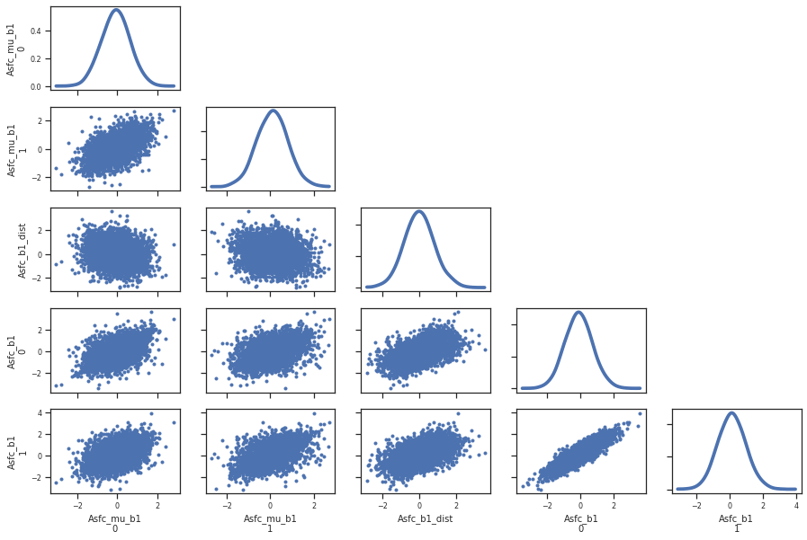
    


    
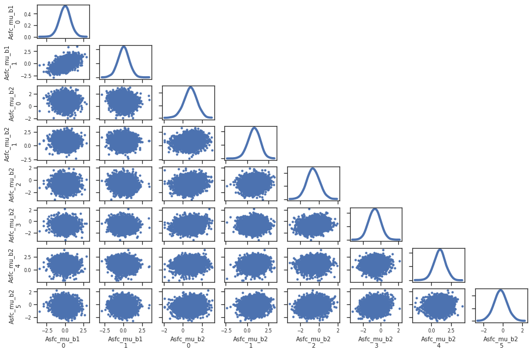
    


    

    


    
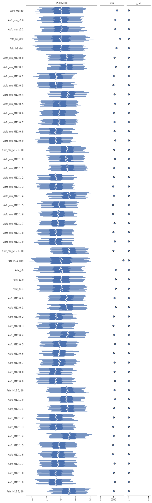
    


```python
with AsfcModel as model:
    plotting_lib.plotTracesB(widthInch,heigthInch,dpi,writeOut,outPathPlots,trace_Asfc,'Asfc')
```


    
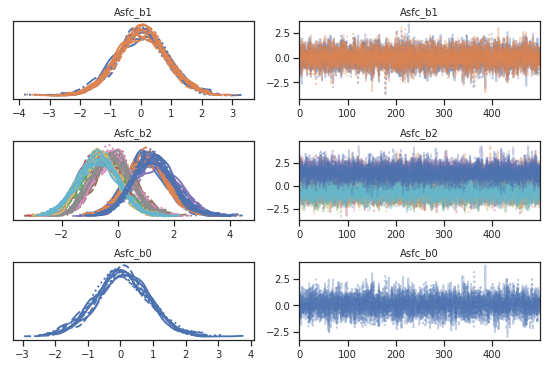
    


```python
with AsfcModel as model:
    plotting_lib.pm.energyplot(trace_Asfc)
```


    
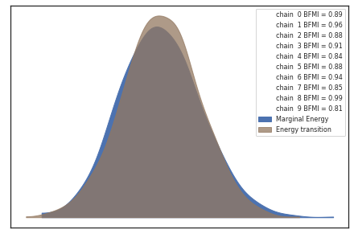
    


#### Posterior predictive distribution


```python
with AsfcModel as model:
    posterior_pred_Asfc = pm.sample_posterior_predictive(trace_Asfc,samples=numPredSamples,random_seed=random_seed)
```

    /home/bob/.local/lib/python3.8/site-packages/pymc3/sampling.py:1707: UserWarning: samples parameter is smaller than nchains times ndraws, some draws and/or chains may not be represented in the returned posterior predictive sample
      warnings.warn(


<div>
    <style>
        /* Turns off some styling */
        progress {
            /* gets rid of default border in Firefox and Opera. */
            border: none;
            /* Needs to be in here for Safari polyfill so background images work as expected. */
            background-size: auto;
        }
        .progress-bar-interrupted, .progress-bar-interrupted::-webkit-progress-bar {
            background: #F44336;
        }
    </style>
  <progress value='2000' class='' max='2000' style='width:300px; height:20px; vertical-align: middle;'></progress>
  100.00% [2000/2000 00:03<00:00]
</div>


```python
plotting_lib.plotPriorPosteriorPredictive(widthInch,heigthInch,dpi,writeOut,outPathPlots,df,dictMeanStd,prior_pred_Asfc,posterior_pred_Asfc,dataZ["Asfc_z"].values,'Asfc')
```


    

    


```python
plotting_lib.plotLevels(widthInch,heigthInch,dpi,sizes,writeOut,outPathPlots,dictMeanStd,dictTreatment,dictSoftware,trace_Asfc,'Asfc',x1,x2)
```


    
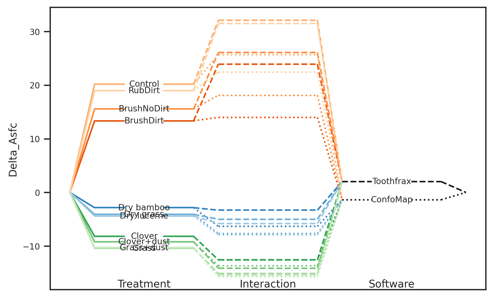
    


```python
plotting_lib.plotLevelsStd(widthInch,heigthInch,dpi,sizes,writeOut,outPathPlots,dictMeanStd,dictTreatment,dictSoftware,trace_Asfc,'Asfc',x1,x2)
```


    
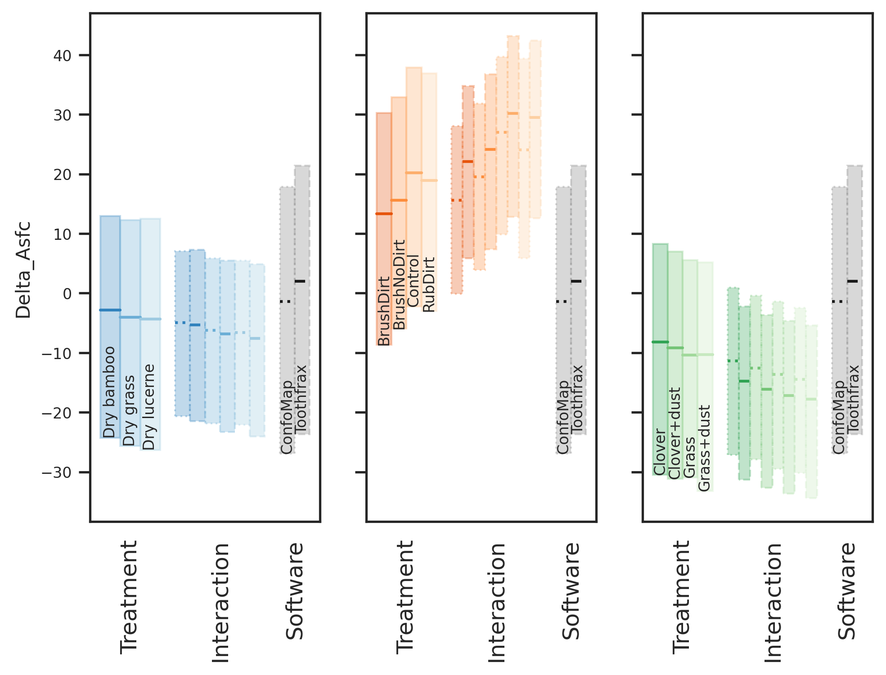
    


#### Compare prior and posterior for model parameters


```python
with AsfcModel as model:
    pm_data_Asfc = az.from_pymc3(trace=trace_Asfc,prior=prior_pred_Asfc,posterior_predictive=posterior_pred_Asfc)
```

    arviz.data.io_pymc3 - WARNING - posterior predictive variable Asfc_y's shape not compatible with number of chains and draws. This can mean that some draws or even whole chains are not represented.


```python
plotting_lib.plotPriorPosteriorB(widthInch,heigthInch,dpi,sizes,writeOut,outPathPlots,dictMeanStd,pm_data_Asfc,'Asfc')
```


    
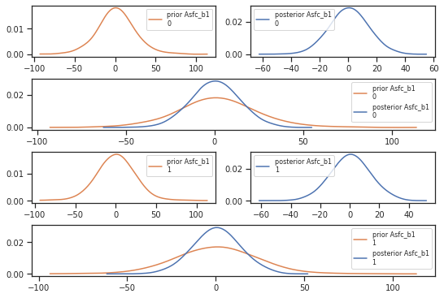
    


#### Posterior and contrasts


```python
plotting_lib.plotPosterior(widthInch,heigthInch,dpi,writeOut,outPathPlots,dictMeanStd,pm_data_Asfc,'Asfc')
```


    
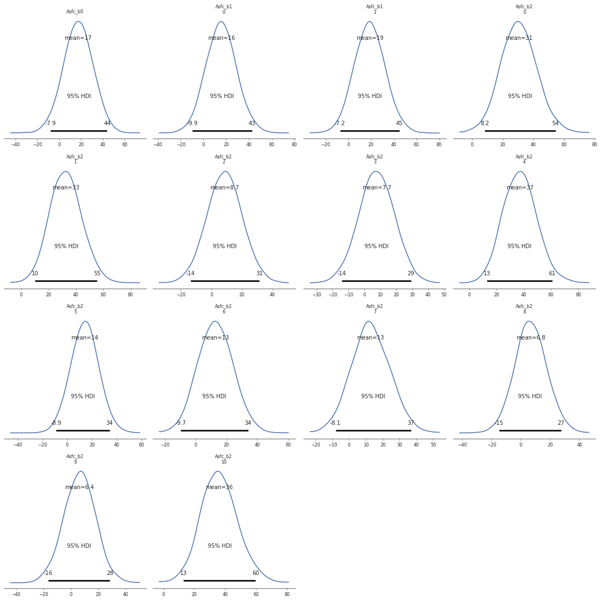
    


```python
df_hdi_Asfc = plotting_lib.plotTreatmentPosterior(widthInch,heigthInch,dpi,sizes,writeOut,outPathPlots,dictMeanStd,dictTreatment,dictSoftware,trace_Asfc,'Asfc',x1,x2)
```


    

    


```python
df_hdi_Asfc
```


<div>
<style scoped>
    .dataframe tbody tr th:only-of-type {
        vertical-align: middle;
    }

    .dataframe tbody tr th {
        vertical-align: top;
    }

    .dataframe thead th {
        text-align: right;
    }
</style>
<table border="1" class="dataframe">
  <thead>
    <tr style="text-align: right;">
      <th></th>
      <th>Treatment_i</th>
      <th>Treatment_j</th>
      <th>hdi_ConfoMap_2.5%</th>
      <th>hdi_ConfoMap_97.5%</th>
      <th>isSignificant_on_ConfoMap</th>
      <th>hdi_Toothfrax_2.5%</th>
      <th>hdi_Toothfrax_97.5%</th>
      <th>isSignificant_on_Toothfrax</th>
    </tr>
  </thead>
  <tbody>
    <tr>
      <th>0</th>
      <td>Dry grass</td>
      <td>Dry bamboo</td>
      <td>-3.939803</td>
      <td>0.935695</td>
      <td>False</td>
      <td>-4.447570</td>
      <td>0.965258</td>
      <td>False</td>
    </tr>
    <tr>
      <th>1</th>
      <td>Dry lucerne</td>
      <td>Dry bamboo</td>
      <td>-4.031412</td>
      <td>0.625569</td>
      <td>False</td>
      <td>-5.003380</td>
      <td>0.239099</td>
      <td>False</td>
    </tr>
    <tr>
      <th>2</th>
      <td>Dry lucerne</td>
      <td>Dry grass</td>
      <td>-2.410119</td>
      <td>1.424301</td>
      <td>False</td>
      <td>-2.515884</td>
      <td>1.276464</td>
      <td>False</td>
    </tr>
    <tr>
      <th>3</th>
      <td>BrushNoDirt</td>
      <td>BrushDirt</td>
      <td>0.013059</td>
      <td>7.915624</td>
      <td>True</td>
      <td>-2.631889</td>
      <td>6.887819</td>
      <td>False</td>
    </tr>
    <tr>
      <th>4</th>
      <td>Control</td>
      <td>BrushDirt</td>
      <td>3.910899</td>
      <td>18.434847</td>
      <td>True</td>
      <td>1.604132</td>
      <td>14.612596</td>
      <td>True</td>
    </tr>
    <tr>
      <th>5</th>
      <td>Control</td>
      <td>BrushNoDirt</td>
      <td>0.022112</td>
      <td>14.415237</td>
      <td>True</td>
      <td>-0.616464</td>
      <td>13.182578</td>
      <td>False</td>
    </tr>
    <tr>
      <th>6</th>
      <td>RubDirt</td>
      <td>BrushDirt</td>
      <td>-0.259987</td>
      <td>20.831039</td>
      <td>False</td>
      <td>1.502426</td>
      <td>13.522475</td>
      <td>True</td>
    </tr>
    <tr>
      <th>7</th>
      <td>RubDirt</td>
      <td>BrushNoDirt</td>
      <td>-4.336062</td>
      <td>16.137641</td>
      <td>False</td>
      <td>-1.231718</td>
      <td>11.842114</td>
      <td>False</td>
    </tr>
    <tr>
      <th>8</th>
      <td>RubDirt</td>
      <td>Control</td>
      <td>-14.247123</td>
      <td>11.427003</td>
      <td>False</td>
      <td>-8.595219</td>
      <td>7.100929</td>
      <td>False</td>
    </tr>
    <tr>
      <th>9</th>
      <td>Clover+dust</td>
      <td>Clover</td>
      <td>-4.902063</td>
      <td>2.035175</td>
      <td>False</td>
      <td>-4.562186</td>
      <td>1.844004</td>
      <td>False</td>
    </tr>
    <tr>
      <th>10</th>
      <td>Grass</td>
      <td>Clover</td>
      <td>-5.948810</td>
      <td>1.110713</td>
      <td>False</td>
      <td>-5.876442</td>
      <td>0.688654</td>
      <td>False</td>
    </tr>
    <tr>
      <th>11</th>
      <td>Grass</td>
      <td>Clover+dust</td>
      <td>-3.539383</td>
      <td>1.255674</td>
      <td>False</td>
      <td>-3.501566</td>
      <td>1.339794</td>
      <td>False</td>
    </tr>
    <tr>
      <th>12</th>
      <td>Grass+dust</td>
      <td>Clover</td>
      <td>-6.781348</td>
      <td>0.056399</td>
      <td>False</td>
      <td>-6.135492</td>
      <td>0.254948</td>
      <td>False</td>
    </tr>
    <tr>
      <th>13</th>
      <td>Grass+dust</td>
      <td>Clover+dust</td>
      <td>-4.430594</td>
      <td>0.335530</td>
      <td>False</td>
      <td>-3.919102</td>
      <td>0.673998</td>
      <td>False</td>
    </tr>
    <tr>
      <th>14</th>
      <td>Grass+dust</td>
      <td>Grass</td>
      <td>-3.353905</td>
      <td>1.617864</td>
      <td>False</td>
      <td>-3.044589</td>
      <td>1.686165</td>
      <td>False</td>
    </tr>
  </tbody>
</table>
</div>


```python
if writeOut:
    df_hdi_Asfc.to_csv(outPathData+ 'hdi_{}.csv'.format('Asfc'))
```

### 	Smfc  <a name="Smfc"></a>


```python
with pm.Model() as model:
    SmfcModel = TwoFactorModel('Smfc',x1,x2,dataZ.Smfc_z.values)
```

#### Verify model settings


```python
SmfcModel.printParams(x1,x2,dataZ.Smfc_z.values)
```

    The number of levels of the x variables are (2, 11)
    The standard deviations used for the beta priors are  (1.190539275484547, 2.890262579386322)
    The standard deviations used for the M12 priors are 0.15629300643560595


```python
pm.model_to_graphviz(SmfcModel)
```


    
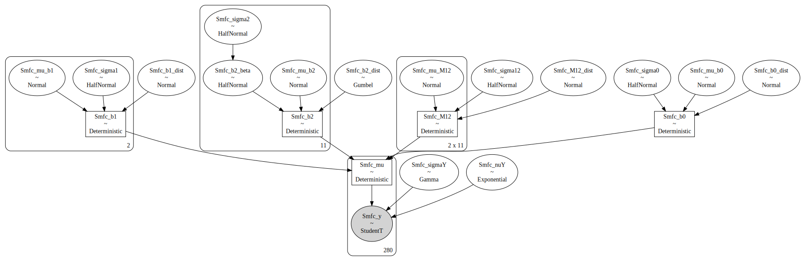
    


#### Check prior choice


```python
with SmfcModel as model:
    prior_pred_Smfc = pm.sample_prior_predictive(samples=numPredSamples,random_seed=random_seed)
```


```python
plotting_lib.plotPriorPredictive(widthInch,heigthInch,dpi,writeOut,outPathPlots,df,dictMeanStd,prior_pred_Smfc,dataZ.Smfc_z.values,'Smfc')
```


    
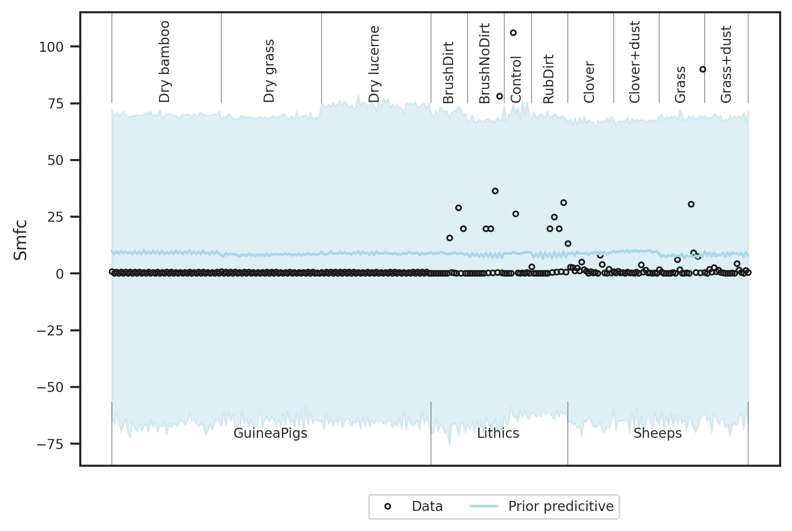
    


Prior choice is as intended: Broad over the data range.

#### Sampling


```python
with SmfcModel as model:
    trace_Smfc = pm.sample(numSamples,cores=numCores,tune=numTune,max_treedepth=20, init='auto',target_accept=0.99,random_seed=random_seed)
```

    Auto-assigning NUTS sampler...
    Initializing NUTS using jitter+adapt_diag...
    Multiprocess sampling (10 chains in 10 jobs)
    NUTS: [Smfc_M12_dist, Smfc_mu_M12, Smfc_b2_dist, Smfc_b2_beta, Smfc_b1_dist, Smfc_b0_dist, Smfc_sigmaY, Smfc_nuY, Smfc_sigma12, Smfc_mu_b2, Smfc_mu_b1, Smfc_mu_b0, Smfc_sigma2, Smfc_sigma1, Smfc_sigma0]


<div>
    <style>
        /* Turns off some styling */
        progress {
            /* gets rid of default border in Firefox and Opera. */
            border: none;
            /* Needs to be in here for Safari polyfill so background images work as expected. */
            background-size: auto;
        }
        .progress-bar-interrupted, .progress-bar-interrupted::-webkit-progress-bar {
            background: #F44336;
        }
    </style>
  <progress value='2257' class='' max='15000' style='width:300px; height:20px; vertical-align: middle;'></progress>
  15.05% [2257/15000 18:47<1:46:07 Sampling 10 chains, 0 divergences]
</div>


    ---------------------------------------------------------------------------

    KeyboardInterrupt                         Traceback (most recent call last)

    ~/.local/lib/python3.8/site-packages/pymc3/sampling.py in _mp_sample(draws, tune, step, chains, cores, chain, random_seed, start, progressbar, trace, model, callback, discard_tuned_samples, mp_ctx, pickle_backend, **kwargs)
       1485             with sampler:
    -> 1486                 for draw in sampler:
       1487                     trace = traces[draw.chain - chain]


    ~/.local/lib/python3.8/site-packages/pymc3/parallel_sampling.py in __iter__(self)
        491         while self._active:
    --> 492             draw = ProcessAdapter.recv_draw(self._active)
        493             proc, is_last, draw, tuning, stats, warns = draw


    ~/.local/lib/python3.8/site-packages/pymc3/parallel_sampling.py in recv_draw(processes, timeout)
        351         pipes = [proc._msg_pipe for proc in processes]
    --> 352         ready = multiprocessing.connection.wait(pipes)
        353         if not ready:


    /usr/lib/python3.8/multiprocessing/connection.py in wait(object_list, timeout)
        930             while True:
    --> 931                 ready = selector.select(timeout)
        932                 if ready:


    /usr/lib/python3.8/selectors.py in select(self, timeout)
        414         try:
    --> 415             fd_event_list = self._selector.poll(timeout)
        416         except InterruptedError:


    KeyboardInterrupt: 

    
    During handling of the above exception, another exception occurred:


    ValueError                                Traceback (most recent call last)

    <ipython-input-90-4de91012caf3> in <module>
          1 with SmfcModel as model:
    ----> 2     trace_Smfc = pm.sample(numSamples,cores=numCores,tune=numTune,max_treedepth=20, init='auto',target_accept=0.99,random_seed=random_seed)
    

    ~/.local/lib/python3.8/site-packages/pymc3/sampling.py in sample(draws, step, init, n_init, start, trace, chain_idx, chains, cores, tune, progressbar, model, random_seed, discard_tuned_samples, compute_convergence_checks, callback, return_inferencedata, idata_kwargs, mp_ctx, pickle_backend, **kwargs)
        543         _print_step_hierarchy(step)
        544         try:
    --> 545             trace = _mp_sample(**sample_args, **parallel_args)
        546         except pickle.PickleError:
        547             _log.warning("Could not pickle model, sampling singlethreaded.")


    ~/.local/lib/python3.8/site-packages/pymc3/sampling.py in _mp_sample(draws, tune, step, chains, cores, chain, random_seed, start, progressbar, trace, model, callback, discard_tuned_samples, mp_ctx, pickle_backend, **kwargs)
       1510     except KeyboardInterrupt:
       1511         if discard_tuned_samples:
    -> 1512             traces, length = _choose_chains(traces, tune)
       1513         else:
       1514             traces, length = _choose_chains(traces, 0)


    ~/.local/lib/python3.8/site-packages/pymc3/sampling.py in _choose_chains(traces, tune)
       1528     lengths = [max(0, len(trace) - tune) for trace in traces]
       1529     if not sum(lengths):
    -> 1530         raise ValueError("Not enough samples to build a trace.")
       1531 
       1532     idxs = np.argsort(lengths)[::-1]


    ValueError: Not enough samples to build a trace.


Analysis stopped here because sampling did not converge.
As the plot shows, some data points are very far away from the others, which would require the analysis to be based on more heavy-tailed distributions.

### HAsfc9 <a name="HAsfc9"></a>


```python
with pm.Model() as model:
    HAsfc9Model = TwoFactorModel('HAsfc9',x1,x2,dataZ["HAsfc9_z"].values)
```

#### Verify model settings


```python
HAsfc9Model.printParams(x1,x2,dataZ["HAsfc9_z"].values)
```

    The number of levels of the x variables are (2, 11)
    The standard deviations used for the beta priors are  (1.0540496136136044, 2.005676747692769)
    The standard deviations used for the M12 priors are 0.11328900878057889


```python
pm.model_to_graphviz(HAsfc9Model)
```


    
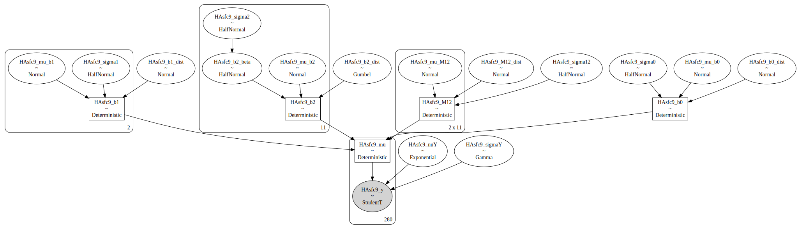
    


#### Check prior choice


```python
with HAsfc9Model as model:
    prior_pred_HAsfc9 = pm.sample_prior_predictive(samples=numPredSamples,random_seed=random_seed)
```


```python
plotting_lib.plotPriorPredictive(widthInch,heigthInch,dpi,writeOut,outPathPlots,df,dictMeanStd,prior_pred_HAsfc9,dataZ["HAsfc9_z"].values,'HAsfc9')
```


    
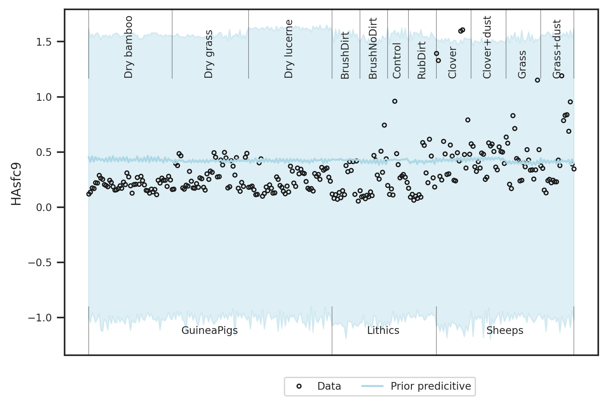
    


Prior choice is as intended: Broad over the data range.

#### Sampling


```python
with HAsfc9Model as model:
    trace_HAsfc9 = pm.sample(numSamples,cores=numCores,tune=numTune,max_treedepth=20, init='auto',target_accept=0.99,random_seed=random_seed)
```

    Auto-assigning NUTS sampler...
    Initializing NUTS using jitter+adapt_diag...
    Multiprocess sampling (10 chains in 10 jobs)
    NUTS: [HAsfc9_M12_dist, HAsfc9_mu_M12, HAsfc9_b2_dist, HAsfc9_b2_beta, HAsfc9_b1_dist, HAsfc9_b0_dist, HAsfc9_sigmaY, HAsfc9_nuY, HAsfc9_sigma12, HAsfc9_mu_b2, HAsfc9_mu_b1, HAsfc9_mu_b0, HAsfc9_sigma2, HAsfc9_sigma1, HAsfc9_sigma0]


<div>
    <style>
        /* Turns off some styling */
        progress {
            /* gets rid of default border in Firefox and Opera. */
            border: none;
            /* Needs to be in here for Safari polyfill so background images work as expected. */
            background-size: auto;
        }
        .progress-bar-interrupted, .progress-bar-interrupted::-webkit-progress-bar {
            background: #F44336;
        }
    </style>
  <progress value='15000' class='' max='15000' style='width:300px; height:20px; vertical-align: middle;'></progress>
  100.00% [15000/15000 06:51<00:00 Sampling 10 chains, 0 divergences]
</div>


    Sampling 10 chains for 1_000 tune and 500 draw iterations (10_000 + 5_000 draws total) took 412 seconds.


```python
with HAsfc9Model as model:
    if writeOut:
        with open(outPathData + 'model_{}.pkl'.format('HAsfc9'), 'wb') as buff:
            pickle.dump({'model': HAsfc9Model, 'trace': trace_HAsfc9}, buff)
```

#### Check sampling


```python
with HAsfc9Model as model:
    dataTrace_HAsfc9 = az.from_pymc3(trace=trace_HAsfc9)
```


```python
pm.summary(dataTrace_HAsfc9,hdi_prob=0.95).round(2)
```


<div>
<style scoped>
    .dataframe tbody tr th:only-of-type {
        vertical-align: middle;
    }

    .dataframe tbody tr th {
        vertical-align: top;
    }

    .dataframe thead th {
        text-align: right;
    }
</style>
<table border="1" class="dataframe">
  <thead>
    <tr style="text-align: right;">
      <th></th>
      <th>mean</th>
      <th>sd</th>
      <th>hdi_2.5%</th>
      <th>hdi_97.5%</th>
      <th>mcse_mean</th>
      <th>mcse_sd</th>
      <th>ess_mean</th>
      <th>ess_sd</th>
      <th>ess_bulk</th>
      <th>ess_tail</th>
      <th>r_hat</th>
    </tr>
  </thead>
  <tbody>
    <tr>
      <th>HAsfc9_mu_b0</th>
      <td>-0.07</td>
      <td>0.80</td>
      <td>-1.65</td>
      <td>1.43</td>
      <td>0.01</td>
      <td>0.01</td>
      <td>5695.0</td>
      <td>2359.0</td>
      <td>5673.0</td>
      <td>4066.0</td>
      <td>1.0</td>
    </tr>
    <tr>
      <th>HAsfc9_mu_b1[0]</th>
      <td>0.04</td>
      <td>0.72</td>
      <td>-1.34</td>
      <td>1.51</td>
      <td>0.01</td>
      <td>0.01</td>
      <td>5050.0</td>
      <td>2946.0</td>
      <td>5057.0</td>
      <td>3783.0</td>
      <td>1.0</td>
    </tr>
    <tr>
      <th>HAsfc9_mu_b1[1]</th>
      <td>-0.10</td>
      <td>0.72</td>
      <td>-1.49</td>
      <td>1.35</td>
      <td>0.01</td>
      <td>0.01</td>
      <td>4834.0</td>
      <td>2979.0</td>
      <td>4834.0</td>
      <td>3973.0</td>
      <td>1.0</td>
    </tr>
    <tr>
      <th>HAsfc9_mu_b2[0]</th>
      <td>-0.26</td>
      <td>0.66</td>
      <td>-1.56</td>
      <td>1.03</td>
      <td>0.01</td>
      <td>0.01</td>
      <td>4119.0</td>
      <td>2839.0</td>
      <td>4127.0</td>
      <td>3512.0</td>
      <td>1.0</td>
    </tr>
    <tr>
      <th>HAsfc9_mu_b2[1]</th>
      <td>-0.20</td>
      <td>0.67</td>
      <td>-1.57</td>
      <td>1.08</td>
      <td>0.01</td>
      <td>0.01</td>
      <td>3738.0</td>
      <td>3165.0</td>
      <td>3749.0</td>
      <td>3996.0</td>
      <td>1.0</td>
    </tr>
    <tr>
      <th>...</th>
      <td>...</td>
      <td>...</td>
      <td>...</td>
      <td>...</td>
      <td>...</td>
      <td>...</td>
      <td>...</td>
      <td>...</td>
      <td>...</td>
      <td>...</td>
      <td>...</td>
    </tr>
    <tr>
      <th>HAsfc9_mu[275]</th>
      <td>-0.03</td>
      <td>0.19</td>
      <td>-0.41</td>
      <td>0.34</td>
      <td>0.00</td>
      <td>0.00</td>
      <td>4547.0</td>
      <td>4013.0</td>
      <td>4560.0</td>
      <td>4624.0</td>
      <td>1.0</td>
    </tr>
    <tr>
      <th>HAsfc9_mu[276]</th>
      <td>0.06</td>
      <td>0.24</td>
      <td>-0.39</td>
      <td>0.52</td>
      <td>0.00</td>
      <td>0.00</td>
      <td>4766.0</td>
      <td>2887.0</td>
      <td>4774.0</td>
      <td>4037.0</td>
      <td>1.0</td>
    </tr>
    <tr>
      <th>HAsfc9_mu[277]</th>
      <td>-0.03</td>
      <td>0.19</td>
      <td>-0.41</td>
      <td>0.34</td>
      <td>0.00</td>
      <td>0.00</td>
      <td>4547.0</td>
      <td>4013.0</td>
      <td>4560.0</td>
      <td>4624.0</td>
      <td>1.0</td>
    </tr>
    <tr>
      <th>HAsfc9_mu[278]</th>
      <td>0.06</td>
      <td>0.24</td>
      <td>-0.39</td>
      <td>0.52</td>
      <td>0.00</td>
      <td>0.00</td>
      <td>4766.0</td>
      <td>2887.0</td>
      <td>4774.0</td>
      <td>4037.0</td>
      <td>1.0</td>
    </tr>
    <tr>
      <th>HAsfc9_mu[279]</th>
      <td>-0.03</td>
      <td>0.19</td>
      <td>-0.41</td>
      <td>0.34</td>
      <td>0.00</td>
      <td>0.00</td>
      <td>4547.0</td>
      <td>4013.0</td>
      <td>4560.0</td>
      <td>4624.0</td>
      <td>1.0</td>
    </tr>
  </tbody>
</table>
<p>384 rows × 11 columns</p>
</div>


```python
plotting_lib.plotDiagnostics(widthInch,heigthInch,dpi,writeOut,outPathPlots,trace_HAsfc9,dataTrace_HAsfc9,'HAsfc9')
```

    /home/bob/.local/lib/python3.8/site-packages/arviz/plots/backends/matplotlib/pairplot.py:212: UserWarning: rcParams['plot.max_subplots'] (40) is smaller than the number of resulting pair plots with these variables, generating only a 8x8 grid
      warnings.warn(


    
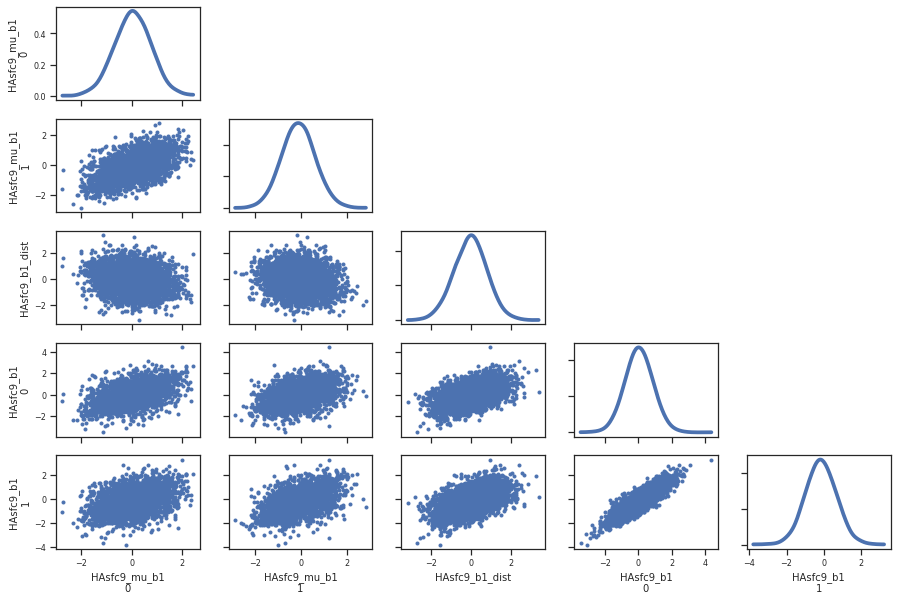
    


    
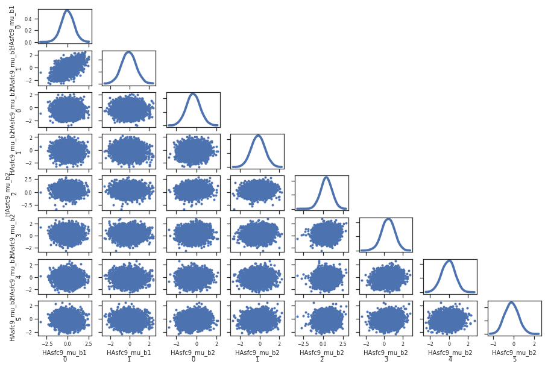
    


    
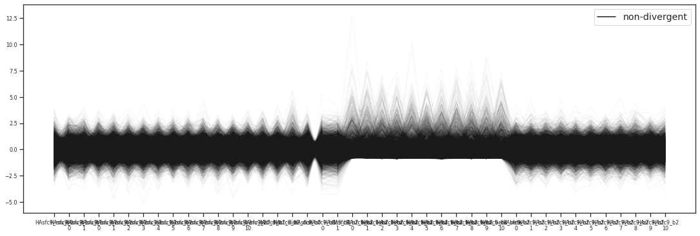
    


    
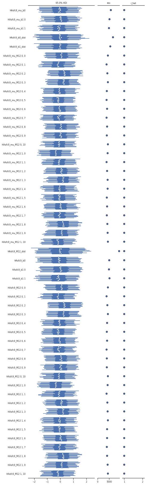
    


```python
with HAsfc9Model as model:
    plotting_lib.plotTracesB(widthInch,heigthInch,dpi,writeOut,outPathPlots,trace_HAsfc9,'HAsfc9')
```


    
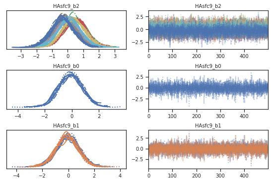
    


```python
with HAsfc9Model as model:
    plotting_lib.pm.energyplot(trace_HAsfc9)
```


    
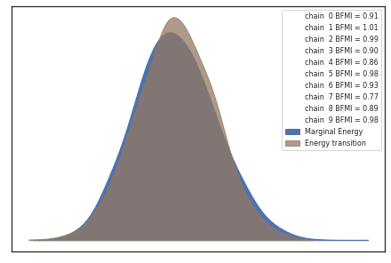
    


#### Posterior predictive distribution


```python
with HAsfc9Model as model:
    posterior_pred_HAsfc9 = pm.sample_posterior_predictive(trace_HAsfc9,samples=numPredSamples,random_seed=random_seed)
```

    /home/bob/.local/lib/python3.8/site-packages/pymc3/sampling.py:1707: UserWarning: samples parameter is smaller than nchains times ndraws, some draws and/or chains may not be represented in the returned posterior predictive sample
      warnings.warn(


<div>
    <style>
        /* Turns off some styling */
        progress {
            /* gets rid of default border in Firefox and Opera. */
            border: none;
            /* Needs to be in here for Safari polyfill so background images work as expected. */
            background-size: auto;
        }
        .progress-bar-interrupted, .progress-bar-interrupted::-webkit-progress-bar {
            background: #F44336;
        }
    </style>
  <progress value='2000' class='' max='2000' style='width:300px; height:20px; vertical-align: middle;'></progress>
  100.00% [2000/2000 00:02<00:00]
</div>


```python
plotting_lib.plotPriorPosteriorPredictive(widthInch,heigthInch,dpi,writeOut,outPathPlots,df,dictMeanStd,prior_pred_HAsfc9,posterior_pred_HAsfc9,dataZ["HAsfc9_z"].values,'HAsfc9')
```


    
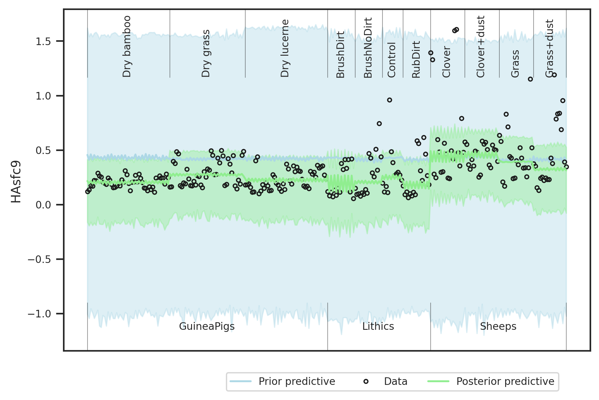
    


```python
plotting_lib.plotLevels(widthInch,heigthInch,dpi,sizes,writeOut,outPathPlots,dictMeanStd,dictTreatment,dictSoftware,trace_HAsfc9,'HAsfc9',x1,x2)
```


    
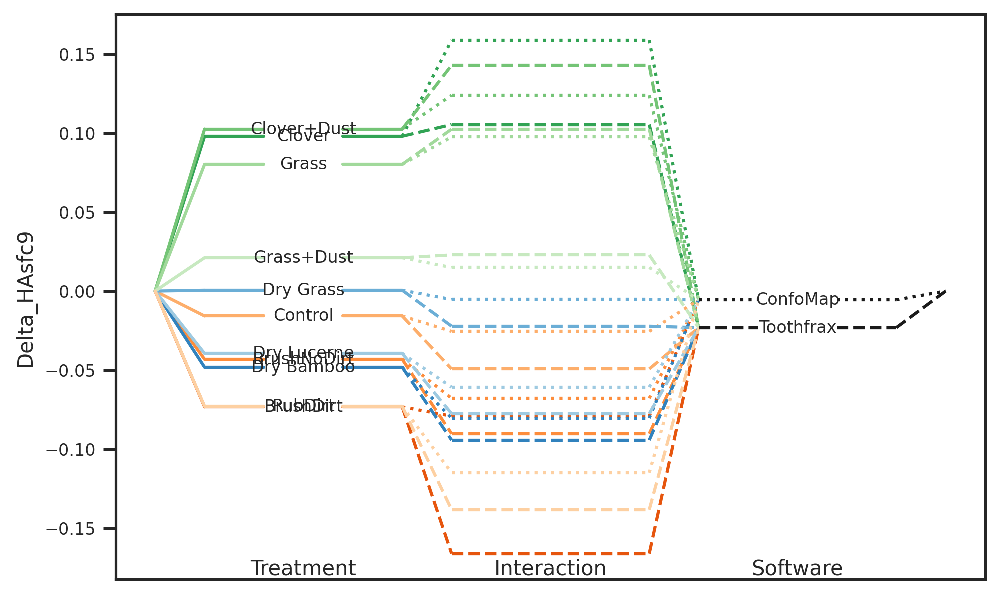
    


```python
plotting_lib.plotLevelsStd(widthInch,heigthInch,dpi,sizes,writeOut,outPathPlots,dictMeanStd,dictTreatment,dictSoftware,trace_HAsfc9,'HAsfc9',x1,x2)
```


    
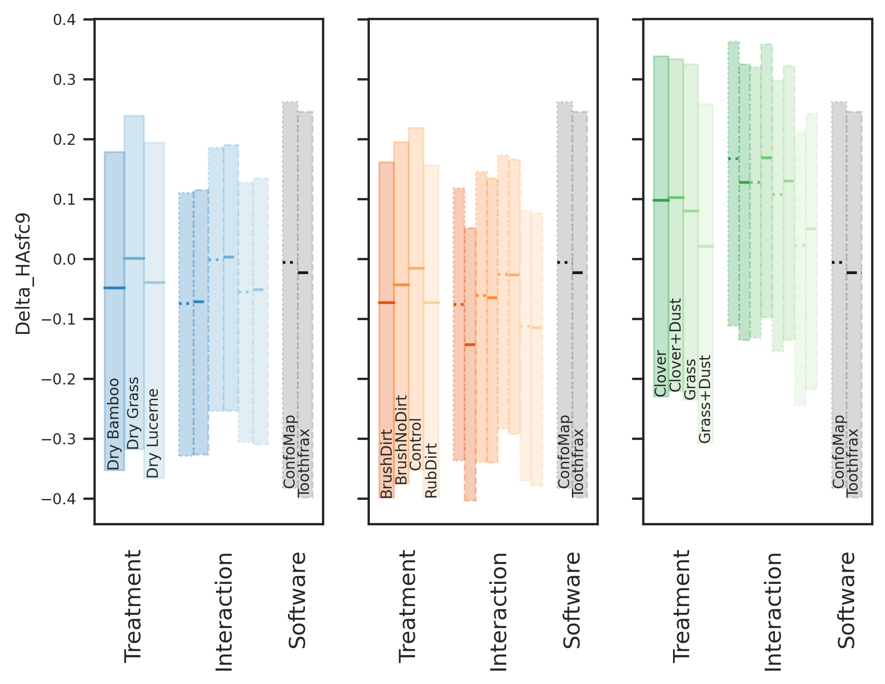
    


#### Compare prior and posterior for model parameters


```python
with HAsfc9Model as model:
    pm_data_HAsfc9 = az.from_pymc3(trace=trace_HAsfc9,prior=prior_pred_HAsfc9,posterior_predictive=posterior_pred_HAsfc9)
```

    arviz.data.io_pymc3 - WARNING - posterior predictive variable HAsfc9_y's shape not compatible with number of chains and draws. This can mean that some draws or even whole chains are not represented.


```python
plotting_lib.plotPriorPosteriorB(widthInch,heigthInch,dpi,sizes,writeOut,outPathPlots,dictMeanStd,pm_data_HAsfc9,'HAsfc9')
```


    
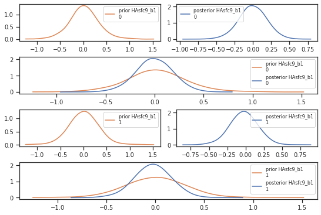
    


#### Posterior and contrasts


```python
plotting_lib.plotPosterior(widthInch,heigthInch,dpi,writeOut,outPathPlots,dictMeanStd,pm_data_HAsfc9,'HAsfc9')
```


    
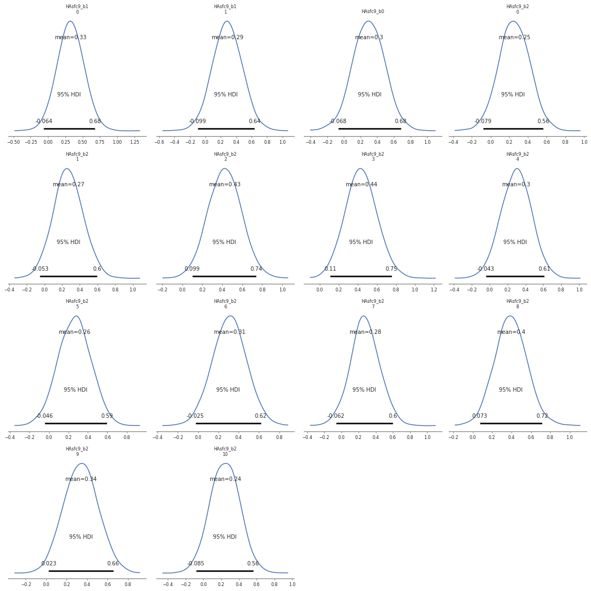
    


```python
df_hdi_HAsfc9 = plotting_lib.plotTreatmentPosterior(widthInch,heigthInch,dpi,sizes,writeOut,outPathPlots,dictMeanStd,dictTreatment,dictSoftware,trace_HAsfc9,'HAsfc9',x1,x2)
```


    

    


```python
df_hdi_HAsfc9
```


<div>
<style scoped>
    .dataframe tbody tr th:only-of-type {
        vertical-align: middle;
    }

    .dataframe tbody tr th {
        vertical-align: top;
    }

    .dataframe thead th {
        text-align: right;
    }
</style>
<table border="1" class="dataframe">
  <thead>
    <tr style="text-align: right;">
      <th></th>
      <th>Treatment_i</th>
      <th>Treatment_j</th>
      <th>hdi_ConfoMap_2.5%</th>
      <th>hdi_ConfoMap_97.5%</th>
      <th>isSignificant_on_ConfoMap</th>
      <th>hdi_Toothfrax_2.5%</th>
      <th>hdi_Toothfrax_97.5%</th>
      <th>isSignificant_on_Toothfrax</th>
    </tr>
  </thead>
  <tbody>
    <tr>
      <th>0</th>
      <td>Dry grass</td>
      <td>Dry bamboo</td>
      <td>0.000670</td>
      <td>0.138311</td>
      <td>True</td>
      <td>0.002941</td>
      <td>0.143668</td>
      <td>True</td>
    </tr>
    <tr>
      <th>1</th>
      <td>Dry lucerne</td>
      <td>Dry bamboo</td>
      <td>-0.035688</td>
      <td>0.084977</td>
      <td>False</td>
      <td>-0.042002</td>
      <td>0.076006</td>
      <td>False</td>
    </tr>
    <tr>
      <th>2</th>
      <td>Dry lucerne</td>
      <td>Dry grass</td>
      <td>-0.117764</td>
      <td>0.031872</td>
      <td>False</td>
      <td>-0.125602</td>
      <td>0.021941</td>
      <td>False</td>
    </tr>
    <tr>
      <th>3</th>
      <td>BrushNoDirt</td>
      <td>BrushDirt</td>
      <td>-0.231361</td>
      <td>0.146793</td>
      <td>False</td>
      <td>-0.063532</td>
      <td>0.221075</td>
      <td>False</td>
    </tr>
    <tr>
      <th>4</th>
      <td>Control</td>
      <td>BrushDirt</td>
      <td>-0.159309</td>
      <td>0.177833</td>
      <td>False</td>
      <td>-0.020488</td>
      <td>0.239702</td>
      <td>False</td>
    </tr>
    <tr>
      <th>5</th>
      <td>Control</td>
      <td>BrushNoDirt</td>
      <td>-0.118868</td>
      <td>0.215704</td>
      <td>False</td>
      <td>-0.121261</td>
      <td>0.192874</td>
      <td>False</td>
    </tr>
    <tr>
      <th>6</th>
      <td>RubDirt</td>
      <td>BrushDirt</td>
      <td>-0.223620</td>
      <td>0.119671</td>
      <td>False</td>
      <td>-0.093554</td>
      <td>0.146212</td>
      <td>False</td>
    </tr>
    <tr>
      <th>7</th>
      <td>RubDirt</td>
      <td>BrushNoDirt</td>
      <td>-0.184998</td>
      <td>0.151141</td>
      <td>False</td>
      <td>-0.204337</td>
      <td>0.093804</td>
      <td>False</td>
    </tr>
    <tr>
      <th>8</th>
      <td>RubDirt</td>
      <td>Control</td>
      <td>-0.211662</td>
      <td>0.080935</td>
      <td>False</td>
      <td>-0.212686</td>
      <td>0.056618</td>
      <td>False</td>
    </tr>
    <tr>
      <th>9</th>
      <td>Clover+dust</td>
      <td>Clover</td>
      <td>-0.147903</td>
      <td>0.136656</td>
      <td>False</td>
      <td>-0.081257</td>
      <td>0.155239</td>
      <td>False</td>
    </tr>
    <tr>
      <th>10</th>
      <td>Grass</td>
      <td>Clover</td>
      <td>-0.251859</td>
      <td>0.071005</td>
      <td>False</td>
      <td>-0.126162</td>
      <td>0.116917</td>
      <td>False</td>
    </tr>
    <tr>
      <th>11</th>
      <td>Grass</td>
      <td>Clover+dust</td>
      <td>-0.231351</td>
      <td>0.051562</td>
      <td>False</td>
      <td>-0.160442</td>
      <td>0.079536</td>
      <td>False</td>
    </tr>
    <tr>
      <th>12</th>
      <td>Grass+dust</td>
      <td>Clover</td>
      <td>-0.310090</td>
      <td>0.004148</td>
      <td>False</td>
      <td>-0.202760</td>
      <td>0.043221</td>
      <td>False</td>
    </tr>
    <tr>
      <th>13</th>
      <td>Grass+dust</td>
      <td>Clover+dust</td>
      <td>-0.272959</td>
      <td>-0.010159</td>
      <td>True</td>
      <td>-0.240244</td>
      <td>-0.005423</td>
      <td>True</td>
    </tr>
    <tr>
      <th>14</th>
      <td>Grass+dust</td>
      <td>Grass</td>
      <td>-0.211711</td>
      <td>0.091591</td>
      <td>False</td>
      <td>-0.206979</td>
      <td>0.039560</td>
      <td>False</td>
    </tr>
  </tbody>
</table>
</div>


```python
if writeOut:
    df_hdi_HAsfc9.to_csv(outPathData+ 'hdi_{}.csv'.format('HAsfc9'))
```

### HAsfc81 <a name="HAsfc81"></a>


```python
with pm.Model() as model:
    HAsfc81Model = TwoFactorModel('HAsfc81',x1,x2,dataZ["HAsfc81_z"].values)
```

#### Verify model settings


```python
HAsfc81Model.printParams(x1,x2,dataZ["HAsfc81_z"].values)
```

    The number of levels of the x variables are (2, 11)
    The standard deviations used for the beta priors are  (1.0444803217312628, 1.586983908089902)
    The standard deviations used for the M12 priors are 0.09499285587637817


```python
pm.model_to_graphviz(HAsfc81Model)
```


    

    


#### Check prior choice


```python
with HAsfc81Model as model:
    prior_pred_HAsfc81 = pm.sample_prior_predictive(samples=numPredSamples,random_seed=random_seed)
```


```python
plotting_lib.plotPriorPredictive(widthInch,heigthInch,dpi,writeOut,outPathPlots,df,dictMeanStd,prior_pred_HAsfc81,dataZ["HAsfc81_z"].values,'HAsfc81')
```


    
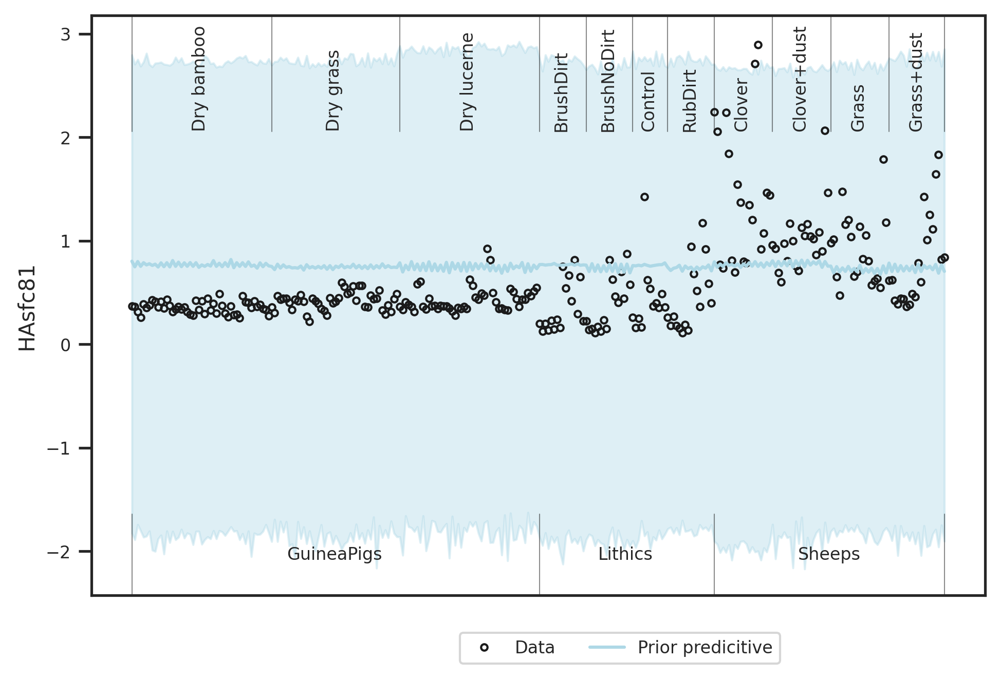
    


Prior choice is as intended: Broad over the data range.

#### Sampling


```python
with HAsfc81Model as model:
    trace_HAsfc81 = pm.sample(numSamples,cores=numCores,tune=numTune,max_treedepth=20, init='auto',target_accept=0.99,random_seed=random_seed)
```

    Auto-assigning NUTS sampler...
    Initializing NUTS using jitter+adapt_diag...
    Multiprocess sampling (10 chains in 10 jobs)
    NUTS: [HAsfc81_M12_dist, HAsfc81_mu_M12, HAsfc81_b2_dist, HAsfc81_b2_beta, HAsfc81_b1_dist, HAsfc81_b0_dist, HAsfc81_sigmaY, HAsfc81_nuY, HAsfc81_sigma12, HAsfc81_mu_b2, HAsfc81_mu_b1, HAsfc81_mu_b0, HAsfc81_sigma2, HAsfc81_sigma1, HAsfc81_sigma0]


<div>
    <style>
        /* Turns off some styling */
        progress {
            /* gets rid of default border in Firefox and Opera. */
            border: none;
            /* Needs to be in here for Safari polyfill so background images work as expected. */
            background-size: auto;
        }
        .progress-bar-interrupted, .progress-bar-interrupted::-webkit-progress-bar {
            background: #F44336;
        }
    </style>
  <progress value='15000' class='' max='15000' style='width:300px; height:20px; vertical-align: middle;'></progress>
  100.00% [15000/15000 11:57<00:00 Sampling 10 chains, 0 divergences]
</div>


    Sampling 10 chains for 1_000 tune and 500 draw iterations (10_000 + 5_000 draws total) took 718 seconds.


```python
with HAsfc81Model as model:
    if writeOut:
        with open(outPathData + 'model_{}.pkl'.format('HAsfc81'), 'wb') as buff:
            pickle.dump({'model': HAsfc81Model, 'trace': trace_HAsfc81}, buff)
```

#### Check sampling


```python
with HAsfc81Model as model:
    dataTrace_HAsfc81 = az.from_pymc3(trace=trace_HAsfc81)
```


```python
pm.summary(dataTrace_HAsfc81,hdi_prob=0.95).round(2)
```


<div>
<style scoped>
    .dataframe tbody tr th:only-of-type {
        vertical-align: middle;
    }

    .dataframe tbody tr th {
        vertical-align: top;
    }

    .dataframe thead th {
        text-align: right;
    }
</style>
<table border="1" class="dataframe">
  <thead>
    <tr style="text-align: right;">
      <th></th>
      <th>mean</th>
      <th>sd</th>
      <th>hdi_2.5%</th>
      <th>hdi_97.5%</th>
      <th>mcse_mean</th>
      <th>mcse_sd</th>
      <th>ess_mean</th>
      <th>ess_sd</th>
      <th>ess_bulk</th>
      <th>ess_tail</th>
      <th>r_hat</th>
    </tr>
  </thead>
  <tbody>
    <tr>
      <th>HAsfc81_mu_b0</th>
      <td>-0.06</td>
      <td>0.81</td>
      <td>-1.66</td>
      <td>1.48</td>
      <td>0.01</td>
      <td>0.01</td>
      <td>5438.0</td>
      <td>3055.0</td>
      <td>5456.0</td>
      <td>4451.0</td>
      <td>1.0</td>
    </tr>
    <tr>
      <th>HAsfc81_mu_b1[0]</th>
      <td>0.01</td>
      <td>0.72</td>
      <td>-1.40</td>
      <td>1.39</td>
      <td>0.01</td>
      <td>0.01</td>
      <td>4786.0</td>
      <td>2800.0</td>
      <td>4784.0</td>
      <td>3776.0</td>
      <td>1.0</td>
    </tr>
    <tr>
      <th>HAsfc81_mu_b1[1]</th>
      <td>-0.08</td>
      <td>0.74</td>
      <td>-1.54</td>
      <td>1.35</td>
      <td>0.01</td>
      <td>0.01</td>
      <td>4760.0</td>
      <td>2996.0</td>
      <td>4760.0</td>
      <td>3738.0</td>
      <td>1.0</td>
    </tr>
    <tr>
      <th>HAsfc81_mu_b2[0]</th>
      <td>-0.36</td>
      <td>0.67</td>
      <td>-1.69</td>
      <td>0.90</td>
      <td>0.01</td>
      <td>0.01</td>
      <td>3853.0</td>
      <td>3574.0</td>
      <td>3866.0</td>
      <td>3483.0</td>
      <td>1.0</td>
    </tr>
    <tr>
      <th>HAsfc81_mu_b2[1]</th>
      <td>-0.40</td>
      <td>0.67</td>
      <td>-1.68</td>
      <td>0.92</td>
      <td>0.01</td>
      <td>0.01</td>
      <td>4465.0</td>
      <td>3899.0</td>
      <td>4474.0</td>
      <td>3963.0</td>
      <td>1.0</td>
    </tr>
    <tr>
      <th>...</th>
      <td>...</td>
      <td>...</td>
      <td>...</td>
      <td>...</td>
      <td>...</td>
      <td>...</td>
      <td>...</td>
      <td>...</td>
      <td>...</td>
      <td>...</td>
      <td>...</td>
    </tr>
    <tr>
      <th>HAsfc81_mu[275]</th>
      <td>-0.16</td>
      <td>0.17</td>
      <td>-0.45</td>
      <td>0.16</td>
      <td>0.00</td>
      <td>0.00</td>
      <td>5195.0</td>
      <td>5195.0</td>
      <td>5325.0</td>
      <td>4756.0</td>
      <td>1.0</td>
    </tr>
    <tr>
      <th>HAsfc81_mu[276]</th>
      <td>-0.10</td>
      <td>0.21</td>
      <td>-0.44</td>
      <td>0.34</td>
      <td>0.00</td>
      <td>0.00</td>
      <td>4753.0</td>
      <td>4660.0</td>
      <td>5116.0</td>
      <td>4932.0</td>
      <td>1.0</td>
    </tr>
    <tr>
      <th>HAsfc81_mu[277]</th>
      <td>-0.16</td>
      <td>0.17</td>
      <td>-0.45</td>
      <td>0.16</td>
      <td>0.00</td>
      <td>0.00</td>
      <td>5195.0</td>
      <td>5195.0</td>
      <td>5325.0</td>
      <td>4756.0</td>
      <td>1.0</td>
    </tr>
    <tr>
      <th>HAsfc81_mu[278]</th>
      <td>-0.10</td>
      <td>0.21</td>
      <td>-0.44</td>
      <td>0.34</td>
      <td>0.00</td>
      <td>0.00</td>
      <td>4753.0</td>
      <td>4660.0</td>
      <td>5116.0</td>
      <td>4932.0</td>
      <td>1.0</td>
    </tr>
    <tr>
      <th>HAsfc81_mu[279]</th>
      <td>-0.16</td>
      <td>0.17</td>
      <td>-0.45</td>
      <td>0.16</td>
      <td>0.00</td>
      <td>0.00</td>
      <td>5195.0</td>
      <td>5195.0</td>
      <td>5325.0</td>
      <td>4756.0</td>
      <td>1.0</td>
    </tr>
  </tbody>
</table>
<p>384 rows × 11 columns</p>
</div>


```python
plotting_lib.plotDiagnostics(widthInch,heigthInch,dpi,writeOut,outPathPlots,trace_HAsfc81,dataTrace_HAsfc81,'HAsfc81')
```

    /home/bob/.local/lib/python3.8/site-packages/arviz/plots/backends/matplotlib/pairplot.py:212: UserWarning: rcParams['plot.max_subplots'] (40) is smaller than the number of resulting pair plots with these variables, generating only a 8x8 grid
      warnings.warn(


    
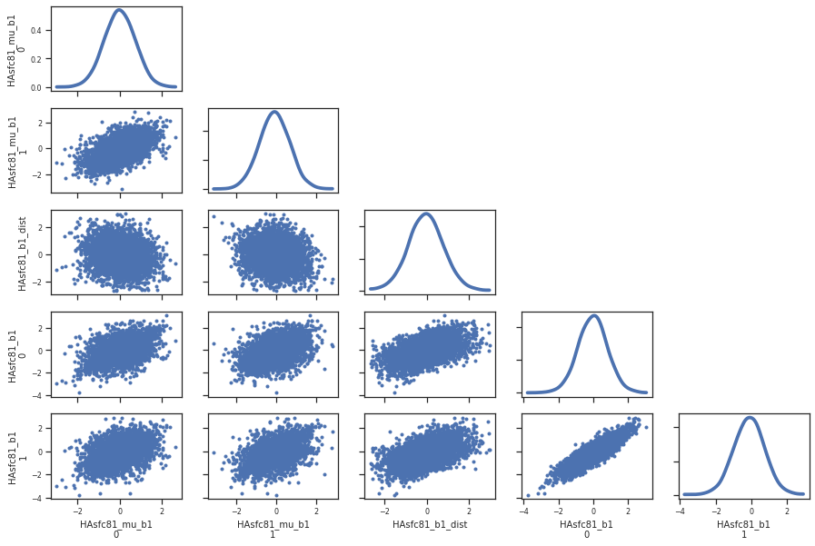
    


    

    


    
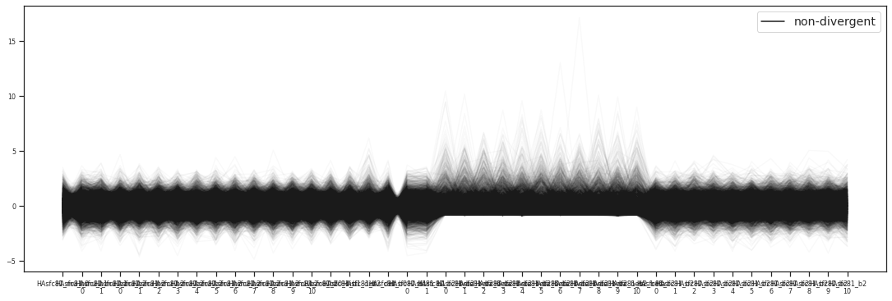
    


    
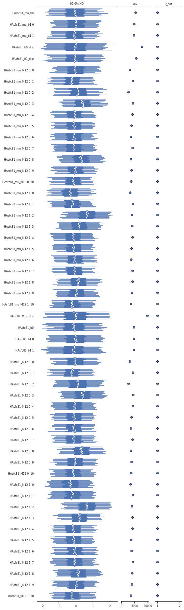
    


```python
with HAsfc81Model as model:
    plotting_lib.plotTracesB(widthInch,heigthInch,dpi,writeOut,outPathPlots,trace_HAsfc81,'HAsfc81')
```


    
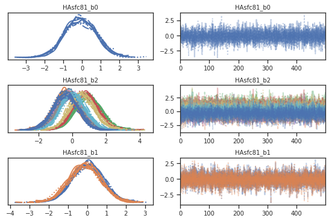
    


```python
with HAsfc81Model as model:
    plotting_lib.pm.energyplot(trace_HAsfc81)
```


    
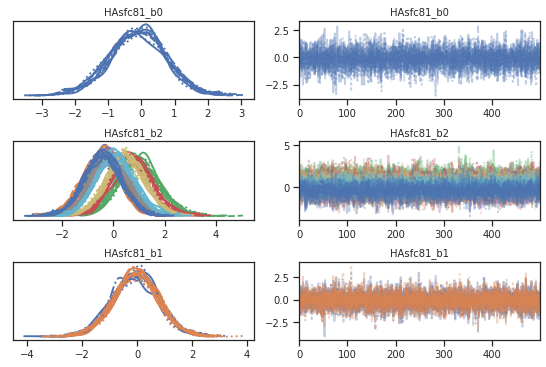
    


#### Posterior predictive distribution


```python
with HAsfc81Model as model:
    posterior_pred_HAsfc81 = pm.sample_posterior_predictive(trace_HAsfc81,samples=numPredSamples,random_seed=random_seed)
```

    /home/bob/.local/lib/python3.8/site-packages/pymc3/sampling.py:1707: UserWarning: samples parameter is smaller than nchains times ndraws, some draws and/or chains may not be represented in the returned posterior predictive sample
      warnings.warn(


<div>
    <style>
        /* Turns off some styling */
        progress {
            /* gets rid of default border in Firefox and Opera. */
            border: none;
            /* Needs to be in here for Safari polyfill so background images work as expected. */
            background-size: auto;
        }
        .progress-bar-interrupted, .progress-bar-interrupted::-webkit-progress-bar {
            background: #F44336;
        }
    </style>
  <progress value='2000' class='' max='2000' style='width:300px; height:20px; vertical-align: middle;'></progress>
  100.00% [2000/2000 00:03<00:00]
</div>


```python
plotting_lib.plotPriorPosteriorPredictive(widthInch,heigthInch,dpi,writeOut,outPathPlots,df,dictMeanStd,prior_pred_HAsfc81,posterior_pred_HAsfc81,dataZ["HAsfc81_z"].values,'HAsfc81')
```


    
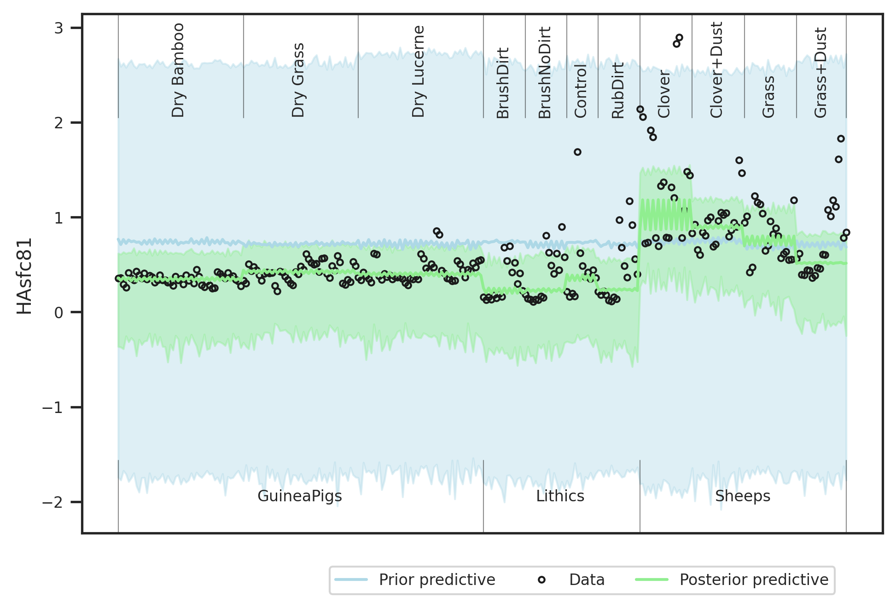
    


```python
plotting_lib.plotLevels(widthInch,heigthInch,dpi,sizes,writeOut,outPathPlots,dictMeanStd,dictTreatment,dictSoftware,trace_HAsfc81,'HAsfc81',x1,x2)
```


    
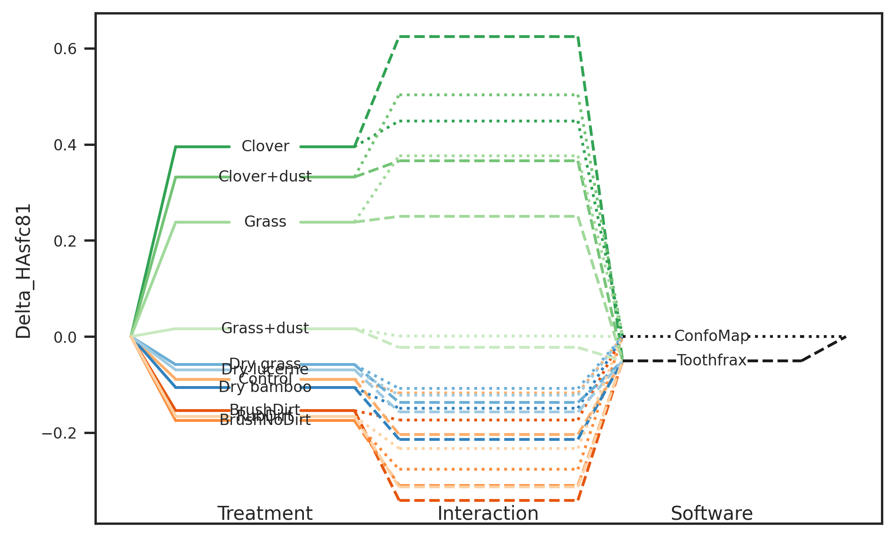
    


#### Compare prior and posterior for model parameters


```python
with HAsfc81Model as model:
    pm_data_HAsfc81 = az.from_pymc3(trace=trace_HAsfc81,prior=prior_pred_HAsfc81,posterior_predictive=posterior_pred_HAsfc81)
```

    arviz.data.io_pymc3 - WARNING - posterior predictive variable HAsfc81_y's shape not compatible with number of chains and draws. This can mean that some draws or even whole chains are not represented.


```python
plotting_lib.plotPriorPosteriorB(widthInch,heigthInch,dpi,sizes,writeOut,outPathPlots,dictMeanStd,pm_data_HAsfc81,'HAsfc81')
```


    
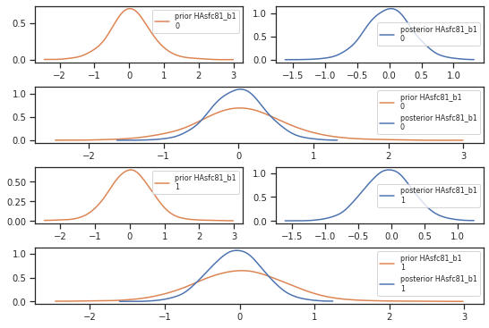
    


```python
plotting_lib.plotLevelsStd(widthInch,heigthInch,dpi,sizes,writeOut,outPathPlots,dictMeanStd,dictTreatment,dictSoftware,trace_HAsfc81,'HAsfc81',x1,x2)
```


    
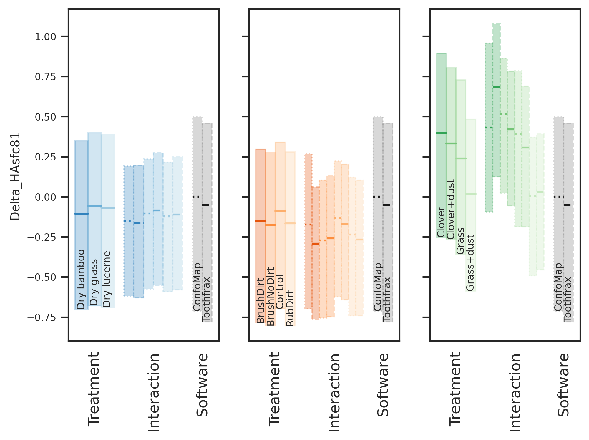
    


#### Posterior and contrasts


```python
plotting_lib.plotPosterior(widthInch,heigthInch,dpi,writeOut,outPathPlots,dictMeanStd,pm_data_HAsfc81,'HAsfc81')
```


    
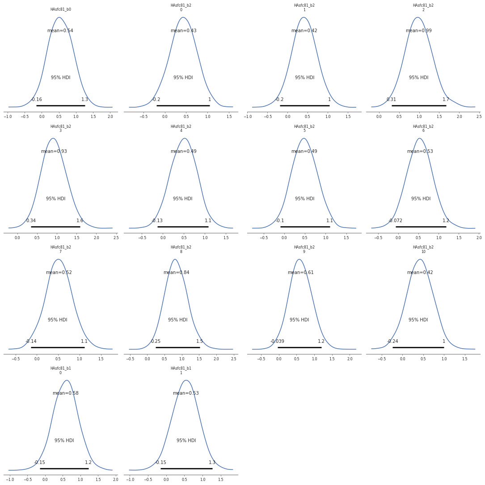
    


```python
df_hdi_HAsfc81 = plotting_lib.plotTreatmentPosterior(widthInch,heigthInch,dpi,sizes,writeOut,outPathPlots,dictMeanStd,dictTreatment,dictSoftware,trace_HAsfc81,'HAsfc81',x1,x2)
```


    

    


```python
df_hdi_HAsfc81
```


<div>
<style scoped>
    .dataframe tbody tr th:only-of-type {
        vertical-align: middle;
    }

    .dataframe tbody tr th {
        vertical-align: top;
    }

    .dataframe thead th {
        text-align: right;
    }
</style>
<table border="1" class="dataframe">
  <thead>
    <tr style="text-align: right;">
      <th></th>
      <th>Treatment_i</th>
      <th>Treatment_j</th>
      <th>hdi_ConfoMap_2.5%</th>
      <th>hdi_ConfoMap_97.5%</th>
      <th>isSignificant_on_ConfoMap</th>
      <th>hdi_Toothfrax_2.5%</th>
      <th>hdi_Toothfrax_97.5%</th>
      <th>isSignificant_on_Toothfrax</th>
    </tr>
  </thead>
  <tbody>
    <tr>
      <th>0</th>
      <td>Dry grass</td>
      <td>Dry bamboo</td>
      <td>-0.009401</td>
      <td>0.101134</td>
      <td>False</td>
      <td>0.018900</td>
      <td>0.136196</td>
      <td>True</td>
    </tr>
    <tr>
      <th>1</th>
      <td>Dry lucerne</td>
      <td>Dry bamboo</td>
      <td>-0.030370</td>
      <td>0.087266</td>
      <td>False</td>
      <td>-0.001664</td>
      <td>0.109981</td>
      <td>False</td>
    </tr>
    <tr>
      <th>2</th>
      <td>Dry lucerne</td>
      <td>Dry grass</td>
      <td>-0.073950</td>
      <td>0.050741</td>
      <td>False</td>
      <td>-0.087209</td>
      <td>0.039690</td>
      <td>False</td>
    </tr>
    <tr>
      <th>3</th>
      <td>BrushNoDirt</td>
      <td>BrushDirt</td>
      <td>-0.518195</td>
      <td>0.206099</td>
      <td>False</td>
      <td>-0.147466</td>
      <td>0.286371</td>
      <td>False</td>
    </tr>
    <tr>
      <th>4</th>
      <td>Control</td>
      <td>BrushDirt</td>
      <td>-0.376578</td>
      <td>0.303712</td>
      <td>False</td>
      <td>-0.030208</td>
      <td>0.268768</td>
      <td>False</td>
    </tr>
    <tr>
      <th>5</th>
      <td>Control</td>
      <td>BrushNoDirt</td>
      <td>-0.097626</td>
      <td>0.347835</td>
      <td>False</td>
      <td>-0.157188</td>
      <td>0.295603</td>
      <td>False</td>
    </tr>
    <tr>
      <th>6</th>
      <td>RubDirt</td>
      <td>BrushDirt</td>
      <td>-0.493950</td>
      <td>0.236296</td>
      <td>False</td>
      <td>-0.128138</td>
      <td>0.198331</td>
      <td>False</td>
    </tr>
    <tr>
      <th>7</th>
      <td>RubDirt</td>
      <td>BrushNoDirt</td>
      <td>-0.231775</td>
      <td>0.307111</td>
      <td>False</td>
      <td>-0.273242</td>
      <td>0.218386</td>
      <td>False</td>
    </tr>
    <tr>
      <th>8</th>
      <td>RubDirt</td>
      <td>Control</td>
      <td>-0.321828</td>
      <td>0.132966</td>
      <td>False</td>
      <td>-0.274491</td>
      <td>0.088330</td>
      <td>False</td>
    </tr>
    <tr>
      <th>9</th>
      <td>Clover+dust</td>
      <td>Clover</td>
      <td>-0.455539</td>
      <td>0.323286</td>
      <td>False</td>
      <td>-0.516906</td>
      <td>0.156140</td>
      <td>False</td>
    </tr>
    <tr>
      <th>10</th>
      <td>Grass</td>
      <td>Clover</td>
      <td>-0.656279</td>
      <td>0.348255</td>
      <td>False</td>
      <td>-0.691228</td>
      <td>0.029980</td>
      <td>False</td>
    </tr>
    <tr>
      <th>11</th>
      <td>Grass</td>
      <td>Clover+dust</td>
      <td>-0.454243</td>
      <td>0.139046</td>
      <td>False</td>
      <td>-0.317566</td>
      <td>0.103036</td>
      <td>False</td>
    </tr>
    <tr>
      <th>12</th>
      <td>Grass+dust</td>
      <td>Clover</td>
      <td>-1.007356</td>
      <td>-0.112084</td>
      <td>True</td>
      <td>-0.965316</td>
      <td>-0.269417</td>
      <td>True</td>
    </tr>
    <tr>
      <th>13</th>
      <td>Grass+dust</td>
      <td>Clover+dust</td>
      <td>-0.689484</td>
      <td>-0.292849</td>
      <td>True</td>
      <td>-0.567226</td>
      <td>-0.229459</td>
      <td>True</td>
    </tr>
    <tr>
      <th>14</th>
      <td>Grass+dust</td>
      <td>Grass</td>
      <td>-0.708570</td>
      <td>-0.038109</td>
      <td>True</td>
      <td>-0.516849</td>
      <td>-0.061466</td>
      <td>True</td>
    </tr>
  </tbody>
</table>
</div>


```python
if writeOut:
    df_hdi_HAsfc81.to_csv(outPathData+ 'hdi_{}.csv'.format('HAsfc81'))
```

#### Bimodal distribution in contrast plots of HAsfc81
For e.g. the pair Clover+Dust vs. Clover shows an unexpected bimodal distribution of the contrast.
We now examine the traces carefully to exclude errors in the sampling:  
Get the traces on ConfoMap of the interactions


```python
m12_clover = trace_HAsfc81['HAsfc81_M12'][:,0,2]
m12_cloverDust = trace_HAsfc81['HAsfc81_M12'][:,0,3]
diff_m12 = m12_cloverDust-m12_clover
```

Get the traces of the treatments:


```python
b2_clover = trace_HAsfc81['HAsfc81_b2'][:,2]
b2_cloverDust = trace_HAsfc81['HAsfc81_b2'][:,3]
diff_b2 = b2_cloverDust-b2_clover
```

Look at all the pairs


```python
sns.pairplot(data=pd.DataFrame.from_dict(
    {'m12_clover':m12_clover,'m12_cloverDust':m12_cloverDust,'diff_m12':diff_m12,
     'b2_clover':b2_clover,'b2_cloverDust':b2_cloverDust,'diff_b2':diff_b2
    }
));
```


    
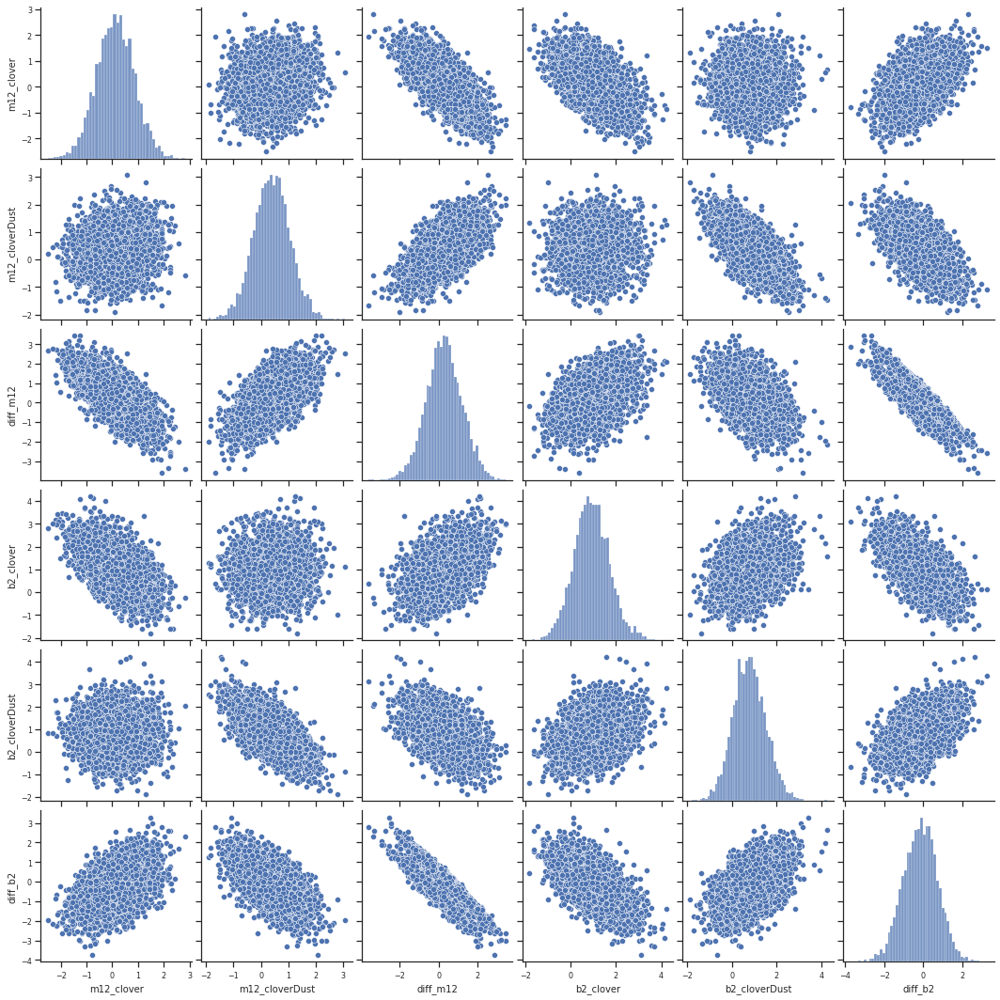
    


Let's have that of the differences again


```python
sns.jointplot(x=diff_b2,y=diff_m12);
```


    
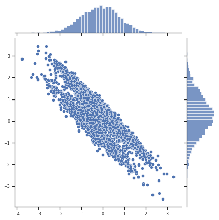
    


We see two sets that are distributed along parallel lines in the scatter plot.
This means that the model estimates two subsets of possible differences.  
However, when looking at the raw data at 'analysis/plots/SSFA_Sheeps_plot.pdf' one can see that the distribution of values for HAsfc81 on Clover (Sheep) measured by ConfoMap appear to have a bimodal distribution.  
Thus, in combination with the chosen uninformative priors, the model correctly describes the distribution as bimodal.  
In summary, we see no issue with the modeling and sampling.

## Summary<a name="summary"></a>

Set the surface parameters for every treatment dataframe:


```python
df_hdi_Asfc["SurfaceParameter"] = "Asfc"
df_hdi_HAsfc9["SurfaceParameter"] = "HAsfc9"
df_hdi_HAsfc81["SurfaceParameter"] = "HAsfc81"
df_hdi_R["SurfaceParameter"] = "R²"
df_hdi_epLsar["SurfaceParameter"] = "epLsar"
```


```python
df_hdi_total = pd.concat([df_hdi_epLsar,df_hdi_R,df_hdi_Asfc,df_hdi_HAsfc9,df_hdi_HAsfc81],ignore_index=True)
```

Show the treatment pairs and surface parameters where the softwares differ


```python
df_summary = df_hdi_total[df_hdi_total.isSignificant_on_ConfoMap != df_hdi_total.isSignificant_on_Toothfrax][["Treatment_i","Treatment_j","SurfaceParameter","isSignificant_on_ConfoMap","isSignificant_on_Toothfrax","hdi_ConfoMap_2.5%","hdi_ConfoMap_97.5%","hdi_Toothfrax_2.5%","hdi_Toothfrax_97.5%"]]
df_summary
```


<div>
<style scoped>
    .dataframe tbody tr th:only-of-type {
        vertical-align: middle;
    }

    .dataframe tbody tr th {
        vertical-align: top;
    }

    .dataframe thead th {
        text-align: right;
    }
</style>
<table border="1" class="dataframe">
  <thead>
    <tr style="text-align: right;">
      <th></th>
      <th>Treatment_i</th>
      <th>Treatment_j</th>
      <th>SurfaceParameter</th>
      <th>isSignificant_on_ConfoMap</th>
      <th>isSignificant_on_Toothfrax</th>
      <th>hdi_ConfoMap_2.5%</th>
      <th>hdi_ConfoMap_97.5%</th>
      <th>hdi_Toothfrax_2.5%</th>
      <th>hdi_Toothfrax_97.5%</th>
    </tr>
  </thead>
  <tbody>
    <tr>
      <th>2</th>
      <td>Dry lucerne</td>
      <td>Dry grass</td>
      <td>epLsar</td>
      <td>True</td>
      <td>False</td>
      <td>0.000228</td>
      <td>0.001524</td>
      <td>-0.000167</td>
      <td>0.001116</td>
    </tr>
    <tr>
      <th>10</th>
      <td>Grass</td>
      <td>Clover</td>
      <td>epLsar</td>
      <td>False</td>
      <td>True</td>
      <td>-0.000153</td>
      <td>0.002973</td>
      <td>0.000293</td>
      <td>0.003795</td>
    </tr>
    <tr>
      <th>18</th>
      <td>BrushNoDirt</td>
      <td>BrushDirt</td>
      <td>R²</td>
      <td>True</td>
      <td>False</td>
      <td>-0.002096</td>
      <td>-0.000672</td>
      <td>-0.000420</td>
      <td>0.000635</td>
    </tr>
    <tr>
      <th>22</th>
      <td>RubDirt</td>
      <td>BrushNoDirt</td>
      <td>R²</td>
      <td>True</td>
      <td>False</td>
      <td>0.000181</td>
      <td>0.002386</td>
      <td>-0.000556</td>
      <td>0.000619</td>
    </tr>
    <tr>
      <th>24</th>
      <td>Clover+dust</td>
      <td>Clover</td>
      <td>R²</td>
      <td>True</td>
      <td>False</td>
      <td>-0.001005</td>
      <td>-0.000290</td>
      <td>-0.000138</td>
      <td>0.000401</td>
    </tr>
    <tr>
      <th>26</th>
      <td>Grass</td>
      <td>Clover+dust</td>
      <td>R²</td>
      <td>False</td>
      <td>True</td>
      <td>-0.000639</td>
      <td>0.000580</td>
      <td>-0.000792</td>
      <td>-0.000199</td>
    </tr>
    <tr>
      <th>28</th>
      <td>Grass+dust</td>
      <td>Clover+dust</td>
      <td>R²</td>
      <td>False</td>
      <td>True</td>
      <td>-0.001314</td>
      <td>0.000824</td>
      <td>-0.000515</td>
      <td>-0.000045</td>
    </tr>
    <tr>
      <th>33</th>
      <td>BrushNoDirt</td>
      <td>BrushDirt</td>
      <td>Asfc</td>
      <td>True</td>
      <td>False</td>
      <td>0.013059</td>
      <td>7.915624</td>
      <td>-2.631889</td>
      <td>6.887819</td>
    </tr>
    <tr>
      <th>35</th>
      <td>Control</td>
      <td>BrushNoDirt</td>
      <td>Asfc</td>
      <td>True</td>
      <td>False</td>
      <td>0.022112</td>
      <td>14.415237</td>
      <td>-0.616464</td>
      <td>13.182578</td>
    </tr>
    <tr>
      <th>36</th>
      <td>RubDirt</td>
      <td>BrushDirt</td>
      <td>Asfc</td>
      <td>False</td>
      <td>True</td>
      <td>-0.259987</td>
      <td>20.831039</td>
      <td>1.502426</td>
      <td>13.522475</td>
    </tr>
    <tr>
      <th>60</th>
      <td>Dry grass</td>
      <td>Dry bamboo</td>
      <td>HAsfc81</td>
      <td>False</td>
      <td>True</td>
      <td>-0.009401</td>
      <td>0.101134</td>
      <td>0.018900</td>
      <td>0.136196</td>
    </tr>
  </tbody>
</table>
</div>


```python
if writeOut:
    df_summary.to_csv(outPathData+ 'summary.csv')
```

### Write out


```python
!jupyter nbconvert --to html Statistical_Model_TwoFactor.ipynb
```

    [NbConvertApp] Converting notebook Statistical_Model_TwoFactor.ipynb to html
    [NbConvertApp] Writing 19659153 bytes to Statistical_Model_TwoFactor.html


```python
!jupyter nbconvert --to markdown Statistical_Model_TwoFactor.ipynb
```

    [NbConvertApp] Converting notebook Statistical_Model_TwoFactor.ipynb to markdown
    [NbConvertApp] Support files will be in Statistical_Model_TwoFactor_files/
    [NbConvertApp] Making directory Statistical_Model_TwoFactor_files
    [NbConvertApp] Making directory Statistical_Model_TwoFactor_files
    [NbConvertApp] Making directory Statistical_Model_TwoFactor_files
    [NbConvertApp] Making directory Statistical_Model_TwoFactor_files
    [NbConvertApp] Making directory Statistical_Model_TwoFactor_files
    [NbConvertApp] Making directory Statistical_Model_TwoFactor_files
    [NbConvertApp] Making directory Statistical_Model_TwoFactor_files
    [NbConvertApp] Making directory Statistical_Model_TwoFactor_files
    [NbConvertApp] Making directory Statistical_Model_TwoFactor_files
    [NbConvertApp] Making directory Statistical_Model_TwoFactor_files
    [NbConvertApp] Making directory Statistical_Model_TwoFactor_files
    [NbConvertApp] Making directory Statistical_Model_TwoFactor_files
    [NbConvertApp] Making directory Statistical_Model_TwoFactor_files
    [NbConvertApp] Making directory Statistical_Model_TwoFactor_files
    [NbConvertApp] Making directory Statistical_Model_TwoFactor_files
    [NbConvertApp] Making directory Statistical_Model_TwoFactor_files
    [NbConvertApp] Making directory Statistical_Model_TwoFactor_files
    [NbConvertApp] Making directory Statistical_Model_TwoFactor_files
    [NbConvertApp] Making directory Statistical_Model_TwoFactor_files
    [NbConvertApp] Making directory Statistical_Model_TwoFactor_files
    [NbConvertApp] Making directory Statistical_Model_TwoFactor_files
    [NbConvertApp] Making directory Statistical_Model_TwoFactor_files
    [NbConvertApp] Making directory Statistical_Model_TwoFactor_files
    [NbConvertApp] Making directory Statistical_Model_TwoFactor_files
    [NbConvertApp] Making directory Statistical_Model_TwoFactor_files
    [NbConvertApp] Making directory Statistical_Model_TwoFactor_files
    [NbConvertApp] Making directory Statistical_Model_TwoFactor_files
    [NbConvertApp] Making directory Statistical_Model_TwoFactor_files
    [NbConvertApp] Making directory Statistical_Model_TwoFactor_files
    [NbConvertApp] Making directory Statistical_Model_TwoFactor_files
    [NbConvertApp] Making directory Statistical_Model_TwoFactor_files
    [NbConvertApp] Making directory Statistical_Model_TwoFactor_files
    [NbConvertApp] Making directory Statistical_Model_TwoFactor_files
    [NbConvertApp] Making directory Statistical_Model_TwoFactor_files
    [NbConvertApp] Making directory Statistical_Model_TwoFactor_files
    [NbConvertApp] Making directory Statistical_Model_TwoFactor_files
    [NbConvertApp] Making directory Statistical_Model_TwoFactor_files
    [NbConvertApp] Making directory Statistical_Model_TwoFactor_files
    [NbConvertApp] Making directory Statistical_Model_TwoFactor_files
    [NbConvertApp] Making directory Statistical_Model_TwoFactor_files
    [NbConvertApp] Making directory Statistical_Model_TwoFactor_files
    [NbConvertApp] Making directory Statistical_Model_TwoFactor_files
    [NbConvertApp] Making directory Statistical_Model_TwoFactor_files
    [NbConvertApp] Making directory Statistical_Model_TwoFactor_files
    [NbConvertApp] Making directory Statistical_Model_TwoFactor_files
    [NbConvertApp] Making directory Statistical_Model_TwoFactor_files
    [NbConvertApp] Making directory Statistical_Model_TwoFactor_files
    [NbConvertApp] Making directory Statistical_Model_TwoFactor_files
    [NbConvertApp] Making directory Statistical_Model_TwoFactor_files
    [NbConvertApp] Making directory Statistical_Model_TwoFactor_files
    [NbConvertApp] Making directory Statistical_Model_TwoFactor_files
    [NbConvertApp] Making directory Statistical_Model_TwoFactor_files
    [NbConvertApp] Making directory Statistical_Model_TwoFactor_files
    [NbConvertApp] Making directory Statistical_Model_TwoFactor_files
    [NbConvertApp] Making directory Statistical_Model_TwoFactor_files
    [NbConvertApp] Making directory Statistical_Model_TwoFactor_files
    [NbConvertApp] Making directory Statistical_Model_TwoFactor_files
    [NbConvertApp] Making directory Statistical_Model_TwoFactor_files
    [NbConvertApp] Making directory Statistical_Model_TwoFactor_files
    [NbConvertApp] Making directory Statistical_Model_TwoFactor_files
    [NbConvertApp] Writing 94860 bytes to Statistical_Model_TwoFactor.md


```python


```
