# Analysis for SSFA project: Two factor model
# Filtered strongly by < 5% NMP

## Table of contents
1. [Used packages](#imports)
1. [Global settings](#settings)
1. [Load data](#load)
1. [Model specification](#model)
1. [Inference](#inference)
   1. [epLsar](#epLsar)
   1. [R²](#r)
   1. [Asfc](#Asfc)
   1. [Smfc](#Smfc)
   1. [HAsfc9](#HAsfc9)
1. [Summary](#summary)

## Used packages <a name="imports"></a>


```python
import numpy as np
import pandas as pd
import matplotlib.pyplot as plt
import seaborn as sns; sns.set()
import pickle
import arviz as az
import pymc3 as pm
```


```python
from matplotlib.colors import to_rgb
```


```python
import scipy.stats as stats 
```


```python
from IPython.display import display
```


```python
import matplotlib as mpl
```


```python
%load_ext autoreload
%autoreload 2
```


```python
import plotting_lib
```

## Global settings <a name="settings"></a>

#### Output


```python
writeOut = True
outPathPlots = "../plots/statistical_model_two_factors_filter_strong/"
outPathData = "../derived_data/statistical_model_two_factors_filter_strong/"
prefix = "TwoFactor_filter_strong"
```

#### Plotting


```python
widthMM = 190 
widthInch = widthMM / 25.4
ratio = 0.66666
heigthInch = ratio*widthInch

SMALL_SIZE = 8
MEDIUM_SIZE = 10
BIGGER_SIZE = 12

plt.rc('font', size=SMALL_SIZE)          # controls default text sizes
plt.rc('axes', titlesize=SMALL_SIZE)     # fontsize of the axes title
plt.rc('axes', labelsize=MEDIUM_SIZE)    # fontsize of the x and y labels
plt.rc('xtick', labelsize=SMALL_SIZE)    # fontsize of the tick labels
plt.rc('ytick', labelsize=SMALL_SIZE)    # fontsize of the tick labels
plt.rc('legend', fontsize=SMALL_SIZE)    # legend fontsize
plt.rc('figure', titlesize=BIGGER_SIZE)  # fontsize of the figure title
sns.set_style("ticks")

dpi = 300
```


```python
sizes = [SMALL_SIZE,MEDIUM_SIZE,BIGGER_SIZE]
```

#### Computing


```python
numSamples = 1000
numCores = 4
numTune = 1000
numPredSamples = 2000
random_seed=36534535
target_accept = 0.99
```

## Load data <a name="load"></a>


```python
datafile = "../derived_data/preprocessing/preprocessed_filter_strong.dat"
```


```python
with open(datafile, "rb") as f:
    x1,x2,_,df,dataZ,dictMeanStd,dictTreatment,dictSoftware = pickle.load(f)    
```

Show that everything is correct:


```python
display(pd.DataFrame.from_dict({'x1':x1,'x2':x2}))
```


<div>
<style scoped>
    .dataframe tbody tr th:only-of-type {
        vertical-align: middle;
    }

    .dataframe tbody tr th {
        vertical-align: top;
    }

    .dataframe thead th {
        text-align: right;
    }
</style>
<table border="1" class="dataframe">
  <thead>
    <tr style="text-align: right;">
      <th></th>
      <th>x1</th>
      <th>x2</th>
    </tr>
  </thead>
  <tbody>
    <tr>
      <th>0</th>
      <td>0</td>
      <td>5</td>
    </tr>
    <tr>
      <th>1</th>
      <td>1</td>
      <td>5</td>
    </tr>
    <tr>
      <th>2</th>
      <td>0</td>
      <td>5</td>
    </tr>
    <tr>
      <th>3</th>
      <td>1</td>
      <td>5</td>
    </tr>
    <tr>
      <th>4</th>
      <td>0</td>
      <td>5</td>
    </tr>
    <tr>
      <th>...</th>
      <td>...</td>
      <td>...</td>
    </tr>
    <tr>
      <th>225</th>
      <td>1</td>
      <td>9</td>
    </tr>
    <tr>
      <th>226</th>
      <td>0</td>
      <td>9</td>
    </tr>
    <tr>
      <th>227</th>
      <td>1</td>
      <td>9</td>
    </tr>
    <tr>
      <th>228</th>
      <td>0</td>
      <td>9</td>
    </tr>
    <tr>
      <th>229</th>
      <td>1</td>
      <td>9</td>
    </tr>
  </tbody>
</table>
<p>230 rows × 2 columns</p>
</div>


x1 indicates the software used, x2 indicates the treatment applied.


```python
for surfaceParam,(mean,std) in dictMeanStd.items():
    print("Surface parameter {} has mean {} and standard deviation {}".format(surfaceParam,mean,std))
```

    Surface parameter epLsar has mean 0.0033908522378621737 and standard deviation 0.001989767613698366
    Surface parameter Rsquared has mean 0.9973621855273914 and standard deviation 0.007969957191822462
    Surface parameter Asfc has mean 13.800529685456086 and standard deviation 12.970336908999228
    Surface parameter Smfc has mean 1.350346875497435 and standard deviation 7.832927757231397
    Surface parameter HAsfc9 has mean 0.4835258022408901 and standard deviation 0.8643524891543747
    Surface parameter HAsfc81 has mean 1.0354777484507558 and standard deviation 2.586788670504154


```python
for k,v in sorted(dictTreatment.items(), key=lambda x: x[0]):    
    print("Number {} encodes treatment {}".format(k,v))
```

    Number 0 encodes treatment BrushDirt
    Number 1 encodes treatment BrushNoDirt
    Number 2 encodes treatment Clover
    Number 3 encodes treatment Clover+dust
    Number 4 encodes treatment Control
    Number 5 encodes treatment Dry bamboo
    Number 6 encodes treatment Dry grass
    Number 7 encodes treatment Dry lucerne
    Number 8 encodes treatment Grass
    Number 9 encodes treatment Grass+dust
    Number 10 encodes treatment RubDirt


```python
for k,v in dictSoftware.items():
    print("Number {} encodes software {}".format(k,v))
```

    Number 0 encodes software ConfoMap
    Number 1 encodes software Toothfrax


```python
display(dataZ)
```


<div>
<style scoped>
    .dataframe tbody tr th:only-of-type {
        vertical-align: middle;
    }

    .dataframe tbody tr th {
        vertical-align: top;
    }

    .dataframe thead th {
        text-align: right;
    }
</style>
<table border="1" class="dataframe">
  <thead>
    <tr style="text-align: right;">
      <th></th>
      <th>index</th>
      <th>TreatmentNumber</th>
      <th>SoftwareNumber</th>
      <th>DatasetNumber</th>
      <th>NameNumber</th>
      <th>epLsar_z</th>
      <th>Rsquared_z</th>
      <th>Asfc_z</th>
      <th>Smfc_z</th>
      <th>HAsfc9_z</th>
      <th>HAsfc81_z</th>
    </tr>
  </thead>
  <tbody>
    <tr>
      <th>0</th>
      <td>0</td>
      <td>5</td>
      <td>0</td>
      <td>0</td>
      <td>98</td>
      <td>0.515753</td>
      <td>0.080435</td>
      <td>-0.165334</td>
      <td>-0.134789</td>
      <td>-0.402292</td>
      <td>-0.259843</td>
    </tr>
    <tr>
      <th>1</th>
      <td>1</td>
      <td>5</td>
      <td>1</td>
      <td>0</td>
      <td>98</td>
      <td>0.668494</td>
      <td>0.275762</td>
      <td>-0.268289</td>
      <td>-0.157173</td>
      <td>-0.402677</td>
      <td>-0.260418</td>
    </tr>
    <tr>
      <th>2</th>
      <td>2</td>
      <td>5</td>
      <td>0</td>
      <td>0</td>
      <td>99</td>
      <td>1.243847</td>
      <td>-0.146130</td>
      <td>0.128490</td>
      <td>-0.134789</td>
      <td>-0.360528</td>
      <td>-0.285754</td>
    </tr>
    <tr>
      <th>3</th>
      <td>3</td>
      <td>5</td>
      <td>1</td>
      <td>0</td>
      <td>99</td>
      <td>1.238912</td>
      <td>0.264094</td>
      <td>-0.046359</td>
      <td>-0.157173</td>
      <td>-0.363618</td>
      <td>-0.299313</td>
    </tr>
    <tr>
      <th>4</th>
      <td>4</td>
      <td>5</td>
      <td>0</td>
      <td>0</td>
      <td>100</td>
      <td>0.829617</td>
      <td>-0.323025</td>
      <td>-0.046215</td>
      <td>-0.134789</td>
      <td>-0.257176</td>
      <td>-0.243567</td>
    </tr>
    <tr>
      <th>...</th>
      <td>...</td>
      <td>...</td>
      <td>...</td>
      <td>...</td>
      <td>...</td>
      <td>...</td>
      <td>...</td>
      <td>...</td>
      <td>...</td>
      <td>...</td>
      <td>...</td>
    </tr>
    <tr>
      <th>225</th>
      <td>225</td>
      <td>9</td>
      <td>1</td>
      <td>2</td>
      <td>52</td>
      <td>0.519230</td>
      <td>0.250668</td>
      <td>-0.923702</td>
      <td>0.007447</td>
      <td>0.408438</td>
      <td>0.029468</td>
    </tr>
    <tr>
      <th>226</th>
      <td>226</td>
      <td>9</td>
      <td>0</td>
      <td>2</td>
      <td>53</td>
      <td>0.005954</td>
      <td>0.186666</td>
      <td>-0.843131</td>
      <td>-0.110277</td>
      <td>0.178138</td>
      <td>0.194629</td>
    </tr>
    <tr>
      <th>227</th>
      <td>227</td>
      <td>9</td>
      <td>1</td>
      <td>2</td>
      <td>53</td>
      <td>-0.126574</td>
      <td>0.298222</td>
      <td>-0.851345</td>
      <td>-0.155367</td>
      <td>0.546274</td>
      <td>0.307811</td>
    </tr>
    <tr>
      <th>228</th>
      <td>228</td>
      <td>9</td>
      <td>0</td>
      <td>2</td>
      <td>54</td>
      <td>-1.091196</td>
      <td>0.265539</td>
      <td>-0.949772</td>
      <td>-0.014439</td>
      <td>-0.130543</td>
      <td>-0.089431</td>
    </tr>
    <tr>
      <th>229</th>
      <td>229</td>
      <td>9</td>
      <td>1</td>
      <td>2</td>
      <td>54</td>
      <td>-1.350837</td>
      <td>0.313027</td>
      <td>-0.953590</td>
      <td>-0.120251</td>
      <td>-0.158980</td>
      <td>-0.075589</td>
    </tr>
  </tbody>
</table>
<p>230 rows × 11 columns</p>
</div>


```python
display(df)
```


<div>
<style scoped>
    .dataframe tbody tr th:only-of-type {
        vertical-align: middle;
    }

    .dataframe tbody tr th {
        vertical-align: top;
    }

    .dataframe thead th {
        text-align: right;
    }
</style>
<table border="1" class="dataframe">
  <thead>
    <tr style="text-align: right;">
      <th></th>
      <th>Dataset</th>
      <th>Name</th>
      <th>Software</th>
      <th>Diet</th>
      <th>Treatment</th>
      <th>Before.after</th>
      <th>NMP</th>
      <th>NMP_cat</th>
      <th>epLsar</th>
      <th>Rsquared</th>
      <th>Asfc</th>
      <th>Smfc</th>
      <th>HAsfc9</th>
      <th>HAsfc81</th>
      <th>NewEplsar</th>
      <th>TreatmentNumber</th>
      <th>SoftwareNumber</th>
      <th>DatasetNumber</th>
      <th>NameNumber</th>
    </tr>
  </thead>
  <tbody>
    <tr>
      <th>0</th>
      <td>GuineaPigs</td>
      <td>capor_2CC6B1_txP4_#1_1_100xL_1</td>
      <td>ConfoMap</td>
      <td>Dry bamboo</td>
      <td>Dry bamboo</td>
      <td>NaN</td>
      <td>0.717312</td>
      <td>0-5%</td>
      <td>0.004417</td>
      <td>0.998003</td>
      <td>11.656095</td>
      <td>0.294557</td>
      <td>0.135803</td>
      <td>0.363319</td>
      <td>0.019460</td>
      <td>5</td>
      <td>0</td>
      <td>0</td>
      <td>98</td>
    </tr>
    <tr>
      <th>1</th>
      <td>GuineaPigs</td>
      <td>capor_2CC6B1_txP4_#1_1_100xL_1</td>
      <td>Toothfrax</td>
      <td>Dry bamboo</td>
      <td>Dry bamboo</td>
      <td>NaN</td>
      <td>0.717312</td>
      <td>0-5%</td>
      <td>0.004721</td>
      <td>0.999560</td>
      <td>10.320730</td>
      <td>0.119219</td>
      <td>0.135471</td>
      <td>0.361833</td>
      <td>NaN</td>
      <td>5</td>
      <td>1</td>
      <td>0</td>
      <td>98</td>
    </tr>
    <tr>
      <th>2</th>
      <td>GuineaPigs</td>
      <td>capor_2CC6B1_txP4_#1_1_100xL_2</td>
      <td>ConfoMap</td>
      <td>Dry bamboo</td>
      <td>Dry bamboo</td>
      <td>NaN</td>
      <td>1.674215</td>
      <td>0-5%</td>
      <td>0.005866</td>
      <td>0.996198</td>
      <td>15.467083</td>
      <td>0.294557</td>
      <td>0.171903</td>
      <td>0.296292</td>
      <td>0.020079</td>
      <td>5</td>
      <td>0</td>
      <td>0</td>
      <td>99</td>
    </tr>
    <tr>
      <th>3</th>
      <td>GuineaPigs</td>
      <td>capor_2CC6B1_txP4_#1_1_100xL_2</td>
      <td>Toothfrax</td>
      <td>Dry bamboo</td>
      <td>Dry bamboo</td>
      <td>NaN</td>
      <td>1.674215</td>
      <td>0-5%</td>
      <td>0.005856</td>
      <td>0.999467</td>
      <td>13.199232</td>
      <td>0.119219</td>
      <td>0.169232</td>
      <td>0.261217</td>
      <td>NaN</td>
      <td>5</td>
      <td>1</td>
      <td>0</td>
      <td>99</td>
    </tr>
    <tr>
      <th>4</th>
      <td>GuineaPigs</td>
      <td>capor_2CC6B1_txP4_#1_1_100xL_3</td>
      <td>ConfoMap</td>
      <td>Dry bamboo</td>
      <td>Dry bamboo</td>
      <td>NaN</td>
      <td>1.760409</td>
      <td>0-5%</td>
      <td>0.005042</td>
      <td>0.994788</td>
      <td>13.201101</td>
      <td>0.294557</td>
      <td>0.261235</td>
      <td>0.405422</td>
      <td>0.019722</td>
      <td>5</td>
      <td>0</td>
      <td>0</td>
      <td>100</td>
    </tr>
    <tr>
      <th>...</th>
      <td>...</td>
      <td>...</td>
      <td>...</td>
      <td>...</td>
      <td>...</td>
      <td>...</td>
      <td>...</td>
      <td>...</td>
      <td>...</td>
      <td>...</td>
      <td>...</td>
      <td>...</td>
      <td>...</td>
      <td>...</td>
      <td>...</td>
      <td>...</td>
      <td>...</td>
      <td>...</td>
      <td>...</td>
    </tr>
    <tr>
      <th>225</th>
      <td>Sheeps</td>
      <td>L8-Ovis-90730-lm2sin-a</td>
      <td>Toothfrax</td>
      <td>Grass+dust</td>
      <td>Grass+dust</td>
      <td>NaN</td>
      <td>0.000000</td>
      <td>0-5%</td>
      <td>0.004424</td>
      <td>0.999360</td>
      <td>1.819802</td>
      <td>1.408678</td>
      <td>0.836560</td>
      <td>1.111706</td>
      <td>NaN</td>
      <td>9</td>
      <td>1</td>
      <td>2</td>
      <td>52</td>
    </tr>
    <tr>
      <th>226</th>
      <td>Sheeps</td>
      <td>L8-Ovis-90764-lm2sin-a</td>
      <td>ConfoMap</td>
      <td>Grass+dust</td>
      <td>Grass+dust</td>
      <td>NaN</td>
      <td>0.000000</td>
      <td>0-5%</td>
      <td>0.003403</td>
      <td>0.998850</td>
      <td>2.864831</td>
      <td>0.486556</td>
      <td>0.637499</td>
      <td>1.538943</td>
      <td>0.018978</td>
      <td>9</td>
      <td>0</td>
      <td>2</td>
      <td>53</td>
    </tr>
    <tr>
      <th>227</th>
      <td>Sheeps</td>
      <td>L8-Ovis-90764-lm2sin-a</td>
      <td>Toothfrax</td>
      <td>Grass+dust</td>
      <td>Grass+dust</td>
      <td>NaN</td>
      <td>0.000000</td>
      <td>0-5%</td>
      <td>0.003139</td>
      <td>0.999739</td>
      <td>2.758297</td>
      <td>0.133366</td>
      <td>0.955699</td>
      <td>1.831721</td>
      <td>NaN</td>
      <td>9</td>
      <td>1</td>
      <td>2</td>
      <td>53</td>
    </tr>
    <tr>
      <th>228</th>
      <td>Sheeps</td>
      <td>L8-Ovis-90814-lm2sin-a</td>
      <td>ConfoMap</td>
      <td>Grass+dust</td>
      <td>Grass+dust</td>
      <td>NaN</td>
      <td>0.000000</td>
      <td>0-5%</td>
      <td>0.001220</td>
      <td>0.999479</td>
      <td>1.481662</td>
      <td>1.237247</td>
      <td>0.370691</td>
      <td>0.804138</td>
      <td>0.017498</td>
      <td>9</td>
      <td>0</td>
      <td>2</td>
      <td>54</td>
    </tr>
    <tr>
      <th>229</th>
      <td>Sheeps</td>
      <td>L8-Ovis-90814-lm2sin-a</td>
      <td>Toothfrax</td>
      <td>Grass+dust</td>
      <td>Grass+dust</td>
      <td>NaN</td>
      <td>0.000000</td>
      <td>0-5%</td>
      <td>0.000703</td>
      <td>0.999857</td>
      <td>1.432148</td>
      <td>0.408433</td>
      <td>0.346111</td>
      <td>0.839946</td>
      <td>NaN</td>
      <td>9</td>
      <td>1</td>
      <td>2</td>
      <td>54</td>
    </tr>
  </tbody>
</table>
<p>230 rows × 19 columns</p>
</div>


## Model specification <a name="model"></a>


```python
class TwoFactorModel(pm.Model):
    
    """
    Compute params of priors and hyperpriors.
    """
    def getParams(self,x1,x2,y):
        # get lengths
        Nx1Lvl = np.unique(x1).size
        Nx2Lvl = np.unique(x2).size
                        
        dims = (Nx1Lvl, Nx2Lvl)
        
        ### get standard deviations
        
        # convert to pandas dataframe to use their logic
        df = pd.DataFrame.from_dict({'x1':x1,'x2':x2,'y':y})
        
        s1 = df.groupby('x1').std()['y'].max()
        s2 = df.groupby('x2').std()['y'].max()
                
        stdSingle = (s1, s2)
        
        prefac = 0.05
        s12 = prefac * np.linalg.norm([s1,s2])
        
        stdMulti = (s12)
        
        return (dims, stdSingle, stdMulti)
    
    def printParams(self,x1,x2,y):
        dims, stdSingle, stdMulti = self.getParams(x1,x2,y)
        Nx1Lvl, Nx2Lvl = dims
        s1, s2 = stdSingle
        s12 = stdMulti
        
        print("The number of levels of the x variables are {}".format(dims))
        print("The standard deviations used for the beta priors are  {}".format(stdSingle))
        print("The standard deviations used for the M12 priors are {}".format(stdMulti))
    
    def __init__(self,name,x1,x2,y,model=None):
        
        # call super's init first, passing model and name
        super().__init__(name, model)
        
        # get parameter of hyperpriors
        dims, stdSingle, stdMulti = self.getParams(x1,x2,y)
        Nx1Lvl, Nx2Lvl = dims
        s1, s2 = stdSingle
        s12 = stdMulti
        
        ### hyperpriors ### 
        # observation hyperpriors
        lamY = 1/30.
        muGamma = 0.5
        sigmaGamma = 2.
        
        # prediction hyperpriors
        sigma0 = pm.HalfNormal('sigma0',sd=1)
        sigma1 = pm.HalfNormal('sigma1',sd=s1, shape=Nx1Lvl)       
        sigma2 = pm.HalfNormal('sigma2',sd=s2, shape=Nx2Lvl)
        beta2 = (np.sqrt(6)*sigma2)/(np.pi)
        
        mu_b0 = pm.Normal('mu_b0', mu=0., sd=1)
        mu_b1 = pm.Normal('mu_b1', mu=0., sd=1, shape=Nx1Lvl)        
        mu_b2 = pm.Normal('mu_b2', mu=0., sd=1, shape=Nx2Lvl)       
        
        sigma12 = pm.HalfNormal('sigma12',sd=s12)
                               
        ### priors ### 
        # observation priors        
        nuY = pm.Exponential('nuY',lam=lamY)
        sigmaY = pm.Gamma('sigmaY',mu=muGamma, sigma=sigmaGamma)
        
        # prediction priors
        b0_dist = pm.Normal('b0_dist', mu=0, sd=1)
        b0 = pm.Deterministic("b0", mu_b0 + b0_dist * sigma0)
       
        b1_dist = pm.Normal('b1_dist', mu=0, sd=1)
        b1 = pm.Deterministic("b1", mu_b1 + b1_dist * sigma1)
                        
        b2_beta = pm.HalfNormal('b2_beta', sd=beta2, shape=Nx2Lvl)
        b2_dist = pm.Gumbel('b2_dist', mu=0, beta=1)
        b2 = pm.Deterministic("b2", mu_b2 + b2_beta * b2_dist)
        
        mu_M12 = pm.Normal('mu_M12', mu=0., sd=1, shape=[Nx1Lvl, Nx2Lvl])
        M12_dist = pm.Normal('M12_dist', mu=0, sd=1)
        M12 = pm.Deterministic("M12", mu_M12 + M12_dist * sigma12)
        
        #### prediction ###         
        mu = pm.Deterministic('mu',b0 + b1[x1]+ b2[x2] +  M12[x1,x2] )
                                        
        ### observation ### 
        y = pm.StudentT('y',nu = nuY, mu=mu, sd=sigmaY, observed=y)
```

## Inference <a name="inference"></a>

### epLsar <a name="epLsar"></a>


```python
with pm.Model() as model:
    epLsarModel = TwoFactorModel('epLsar',x1,x2,dataZ.epLsar_z.values)
```

#### Verify model settings


```python
epLsarModel.printParams(x1,x2,dataZ.epLsar_z.values)
```

    The number of levels of the x variables are (2, 11)
    The standard deviations used for the beta priors are  (1.022692176080412, 1.4502540614172976)
    The standard deviations used for the M12 priors are 0.08872902751740064


```python
try:
    graph_epLsar = pm.model_to_graphviz(epLsarModel)    
except:
    graph_epLsar = "Could not make graph"
graph_epLsar
```


    
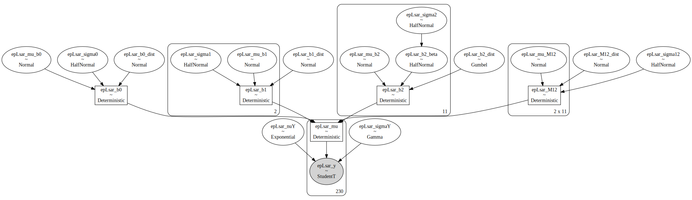
    


#### Check prior choice


```python
with epLsarModel as model:
    prior_pred_epLsar = pm.sample_prior_predictive(samples=numPredSamples,random_seed=random_seed)
```


```python
plotting_lib.plotPriorPredictive(widthInch,heigthInch,dpi,writeOut,outPathPlots,df,dictMeanStd,\
                                 prior_pred_epLsar,dataZ.epLsar_z.values,'epLsar',prefix)
```


    
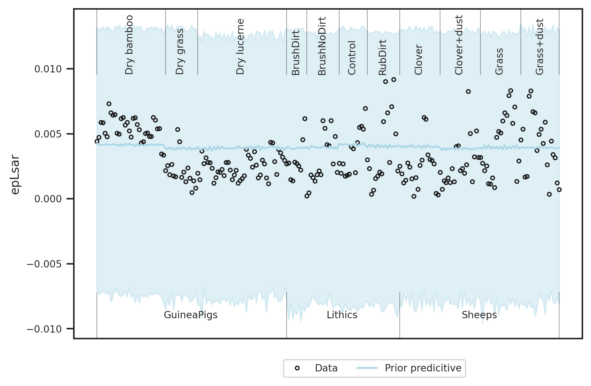
    


Prior choice is as intended: Broad over the data range.

#### Sampling


```python
with epLsarModel as model:
    trace_epLsar = pm.sample(numSamples,cores=numCores,tune=numTune,max_treedepth=20, init='auto',target_accept=0.99,random_seed=random_seed)
```

    Auto-assigning NUTS sampler...
    Initializing NUTS using jitter+adapt_diag...
    Multiprocess sampling (4 chains in 4 jobs)
    NUTS: [epLsar_M12_dist, epLsar_mu_M12, epLsar_b2_dist, epLsar_b2_beta, epLsar_b1_dist, epLsar_b0_dist, epLsar_sigmaY, epLsar_nuY, epLsar_sigma12, epLsar_mu_b2, epLsar_mu_b1, epLsar_mu_b0, epLsar_sigma2, epLsar_sigma1, epLsar_sigma0]


<div>
    <style>
        /* Turns off some styling */
        progress {
            /* gets rid of default border in Firefox and Opera. */
            border: none;
            /* Needs to be in here for Safari polyfill so background images work as expected. */
            background-size: auto;
        }
        .progress-bar-interrupted, .progress-bar-interrupted::-webkit-progress-bar {
            background: #F44336;
        }
    </style>
  <progress value='8000' class='' max='8000' style='width:300px; height:20px; vertical-align: middle;'></progress>
  100.00% [8000/8000 02:45<00:00 Sampling 4 chains, 0 divergences]
</div>


    Sampling 4 chains for 1_000 tune and 1_000 draw iterations (4_000 + 4_000 draws total) took 166 seconds.


```python
with epLsarModel as model:
    if writeOut:
        with open(outPathData + '{}_model_{}.pkl'.format(prefix,'epLsar'), 'wb') as buff:
            pickle.dump({'model':epLsarModel, 'trace': trace_epLsar}, buff)            
```

##### Save for later comparison


```python
if writeOut:
    np.save('../derived_data/statistical_model_two_factors_filter_strong/statistical_model_two_factors_filter_strong_epLsar_oldb1', trace_epLsar['epLsar_b1'])
    np.save('../derived_data/statistical_model_two_factors_filter_strong/statistical_model_two_factors_filter_strong_epLsar_oldb2', trace_epLsar['epLsar_b2'])
    np.save('../derived_data/statistical_model_two_factors_filter_strong/statistical_model_two_factors_filter_strong_epLsar_oldM12', trace_epLsar['epLsar_M12'])
```

#### Check sampling


```python
with epLsarModel as model:
    dataTrace_epLsar = az.from_pymc3(trace=trace_epLsar)
```


```python
pm.summary(dataTrace_epLsar,hdi_prob=0.95).round(2)
```


<div>
<style scoped>
    .dataframe tbody tr th:only-of-type {
        vertical-align: middle;
    }

    .dataframe tbody tr th {
        vertical-align: top;
    }

    .dataframe thead th {
        text-align: right;
    }
</style>
<table border="1" class="dataframe">
  <thead>
    <tr style="text-align: right;">
      <th></th>
      <th>mean</th>
      <th>sd</th>
      <th>hdi_2.5%</th>
      <th>hdi_97.5%</th>
      <th>mcse_mean</th>
      <th>mcse_sd</th>
      <th>ess_mean</th>
      <th>ess_sd</th>
      <th>ess_bulk</th>
      <th>ess_tail</th>
      <th>r_hat</th>
    </tr>
  </thead>
  <tbody>
    <tr>
      <th>epLsar_mu_b0</th>
      <td>-0.04</td>
      <td>0.81</td>
      <td>-1.61</td>
      <td>1.61</td>
      <td>0.01</td>
      <td>0.01</td>
      <td>5648.0</td>
      <td>1752.0</td>
      <td>5643.0</td>
      <td>2897.0</td>
      <td>1.0</td>
    </tr>
    <tr>
      <th>epLsar_mu_b1[0]</th>
      <td>0.02</td>
      <td>0.72</td>
      <td>-1.38</td>
      <td>1.48</td>
      <td>0.01</td>
      <td>0.01</td>
      <td>6045.0</td>
      <td>1737.0</td>
      <td>6074.0</td>
      <td>2691.0</td>
      <td>1.0</td>
    </tr>
    <tr>
      <th>epLsar_mu_b1[1]</th>
      <td>-0.06</td>
      <td>0.70</td>
      <td>-1.45</td>
      <td>1.26</td>
      <td>0.01</td>
      <td>0.01</td>
      <td>5666.0</td>
      <td>1688.0</td>
      <td>5632.0</td>
      <td>3055.0</td>
      <td>1.0</td>
    </tr>
    <tr>
      <th>epLsar_mu_b2[0]</th>
      <td>-0.12</td>
      <td>0.65</td>
      <td>-1.54</td>
      <td>1.09</td>
      <td>0.01</td>
      <td>0.01</td>
      <td>4895.0</td>
      <td>1989.0</td>
      <td>4940.0</td>
      <td>2893.0</td>
      <td>1.0</td>
    </tr>
    <tr>
      <th>epLsar_mu_b2[1]</th>
      <td>-0.11</td>
      <td>0.68</td>
      <td>-1.48</td>
      <td>1.15</td>
      <td>0.01</td>
      <td>0.01</td>
      <td>5403.0</td>
      <td>1561.0</td>
      <td>5390.0</td>
      <td>2519.0</td>
      <td>1.0</td>
    </tr>
    <tr>
      <th>...</th>
      <td>...</td>
      <td>...</td>
      <td>...</td>
      <td>...</td>
      <td>...</td>
      <td>...</td>
      <td>...</td>
      <td>...</td>
      <td>...</td>
      <td>...</td>
      <td>...</td>
    </tr>
    <tr>
      <th>epLsar_mu[225]</th>
      <td>0.37</td>
      <td>0.28</td>
      <td>-0.18</td>
      <td>0.96</td>
      <td>0.00</td>
      <td>0.00</td>
      <td>3972.0</td>
      <td>3951.0</td>
      <td>3982.0</td>
      <td>3531.0</td>
      <td>1.0</td>
    </tr>
    <tr>
      <th>epLsar_mu[226]</th>
      <td>0.37</td>
      <td>0.30</td>
      <td>-0.22</td>
      <td>0.95</td>
      <td>0.00</td>
      <td>0.00</td>
      <td>3719.0</td>
      <td>3719.0</td>
      <td>3723.0</td>
      <td>3229.0</td>
      <td>1.0</td>
    </tr>
    <tr>
      <th>epLsar_mu[227]</th>
      <td>0.37</td>
      <td>0.28</td>
      <td>-0.18</td>
      <td>0.96</td>
      <td>0.00</td>
      <td>0.00</td>
      <td>3972.0</td>
      <td>3951.0</td>
      <td>3982.0</td>
      <td>3531.0</td>
      <td>1.0</td>
    </tr>
    <tr>
      <th>epLsar_mu[228]</th>
      <td>0.37</td>
      <td>0.30</td>
      <td>-0.22</td>
      <td>0.95</td>
      <td>0.00</td>
      <td>0.00</td>
      <td>3719.0</td>
      <td>3719.0</td>
      <td>3723.0</td>
      <td>3229.0</td>
      <td>1.0</td>
    </tr>
    <tr>
      <th>epLsar_mu[229]</th>
      <td>0.37</td>
      <td>0.28</td>
      <td>-0.18</td>
      <td>0.96</td>
      <td>0.00</td>
      <td>0.00</td>
      <td>3972.0</td>
      <td>3951.0</td>
      <td>3982.0</td>
      <td>3531.0</td>
      <td>1.0</td>
    </tr>
  </tbody>
</table>
<p>334 rows × 11 columns</p>
</div>


```python
plotting_lib.plotDiagnostics(widthInch,heigthInch,dpi,writeOut,outPathPlots,trace_epLsar,dataTrace_epLsar,\
                             'epLsar',prefix)
```

    /home/bob/Documents/Projekt_Neuwied/SSFA/ssfa-env/lib/python3.7/site-packages/arviz/plots/backends/matplotlib/pairplot.py:216: UserWarning: rcParams['plot.max_subplots'] (40) is smaller than the number of resulting pair plots with these variables, generating only a 8x8 grid
      UserWarning,


    

    


    
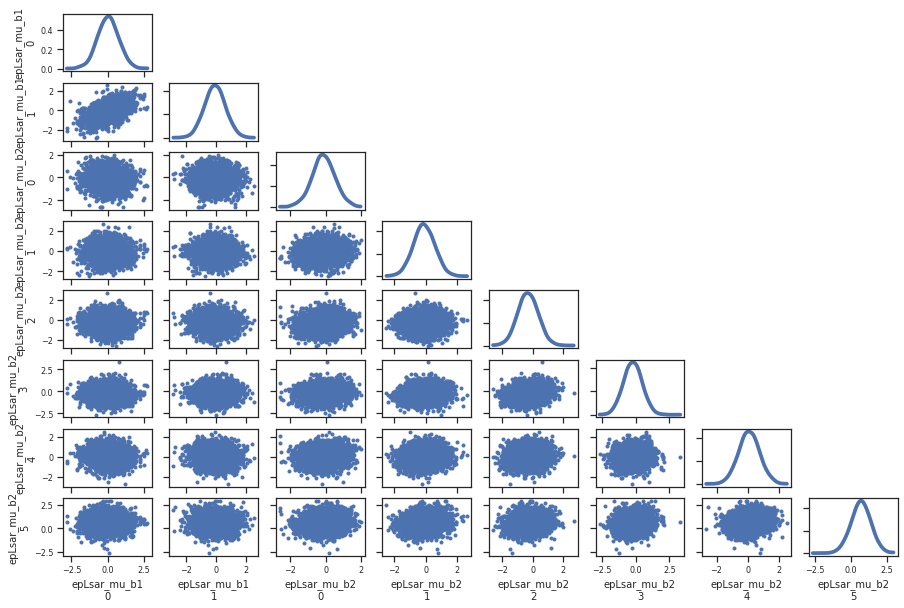
    


    
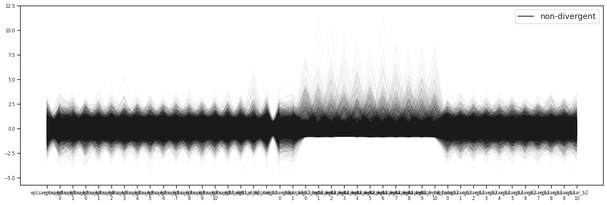
    


    
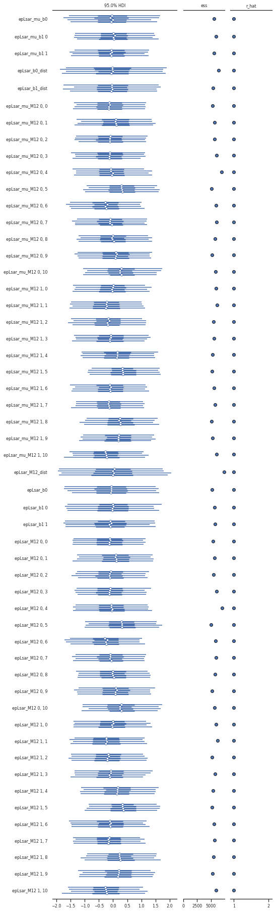
    


```python
with epLsarModel as model:
    plotting_lib.plotTracesB(widthInch,heigthInch,dpi,writeOut,outPathPlots,trace_epLsar,'epLsar',prefix)
```


    
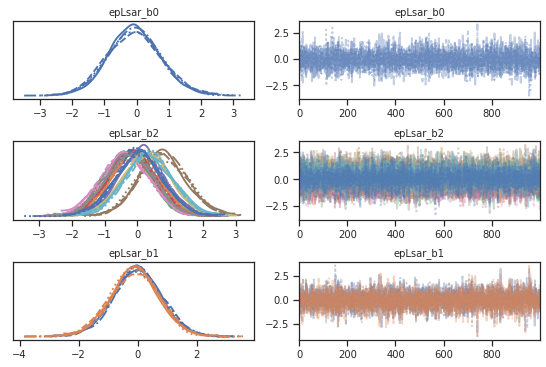
    


```python
with epLsarModel as model:
    plotting_lib.pm.energyplot(trace_epLsar)
```


    

    


#### Posterior predictive distribution


```python
with epLsarModel as model:
    posterior_pred_epLsar = pm.sample_posterior_predictive(trace_epLsar,samples=numPredSamples,random_seed=random_seed)
```

    /home/bob/Documents/Projekt_Neuwied/SSFA/ssfa-env/lib/python3.7/site-packages/pymc3/sampling.py:1708: UserWarning: samples parameter is smaller than nchains times ndraws, some draws and/or chains may not be represented in the returned posterior predictive sample
      "samples parameter is smaller than nchains times ndraws, some draws "


<div>
    <style>
        /* Turns off some styling */
        progress {
            /* gets rid of default border in Firefox and Opera. */
            border: none;
            /* Needs to be in here for Safari polyfill so background images work as expected. */
            background-size: auto;
        }
        .progress-bar-interrupted, .progress-bar-interrupted::-webkit-progress-bar {
            background: #F44336;
        }
    </style>
  <progress value='2000' class='' max='2000' style='width:300px; height:20px; vertical-align: middle;'></progress>
  100.00% [2000/2000 00:01<00:00]
</div>


```python
plotting_lib.plotPriorPosteriorPredictive(widthInch,heigthInch,dpi,writeOut,outPathPlots,df,dictMeanStd,\
                                          prior_pred_epLsar,posterior_pred_epLsar,dataZ.epLsar_z.values,\
                                          'epLsar',prefix)
```


    
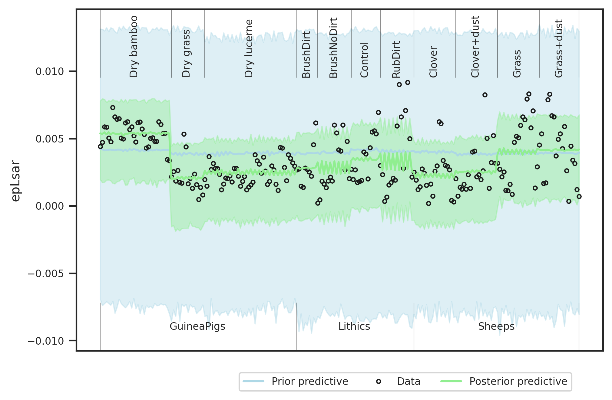
    


#### Compare prior and posterior for model parameters


```python
with epLsarModel as model:
    pm_data_epLsar = az.from_pymc3(trace=trace_epLsar,prior=prior_pred_epLsar,posterior_predictive=posterior_pred_epLsar)
```

    arviz.data.io_pymc3 - WARNING - posterior predictive variable epLsar_y's shape not compatible with number of chains and draws. This can mean that some draws or even whole chains are not represented.


```python
plotting_lib.plotPriorPosteriorB(widthInch,heigthInch,dpi,sizes,writeOut,outPathPlots,dictMeanStd,\
                                 pm_data_epLsar,'epLsar',prefix)
```


    

    


```python
plotting_lib.plotLevels(widthInch,heigthInch,dpi,sizes,writeOut,outPathPlots,dictMeanStd,dictTreatment,\
                        dictSoftware,trace_epLsar,'epLsar',x1,x2)
```


    

    


```python
plotting_lib.plotLevelsStd(widthInch,heigthInch,dpi,sizes,writeOut,outPathPlots,dictMeanStd,dictTreatment,\
                           dictSoftware,trace_epLsar,'epLsar',x1,x2)
```


    
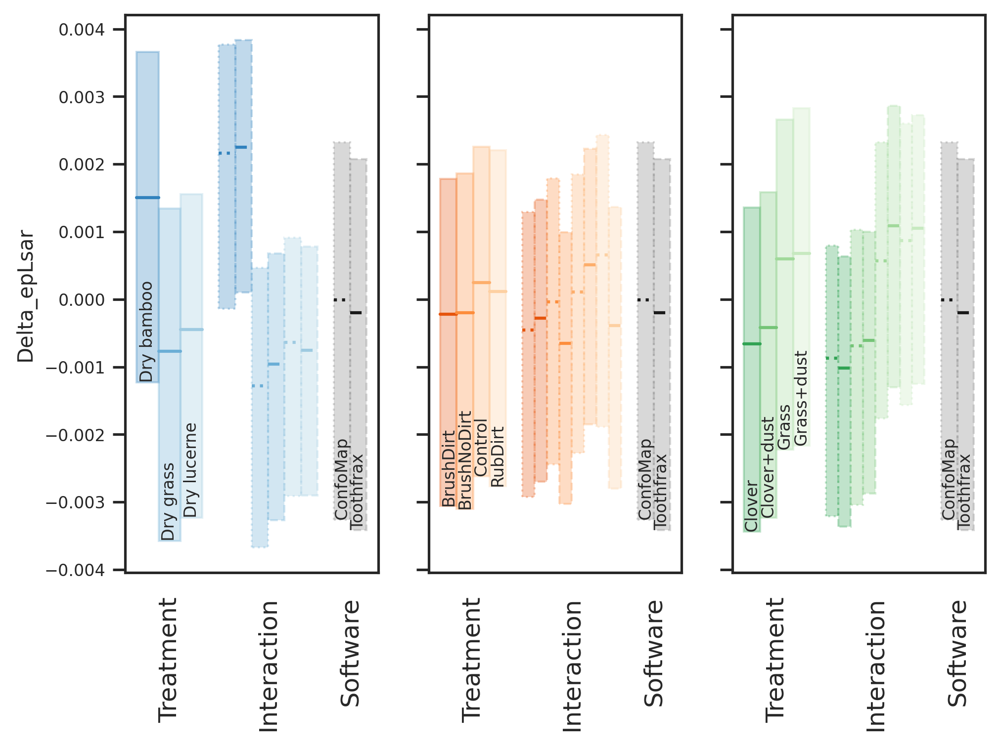
    


#### Posterior and contrasts


```python
plotting_lib.plotPosterior(widthInch,heigthInch,dpi,writeOut,outPathPlots,dictMeanStd,pm_data_epLsar,'epLsar',prefix)
```


    
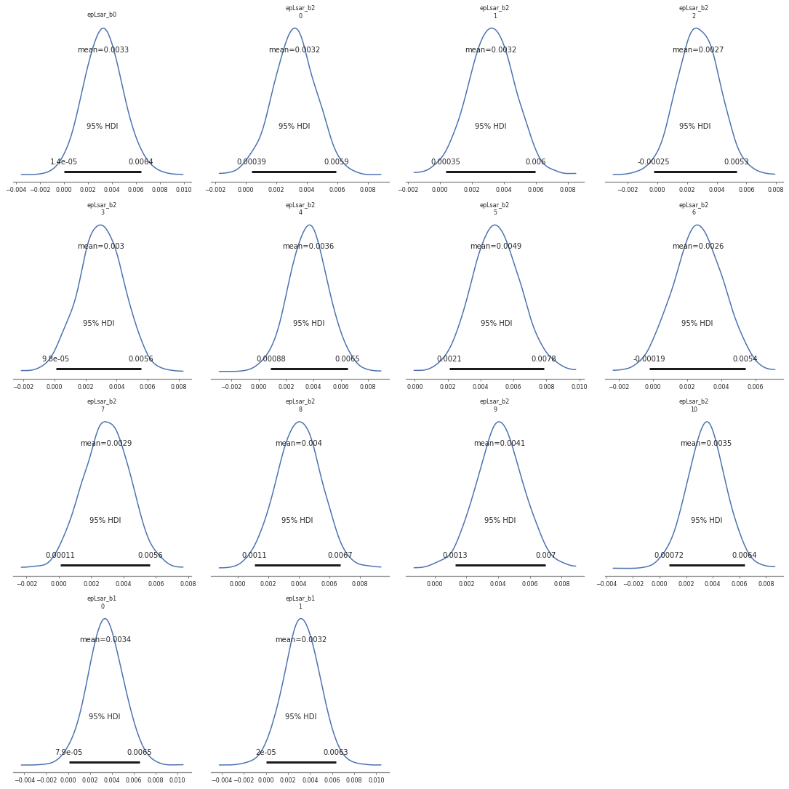
    


```python
df_hdi_epLsar = plotting_lib.plotTreatmentPosterior(widthInch,heigthInch,dpi,sizes,writeOut,outPathPlots,\
                                                    dictMeanStd,dictTreatment,dictSoftware,trace_epLsar,\
                                                    'epLsar',x1,x2,prefix)
```


    

    


```python
df_hdi_epLsar
```


<div>
<style scoped>
    .dataframe tbody tr th:only-of-type {
        vertical-align: middle;
    }

    .dataframe tbody tr th {
        vertical-align: top;
    }

    .dataframe thead th {
        text-align: right;
    }
</style>
<table border="1" class="dataframe">
  <thead>
    <tr style="text-align: right;">
      <th></th>
      <th>Treatment_i</th>
      <th>Treatment_j</th>
      <th>hdi_ConfoMap_2.5%</th>
      <th>hdi_ConfoMap_97.5%</th>
      <th>isSignificant_on_ConfoMap</th>
      <th>hdi_Toothfrax_2.5%</th>
      <th>hdi_Toothfrax_97.5%</th>
      <th>isSignificant_on_Toothfrax</th>
    </tr>
  </thead>
  <tbody>
    <tr>
      <th>0</th>
      <td>Dry grass</td>
      <td>Dry bamboo</td>
      <td>-0.004671</td>
      <td>-0.002183</td>
      <td>True</td>
      <td>-0.004478</td>
      <td>-0.002005</td>
      <td>True</td>
    </tr>
    <tr>
      <th>1</th>
      <td>Dry lucerne</td>
      <td>Dry bamboo</td>
      <td>-0.003734</td>
      <td>-0.001874</td>
      <td>True</td>
      <td>-0.003890</td>
      <td>-0.002062</td>
      <td>True</td>
    </tr>
    <tr>
      <th>2</th>
      <td>Dry lucerne</td>
      <td>Dry grass</td>
      <td>-0.000557</td>
      <td>0.001859</td>
      <td>False</td>
      <td>-0.001082</td>
      <td>0.001336</td>
      <td>False</td>
    </tr>
    <tr>
      <th>3</th>
      <td>BrushNoDirt</td>
      <td>BrushDirt</td>
      <td>-0.001341</td>
      <td>0.002360</td>
      <td>False</td>
      <td>-0.002158</td>
      <td>0.001258</td>
      <td>False</td>
    </tr>
    <tr>
      <th>4</th>
      <td>Control</td>
      <td>BrushDirt</td>
      <td>-0.001054</td>
      <td>0.002426</td>
      <td>False</td>
      <td>-0.001096</td>
      <td>0.002599</td>
      <td>False</td>
    </tr>
    <tr>
      <th>5</th>
      <td>Control</td>
      <td>BrushNoDirt</td>
      <td>-0.001753</td>
      <td>0.001850</td>
      <td>False</td>
      <td>-0.000474</td>
      <td>0.002917</td>
      <td>False</td>
    </tr>
    <tr>
      <th>6</th>
      <td>RubDirt</td>
      <td>BrushDirt</td>
      <td>-0.000877</td>
      <td>0.003022</td>
      <td>False</td>
      <td>-0.001946</td>
      <td>0.001789</td>
      <td>False</td>
    </tr>
    <tr>
      <th>7</th>
      <td>RubDirt</td>
      <td>BrushNoDirt</td>
      <td>-0.001517</td>
      <td>0.002491</td>
      <td>False</td>
      <td>-0.001351</td>
      <td>0.002015</td>
      <td>False</td>
    </tr>
    <tr>
      <th>8</th>
      <td>RubDirt</td>
      <td>Control</td>
      <td>-0.001317</td>
      <td>0.002492</td>
      <td>False</td>
      <td>-0.002699</td>
      <td>0.000872</td>
      <td>False</td>
    </tr>
    <tr>
      <th>9</th>
      <td>Clover+dust</td>
      <td>Clover</td>
      <td>-0.001231</td>
      <td>0.001618</td>
      <td>False</td>
      <td>-0.001001</td>
      <td>0.001813</td>
      <td>False</td>
    </tr>
    <tr>
      <th>10</th>
      <td>Grass</td>
      <td>Clover</td>
      <td>-0.000204</td>
      <td>0.002888</td>
      <td>False</td>
      <td>0.000434</td>
      <td>0.003762</td>
      <td>True</td>
    </tr>
    <tr>
      <th>11</th>
      <td>Grass</td>
      <td>Clover+dust</td>
      <td>-0.000339</td>
      <td>0.002881</td>
      <td>False</td>
      <td>0.000060</td>
      <td>0.003390</td>
      <td>True</td>
    </tr>
    <tr>
      <th>12</th>
      <td>Grass+dust</td>
      <td>Clover</td>
      <td>0.000238</td>
      <td>0.003278</td>
      <td>True</td>
      <td>0.000589</td>
      <td>0.003629</td>
      <td>True</td>
    </tr>
    <tr>
      <th>13</th>
      <td>Grass+dust</td>
      <td>Clover+dust</td>
      <td>0.000026</td>
      <td>0.003130</td>
      <td>True</td>
      <td>0.000228</td>
      <td>0.003223</td>
      <td>True</td>
    </tr>
    <tr>
      <th>14</th>
      <td>Grass+dust</td>
      <td>Grass</td>
      <td>-0.001440</td>
      <td>0.001914</td>
      <td>False</td>
      <td>-0.001678</td>
      <td>0.001754</td>
      <td>False</td>
    </tr>
  </tbody>
</table>
</div>


```python
plotting_lib.plotTreatmentPosteriorDiff(widthInch,heigthInch,dpi,sizes,writeOut,outPathPlots,dictMeanStd,\
                                        dictTreatment,dictSoftware,trace_epLsar,'epLsar',x1,x2,prefix)
```


    

    


    

    


```python
if writeOut:
    df_hdi_epLsar.to_csv(outPathData+ '{}_hdi_{}.csv'.format(prefix,'epLsar'))
```

### R²<a name="r"></a>


```python
with pm.Model() as model:
    RsquaredModel = TwoFactorModel('Rsquared',x1,x2,dataZ["Rsquared_z"].values)
```

#### Verify model settings


```python
RsquaredModel.printParams(x1,x2,dataZ["Rsquared_z"].values)
```

    The number of levels of the x variables are (2, 11)
    The standard deviations used for the beta priors are  (1.3690772711592387, 3.503507127699258)
    The standard deviations used for the M12 priors are 0.1880753490508813


```python
pm.model_to_graphviz(RsquaredModel)
```


    

    


#### Check prior choice


```python
with RsquaredModel as model:
    prior_pred_Rsquared = pm.sample_prior_predictive(samples=numPredSamples,random_seed=random_seed)
```


```python
plotting_lib.plotPriorPredictive(widthInch,heigthInch,dpi,writeOut,outPathPlots,df,dictMeanStd,\
                                 prior_pred_Rsquared,dataZ["Rsquared_z"].values,'Rsquared',prefix)
```


    

    


#### Sampling


```python
with RsquaredModel as model:
    trace_Rsquared = pm.sample(numSamples,cores=numCores,tune=numTune,max_treedepth=20, init='auto',target_accept=0.99,random_seed=random_seed)
```

    Auto-assigning NUTS sampler...
    Initializing NUTS using jitter+adapt_diag...
    Multiprocess sampling (4 chains in 4 jobs)
    NUTS: [Rsquared_M12_dist, Rsquared_mu_M12, Rsquared_b2_dist, Rsquared_b2_beta, Rsquared_b1_dist, Rsquared_b0_dist, Rsquared_sigmaY, Rsquared_nuY, Rsquared_sigma12, Rsquared_mu_b2, Rsquared_mu_b1, Rsquared_mu_b0, Rsquared_sigma2, Rsquared_sigma1, Rsquared_sigma0]


<div>
    <style>
        /* Turns off some styling */
        progress {
            /* gets rid of default border in Firefox and Opera. */
            border: none;
            /* Needs to be in here for Safari polyfill so background images work as expected. */
            background-size: auto;
        }
        .progress-bar-interrupted, .progress-bar-interrupted::-webkit-progress-bar {
            background: #F44336;
        }
    </style>
  <progress value='8000' class='' max='8000' style='width:300px; height:20px; vertical-align: middle;'></progress>
  100.00% [8000/8000 34:04<00:00 Sampling 4 chains, 0 divergences]
</div>


    Sampling 4 chains for 1_000 tune and 1_000 draw iterations (4_000 + 4_000 draws total) took 2044 seconds.


```python
with RsquaredModel as model:
    if writeOut:
        with open(outPathData + '{}_model_{}.pkl'.format(prefix,'Rsquared'), 'wb') as buff:
            pickle.dump({'model': RsquaredModel, 'trace': trace_Rsquared}, buff)
```

#### Check sampling


```python
with RsquaredModel as model:
    dataTrace_Rsquared = az.from_pymc3(trace=trace_Rsquared)
```


```python
pm.summary(dataTrace_Rsquared,hdi_prob=0.95).round(2)
```


<div>
<style scoped>
    .dataframe tbody tr th:only-of-type {
        vertical-align: middle;
    }

    .dataframe tbody tr th {
        vertical-align: top;
    }

    .dataframe thead th {
        text-align: right;
    }
</style>
<table border="1" class="dataframe">
  <thead>
    <tr style="text-align: right;">
      <th></th>
      <th>mean</th>
      <th>sd</th>
      <th>hdi_2.5%</th>
      <th>hdi_97.5%</th>
      <th>mcse_mean</th>
      <th>mcse_sd</th>
      <th>ess_mean</th>
      <th>ess_sd</th>
      <th>ess_bulk</th>
      <th>ess_tail</th>
      <th>r_hat</th>
    </tr>
  </thead>
  <tbody>
    <tr>
      <th>Rsquared_mu_b0</th>
      <td>0.07</td>
      <td>0.83</td>
      <td>-1.56</td>
      <td>1.67</td>
      <td>0.01</td>
      <td>0.01</td>
      <td>4417.0</td>
      <td>2226.0</td>
      <td>4420.0</td>
      <td>3217.0</td>
      <td>1.0</td>
    </tr>
    <tr>
      <th>Rsquared_mu_b1[0]</th>
      <td>-0.04</td>
      <td>0.73</td>
      <td>-1.42</td>
      <td>1.47</td>
      <td>0.01</td>
      <td>0.01</td>
      <td>3480.0</td>
      <td>2287.0</td>
      <td>3469.0</td>
      <td>2992.0</td>
      <td>1.0</td>
    </tr>
    <tr>
      <th>Rsquared_mu_b1[1]</th>
      <td>0.09</td>
      <td>0.72</td>
      <td>-1.23</td>
      <td>1.61</td>
      <td>0.01</td>
      <td>0.01</td>
      <td>3364.0</td>
      <td>2286.0</td>
      <td>3364.0</td>
      <td>2820.0</td>
      <td>1.0</td>
    </tr>
    <tr>
      <th>Rsquared_mu_b2[0]</th>
      <td>0.03</td>
      <td>0.66</td>
      <td>-1.27</td>
      <td>1.32</td>
      <td>0.01</td>
      <td>0.01</td>
      <td>2953.0</td>
      <td>2039.0</td>
      <td>2997.0</td>
      <td>2879.0</td>
      <td>1.0</td>
    </tr>
    <tr>
      <th>Rsquared_mu_b2[1]</th>
      <td>0.03</td>
      <td>0.67</td>
      <td>-1.26</td>
      <td>1.30</td>
      <td>0.01</td>
      <td>0.01</td>
      <td>3269.0</td>
      <td>2311.0</td>
      <td>3301.0</td>
      <td>2698.0</td>
      <td>1.0</td>
    </tr>
    <tr>
      <th>...</th>
      <td>...</td>
      <td>...</td>
      <td>...</td>
      <td>...</td>
      <td>...</td>
      <td>...</td>
      <td>...</td>
      <td>...</td>
      <td>...</td>
      <td>...</td>
      <td>...</td>
    </tr>
    <tr>
      <th>Rsquared_mu[225]</th>
      <td>0.28</td>
      <td>0.01</td>
      <td>0.25</td>
      <td>0.31</td>
      <td>0.00</td>
      <td>0.00</td>
      <td>3553.0</td>
      <td>3530.0</td>
      <td>3554.0</td>
      <td>3929.0</td>
      <td>1.0</td>
    </tr>
    <tr>
      <th>Rsquared_mu[226]</th>
      <td>0.20</td>
      <td>0.02</td>
      <td>0.15</td>
      <td>0.25</td>
      <td>0.00</td>
      <td>0.00</td>
      <td>3916.0</td>
      <td>3916.0</td>
      <td>3926.0</td>
      <td>3480.0</td>
      <td>1.0</td>
    </tr>
    <tr>
      <th>Rsquared_mu[227]</th>
      <td>0.28</td>
      <td>0.01</td>
      <td>0.25</td>
      <td>0.31</td>
      <td>0.00</td>
      <td>0.00</td>
      <td>3553.0</td>
      <td>3530.0</td>
      <td>3554.0</td>
      <td>3929.0</td>
      <td>1.0</td>
    </tr>
    <tr>
      <th>Rsquared_mu[228]</th>
      <td>0.20</td>
      <td>0.02</td>
      <td>0.15</td>
      <td>0.25</td>
      <td>0.00</td>
      <td>0.00</td>
      <td>3916.0</td>
      <td>3916.0</td>
      <td>3926.0</td>
      <td>3480.0</td>
      <td>1.0</td>
    </tr>
    <tr>
      <th>Rsquared_mu[229]</th>
      <td>0.28</td>
      <td>0.01</td>
      <td>0.25</td>
      <td>0.31</td>
      <td>0.00</td>
      <td>0.00</td>
      <td>3553.0</td>
      <td>3530.0</td>
      <td>3554.0</td>
      <td>3929.0</td>
      <td>1.0</td>
    </tr>
  </tbody>
</table>
<p>334 rows × 11 columns</p>
</div>


```python
plotting_lib.plotDiagnostics(widthInch,heigthInch,dpi,writeOut,outPathPlots,trace_Rsquared,\
                             dataTrace_Rsquared,'Rsquared',prefix)
```

    /home/bob/Documents/Projekt_Neuwied/SSFA/ssfa-env/lib/python3.7/site-packages/arviz/plots/backends/matplotlib/pairplot.py:216: UserWarning: rcParams['plot.max_subplots'] (40) is smaller than the number of resulting pair plots with these variables, generating only a 8x8 grid
      UserWarning,


    

    


    

    


    

    


    

    


```python
with RsquaredModel as model:
    plotting_lib.plotTracesB(widthInch,heigthInch,dpi,writeOut,outPathPlots,trace_Rsquared,'Rsquared',prefix)
```


    

    


```python
with RsquaredModel as model:
    plotting_lib.pm.energyplot(trace_Rsquared)
```


    

    


#### Posterior predictive distribution


```python
with RsquaredModel as model:
    posterior_pred_Rsquared = pm.sample_posterior_predictive(trace_Rsquared,samples=numPredSamples,random_seed=random_seed)
```

    /home/bob/Documents/Projekt_Neuwied/SSFA/ssfa-env/lib/python3.7/site-packages/pymc3/sampling.py:1708: UserWarning: samples parameter is smaller than nchains times ndraws, some draws and/or chains may not be represented in the returned posterior predictive sample
      "samples parameter is smaller than nchains times ndraws, some draws "


<div>
    <style>
        /* Turns off some styling */
        progress {
            /* gets rid of default border in Firefox and Opera. */
            border: none;
            /* Needs to be in here for Safari polyfill so background images work as expected. */
            background-size: auto;
        }
        .progress-bar-interrupted, .progress-bar-interrupted::-webkit-progress-bar {
            background: #F44336;
        }
    </style>
  <progress value='2000' class='' max='2000' style='width:300px; height:20px; vertical-align: middle;'></progress>
  100.00% [2000/2000 00:01<00:00]
</div>


```python
plotting_lib.plotPriorPosteriorPredictive(widthInch,heigthInch,dpi,writeOut,outPathPlots,df,dictMeanStd,\
                                          prior_pred_Rsquared,posterior_pred_Rsquared,\
                                          dataZ["Rsquared_z"].values,'Rsquared',prefix)
```


    
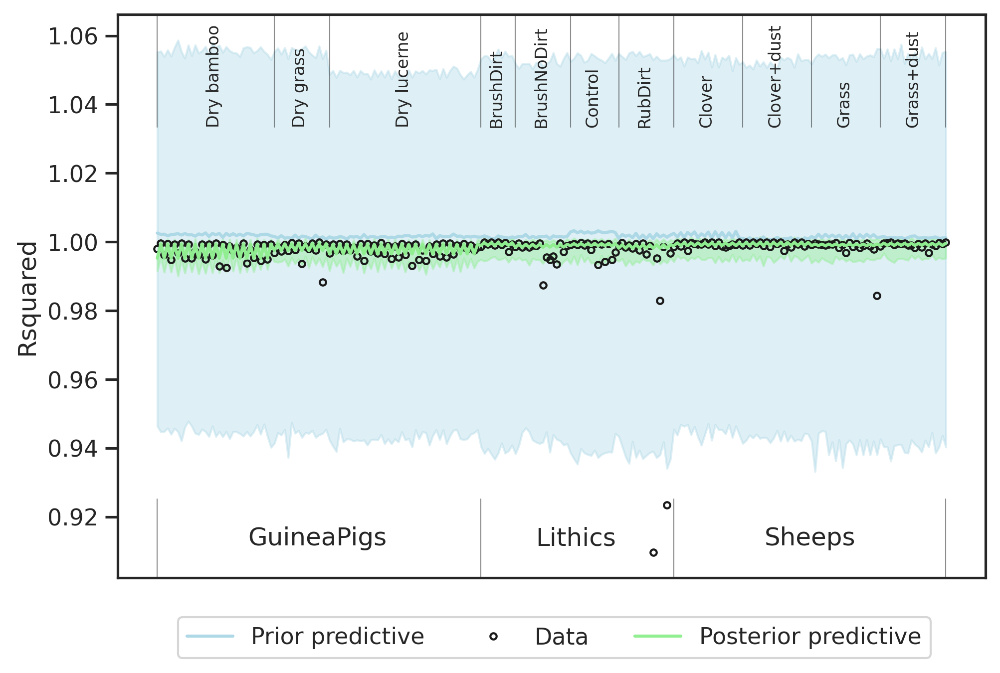
    


#### Compare prior and posterior for model parameters


```python
with RsquaredModel as model:
    pm_data_Rsquared = az.from_pymc3(trace=trace_Rsquared,prior=prior_pred_Rsquared,posterior_predictive=posterior_pred_Rsquared)
```

    arviz.data.io_pymc3 - WARNING - posterior predictive variable Rsquared_y's shape not compatible with number of chains and draws. This can mean that some draws or even whole chains are not represented.


```python
plotting_lib.plotPriorPosteriorB(widthInch,heigthInch,dpi,sizes,writeOut,outPathPlots,dictMeanStd,\
                                 pm_data_Rsquared,'Rsquared',prefix)
```


    
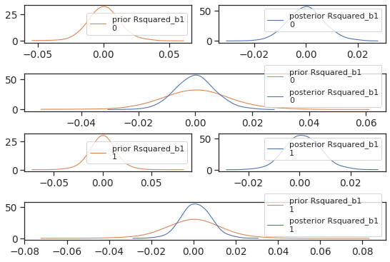
    


```python
plotting_lib.plotLevels(widthInch,heigthInch,dpi,sizes,writeOut,outPathPlots,dictMeanStd,\
                        dictTreatment,dictSoftware,trace_Rsquared,'Rsquared',x1,x2)
```


    

    


```python
plotting_lib.plotLevelsStd(widthInch,heigthInch,dpi,sizes,writeOut,outPathPlots,dictMeanStd,\
                           dictTreatment,dictSoftware,trace_Rsquared,'Rsquared',x1,x2)
```


    
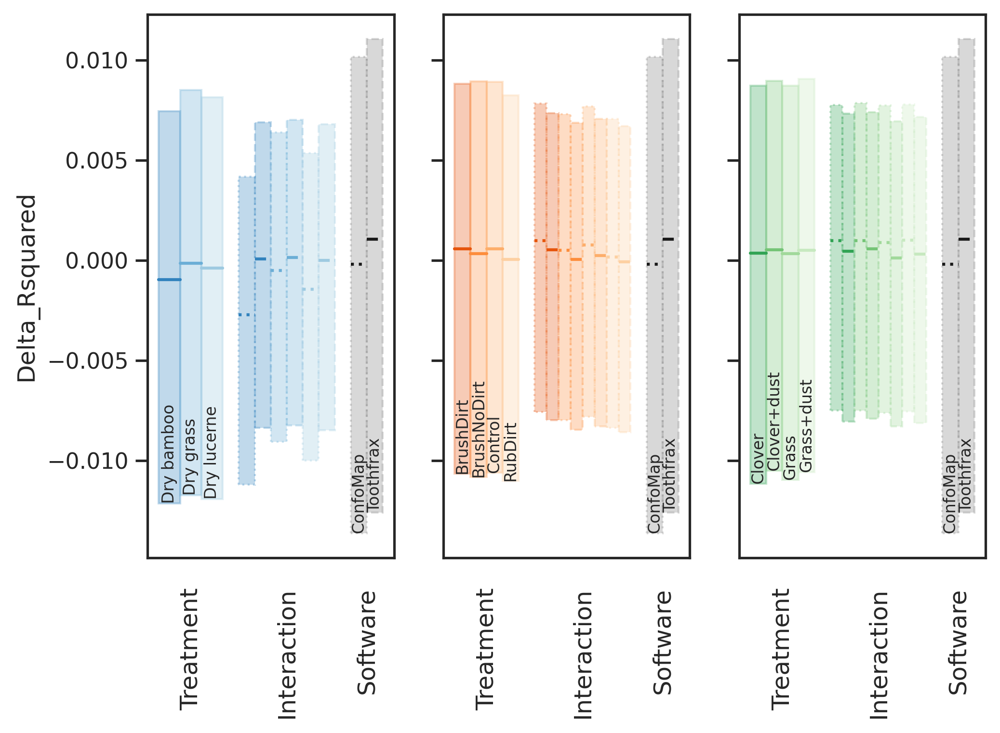
    


#### Posterior and contrasts


```python
plotting_lib.plotPosterior(widthInch,heigthInch,dpi,writeOut,outPathPlots,dictMeanStd,\
                           pm_data_Rsquared,'Rsquared',prefix)
```


    

    


```python
df_hdi_R = plotting_lib.plotTreatmentPosterior(widthInch,heigthInch,dpi,sizes,writeOut,outPathPlots,dictMeanStd,\
                                               dictTreatment,dictSoftware,trace_Rsquared,'Rsquared',x1,x2,prefix)
```


    

    


```python
df_hdi_R
```


<div>
<style scoped>
    .dataframe tbody tr th:only-of-type {
        vertical-align: middle;
    }

    .dataframe tbody tr th {
        vertical-align: top;
    }

    .dataframe thead th {
        text-align: right;
    }
</style>
<table border="1" class="dataframe">
  <thead>
    <tr style="text-align: right;">
      <th></th>
      <th>Treatment_i</th>
      <th>Treatment_j</th>
      <th>hdi_ConfoMap_2.5%</th>
      <th>hdi_ConfoMap_97.5%</th>
      <th>isSignificant_on_ConfoMap</th>
      <th>hdi_Toothfrax_2.5%</th>
      <th>hdi_Toothfrax_97.5%</th>
      <th>isSignificant_on_Toothfrax</th>
    </tr>
  </thead>
  <tbody>
    <tr>
      <th>0</th>
      <td>Dry grass</td>
      <td>Dry bamboo</td>
      <td>0.001541</td>
      <td>0.002830</td>
      <td>True</td>
      <td>-0.000339</td>
      <td>0.000455</td>
      <td>False</td>
    </tr>
    <tr>
      <th>1</th>
      <td>Dry lucerne</td>
      <td>Dry bamboo</td>
      <td>0.000551</td>
      <td>0.001855</td>
      <td>True</td>
      <td>-0.000373</td>
      <td>0.000178</td>
      <td>False</td>
    </tr>
    <tr>
      <th>2</th>
      <td>Dry lucerne</td>
      <td>Dry grass</td>
      <td>-0.001538</td>
      <td>-0.000439</td>
      <td>True</td>
      <td>-0.000609</td>
      <td>0.000202</td>
      <td>False</td>
    </tr>
    <tr>
      <th>3</th>
      <td>BrushNoDirt</td>
      <td>BrushDirt</td>
      <td>-0.001141</td>
      <td>0.000105</td>
      <td>False</td>
      <td>-0.000936</td>
      <td>0.000088</td>
      <td>False</td>
    </tr>
    <tr>
      <th>4</th>
      <td>Control</td>
      <td>BrushDirt</td>
      <td>-0.001287</td>
      <td>0.000661</td>
      <td>False</td>
      <td>-0.000664</td>
      <td>0.000164</td>
      <td>False</td>
    </tr>
    <tr>
      <th>5</th>
      <td>Control</td>
      <td>BrushNoDirt</td>
      <td>-0.000739</td>
      <td>0.001189</td>
      <td>False</td>
      <td>-0.000262</td>
      <td>0.000716</td>
      <td>False</td>
    </tr>
    <tr>
      <th>6</th>
      <td>RubDirt</td>
      <td>BrushDirt</td>
      <td>-0.001555</td>
      <td>-0.000071</td>
      <td>True</td>
      <td>-0.001123</td>
      <td>0.000027</td>
      <td>False</td>
    </tr>
    <tr>
      <th>7</th>
      <td>RubDirt</td>
      <td>BrushNoDirt</td>
      <td>-0.001066</td>
      <td>0.000435</td>
      <td>False</td>
      <td>-0.000755</td>
      <td>0.000524</td>
      <td>False</td>
    </tr>
    <tr>
      <th>8</th>
      <td>RubDirt</td>
      <td>Control</td>
      <td>-0.001689</td>
      <td>0.000501</td>
      <td>False</td>
      <td>-0.000874</td>
      <td>0.000229</td>
      <td>False</td>
    </tr>
    <tr>
      <th>9</th>
      <td>Clover+dust</td>
      <td>Clover</td>
      <td>-0.000440</td>
      <td>0.000460</td>
      <td>False</td>
      <td>-0.000216</td>
      <td>0.000461</td>
      <td>False</td>
    </tr>
    <tr>
      <th>10</th>
      <td>Grass</td>
      <td>Clover</td>
      <td>-0.000685</td>
      <td>0.000545</td>
      <td>False</td>
      <td>-0.000706</td>
      <td>0.000045</td>
      <td>False</td>
    </tr>
    <tr>
      <th>11</th>
      <td>Grass</td>
      <td>Clover+dust</td>
      <td>-0.000705</td>
      <td>0.000535</td>
      <td>False</td>
      <td>-0.000831</td>
      <td>-0.000136</td>
      <td>True</td>
    </tr>
    <tr>
      <th>12</th>
      <td>Grass+dust</td>
      <td>Clover</td>
      <td>-0.000430</td>
      <td>0.000526</td>
      <td>False</td>
      <td>-0.000451</td>
      <td>0.000218</td>
      <td>False</td>
    </tr>
    <tr>
      <th>13</th>
      <td>Grass+dust</td>
      <td>Clover+dust</td>
      <td>-0.000516</td>
      <td>0.000495</td>
      <td>False</td>
      <td>-0.000568</td>
      <td>0.000045</td>
      <td>False</td>
    </tr>
    <tr>
      <th>14</th>
      <td>Grass+dust</td>
      <td>Grass</td>
      <td>-0.000502</td>
      <td>0.000785</td>
      <td>False</td>
      <td>-0.000141</td>
      <td>0.000578</td>
      <td>False</td>
    </tr>
  </tbody>
</table>
</div>


```python
plotting_lib.plotTreatmentPosteriorDiff(widthInch,heigthInch,dpi,sizes,writeOut,outPathPlots,dictMeanStd,\
                                        dictTreatment,dictSoftware,trace_Rsquared,'Rsquared',x1,x2,prefix)
```


    

    


    

    


    

    


    

    


    

    


```python
if writeOut:
    df_hdi_R.to_csv(outPathData+ '{}_hdi_{}.csv'.format(prefix,'Rsquared'))
```

### Asfc  <a name="Asfc"></a>


```python
with pm.Model() as model:
    AsfcModel = TwoFactorModel('Asfc',x1,x2,dataZ["Asfc_z"].values)
```

#### Verify model settings


```python
AsfcModel.printParams(x1,x2,dataZ["Asfc_z"].values)
```

    The number of levels of the x variables are (2, 11)
    The standard deviations used for the beta priors are  (1.0817297140638054, 1.6678950572969222)
    The standard deviations used for the M12 priors are 0.09939835381489054


```python
pm.model_to_graphviz(AsfcModel)
```


    
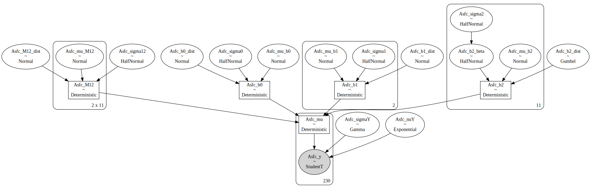
    


#### Check prior choice


```python
with AsfcModel as model:
    prior_pred_Asfc = pm.sample_prior_predictive(samples=numPredSamples,random_seed=random_seed)
```


```python
plotting_lib.plotPriorPredictive(widthInch,heigthInch,dpi,writeOut,outPathPlots,df,dictMeanStd,\
                                 prior_pred_Asfc,dataZ["Asfc_z"].values,'Asfc',prefix)
```


    

    


Prior choice is as intended: Broad over the data range.

#### Sampling


```python
with AsfcModel as model:
    trace_Asfc = pm.sample(numSamples,cores=numCores,tune=numTune,max_treedepth=20, init='auto',target_accept=0.99,random_seed=random_seed)
```

    Auto-assigning NUTS sampler...
    Initializing NUTS using jitter+adapt_diag...
    Multiprocess sampling (4 chains in 4 jobs)
    NUTS: [Asfc_M12_dist, Asfc_mu_M12, Asfc_b2_dist, Asfc_b2_beta, Asfc_b1_dist, Asfc_b0_dist, Asfc_sigmaY, Asfc_nuY, Asfc_sigma12, Asfc_mu_b2, Asfc_mu_b1, Asfc_mu_b0, Asfc_sigma2, Asfc_sigma1, Asfc_sigma0]


<div>
    <style>
        /* Turns off some styling */
        progress {
            /* gets rid of default border in Firefox and Opera. */
            border: none;
            /* Needs to be in here for Safari polyfill so background images work as expected. */
            background-size: auto;
        }
        .progress-bar-interrupted, .progress-bar-interrupted::-webkit-progress-bar {
            background: #F44336;
        }
    </style>
  <progress value='8000' class='' max='8000' style='width:300px; height:20px; vertical-align: middle;'></progress>
  100.00% [8000/8000 10:43<00:00 Sampling 4 chains, 0 divergences]
</div>


    Sampling 4 chains for 1_000 tune and 1_000 draw iterations (4_000 + 4_000 draws total) took 644 seconds.
    The estimated number of effective samples is smaller than 200 for some parameters.


```python
with AsfcModel as model:
    if writeOut:
        with open(outPathData + '{}_model_{}.pkl'.format(prefix,'Asfc'), 'wb') as buff:
            pickle.dump({'model': AsfcModel, 'trace': trace_Asfc}, buff)
```

#### Check sampling


```python
with AsfcModel as model:
    dataTrace_Asfc = az.from_pymc3(trace=trace_Asfc)
```


```python
pm.summary(dataTrace_Asfc,hdi_prob=0.95).round(2)
```


<div>
<style scoped>
    .dataframe tbody tr th:only-of-type {
        vertical-align: middle;
    }

    .dataframe tbody tr th {
        vertical-align: top;
    }

    .dataframe thead th {
        text-align: right;
    }
</style>
<table border="1" class="dataframe">
  <thead>
    <tr style="text-align: right;">
      <th></th>
      <th>mean</th>
      <th>sd</th>
      <th>hdi_2.5%</th>
      <th>hdi_97.5%</th>
      <th>mcse_mean</th>
      <th>mcse_sd</th>
      <th>ess_mean</th>
      <th>ess_sd</th>
      <th>ess_bulk</th>
      <th>ess_tail</th>
      <th>r_hat</th>
    </tr>
  </thead>
  <tbody>
    <tr>
      <th>Asfc_mu_b0</th>
      <td>-0.03</td>
      <td>0.82</td>
      <td>-1.62</td>
      <td>1.50</td>
      <td>0.01</td>
      <td>0.01</td>
      <td>4569.0</td>
      <td>1742.0</td>
      <td>4604.0</td>
      <td>3062.0</td>
      <td>1.0</td>
    </tr>
    <tr>
      <th>Asfc_mu_b1[0]</th>
      <td>0.06</td>
      <td>0.72</td>
      <td>-1.37</td>
      <td>1.47</td>
      <td>0.01</td>
      <td>0.01</td>
      <td>5112.0</td>
      <td>1836.0</td>
      <td>5115.0</td>
      <td>2795.0</td>
      <td>1.0</td>
    </tr>
    <tr>
      <th>Asfc_mu_b1[1]</th>
      <td>-0.11</td>
      <td>0.72</td>
      <td>-1.55</td>
      <td>1.26</td>
      <td>0.01</td>
      <td>0.01</td>
      <td>4876.0</td>
      <td>2061.0</td>
      <td>4878.0</td>
      <td>2946.0</td>
      <td>1.0</td>
    </tr>
    <tr>
      <th>Asfc_mu_b2[0]</th>
      <td>1.16</td>
      <td>0.76</td>
      <td>-0.36</td>
      <td>2.66</td>
      <td>0.01</td>
      <td>0.01</td>
      <td>3730.0</td>
      <td>3282.0</td>
      <td>3758.0</td>
      <td>3092.0</td>
      <td>1.0</td>
    </tr>
    <tr>
      <th>Asfc_mu_b2[1]</th>
      <td>0.90</td>
      <td>0.75</td>
      <td>-0.54</td>
      <td>2.40</td>
      <td>0.01</td>
      <td>0.01</td>
      <td>4520.0</td>
      <td>3394.0</td>
      <td>4559.0</td>
      <td>2919.0</td>
      <td>1.0</td>
    </tr>
    <tr>
      <th>...</th>
      <td>...</td>
      <td>...</td>
      <td>...</td>
      <td>...</td>
      <td>...</td>
      <td>...</td>
      <td>...</td>
      <td>...</td>
      <td>...</td>
      <td>...</td>
      <td>...</td>
    </tr>
    <tr>
      <th>Asfc_mu[225]</th>
      <td>-0.93</td>
      <td>0.04</td>
      <td>-1.02</td>
      <td>-0.85</td>
      <td>0.00</td>
      <td>0.00</td>
      <td>4032.0</td>
      <td>4032.0</td>
      <td>4049.0</td>
      <td>3672.0</td>
      <td>1.0</td>
    </tr>
    <tr>
      <th>Asfc_mu[226]</th>
      <td>-0.93</td>
      <td>0.04</td>
      <td>-1.01</td>
      <td>-0.84</td>
      <td>0.00</td>
      <td>0.00</td>
      <td>3668.0</td>
      <td>3651.0</td>
      <td>3647.0</td>
      <td>3391.0</td>
      <td>1.0</td>
    </tr>
    <tr>
      <th>Asfc_mu[227]</th>
      <td>-0.93</td>
      <td>0.04</td>
      <td>-1.02</td>
      <td>-0.85</td>
      <td>0.00</td>
      <td>0.00</td>
      <td>4032.0</td>
      <td>4032.0</td>
      <td>4049.0</td>
      <td>3672.0</td>
      <td>1.0</td>
    </tr>
    <tr>
      <th>Asfc_mu[228]</th>
      <td>-0.93</td>
      <td>0.04</td>
      <td>-1.01</td>
      <td>-0.84</td>
      <td>0.00</td>
      <td>0.00</td>
      <td>3668.0</td>
      <td>3651.0</td>
      <td>3647.0</td>
      <td>3391.0</td>
      <td>1.0</td>
    </tr>
    <tr>
      <th>Asfc_mu[229]</th>
      <td>-0.93</td>
      <td>0.04</td>
      <td>-1.02</td>
      <td>-0.85</td>
      <td>0.00</td>
      <td>0.00</td>
      <td>4032.0</td>
      <td>4032.0</td>
      <td>4049.0</td>
      <td>3672.0</td>
      <td>1.0</td>
    </tr>
  </tbody>
</table>
<p>334 rows × 11 columns</p>
</div>


```python
plotting_lib.plotDiagnostics(widthInch,heigthInch,dpi,writeOut,outPathPlots,trace_Asfc,dataTrace_Asfc,'Asfc',prefix)
```

    /home/bob/Documents/Projekt_Neuwied/SSFA/ssfa-env/lib/python3.7/site-packages/arviz/plots/backends/matplotlib/pairplot.py:216: UserWarning: rcParams['plot.max_subplots'] (40) is smaller than the number of resulting pair plots with these variables, generating only a 8x8 grid
      UserWarning,


    

    


    

    


    

    


    

    


```python
with AsfcModel as model:
    plotting_lib.plotTracesB(widthInch,heigthInch,dpi,writeOut,outPathPlots,trace_Asfc,'Asfc',prefix)
```


    

    


```python
with AsfcModel as model:
    plotting_lib.pm.energyplot(trace_Asfc)
```


    

    


#### Posterior predictive distribution


```python
with AsfcModel as model:
    posterior_pred_Asfc = pm.sample_posterior_predictive(trace_Asfc,samples=numPredSamples,random_seed=random_seed)
```

    /home/bob/Documents/Projekt_Neuwied/SSFA/ssfa-env/lib/python3.7/site-packages/pymc3/sampling.py:1708: UserWarning: samples parameter is smaller than nchains times ndraws, some draws and/or chains may not be represented in the returned posterior predictive sample
      "samples parameter is smaller than nchains times ndraws, some draws "


<div>
    <style>
        /* Turns off some styling */
        progress {
            /* gets rid of default border in Firefox and Opera. */
            border: none;
            /* Needs to be in here for Safari polyfill so background images work as expected. */
            background-size: auto;
        }
        .progress-bar-interrupted, .progress-bar-interrupted::-webkit-progress-bar {
            background: #F44336;
        }
    </style>
  <progress value='2000' class='' max='2000' style='width:300px; height:20px; vertical-align: middle;'></progress>
  100.00% [2000/2000 00:02<00:00]
</div>


```python
plotting_lib.plotPriorPosteriorPredictive(widthInch,heigthInch,dpi,writeOut,outPathPlots,df,\
                                          dictMeanStd,prior_pred_Asfc,posterior_pred_Asfc,\
                                          dataZ["Asfc_z"].values,'Asfc',prefix)
```


    

    


```python
plotting_lib.plotLevels(widthInch,heigthInch,dpi,sizes,writeOut,outPathPlots,dictMeanStd,dictTreatment,\
                        dictSoftware,trace_Asfc,'Asfc',x1,x2)
```


    

    


```python
plotting_lib.plotLevelsStd(widthInch,heigthInch,dpi,sizes,writeOut,outPathPlots,dictMeanStd,dictTreatment,\
                           dictSoftware,trace_Asfc,'Asfc',x1,x2)
```


    

    


#### Compare prior and posterior for model parameters


```python
with AsfcModel as model:
    pm_data_Asfc = az.from_pymc3(trace=trace_Asfc,prior=prior_pred_Asfc,posterior_predictive=posterior_pred_Asfc)
```

    arviz.data.io_pymc3 - WARNING - posterior predictive variable Asfc_y's shape not compatible with number of chains and draws. This can mean that some draws or even whole chains are not represented.


```python
plotting_lib.plotPriorPosteriorB(widthInch,heigthInch,dpi,sizes,writeOut,outPathPlots,dictMeanStd,\
                                 pm_data_Asfc,'Asfc',prefix)
```


    

    


#### Posterior and contrasts


```python
plotting_lib.plotPosterior(widthInch,heigthInch,dpi,writeOut,outPathPlots,dictMeanStd,pm_data_Asfc,'Asfc',prefix)
```


    

    


```python
df_hdi_Asfc = plotting_lib.plotTreatmentPosterior(widthInch,heigthInch,dpi,sizes,writeOut,\
                                                  outPathPlots,dictMeanStd,dictTreatment,dictSoftware,\
                                                  trace_Asfc,'Asfc',x1,x2,prefix)
```


    

    


```python
df_hdi_Asfc
```


<div>
<style scoped>
    .dataframe tbody tr th:only-of-type {
        vertical-align: middle;
    }

    .dataframe tbody tr th {
        vertical-align: top;
    }

    .dataframe thead th {
        text-align: right;
    }
</style>
<table border="1" class="dataframe">
  <thead>
    <tr style="text-align: right;">
      <th></th>
      <th>Treatment_i</th>
      <th>Treatment_j</th>
      <th>hdi_ConfoMap_2.5%</th>
      <th>hdi_ConfoMap_97.5%</th>
      <th>isSignificant_on_ConfoMap</th>
      <th>hdi_Toothfrax_2.5%</th>
      <th>hdi_Toothfrax_97.5%</th>
      <th>isSignificant_on_Toothfrax</th>
    </tr>
  </thead>
  <tbody>
    <tr>
      <th>0</th>
      <td>Dry grass</td>
      <td>Dry bamboo</td>
      <td>-2.914947</td>
      <td>2.365610</td>
      <td>False</td>
      <td>-2.600433</td>
      <td>1.769296</td>
      <td>False</td>
    </tr>
    <tr>
      <th>1</th>
      <td>Dry lucerne</td>
      <td>Dry bamboo</td>
      <td>-1.399234</td>
      <td>2.293610</td>
      <td>False</td>
      <td>-1.732294</td>
      <td>1.659878</td>
      <td>False</td>
    </tr>
    <tr>
      <th>2</th>
      <td>Dry lucerne</td>
      <td>Dry grass</td>
      <td>-1.688190</td>
      <td>3.380153</td>
      <td>False</td>
      <td>-1.669210</td>
      <td>2.232344</td>
      <td>False</td>
    </tr>
    <tr>
      <th>3</th>
      <td>BrushNoDirt</td>
      <td>BrushDirt</td>
      <td>-15.196748</td>
      <td>3.533049</td>
      <td>False</td>
      <td>-14.476359</td>
      <td>3.598702</td>
      <td>False</td>
    </tr>
    <tr>
      <th>4</th>
      <td>Control</td>
      <td>BrushDirt</td>
      <td>-35.751145</td>
      <td>4.803498</td>
      <td>False</td>
      <td>-31.583528</td>
      <td>3.896526</td>
      <td>False</td>
    </tr>
    <tr>
      <th>5</th>
      <td>Control</td>
      <td>BrushNoDirt</td>
      <td>-33.267965</td>
      <td>15.869328</td>
      <td>False</td>
      <td>-30.695311</td>
      <td>14.827444</td>
      <td>False</td>
    </tr>
    <tr>
      <th>6</th>
      <td>RubDirt</td>
      <td>BrushDirt</td>
      <td>-43.457907</td>
      <td>-34.032025</td>
      <td>True</td>
      <td>-36.298904</td>
      <td>-25.764600</td>
      <td>True</td>
    </tr>
    <tr>
      <th>7</th>
      <td>RubDirt</td>
      <td>BrushNoDirt</td>
      <td>-43.669076</td>
      <td>-23.369520</td>
      <td>True</td>
      <td>-36.904964</td>
      <td>-15.465674</td>
      <td>True</td>
    </tr>
    <tr>
      <th>8</th>
      <td>RubDirt</td>
      <td>Control</td>
      <td>-44.050859</td>
      <td>-2.428273</td>
      <td>True</td>
      <td>-37.081175</td>
      <td>0.973047</td>
      <td>False</td>
    </tr>
    <tr>
      <th>9</th>
      <td>Clover+dust</td>
      <td>Clover</td>
      <td>-3.719954</td>
      <td>2.410717</td>
      <td>False</td>
      <td>-3.596101</td>
      <td>2.037584</td>
      <td>False</td>
    </tr>
    <tr>
      <th>10</th>
      <td>Grass</td>
      <td>Clover</td>
      <td>-5.067046</td>
      <td>1.295456</td>
      <td>False</td>
      <td>-4.849023</td>
      <td>0.951618</td>
      <td>False</td>
    </tr>
    <tr>
      <th>11</th>
      <td>Grass</td>
      <td>Clover+dust</td>
      <td>-3.219981</td>
      <td>0.650326</td>
      <td>False</td>
      <td>-2.833752</td>
      <td>0.633075</td>
      <td>False</td>
    </tr>
    <tr>
      <th>12</th>
      <td>Grass+dust</td>
      <td>Clover</td>
      <td>-5.715432</td>
      <td>0.022721</td>
      <td>False</td>
      <td>-5.235751</td>
      <td>0.294740</td>
      <td>False</td>
    </tr>
    <tr>
      <th>13</th>
      <td>Grass+dust</td>
      <td>Clover+dust</td>
      <td>-3.949583</td>
      <td>-0.482832</td>
      <td>True</td>
      <td>-3.407486</td>
      <td>-0.126538</td>
      <td>True</td>
    </tr>
    <tr>
      <th>14</th>
      <td>Grass+dust</td>
      <td>Grass</td>
      <td>-2.676912</td>
      <td>0.879903</td>
      <td>False</td>
      <td>-2.324307</td>
      <td>1.051653</td>
      <td>False</td>
    </tr>
  </tbody>
</table>
</div>


```python
plotting_lib.plotTreatmentPosteriorDiff(widthInch,heigthInch,dpi,sizes,writeOut,outPathPlots,dictMeanStd,\
                                        dictTreatment,dictSoftware,trace_Asfc,'Asfc',x1,x2,prefix)
```


    

    


```python
if writeOut:
    df_hdi_Asfc.to_csv(outPathData+ '{}_hdi_{}.csv'.format(prefix,'Asfc'))
```

### 	Smfc  <a name="Smfc"></a>


```python
with pm.Model() as model:
    SmfcModel = TwoFactorModel('Smfc',x1,x2,dataZ.Smfc_z.values)
```

#### Verify model settings


```python
SmfcModel.printParams(x1,x2,dataZ.Smfc_z.values)
```

    The number of levels of the x variables are (2, 11)
    The standard deviations used for the beta priors are  (1.2914215627674575, 3.238203806583398)
    The standard deviations used for the M12 priors are 0.17431102622720077


```python
pm.model_to_graphviz(SmfcModel)
```


    

    


#### Check prior choice


```python
with SmfcModel as model:
    prior_pred_Smfc = pm.sample_prior_predictive(samples=numPredSamples,random_seed=random_seed)
```


```python
plotting_lib.plotPriorPredictive(widthInch,heigthInch,dpi,writeOut,outPathPlots,df,dictMeanStd,\
                                 prior_pred_Smfc,dataZ.Smfc_z.values,'Smfc',prefix)
```


    

    


Prior choice is as intended: Broad over the data range.

#### Sampling


```python
with SmfcModel as model:
    trace_Smfc = pm.sample(numSamples,cores=numCores,tune=numTune,max_treedepth=20, init='auto',target_accept=0.99,random_seed=random_seed)
```

    Auto-assigning NUTS sampler...
    Initializing NUTS using jitter+adapt_diag...
    Multiprocess sampling (4 chains in 4 jobs)
    NUTS: [Smfc_M12_dist, Smfc_mu_M12, Smfc_b2_dist, Smfc_b2_beta, Smfc_b1_dist, Smfc_b0_dist, Smfc_sigmaY, Smfc_nuY, Smfc_sigma12, Smfc_mu_b2, Smfc_mu_b1, Smfc_mu_b0, Smfc_sigma2, Smfc_sigma1, Smfc_sigma0]


<div>
    <style>
        /* Turns off some styling */
        progress {
            /* gets rid of default border in Firefox and Opera. */
            border: none;
            /* Needs to be in here for Safari polyfill so background images work as expected. */
            background-size: auto;
        }
        .progress-bar-interrupted, .progress-bar-interrupted::-webkit-progress-bar {
            background: #F44336;
        }
    </style>
  <progress value='811' class='' max='8000' style='width:300px; height:20px; vertical-align: middle;'></progress>
  10.14% [811/8000 00:16<02:29 Sampling 4 chains, 0 divergences]
</div>


    ---------------------------------------------------------------------------

    KeyboardInterrupt                         Traceback (most recent call last)

    ~/Documents/Projekt_Neuwied/SSFA/ssfa-env/lib/python3.7/site-packages/pymc3/sampling.py in _mp_sample(draws, tune, step, chains, cores, chain, random_seed, start, progressbar, trace, model, callback, discard_tuned_samples, mp_ctx, pickle_backend, **kwargs)
       1485             with sampler:
    -> 1486                 for draw in sampler:
       1487                     trace = traces[draw.chain - chain]


    ~/Documents/Projekt_Neuwied/SSFA/ssfa-env/lib/python3.7/site-packages/pymc3/parallel_sampling.py in __iter__(self)
        491         while self._active:
    --> 492             draw = ProcessAdapter.recv_draw(self._active)
        493             proc, is_last, draw, tuning, stats, warns = draw


    ~/Documents/Projekt_Neuwied/SSFA/ssfa-env/lib/python3.7/site-packages/pymc3/parallel_sampling.py in recv_draw(processes, timeout)
        351         pipes = [proc._msg_pipe for proc in processes]
    --> 352         ready = multiprocessing.connection.wait(pipes)
        353         if not ready:


    /usr/lib/python3.7/multiprocessing/connection.py in wait(object_list, timeout)
        919             while True:
    --> 920                 ready = selector.select(timeout)
        921                 if ready:


    /usr/lib/python3.7/selectors.py in select(self, timeout)
        414         try:
    --> 415             fd_event_list = self._selector.poll(timeout)
        416         except InterruptedError:


    KeyboardInterrupt: 

    
    During handling of the above exception, another exception occurred:


    ValueError                                Traceback (most recent call last)

    <ipython-input-104-4de91012caf3> in <module>
          1 with SmfcModel as model:
    ----> 2     trace_Smfc = pm.sample(numSamples,cores=numCores,tune=numTune,max_treedepth=20, init='auto',target_accept=0.99,random_seed=random_seed)
    

    ~/Documents/Projekt_Neuwied/SSFA/ssfa-env/lib/python3.7/site-packages/pymc3/sampling.py in sample(draws, step, init, n_init, start, trace, chain_idx, chains, cores, tune, progressbar, model, random_seed, discard_tuned_samples, compute_convergence_checks, callback, return_inferencedata, idata_kwargs, mp_ctx, pickle_backend, **kwargs)
        543         _print_step_hierarchy(step)
        544         try:
    --> 545             trace = _mp_sample(**sample_args, **parallel_args)
        546         except pickle.PickleError:
        547             _log.warning("Could not pickle model, sampling singlethreaded.")


    ~/Documents/Projekt_Neuwied/SSFA/ssfa-env/lib/python3.7/site-packages/pymc3/sampling.py in _mp_sample(draws, tune, step, chains, cores, chain, random_seed, start, progressbar, trace, model, callback, discard_tuned_samples, mp_ctx, pickle_backend, **kwargs)
       1510     except KeyboardInterrupt:
       1511         if discard_tuned_samples:
    -> 1512             traces, length = _choose_chains(traces, tune)
       1513         else:
       1514             traces, length = _choose_chains(traces, 0)


    ~/Documents/Projekt_Neuwied/SSFA/ssfa-env/lib/python3.7/site-packages/pymc3/sampling.py in _choose_chains(traces, tune)
       1528     lengths = [max(0, len(trace) - tune) for trace in traces]
       1529     if not sum(lengths):
    -> 1530         raise ValueError("Not enough samples to build a trace.")
       1531 
       1532     idxs = np.argsort(lengths)[::-1]


    ValueError: Not enough samples to build a trace.


Analysis stopped here because sampling did not converge.
As the plot shows, some data points are very far away from the others, which would require the analysis to be based on more heavy-tailed distributions.

### HAsfc9 <a name="HAsfc9"></a>


```python
with pm.Model() as model:
    HAsfc9Model = TwoFactorModel('HAsfc9',x1,x2,dataZ["HAsfc9_z"].values)
```

#### Verify model settings


```python
HAsfc9Model.printParams(x1,x2,dataZ["HAsfc9_z"].values)
```

    The number of levels of the x variables are (2, 11)
    The standard deviations used for the beta priors are  (1.2761156280868398, 3.214359712024942)
    The standard deviations used for the M12 priors are 0.17292035344730636


```python
pm.model_to_graphviz(HAsfc9Model)
```


    

    


#### Check prior choice


```python
with HAsfc9Model as model:
    prior_pred_HAsfc9 = pm.sample_prior_predictive(samples=numPredSamples,random_seed=random_seed)
```


```python
plotting_lib.plotPriorPredictive(widthInch,heigthInch,dpi,writeOut,outPathPlots,df,dictMeanStd,\
                                 prior_pred_HAsfc9,dataZ["HAsfc9_z"].values,'HAsfc9',prefix)
```


    

    


Prior choice is as intended: Broad over the data range.

#### Sampling


```python
with HAsfc9Model as model:
    trace_HAsfc9 = pm.sample(numSamples,cores=numCores,tune=numTune,max_treedepth=20, init='auto',target_accept=0.99,random_seed=random_seed)
```

    Auto-assigning NUTS sampler...
    Initializing NUTS using jitter+adapt_diag...
    Multiprocess sampling (4 chains in 4 jobs)
    NUTS: [HAsfc9_M12_dist, HAsfc9_mu_M12, HAsfc9_b2_dist, HAsfc9_b2_beta, HAsfc9_b1_dist, HAsfc9_b0_dist, HAsfc9_sigmaY, HAsfc9_nuY, HAsfc9_sigma12, HAsfc9_mu_b2, HAsfc9_mu_b1, HAsfc9_mu_b0, HAsfc9_sigma2, HAsfc9_sigma1, HAsfc9_sigma0]


<div>
    <style>
        /* Turns off some styling */
        progress {
            /* gets rid of default border in Firefox and Opera. */
            border: none;
            /* Needs to be in here for Safari polyfill so background images work as expected. */
            background-size: auto;
        }
        .progress-bar-interrupted, .progress-bar-interrupted::-webkit-progress-bar {
            background: #F44336;
        }
    </style>
  <progress value='8000' class='' max='8000' style='width:300px; height:20px; vertical-align: middle;'></progress>
  100.00% [8000/8000 13:52<00:00 Sampling 4 chains, 0 divergences]
</div>


    Sampling 4 chains for 1_000 tune and 1_000 draw iterations (4_000 + 4_000 draws total) took 833 seconds.


```python
with HAsfc9Model as model:
    if writeOut:
        with open(outPathData + '{}_model_{}.pkl'.format(prefix,'HAsfc9'), 'wb') as buff:
            pickle.dump({'model': HAsfc9Model, 'trace': trace_HAsfc9}, buff)
```

#### Check sampling


```python
with HAsfc9Model as model:
    dataTrace_HAsfc9 = az.from_pymc3(trace=trace_HAsfc9)
```


```python
pm.summary(dataTrace_HAsfc9,hdi_prob=0.95).round(2)
```


<div>
<style scoped>
    .dataframe tbody tr th:only-of-type {
        vertical-align: middle;
    }

    .dataframe tbody tr th {
        vertical-align: top;
    }

    .dataframe thead th {
        text-align: right;
    }
</style>
<table border="1" class="dataframe">
  <thead>
    <tr style="text-align: right;">
      <th></th>
      <th>mean</th>
      <th>sd</th>
      <th>hdi_2.5%</th>
      <th>hdi_97.5%</th>
      <th>mcse_mean</th>
      <th>mcse_sd</th>
      <th>ess_mean</th>
      <th>ess_sd</th>
      <th>ess_bulk</th>
      <th>ess_tail</th>
      <th>r_hat</th>
    </tr>
  </thead>
  <tbody>
    <tr>
      <th>HAsfc9_mu_b0</th>
      <td>-0.08</td>
      <td>0.81</td>
      <td>-1.71</td>
      <td>1.52</td>
      <td>0.01</td>
      <td>0.01</td>
      <td>4112.0</td>
      <td>2349.0</td>
      <td>4119.0</td>
      <td>3163.0</td>
      <td>1.0</td>
    </tr>
    <tr>
      <th>HAsfc9_mu_b1[0]</th>
      <td>-0.03</td>
      <td>0.74</td>
      <td>-1.43</td>
      <td>1.44</td>
      <td>0.01</td>
      <td>0.01</td>
      <td>3669.0</td>
      <td>2074.0</td>
      <td>3688.0</td>
      <td>2541.0</td>
      <td>1.0</td>
    </tr>
    <tr>
      <th>HAsfc9_mu_b1[1]</th>
      <td>-0.05</td>
      <td>0.74</td>
      <td>-1.44</td>
      <td>1.43</td>
      <td>0.01</td>
      <td>0.01</td>
      <td>3625.0</td>
      <td>2253.0</td>
      <td>3627.0</td>
      <td>2929.0</td>
      <td>1.0</td>
    </tr>
    <tr>
      <th>HAsfc9_mu_b2[0]</th>
      <td>-0.12</td>
      <td>0.66</td>
      <td>-1.46</td>
      <td>1.07</td>
      <td>0.01</td>
      <td>0.01</td>
      <td>3161.0</td>
      <td>2588.0</td>
      <td>3171.0</td>
      <td>3161.0</td>
      <td>1.0</td>
    </tr>
    <tr>
      <th>HAsfc9_mu_b2[1]</th>
      <td>-0.07</td>
      <td>0.67</td>
      <td>-1.42</td>
      <td>1.22</td>
      <td>0.01</td>
      <td>0.01</td>
      <td>3340.0</td>
      <td>2428.0</td>
      <td>3338.0</td>
      <td>2786.0</td>
      <td>1.0</td>
    </tr>
    <tr>
      <th>...</th>
      <td>...</td>
      <td>...</td>
      <td>...</td>
      <td>...</td>
      <td>...</td>
      <td>...</td>
      <td>...</td>
      <td>...</td>
      <td>...</td>
      <td>...</td>
      <td>...</td>
    </tr>
    <tr>
      <th>HAsfc9_mu[225]</th>
      <td>-0.21</td>
      <td>0.05</td>
      <td>-0.31</td>
      <td>-0.11</td>
      <td>0.00</td>
      <td>0.00</td>
      <td>3915.0</td>
      <td>3915.0</td>
      <td>3920.0</td>
      <td>3917.0</td>
      <td>1.0</td>
    </tr>
    <tr>
      <th>HAsfc9_mu[226]</th>
      <td>-0.18</td>
      <td>0.07</td>
      <td>-0.31</td>
      <td>-0.05</td>
      <td>0.00</td>
      <td>0.00</td>
      <td>4165.0</td>
      <td>4160.0</td>
      <td>4175.0</td>
      <td>3892.0</td>
      <td>1.0</td>
    </tr>
    <tr>
      <th>HAsfc9_mu[227]</th>
      <td>-0.21</td>
      <td>0.05</td>
      <td>-0.31</td>
      <td>-0.11</td>
      <td>0.00</td>
      <td>0.00</td>
      <td>3915.0</td>
      <td>3915.0</td>
      <td>3920.0</td>
      <td>3917.0</td>
      <td>1.0</td>
    </tr>
    <tr>
      <th>HAsfc9_mu[228]</th>
      <td>-0.18</td>
      <td>0.07</td>
      <td>-0.31</td>
      <td>-0.05</td>
      <td>0.00</td>
      <td>0.00</td>
      <td>4165.0</td>
      <td>4160.0</td>
      <td>4175.0</td>
      <td>3892.0</td>
      <td>1.0</td>
    </tr>
    <tr>
      <th>HAsfc9_mu[229]</th>
      <td>-0.21</td>
      <td>0.05</td>
      <td>-0.31</td>
      <td>-0.11</td>
      <td>0.00</td>
      <td>0.00</td>
      <td>3915.0</td>
      <td>3915.0</td>
      <td>3920.0</td>
      <td>3917.0</td>
      <td>1.0</td>
    </tr>
  </tbody>
</table>
<p>334 rows × 11 columns</p>
</div>


```python
plotting_lib.plotDiagnostics(widthInch,heigthInch,dpi,writeOut,outPathPlots,trace_HAsfc9,\
                             dataTrace_HAsfc9,'HAsfc9',prefix)
```

    /home/bob/Documents/Projekt_Neuwied/SSFA/ssfa-env/lib/python3.7/site-packages/arviz/plots/backends/matplotlib/pairplot.py:216: UserWarning: rcParams['plot.max_subplots'] (40) is smaller than the number of resulting pair plots with these variables, generating only a 8x8 grid
      UserWarning,


    

    


    

    


    

    


    

    


```python
with HAsfc9Model as model:
    plotting_lib.plotTracesB(widthInch,heigthInch,dpi,writeOut,outPathPlots,trace_HAsfc9,'HAsfc9',prefix)
```


    

    


```python
with HAsfc9Model as model:
    plotting_lib.pm.energyplot(trace_HAsfc9)
```


    
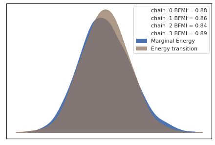
    


#### Posterior predictive distribution


```python
with HAsfc9Model as model:
    posterior_pred_HAsfc9 = pm.sample_posterior_predictive(trace_HAsfc9,samples=numPredSamples,random_seed=random_seed)
```

    /home/bob/Documents/Projekt_Neuwied/SSFA/ssfa-env/lib/python3.7/site-packages/pymc3/sampling.py:1708: UserWarning: samples parameter is smaller than nchains times ndraws, some draws and/or chains may not be represented in the returned posterior predictive sample
      "samples parameter is smaller than nchains times ndraws, some draws "


<div>
    <style>
        /* Turns off some styling */
        progress {
            /* gets rid of default border in Firefox and Opera. */
            border: none;
            /* Needs to be in here for Safari polyfill so background images work as expected. */
            background-size: auto;
        }
        .progress-bar-interrupted, .progress-bar-interrupted::-webkit-progress-bar {
            background: #F44336;
        }
    </style>
  <progress value='2000' class='' max='2000' style='width:300px; height:20px; vertical-align: middle;'></progress>
  100.00% [2000/2000 00:01<00:00]
</div>


```python
plotting_lib.plotPriorPosteriorPredictive(widthInch,heigthInch,dpi,writeOut,outPathPlots,df,dictMeanStd,\
                                          prior_pred_HAsfc9,posterior_pred_HAsfc9,dataZ["HAsfc9_z"].values,\
                                          'HAsfc9',prefix)
```


    

    


```python
plotting_lib.plotLevels(widthInch,heigthInch,dpi,sizes,writeOut,outPathPlots,dictMeanStd,dictTreatment,\
                        dictSoftware,trace_HAsfc9,'HAsfc9',x1,x2)
```


    
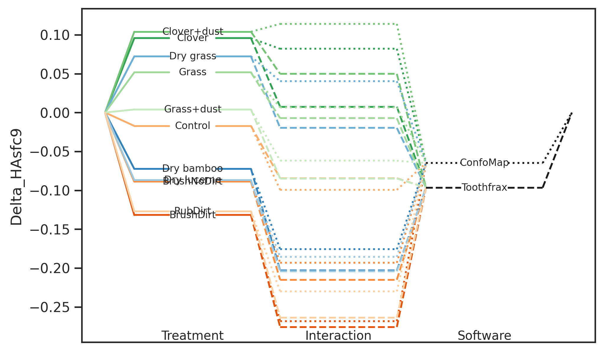
    


```python
plotting_lib.plotLevelsStd(widthInch,heigthInch,dpi,sizes,writeOut,outPathPlots,dictMeanStd,dictTreatment,\
                           dictSoftware,trace_HAsfc9,'HAsfc9',x1,x2)
```


    
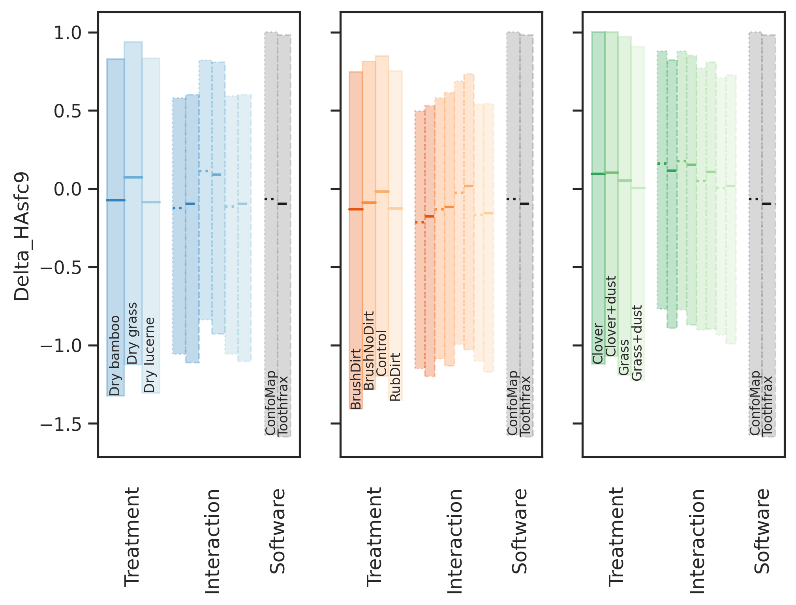
    


#### Compare prior and posterior for model parameters


```python
with HAsfc9Model as model:
    pm_data_HAsfc9 = az.from_pymc3(trace=trace_HAsfc9,prior=prior_pred_HAsfc9,posterior_predictive=posterior_pred_HAsfc9)
```

    arviz.data.io_pymc3 - WARNING - posterior predictive variable HAsfc9_y's shape not compatible with number of chains and draws. This can mean that some draws or even whole chains are not represented.


```python
plotting_lib.plotPriorPosteriorB(widthInch,heigthInch,dpi,sizes,writeOut,outPathPlots,dictMeanStd,\
                                 pm_data_HAsfc9,'HAsfc9',prefix)
```


    
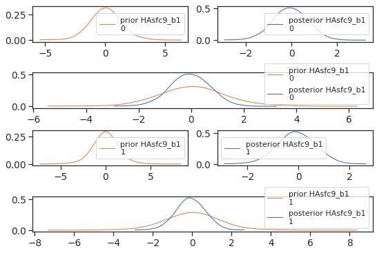
    


#### Posterior and contrasts


```python
plotting_lib.plotPosterior(widthInch,heigthInch,dpi,writeOut,outPathPlots,dictMeanStd,pm_data_HAsfc9,'HAsfc9',prefix)
```


    

    


```python
df_hdi_HAsfc9 = plotting_lib.plotTreatmentPosterior(widthInch,heigthInch,dpi,sizes,writeOut,\
                                                    outPathPlots,dictMeanStd,dictTreatment,dictSoftware,\
                                                    trace_HAsfc9,'HAsfc9',x1,x2,prefix)
```


    

    


```python
df_hdi_HAsfc9
```


<div>
<style scoped>
    .dataframe tbody tr th:only-of-type {
        vertical-align: middle;
    }

    .dataframe tbody tr th {
        vertical-align: top;
    }

    .dataframe thead th {
        text-align: right;
    }
</style>
<table border="1" class="dataframe">
  <thead>
    <tr style="text-align: right;">
      <th></th>
      <th>Treatment_i</th>
      <th>Treatment_j</th>
      <th>hdi_ConfoMap_2.5%</th>
      <th>hdi_ConfoMap_97.5%</th>
      <th>isSignificant_on_ConfoMap</th>
      <th>hdi_Toothfrax_2.5%</th>
      <th>hdi_Toothfrax_97.5%</th>
      <th>isSignificant_on_Toothfrax</th>
    </tr>
  </thead>
  <tbody>
    <tr>
      <th>0</th>
      <td>Dry grass</td>
      <td>Dry bamboo</td>
      <td>0.033511</td>
      <td>0.396677</td>
      <td>True</td>
      <td>0.027804</td>
      <td>0.321135</td>
      <td>True</td>
    </tr>
    <tr>
      <th>1</th>
      <td>Dry lucerne</td>
      <td>Dry bamboo</td>
      <td>-0.057178</td>
      <td>0.067876</td>
      <td>False</td>
      <td>-0.059019</td>
      <td>0.061239</td>
      <td>False</td>
    </tr>
    <tr>
      <th>2</th>
      <td>Dry lucerne</td>
      <td>Dry grass</td>
      <td>-0.380004</td>
      <td>-0.016990</td>
      <td>True</td>
      <td>-0.317744</td>
      <td>-0.026117</td>
      <td>True</td>
    </tr>
    <tr>
      <th>3</th>
      <td>BrushNoDirt</td>
      <td>BrushDirt</td>
      <td>-0.091347</td>
      <td>0.223721</td>
      <td>False</td>
      <td>-0.115916</td>
      <td>0.280188</td>
      <td>False</td>
    </tr>
    <tr>
      <th>4</th>
      <td>Control</td>
      <td>BrushDirt</td>
      <td>-0.010468</td>
      <td>0.410746</td>
      <td>False</td>
      <td>-0.038884</td>
      <td>0.471882</td>
      <td>False</td>
    </tr>
    <tr>
      <th>5</th>
      <td>Control</td>
      <td>BrushNoDirt</td>
      <td>-0.105794</td>
      <td>0.376993</td>
      <td>False</td>
      <td>-0.135469</td>
      <td>0.472578</td>
      <td>False</td>
    </tr>
    <tr>
      <th>6</th>
      <td>RubDirt</td>
      <td>BrushDirt</td>
      <td>-0.094686</td>
      <td>0.182720</td>
      <td>False</td>
      <td>-0.125451</td>
      <td>0.167933</td>
      <td>False</td>
    </tr>
    <tr>
      <th>7</th>
      <td>RubDirt</td>
      <td>BrushNoDirt</td>
      <td>-0.190732</td>
      <td>0.158962</td>
      <td>False</td>
      <td>-0.271961</td>
      <td>0.170081</td>
      <td>False</td>
    </tr>
    <tr>
      <th>8</th>
      <td>RubDirt</td>
      <td>Control</td>
      <td>-0.371713</td>
      <td>0.072724</td>
      <td>False</td>
      <td>-0.480866</td>
      <td>0.068933</td>
      <td>False</td>
    </tr>
    <tr>
      <th>9</th>
      <td>Clover+dust</td>
      <td>Clover</td>
      <td>-0.128477</td>
      <td>0.165133</td>
      <td>False</td>
      <td>-0.085937</td>
      <td>0.180708</td>
      <td>False</td>
    </tr>
    <tr>
      <th>10</th>
      <td>Grass</td>
      <td>Clover</td>
      <td>-0.304313</td>
      <td>0.064998</td>
      <td>False</td>
      <td>-0.139161</td>
      <td>0.119079</td>
      <td>False</td>
    </tr>
    <tr>
      <th>11</th>
      <td>Grass</td>
      <td>Clover+dust</td>
      <td>-0.276306</td>
      <td>0.045259</td>
      <td>False</td>
      <td>-0.172873</td>
      <td>0.076407</td>
      <td>False</td>
    </tr>
    <tr>
      <th>12</th>
      <td>Grass+dust</td>
      <td>Clover</td>
      <td>-0.329568</td>
      <td>0.009422</td>
      <td>False</td>
      <td>-0.225249</td>
      <td>0.033805</td>
      <td>False</td>
    </tr>
    <tr>
      <th>13</th>
      <td>Grass+dust</td>
      <td>Clover+dust</td>
      <td>-0.311129</td>
      <td>-0.032240</td>
      <td>True</td>
      <td>-0.253405</td>
      <td>0.000102</td>
      <td>False</td>
    </tr>
    <tr>
      <th>14</th>
      <td>Grass+dust</td>
      <td>Grass</td>
      <td>-0.234865</td>
      <td>0.131714</td>
      <td>False</td>
      <td>-0.210559</td>
      <td>0.036078</td>
      <td>False</td>
    </tr>
  </tbody>
</table>
</div>


```python
if writeOut:
    df_hdi_HAsfc9.to_csv(outPathData+ '{}_hdi_{}.csv'.format(prefix,'HAsfc9'))
```


```python
plotting_lib.plotTreatmentPosteriorDiff(widthInch,heigthInch,dpi,sizes,writeOut,outPathPlots,dictMeanStd,\
                                        dictTreatment,dictSoftware,trace_HAsfc9,'HAsfc9',x1,x2,prefix)
```


    
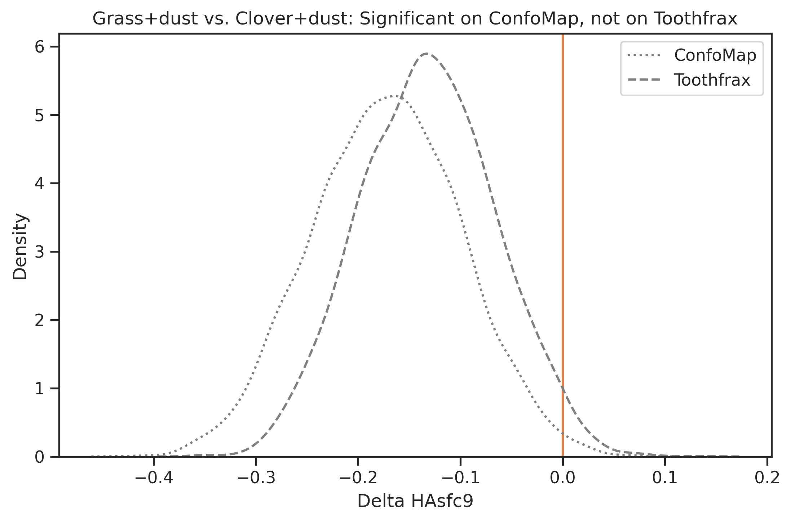
    


## Summary<a name="summary"></a>

Set the surface parameters for every treatment dataframe:


```python
df_hdi_Asfc["SurfaceParameter"] = "Asfc"
df_hdi_HAsfc9["SurfaceParameter"] = "HAsfc9"
df_hdi_R["SurfaceParameter"] = "R²"
df_hdi_epLsar["SurfaceParameter"] = "epLsar"
```


```python
df_hdi_total = pd.concat([df_hdi_epLsar,df_hdi_R,df_hdi_Asfc,df_hdi_HAsfc9],ignore_index=True)
```

Show the treatment pairs and surface parameters where the softwares differ


```python
df_summary = df_hdi_total[df_hdi_total.isSignificant_on_ConfoMap != df_hdi_total.isSignificant_on_Toothfrax][["Treatment_i","Treatment_j","SurfaceParameter","isSignificant_on_ConfoMap","isSignificant_on_Toothfrax","hdi_ConfoMap_2.5%","hdi_ConfoMap_97.5%","hdi_Toothfrax_2.5%","hdi_Toothfrax_97.5%"]]
df_summary
```


<div>
<style scoped>
    .dataframe tbody tr th:only-of-type {
        vertical-align: middle;
    }

    .dataframe tbody tr th {
        vertical-align: top;
    }

    .dataframe thead th {
        text-align: right;
    }
</style>
<table border="1" class="dataframe">
  <thead>
    <tr style="text-align: right;">
      <th></th>
      <th>Treatment_i</th>
      <th>Treatment_j</th>
      <th>SurfaceParameter</th>
      <th>isSignificant_on_ConfoMap</th>
      <th>isSignificant_on_Toothfrax</th>
      <th>hdi_ConfoMap_2.5%</th>
      <th>hdi_ConfoMap_97.5%</th>
      <th>hdi_Toothfrax_2.5%</th>
      <th>hdi_Toothfrax_97.5%</th>
    </tr>
  </thead>
  <tbody>
    <tr>
      <th>10</th>
      <td>Grass</td>
      <td>Clover</td>
      <td>epLsar</td>
      <td>False</td>
      <td>True</td>
      <td>-0.000204</td>
      <td>0.002888</td>
      <td>0.000434</td>
      <td>0.003762</td>
    </tr>
    <tr>
      <th>11</th>
      <td>Grass</td>
      <td>Clover+dust</td>
      <td>epLsar</td>
      <td>False</td>
      <td>True</td>
      <td>-0.000339</td>
      <td>0.002881</td>
      <td>0.000060</td>
      <td>0.003390</td>
    </tr>
    <tr>
      <th>15</th>
      <td>Dry grass</td>
      <td>Dry bamboo</td>
      <td>R²</td>
      <td>True</td>
      <td>False</td>
      <td>0.001541</td>
      <td>0.002830</td>
      <td>-0.000339</td>
      <td>0.000455</td>
    </tr>
    <tr>
      <th>16</th>
      <td>Dry lucerne</td>
      <td>Dry bamboo</td>
      <td>R²</td>
      <td>True</td>
      <td>False</td>
      <td>0.000551</td>
      <td>0.001855</td>
      <td>-0.000373</td>
      <td>0.000178</td>
    </tr>
    <tr>
      <th>17</th>
      <td>Dry lucerne</td>
      <td>Dry grass</td>
      <td>R²</td>
      <td>True</td>
      <td>False</td>
      <td>-0.001538</td>
      <td>-0.000439</td>
      <td>-0.000609</td>
      <td>0.000202</td>
    </tr>
    <tr>
      <th>21</th>
      <td>RubDirt</td>
      <td>BrushDirt</td>
      <td>R²</td>
      <td>True</td>
      <td>False</td>
      <td>-0.001555</td>
      <td>-0.000071</td>
      <td>-0.001123</td>
      <td>0.000027</td>
    </tr>
    <tr>
      <th>26</th>
      <td>Grass</td>
      <td>Clover+dust</td>
      <td>R²</td>
      <td>False</td>
      <td>True</td>
      <td>-0.000705</td>
      <td>0.000535</td>
      <td>-0.000831</td>
      <td>-0.000136</td>
    </tr>
    <tr>
      <th>38</th>
      <td>RubDirt</td>
      <td>Control</td>
      <td>Asfc</td>
      <td>True</td>
      <td>False</td>
      <td>-44.050859</td>
      <td>-2.428273</td>
      <td>-37.081175</td>
      <td>0.973047</td>
    </tr>
    <tr>
      <th>58</th>
      <td>Grass+dust</td>
      <td>Clover+dust</td>
      <td>HAsfc9</td>
      <td>True</td>
      <td>False</td>
      <td>-0.311129</td>
      <td>-0.032240</td>
      <td>-0.253405</td>
      <td>0.000102</td>
    </tr>
  </tbody>
</table>
</div>


```python
if writeOut:
    df_summary.to_csv(outPathData+ 'TwoFactor_summary_filter_strong.csv')
```

### Write out


```python
!jupyter nbconvert --to html Statistical_Model_TwoFactor_filter_strong.ipynb
```


```python
!jupyter nbconvert --to markdown Statistical_Model_TwoFactor_filter_strong.ipynb
```


```python


```
