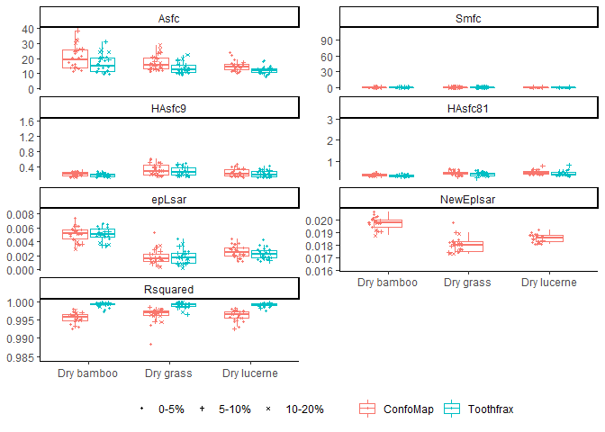
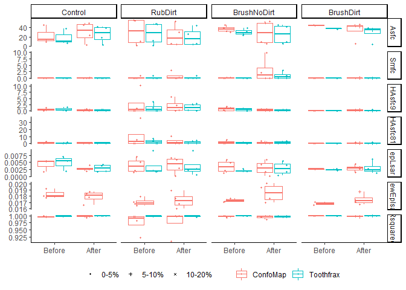
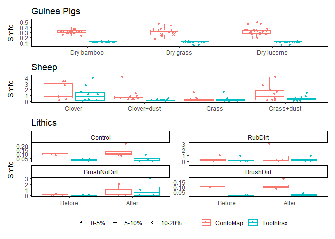
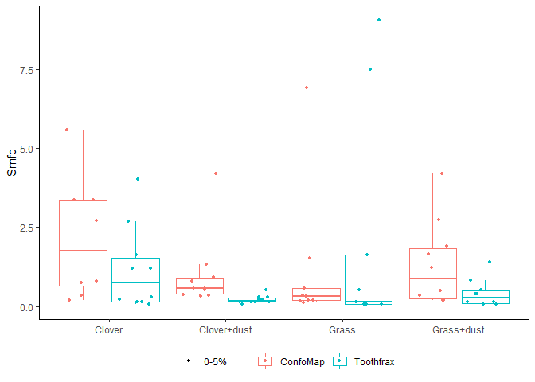

Plots of SSFA variables
================
Ivan Calandra
2021-09-06 16:22:11

-   [Goal of the script](#goal-of-the-script)
-   [Load packages](#load-packages)
-   [Read in data](#read-in-data)
    -   [Get name and path of input
        file](#get-name-and-path-of-input-file)
    -   [Read in Rbin file](#read-in-rbin-file)
-   [Define variables](#define-variables)
-   [Calculate y-scales](#calculate-y-scales)
-   [Number of diets](#number-of-diets)
-   [Exclude surfaces with NMP &gt; 20%](#exclude-surfaces-with-nmp--20)
-   [Plot each set of the selected numeric
    variables](#plot-each-set-of-the-selected-numeric-variables)
    -   [Define plotting function](#define-plotting-function)
    -   [Guinea Pigs](#guinea-pigs)
    -   [Sheeps](#sheeps)
    -   [Lithics](#lithics)
    -   [Zoom in for Smfc](#zoom-in-for-smfc)
    -   [Save plots](#save-plots)
-   [sessionInfo() and RStudio
    version](#sessioninfo-and-rstudio-version)
-   [Cite R packages used](#cite-r-packages-used)

------------------------------------------------------------------------

# Goal of the script

The script plots all SSFA variables for each dataset to compare between
the ConfoMap and Toothfrax analyses.

``` r
dir_in  <- "R_analysis/derived_data"
dir_out <- "R_analysis/plots"
```

Input Rbin data file must be located in
“\~/R\_analysis/derived\_data”.  
Plots will be saved in “\~/R\_analysis/plots”.

The knit directory for this script is the project directory.

------------------------------------------------------------------------

# Load packages

``` r
pack_to_load <- c("R.utils", "ggplot2", "tidyverse", "ggh4x")
sapply(pack_to_load, library, character.only = TRUE, logical.return = TRUE)
```

      R.utils   ggplot2 tidyverse     ggh4x 
         TRUE      TRUE      TRUE      TRUE 

------------------------------------------------------------------------

# Read in data

## Get name and path of input file

``` r
info_in <- list.files(dir_in, pattern = "\\.Rbin$", full.names = TRUE)
info_in
```

    [1] "R_analysis/derived_data/SSFA_all_data.Rbin"

## Read in Rbin file

``` r
all_data <- loadObject(info_in)
str(all_data)
```

    'data.frame':   284 obs. of  15 variables:
     $ Dataset     : chr  "GuineaPigs" "GuineaPigs" "GuineaPigs" "GuineaPigs" ...
     $ Name        : chr  "capor_2CC4B1_txP4_#1_1_100xL_1" "capor_2CC4B1_txP4_#1_1_100xL_1" "capor_2CC4B1_txP4_#1_1_100xL_2" "capor_2CC4B1_txP4_#1_1_100xL_2" ...
     $ Software    : chr  "ConfoMap" "Toothfrax" "ConfoMap" "Toothfrax" ...
     $ Diet        : chr  "Dry lucerne" "Dry lucerne" "Dry lucerne" "Dry lucerne" ...
     $ Treatment   : Factor w/ 4 levels "Control","RubDirt",..: NA NA NA NA NA NA NA NA NA NA ...
     $ Before.after: Factor w/ 2 levels "Before","After": NA NA NA NA NA NA NA NA NA NA ...
     $ NMP         : num  1.896 1.896 1.308 1.308 0.806 ...
     $ NMP_cat     : Ord.factor w/ 4 levels "0-5%"<"5-10%"<..: 1 1 1 1 1 1 1 1 1 1 ...
     $ epLsar      : num  0.00196 0.00147 0.00366 0.00269 0.00314 ...
     $ R²          : num  0.997 0.999 0.998 1 0.997 ...
     $ Asfc        : num  16 12.9 14.1 12 15.1 ...
     $ Smfc        : num  0.33 0.119 0.35 0.119 0.33 ...
     $ HAsfc9      : num  0.179 0.182 0.136 0.159 0.131 ...
     $ HAsfc81     : num  0.391 0.337 0.443 0.382 0.357 ...
     $ NewEplsar   : num  0.0184 NA 0.0189 NA 0.0187 ...
     - attr(*, "comment")= Named chr [1:9] "%" "<no unit>" "<no unit>" "<no unit>" ...
      ..- attr(*, "names")= chr [1:9] "NMP" "epLsar" "NewEplsar" "R²" ...

------------------------------------------------------------------------

# Define variables

``` r
# x-axis (grouping)
x_var_GP <- x_var_sheep <- "Diet"
x_var_lith <- "Before.after"

# y-axis
y_var <- c("Asfc", "Smfc", "HAsfc9", "HAsfc81", "epLsar", "NewEplsar")

# colors
grp_colors <- "Software"

# shapes
grp_shapes <- "NMP_cat"

# subplots Lithics dataset
facet_lith <- "Treatment"
```

The following variables will be used:

``` r
x_var_GP
```

    [1] "Diet"

``` r
x_var_sheep
```

    [1] "Diet"

``` r
x_var_lith
```

    [1] "Before.after"

``` r
grp_colors
```

    [1] "Software"

``` r
facet_lith
```

    [1] "Treatment"

``` r
y_var
```

    [1] "Asfc"      "Smfc"      "HAsfc9"    "HAsfc81"   "epLsar"    "NewEplsar"

------------------------------------------------------------------------

# Calculate y-scales

The range of the y-scales on the plots should be the same for the guinea
pig and sheep datasets. Lithics are not comparable at all so this
dataset is plotted with appropriate y-scales for this dataset alone.

``` r
# Select guinea pig and sheep datasets
GP_sheep <- filter(all_data, Dataset %in% c("GuineaPigs", "Sheeps"))

# Create a named empty list to store the ranges of each parameter
yscales <- vector(mode = "list", length = length(y_var))
names(yscales) <- y_var

# Calculate the range of each parameter
for (i in y_var) {
  yscales[[i]] <- scale_y_continuous(limits = range(GP_sheep[[i]], na.rm = TRUE))
}
```

------------------------------------------------------------------------

# Number of diets

In order to have the same width of the boxes for the sheep and guinea
pig datasets, we need to calculate how many diets there are in each
dataset.

``` r
diet_GP <- length(unique(all_data[all_data$Dataset == "GuineaPigs", "Diet"]))
diet_sheep <- length(unique(all_data[all_data$Dataset == "Sheeps", "Diet"]))
ratio_diet <- diet_GP / diet_sheep
```

------------------------------------------------------------------------

# Exclude surfaces with NMP &gt; 20%

``` r
data_nmp0_20 <- filter(all_data, NMP_cat != "20-100%")
```

------------------------------------------------------------------------

# Plot each set of the selected numeric variables

## Define plotting function

``` r
boxes_points <- function(dat, x_var, y_var, 
                         group_col, group_shape, 
                         box_width = 0.9, box_size = 0.25, med_size = 3, point_size = 0.8, shape_scale,
                         point_jitter = 0.6, point_dodge = 0.9, jitter_seed = 123, 
                         wrap_grid, facet_var, facet_ncol = 2, facet_yscales,
                         grid_row, grid_col,
                         xlab = NULL, ylab = NULL) {
  
  # package 'ggh4x' is required for the function facetted_pos_scales()
  require(ggh4x)
  
  # Supply x, y and color variables as strings for the plotting
  p_out <- ggplot(dat, aes_string(x = x_var, y = y_var, color = group_col)) +
    
    # Boxplots:
    # hide outliers (all points are shown with geom_point() below) 
    # and adjust proportions of elements
    geom_boxplot(outlier.shape = NA, width = box_width, size = box_size, fatten = med_size) + 
    
    # Points:
    # Add a layer of shapes for points using the variable 'group_shape' ('group' necessary for dodging)
    # Define jitter for points (jitter) within boxplots (dodge)
    # Set seed for repeatability
    geom_point(mapping = aes_string(shape = group_shape, group = group_col), 
               size = point_size,
               position = position_jitterdodge(jitter.width = point_jitter,
                                               dodge.width = point_dodge,
                                               seed = jitter_seed)) +
  
    # Remove axis labels
    labs(x = xlab, y = ylab) + 
  
    # Adjust values for shapes
    scale_shape_manual(values = shape_scale) +
  
    # Choose a light theme
    theme_classic() +
  
    # Move legend to bottom and remove legend title
    theme(legend.position = "bottom", legend.title = element_blank())
  
  if (wrap_grid == "wrap") {
    # Wrap around parameters with free y-scales
    p_out <- p_out + facet_wrap(as.formula(paste0("~", facet_var)), 
                                scales = "free_y", ncol = facet_ncol) + 
             # Use custom y-scales if argument provided
             if (!missing(facet_yscales)) facetted_pos_scales(y = facet_yscales)
  } 
  if (wrap_grid == "grid") {
    # Plot a grid of subplots, with variables in rows and treatments in columns
    p_out <- p_out + facet_grid(as.formula(paste0(grid_row, "~", grid_col)), scales = "free_y")
  }
  return(p_out)
}
```

## Guinea Pigs

``` r
# Filter data for guinea pigs and by NMP (<5%, 5-10% and >= 10%)
GP <- filter(data_nmp0_20, Dataset == "GuineaPigs")

# Change from wide to long format
GP_plot  <- pivot_longer(GP[c(x_var_GP, grp_colors, grp_shapes, y_var)], all_of(y_var))

# Re-order factor levels to fit order of plots on facet
GP_plot$name  <- factor(GP_plot$name, levels = y_var)

# Plot all variables at once using facet_wrap()
# The factor 'ratio_diet' ensures that the boxes have the same width as for the sheep dataset
p_GP <- boxes_points(dat = GP_plot, x_var = x_var_GP, y_var = "value", 
                     group_col = grp_colors, group_shape = grp_shapes,
                     box_width = 0.9*ratio_diet, 
                     point_jitter = 0.6, point_dodge = 0.9*ratio_diet,
                     wrap_grid = "wrap", facet_var = "name", facet_yscales = yscales, 
                     shape_scale = c(19, 3, 4))

# Print and save resulting plot
print(p_GP)
```

    Warning: Removed 70 rows containing non-finite values (stat_boxplot).

    Warning: Removed 70 rows containing missing values (geom_point).

<!-- -->

Warnings are due to the missing values for Toothfrax - NewEplsar.

## Sheeps

Note that for compactness, comments to explain the code are given only
in the section about [Guinea Pigs](#guinea-pigs). .

``` r
sheep <- filter(data_nmp0_20, Dataset == "Sheeps")
sheep_plot <- pivot_longer(sheep[c(x_var_sheep, grp_colors, grp_shapes, y_var)], all_of(y_var))
sheep_plot$name <- factor(sheep_plot$name, levels = y_var)
p_sheep <- boxes_points(dat = sheep_plot, x_var = x_var_sheep, y_var = "value", 
                        group_col = grp_colors, group_shape = grp_shapes,
                        box_width = 0.9, 
                        point_jitter = 0.9, point_dodge = 0.9,
                        wrap_grid = "wrap", facet_var = "name", facet_yscales = yscales, 
                        shape_scale = c(19, 3, 4))
print(p_sheep)
```

    Warning: Removed 40 rows containing non-finite values (stat_boxplot).

    Warning: Removed 40 rows containing missing values (geom_point).

<!-- -->

## Lithics

Note that for compactness, comments to explain the code are given only
in the section about [Guinea Pigs](#guinea-pigs).

There is one difference though: here, three columns are used for the
grouping (“Software”, “Treatment”, and “Before.after”).  
Software is still shown with colors.  
“Before.after” is plotted on the x-axis and the variables are on the
y-axes.  
`facet_grid()` is used to plot a grid of subplots, with variables in
rows and treatments in columns.

``` r
lith <- filter(data_nmp0_20, Dataset == "Lithics")
lith_plot <- pivot_longer(lith[c(x_var_lith, grp_colors, grp_shapes, facet_lith, y_var)],
                          all_of(y_var))
lith_plot$name <- factor(lith_plot$name, levels = y_var)
p_lith <- boxes_points(dat = lith_plot, x_var = x_var_lith, y_var = "value", 
                       group_col = grp_colors, group_shape = grp_shapes,
                       box_width = 0.9, 
                       point_jitter = 0.9, point_dodge = 0.9,
                       wrap_grid = "grid", grid_row = "name", grid_col = facet_lith, 
                       shape_scale = c(19, 3, 4))
print(p_lith)
```

    Warning: Removed 29 rows containing non-finite values (stat_boxplot).

    Warning: Removed 29 rows containing missing values (geom_point).

<!-- -->

## Zoom in for Smfc

The previous plots for the parameter Smfc show some extreme values for
the sheep and lithic datasets.  
In order to better visualize the differences in software, we need
zoomed-in plots excluding these extreme values (&gt; 10).

``` r
y_Smfc <- "Smfc"
ext_val <- 10

# Guinea pig dataset
GP_plot_Smfc <- filter(GP_plot, name == y_Smfc)
GP_plot_Smfc_filt <- filter(GP_plot_Smfc, value <= ext_val)
p_GP_Smfc <- boxes_points(dat = GP_plot_Smfc_filt, x_var = x_var_GP, y_var = "value", 
                          group_col = grp_colors, group_shape = grp_shapes,
                          box_width = 0.9*ratio_diet, 
                          point_jitter = 0.9, point_dodge = 0.9*ratio_diet, point_size = 1,
                          ylab = y_Smfc, shape_scale = c(19, 3, 4), wrap_grid = "none")
print(p_GP_Smfc)
```

<!-- -->

``` r
# Sheep dataset
sheep_plot_Smfc <- filter(sheep_plot, name == y_Smfc)
sheep_plot_Smfc_filt <- filter(sheep_plot_Smfc, value <= ext_val)
p_sheep_Smfc <- boxes_points(dat = sheep_plot_Smfc_filt, x_var = x_var_sheep, y_var = "value", 
                             group_col = grp_colors, group_shape = grp_shapes,
                             box_width = 0.9, 
                             point_jitter = 0.9, point_dodge = 0.9, point_size = 1,
                             ylab = y_Smfc, shape_scale = c(19, 3, 4), wrap_grid = "none")
print(p_sheep_Smfc)
```

<!-- -->

``` r
# Lithic dataset
lith_plot_Smfc <- filter(lith_plot, name == y_Smfc)
lith_plot_Smfc_filt <- filter(lith_plot_Smfc, value <= ext_val)
p_lith_Smfc <- boxes_points(dat = lith_plot_Smfc_filt, x_var = x_var_lith, y_var = "value", 
                            group_col = grp_colors, group_shape = grp_shapes,
                            box_width = 0.9, 
                            point_jitter = 0.9, point_dodge = 0.9, point_size = 1,
                            ylab = y_Smfc, shape_scale = c(19, 3, 4),
                            wrap_grid = "wrap", facet_var = "Treatment")
print(p_lith_Smfc) 
```

<!-- -->

These plots of Smfc do not show all data points.  
For the guinea pigs plot, these points are outside of the y-range shown
and are therefore excluded from the plot:

``` r
data.frame(GP_plot_Smfc[GP_plot_Smfc$value > ext_val, ])
```

    [1] Diet     Software NMP_cat  name     value   
    <0 rows> (or 0-length row.names)

For the sheep plot, these points are outside of the y-range shown and
are therefore excluded from the plot:

``` r
data.frame(sheep_plot_Smfc[sheep_plot_Smfc$value > ext_val, ])
```

        Diet  Software NMP_cat name    value
    1 Clover  ConfoMap    0-5% Smfc 12.28573
    2 Clover  ConfoMap    0-5% Smfc 12.28573
    3  Grass  ConfoMap    0-5% Smfc 44.73203
    4  Grass Toothfrax    0-5% Smfc 89.99452

For the lithic plots, these points are outside of the y-ranges shown and
were therefore excluded from the plots:

``` r
data.frame(lith_plot_Smfc[lith_plot_Smfc$value > ext_val, ])
```

      Before.after  Software NMP_cat Treatment name    value
    1        After Toothfrax    0-5%   Control Smfc 26.21508

## Save plots

``` r
# Define filenames
plot_files <- paste0("SSFA_", c("GuineaPigs", "Sheeps", "Lithics"), 
                     rep(c("_plot.pdf", "_plot-Smfc.pdf"), each = 3))

# Add names to 'plot_files' from object names
names(plot_files) <- c("p_GP", "p_sheep", "p_lith", "p_GP_Smfc", "p_sheep_Smfc", "p_lith_Smfc")

# Save plots as PDF
for (i in seq_along(plot_files)[1:3]) {
  ggsave(plot = get(names(plot_files)[i]), filename = plot_files[i], path = dir_out, 
         width = 190, height = 240, units = "mm")
}
```

    Warning: Removed 70 rows containing non-finite values (stat_boxplot).

    Warning: Removed 70 rows containing missing values (geom_point).

    Warning: Removed 40 rows containing non-finite values (stat_boxplot).

    Warning: Removed 40 rows containing missing values (geom_point).

    Warning: Removed 29 rows containing non-finite values (stat_boxplot).

    Warning: Removed 29 rows containing missing values (geom_point).

``` r
for (i in seq_along(plot_files)[4:6]) {
  ggsave(plot = get(names(plot_files)[i]), filename = plot_files[i], path = dir_out)
}
```

------------------------------------------------------------------------

# sessionInfo() and RStudio version

``` r
sessionInfo()
```

    R version 4.1.1 (2021-08-10)
    Platform: x86_64-w64-mingw32/x64 (64-bit)
    Running under: Windows 10 x64 (build 19041)

    Matrix products: default

    locale:
    [1] LC_COLLATE=English_United Kingdom.1252 
    [2] LC_CTYPE=English_United Kingdom.1252   
    [3] LC_MONETARY=English_United Kingdom.1252
    [4] LC_NUMERIC=C                           
    [5] LC_TIME=English_United Kingdom.1252    

    attached base packages:
    [1] stats     graphics  grDevices datasets  utils     methods   base     

    other attached packages:
     [1] ggh4x_0.2.0.9000  forcats_0.5.1     stringr_1.4.0     dplyr_1.0.7      
     [5] purrr_0.3.4       readr_2.0.1       tidyr_1.1.3       tibble_3.1.4     
     [9] tidyverse_1.3.1   ggplot2_3.3.5     R.utils_2.10.1    R.oo_1.24.0      
    [13] R.methodsS3_1.8.1

    loaded via a namespace (and not attached):
     [1] Rcpp_1.0.7       lubridate_1.7.10 assertthat_0.2.1 rprojroot_2.0.2 
     [5] digest_0.6.27    utf8_1.2.2       R6_2.5.1         cellranger_1.1.0
     [9] backports_1.2.1  reprex_2.0.1     evaluate_0.14    highr_0.9       
    [13] httr_1.4.2       pillar_1.6.2     rlang_0.4.11     readxl_1.3.1    
    [17] rstudioapi_0.13  rmarkdown_2.10   labeling_0.4.2   munsell_0.5.0   
    [21] broom_0.7.9      compiler_4.1.1   modelr_0.1.8     xfun_0.25       
    [25] pkgconfig_2.0.3  htmltools_0.5.2  tidyselect_1.1.1 fansi_0.5.0     
    [29] crayon_1.4.1     tzdb_0.1.2       dbplyr_2.1.1     withr_2.4.2     
    [33] grid_4.1.1       jsonlite_1.7.2   gtable_0.3.0     lifecycle_1.0.0 
    [37] DBI_1.1.1        magrittr_2.0.1   scales_1.1.1     cli_3.0.1       
    [41] stringi_1.7.4    farver_2.1.0     renv_0.14.0      fs_1.5.0        
    [45] xml2_1.3.2       ellipsis_0.3.2   generics_0.1.0   vctrs_0.3.8     
    [49] tools_4.1.1      glue_1.4.2       hms_1.1.0        fastmap_1.1.0   
    [53] yaml_2.2.1       colorspace_2.0-2 rvest_1.0.1      knitr_1.33      
    [57] haven_2.4.3     

RStudio version 1.4.1717.

------------------------------------------------------------------------

# Cite R packages used

    R.utils 
    Henrik Bengtsson (2020). R.utils: Various Programming Utilities. R package version 2.10.1. https://CRAN.R-project.org/package=R.utils 
     
    ggplot2 
    H. Wickham. ggplot2: Elegant Graphics for Data Analysis. Springer-Verlag New York, 2016. 
     
    tidyverse 
    Wickham et al., (2019). Welcome to the tidyverse. Journal of Open Source Software, 4(43), 1686, https://doi.org/10.21105/joss.01686 
     
    ggh4x 
    Teun van den Brand (2021). ggh4x: Hacks for 'ggplot2'. R package version 0.2.0.9000. https://github.com/teunbrand/ggh4x 
     

------------------------------------------------------------------------

END OF SCRIPT
