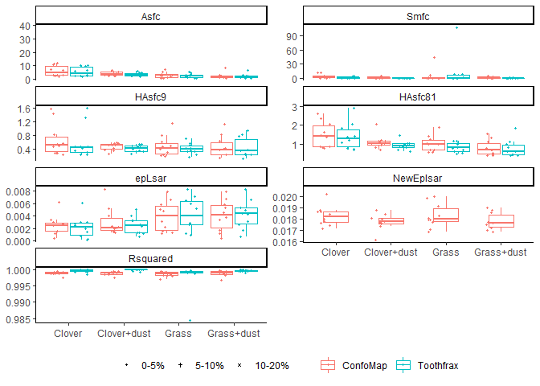

Plots of SSFA variables
================
Ivan Calandra
2021-01-26 10:38:18

-   [Goal of the script](#goal-of-the-script)
-   [Load packages](#load-packages)
-   [Read in data](#read-in-data)
    -   [Get names, path and information of input
        file](#get-names-path-and-information-of-input-file)
    -   [Read in Rbin file](#read-in-rbin-file)
-   [Define variables](#define-variables)
-   [Calculate y-scales](#calculate-y-scales)
-   [Number of diets](#number-of-diets)
-   [Plot each set of the selected numeric
    variables](#plot-each-set-of-the-selected-numeric-variables)
    -   [Guinea Pigs](#guinea-pigs)
    -   [Sheeps](#sheeps)
    -   [Lithics](#lithics)
    -   [Zoom in for Smfc](#zoom-in-for-smfc)
-   [sessionInfo() and RStudio
    version](#sessioninfo-and-rstudio-version)

------------------------------------------------------------------------

# Goal of the script

The script plots all SSFA variables for each dataset to compare between
the ConfoMap and Toothfrax analyses.

``` r
dir_in  <- "R_analysis/derived_data"
dir_out <- "R_analysis/plots"
```

Input Rbin data file must be located in
“\~/R\_analysis/derived\_data”.  
Plots will be saved in “\~/R\_analysis/plots”.

The knit directory for this script is the project directory.

------------------------------------------------------------------------

# Load packages

``` r
library(R.utils)
library(ggplot2)
library(tools)
library(tidyverse)
library(ggh4x)
```

------------------------------------------------------------------------

# Read in data

## Get names, path and information of input file

``` r
info_in <- list.files(dir_in, pattern = "\\.Rbin$", full.names = TRUE) %>% 
           md5sum()
```

The checksum (MD5 hashes) of the loaded file is:

                   files                         checksum
    1 SSFA_all_data.Rbin d2fc242595873d663b12beb7633acb0a

## Read in Rbin file

``` r
all_data <- loadObject(names(info_in))
str(all_data)
```

    'data.frame':   280 obs. of  13 variables:
     $ Dataset     : chr  "GuineaPigs" "GuineaPigs" "GuineaPigs" "GuineaPigs" ...
     $ Name        : chr  "capor_2CC4B1_txP4_#1_1_100xL_1" "capor_2CC4B1_txP4_#1_1_100xL_1" "capor_2CC4B1_txP4_#1_1_100xL_2" "capor_2CC4B1_txP4_#1_1_100xL_2" ...
     $ Software    : chr  "ConfoMap" "Toothfrax" "ConfoMap" "Toothfrax" ...
     $ Diet        : chr  "Dry lucerne" "Dry lucerne" "Dry lucerne" "Dry lucerne" ...
     $ Treatment   : Factor w/ 4 levels "Control","RubDirt",..: NA NA NA NA NA NA NA NA NA NA ...
     $ Before.after: Factor w/ 2 levels "Before","After": NA NA NA NA NA NA NA NA NA NA ...
     $ epLsar      : num  0.00207 0.00147 0.00381 0.00269 0.00327 ...
     $ R²          : num  0.998 0.999 0.998 1 0.998 ...
     $ Asfc        : num  10.8 12.9 10 12 10.5 ...
     $ Smfc        : num  0.448 0.119 0.591 0.119 0.591 ...
     $ HAsfc9      : num  0.181 0.182 0.19 0.159 0.114 ...
     $ HAsfc81     : num  0.365 0.337 0.407 0.382 0.363 ...
     $ NewEplsar   : num  0.0185 NA 0.019 NA 0.0188 ...
     - attr(*, "comment")= Named chr [1:8] "<no unit>" "<no unit>" "<no unit>" "<no unit>" ...
      ..- attr(*, "names")= chr [1:8] "epLsar" "NewEplsar" "R²" "Asfc" ...

------------------------------------------------------------------------

# Define variables

``` r
# x-axis (grouping)
x_var_GP <- x_var_sheep <- "Diet"
x_var_lith <- "Before.after"

# y-axis
y_var <- c("Asfc", "Smfc", "HAsfc9", "HAsfc81", "epLsar", "NewEplsar")

# colors
grp_colors <- "Software"

# subplots Lithics dataset
facet_lith <- "Treatment"
```

The following variables will be used:

``` r
x_var_GP
```

    [1] "Diet"

``` r
x_var_sheep
```

    [1] "Diet"

``` r
x_var_lith
```

    [1] "Before.after"

``` r
grp_colors
```

    [1] "Software"

``` r
facet_lith
```

    [1] "Treatment"

``` r
y_var
```

    [1] "Asfc"      "Smfc"      "HAsfc9"    "HAsfc81"   "epLsar"    "NewEplsar"

------------------------------------------------------------------------

# Calculate y-scales

The range of the y-scales on the plots should be the same for the guinea
pig and sheep datasets. Lithics are not comparable at all so this
dataset is plotted with appropriate y-scales for this dataset alone.

``` r
# Select guinea pig and sheep datasets
GP_sheep <- filter(all_data, Dataset %in% c("GuineaPigs", "Sheeps"))

# Create a named empty list to store the ranges of each parameter
yscales <- vector(mode = "list", length = length(y_var))
names(yscales) <- y_var

# Calculate the range of each parameter
for (i in y_var) {
  yscales[[i]] <- scale_y_continuous(limits = range(GP_sheep[[i]], na.rm = TRUE))
}
```

------------------------------------------------------------------------

# Number of diets

In order to have the same width of the boxes for the sheep and guinea
pig datasets, we need to calculate how many diets there are in each
dataset.

``` r
diet_GP <- length(unique(all_data[all_data$Dataset == "GuineaPigs", "Diet"]))
diet_sheep <- length(unique(all_data[all_data$Dataset == "Sheeps", "Diet"]))
ratio_diet <- diet_GP / diet_sheep
```

------------------------------------------------------------------------

# Plot each set of the selected numeric variables

## Guinea Pigs

``` r
# Filter dataset
GP <- filter(all_data, Dataset == "GuineaPigs")

# Change from wide to long format
GP_plot <- pivot_longer(GP[c(x_var_GP, grp_colors, y_var)], all_of(y_var))

# Re-order factor levels to fit order of plots on facet
GP_plot$name <- factor(GP_plot$name, levels = y_var)

# Plot all variables at once using facet_wrap()
p_GP <- ggplot(GP_plot, aes_string(x = x_var_GP, y = "value", color = grp_colors)) +
        
        # Hide outliers (all points are shown with geom_point() below)
        # The factor 'ratio_diet' ensures that the boxes have the same width 
        # as for the sheep dataset
        geom_boxplot(outlier.shape = NA, 
                     position = position_dodge(preserve = "single", width = 0.9*ratio_diet),
                     width = 0.8*ratio_diet) + 
  
        # Define jitter for points within boxplots
        # The factor 'ratio_diet' ensures that the boxes have the same width 
        # as for the sheep dataset
        geom_point(position = position_jitterdodge(jitter.width = 0.3*ratio_diet,
                                                   dodge.width = 0.9*ratio_diet,
                                                   seed = 123)) +
  
        # Wrap around parameters
        facet_wrap(~name, scales = "free_y", ncol = 2) +
  
        # Use custom y-scales
        facetted_pos_scales(y = yscales) +
  
        # Remove axis labels
        labs(x = NULL, y = NULL) + 

        # Choose a light theme
        theme_classic() +

        # Move legend to bottom and remove legend title
        theme(legend.position="bottom", legend.title = element_blank())

# Print and save resulting plot
print(p_GP)
```

    Warning: Removed 70 rows containing non-finite values (stat_boxplot).

    Warning: Removed 70 rows containing missing values (geom_point).

<!-- -->

``` r
ggsave(filename = "/SSFA_GuineaPigs_plot.pdf", path = dir_out, 
       device = "pdf", width = 190, height = 240, units = "mm")
```

    Warning: Removed 70 rows containing non-finite values (stat_boxplot).

    Warning: Removed 70 rows containing missing values (geom_point).

Warnings are due to the missing values for Toothfrax - NewEplsar.

## Sheeps

Note that for compactness, comments to explain the code are given only
in the section about [Guinea Pigs](#guinea-pigs).

``` r
sheep <- filter(all_data, Dataset == "Sheeps")
sheep_plot <- pivot_longer(sheep[c(x_var_sheep, grp_colors, y_var)], all_of(y_var))
sheep_plot$name <- factor(sheep_plot$name, levels = y_var)
p_sheep <- ggplot(sheep_plot, aes_string(x = x_var_sheep, y = "value", color = grp_colors)) +
           geom_boxplot(outlier.shape = NA, 
                        position = position_dodge(preserve = "single", width = 0.9),
                        width = 0.8) + 
           geom_point(position = position_jitterdodge(jitter.width = 0.3, 
                                                      dodge.width = 0.9,
                                                      seed = 123)) +
           facet_wrap(~name, scales = "free_y", ncol = 2) +
           facetted_pos_scales(y = yscales) +
           labs(x = NULL, y = NULL) + 
           theme_classic() +
           theme(legend.position="bottom", legend.title = element_blank())
print(p_sheep)
```

    Warning: Removed 40 rows containing non-finite values (stat_boxplot).

    Warning: Removed 40 rows containing missing values (geom_point).

<!-- -->

``` r
ggsave(filename = "/SSFA_Sheeps_plot.pdf", path = dir_out, 
       device = "pdf", width = 190, height = 240, units = "mm")
```

    Warning: Removed 40 rows containing non-finite values (stat_boxplot).

    Warning: Removed 40 rows containing missing values (geom_point).

## Lithics

Note that for compactness, comments to explain the code are given only
in the section about [Guinea Pigs](#guinea-pigs).

There is one difference though: here, three columns are used for the
grouping (“Software”, “Treatment”, and “Before.after”).  
Software is still shown with colors.  
“Before.after” is plotted on the x-axis and the variables are on the
y-axes.  
`facet_grid()` is used to plot a grid of subplots, with variables in
rows and treatments in columns.

``` r
lith <- filter(all_data, Dataset == "Lithics")
lith_plot <- pivot_longer(lith[c(x_var_lith, grp_colors, facet_lith, y_var)], all_of(y_var))
lith_plot$name <- factor(lith_plot$name, levels = y_var)
p_lith <- ggplot(lith_plot, aes_string(x = x_var_lith, y = "value", color = grp_colors)) +
          geom_boxplot(outlier.shape = NA,
                       position = position_dodge(preserve = "single", width = 0.8),
                       width = 0.7) + 
          geom_point(position = position_jitterdodge(jitter.width = 0.3, 
                                                     dodge.width = 0.8,
                                                     seed = 123)) +
          facet_grid(as.formula(paste0("name~", facet_lith)), scales = "free_y") +
          labs(x = NULL, y = NULL) + 
          theme_classic() +
          theme(legend.position="bottom", legend.title = element_blank())
print(p_lith)
```

    Warning: Removed 30 rows containing non-finite values (stat_boxplot).

    Warning: Removed 30 rows containing missing values (geom_point).

<!-- -->

``` r
ggsave(filename = "/SSFA_Lithics_plot.pdf", path = dir_out, 
       device = "pdf", width = 190, height = 240, units = "mm")
```

    Warning: Removed 30 rows containing non-finite values (stat_boxplot).

    Warning: Removed 30 rows containing missing values (geom_point).

## Zoom in for Smfc

The previous plots for the parameter Smfc show some extreme values for
the sheep and lithic datasets.  
In order to better visualize the differences in software, we need
zoomed-in plots excluding these extreme values (&gt; 10).

``` r
y_Smfc <- "Smfc"
ext_val <- 10

# Guinea pig dataset
GP_plot_Smfc <- filter(GP_plot, name == y_Smfc)
p_GP_Smfc <- ggplot(GP_plot_Smfc, 
                    aes_string(x = x_var_GP, y = "value", color = grp_colors)) +
             geom_boxplot(outlier.shape = NA) + 
             geom_point(position = position_jitterdodge(jitter.width = 0.2, seed = 123)) +
             labs(x = NULL, y = y_Smfc) + 
             theme_classic() +
             theme(legend.position="bottom", legend.title = element_blank())
print(p_GP_Smfc)
```

<!-- -->

``` r
ggsave(plot = p_GP_Smfc, filename = "/SSFA_GuineaPigs_plot_Smfc.pdf", path = dir_out, 
       device = "pdf")

# Sheep dataset
sheep_plot_Smfc <- filter(sheep_plot, name == y_Smfc)
sheep_plot_Smfc_filt <- filter(sheep_plot_Smfc, value <= ext_val)
p_sheep_Smfc <- ggplot(sheep_plot_Smfc_filt, 
                       aes_string(x = x_var_sheep, y = "value", color = grp_colors)) +
                geom_boxplot(outlier.shape = NA) + 
                geom_point(position = position_jitterdodge(jitter.width = 0.2, seed = 123)) +
                labs(x = NULL, y = y_Smfc) + 
                theme_classic() +
                theme(legend.position="bottom", legend.title = element_blank())
print(p_sheep_Smfc)
```

<!-- -->

``` r
ggsave(plot = p_sheep_Smfc, filename = "/SSFA_Sheeps_plot_Smfc.pdf", path = dir_out, 
       device = "pdf")

# Lithic dataset
lith_plot_Smfc <- filter(lith_plot, name == y_Smfc)
lith_plot_Smfc_filt <- filter(lith_plot_Smfc, value <= ext_val)
p_lith_Smfc <- ggplot(lith_plot_Smfc_filt, 
                      aes_string(x = x_var_lith, y = "value", color = grp_colors)) +
               geom_boxplot(outlier.shape = NA) + 
               geom_point(position = position_jitterdodge(jitter.width = 0.2, seed = 123)) +
               facet_wrap(~Treatment, scale = "free_y") +
               labs(x = NULL, y = y_Smfc) + 
               theme_classic() +
               theme(legend.position="bottom", legend.title = element_blank())
print(p_lith_Smfc) 
```

<!-- -->

``` r
ggsave(plot = p_lith_Smfc, filename = "/SSFA_Lithics_plot_Smfc.pdf", path = dir_out, 
       device = "pdf")
```

These plots of Smfc do not show all data points.  
For the sheep plot, these points are outside of the y-range shown and
are therefore excluded from the plot:

``` r
data.frame(sheep_plot_Smfc[sheep_plot_Smfc$value > ext_val, ])
```

        Diet  Software name    value
    1 Clover  ConfoMap Smfc 13.18123
    2  Grass  ConfoMap Smfc 30.44265
    3  Grass Toothfrax Smfc 89.99452

For the lithic plots, these points are outside of the y-ranges shown and
were therefore excluded from the plots:

``` r
data.frame(lith_plot_Smfc[lith_plot_Smfc$value > ext_val, ])
```

       Before.after  Software   Treatment name     value
    1        Before  ConfoMap   BrushDirt Smfc  28.94619
    2        Before  ConfoMap   BrushDirt Smfc  19.75685
    3         After  ConfoMap   BrushDirt Smfc  15.71063
    4         After  ConfoMap     Control Smfc 106.06247
    5         After Toothfrax     Control Smfc  26.21508
    6        Before  ConfoMap     RubDirt Smfc  19.75685
    7        Before  ConfoMap     RubDirt Smfc  31.24396
    8         After  ConfoMap     RubDirt Smfc  19.75685
    9         After  ConfoMap     RubDirt Smfc  24.84517
    10       Before  ConfoMap BrushNoDirt Smfc  36.40119
    11       Before  ConfoMap BrushNoDirt Smfc  78.13810
    12        After  ConfoMap BrushNoDirt Smfc  19.75685
    13        After  ConfoMap BrushNoDirt Smfc  19.75685

------------------------------------------------------------------------

# sessionInfo() and RStudio version

``` r
sessionInfo()
```

    R version 4.0.3 (2020-10-10)
    Platform: x86_64-w64-mingw32/x64 (64-bit)
    Running under: Windows 10 x64 (build 19041)

    Matrix products: default

    locale:
    [1] LC_COLLATE=French_France.1252  LC_CTYPE=French_France.1252   
    [3] LC_MONETARY=French_France.1252 LC_NUMERIC=C                  
    [5] LC_TIME=French_France.1252    

    attached base packages:
    [1] tools     stats     graphics  grDevices datasets  utils     methods  
    [8] base     

    other attached packages:
     [1] ggh4x_0.1.0.9000  forcats_0.5.0     stringr_1.4.0     dplyr_1.0.3      
     [5] purrr_0.3.4       readr_1.4.0       tidyr_1.1.2       tibble_3.0.5     
     [9] tidyverse_1.3.0   ggplot2_3.3.3     R.utils_2.10.1    R.oo_1.24.0      
    [13] R.methodsS3_1.8.1

    loaded via a namespace (and not attached):
     [1] tidyselect_1.1.0  xfun_0.20         haven_2.3.1       colorspace_2.0-0 
     [5] vctrs_0.3.6       generics_0.1.0    htmltools_0.5.1.1 yaml_2.2.1       
     [9] rlang_0.4.10      pillar_1.4.7      glue_1.4.2        withr_2.4.0      
    [13] DBI_1.1.1         dbplyr_2.0.0      modelr_0.1.8      readxl_1.3.1     
    [17] lifecycle_0.2.0   munsell_0.5.0     gtable_0.3.0      cellranger_1.1.0 
    [21] rvest_0.3.6       evaluate_0.14     labeling_0.4.2    knitr_1.30       
    [25] fansi_0.4.2       broom_0.7.3       Rcpp_1.0.6        renv_0.12.5      
    [29] scales_1.1.1      backports_1.2.1   jsonlite_1.7.2    farver_2.0.3     
    [33] fs_1.5.0          hms_1.0.0         digest_0.6.27     stringi_1.5.3    
    [37] grid_4.0.3        rprojroot_2.0.2   cli_2.2.0         magrittr_2.0.1   
    [41] crayon_1.3.4      pkgconfig_2.0.3   ellipsis_0.3.1    xml2_1.3.2       
    [45] reprex_0.3.0      lubridate_1.7.9.2 rstudioapi_0.13   assertthat_0.2.1 
    [49] rmarkdown_2.6     httr_1.4.2        R6_2.5.0          compiler_4.0.3   

RStudio version 1.4.1103.

------------------------------------------------------------------------

END OF SCRIPT
