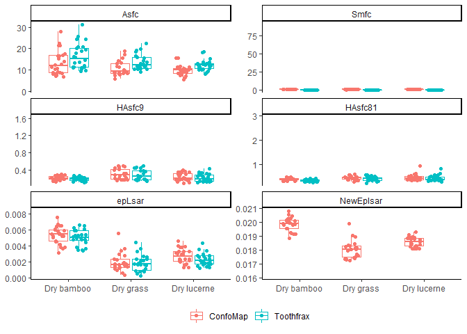
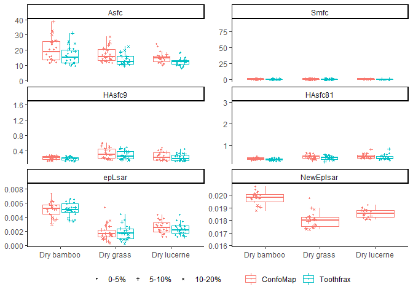
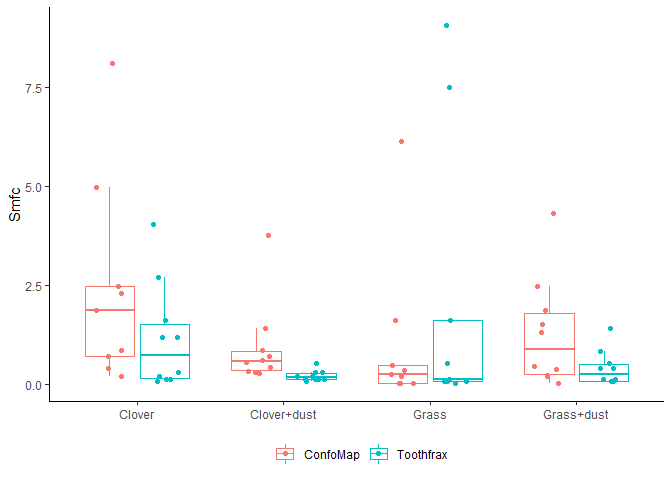
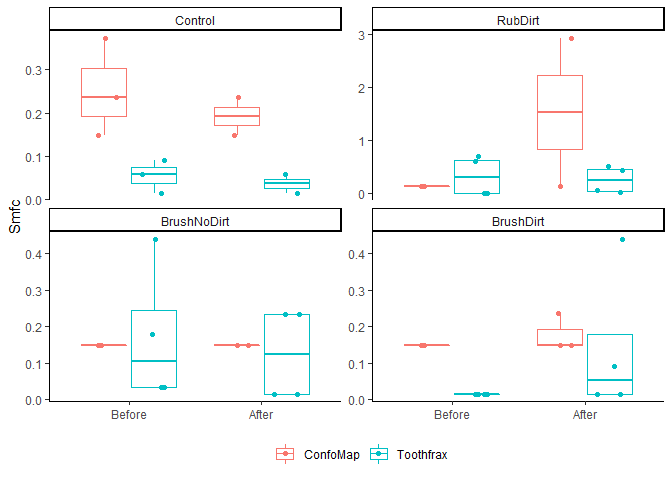

Plots of SSFA variables
================
Ivan Calandra
2021-01-12 14:30:49

-   [Goal of the script](#goal-of-the-script)
-   [Load packages](#load-packages)
-   [Read in data](#read-in-data)
    -   [Get names, path and information of input
        file](#get-names-path-and-information-of-input-file)
    -   [Read in Rbin file](#read-in-rbin-file)
-   [Define variables](#define-variables)
-   [Calculate y-scales](#calculate-y-scales)
-   [Plot each set of the selected numeric
    variables](#plot-each-set-of-the-selected-numeric-variables)
    -   [Guinea Pigs](#guinea-pigs)
    -   [Sheeps](#sheeps)
    -   [Lithics](#lithics)
    -   [Zoom in for Smfc](#zoom-in-for-smfc)
-   [Show plot files information](#show-plot-files-information)
-   [sessionInfo() and RStudio
    version](#sessioninfo-and-rstudio-version)

------------------------------------------------------------------------

# Goal of the script

The script plots all SSFA variables for each dataset to compare between
the ConfoMap and Toothfrax analyses.

``` r
dir_in  <- "R_analysis/derived_data"
dir_out <- "R_analysis/plots"
```

Input Rbin data file must be located in
“\~/R\_analysis/derived\_data”.  
Plots will be saved in “\~/R\_analysis/plots”.

The knit directory for this script is the project directory.

------------------------------------------------------------------------

# Load packages

``` r
library(R.utils)
library(ggplot2)
library(tools)
library(tidyverse)
library(ggh4x)
```

------------------------------------------------------------------------

# Read in data

## Get names, path and information of input file

``` r
info_in <- list.files(dir_in, pattern = "\\.Rbin$", full.names = TRUE) %>% 
           md5sum()
```

The checksum (MD5 hashes) of the loaded file is:

                   files                         checksum
    1 SSFA_all_data.Rbin 55465bdc7308d20cdff2d3d1bdeea63d

## Read in Rbin file

``` r
all_data <- loadObject(names(info_in))
str(all_data)
```

    'data.frame':   280 obs. of  13 variables:
     $ Dataset     : chr  "GuineaPigs" "GuineaPigs" "GuineaPigs" "GuineaPigs" ...
     $ Name        : chr  "capor_2CC4B1_txP4_#1_1_100xL_1" "capor_2CC4B1_txP4_#1_1_100xL_1" "capor_2CC4B1_txP4_#1_1_100xL_2" "capor_2CC4B1_txP4_#1_1_100xL_2" ...
     $ Software    : chr  "ConfoMap" "Toothfrax" "ConfoMap" "Toothfrax" ...
     $ Diet        : chr  "Dry Lucerne" "Dry Lucerne" "Dry Lucerne" "Dry Lucerne" ...
     $ Treatment   : chr  NA NA NA NA ...
     $ Before.after: Factor w/ 2 levels "Before","After": NA NA NA NA NA NA NA NA NA NA ...
     $ epLsar      : num  0.00196 0.00147 0.00366 0.00269 0.00314 ...
     $ R²          : num  0.998 0.999 0.999 1 0.999 ...
     $ Asfc        : num  14.3 12.9 12.9 12 13.7 ...
     $ Smfc        : num  0.415 0.119 0.441 0.119 0.441 ...
     $ HAsfc9      : num  0.164 0.182 0.171 0.159 0.131 ...
     $ HAsfc81     : num  0.368 0.337 0.417 0.382 0.352 ...
     $ NewEplsar   : num  0.0184 NA 0.0189 NA 0.0187 ...
     - attr(*, "comment")= Named chr [1:8] "<no unit>" "<no unit>" "<no unit>" "<no unit>" ...
      ..- attr(*, "names")= chr [1:8] "epLsar" "NewEplsar" "R²" "Asfc" ...

------------------------------------------------------------------------

# Define variables

``` r
# x-axis (grouping)
x_var_GP <- x_var_sheep <- "Diet"
x_var_lith <- "Before.after"

# y-axis
y_var <- c("Asfc", "Smfc", "HAsfc9", "HAsfc81", "epLsar", "NewEplsar")

# colors
grp_colors <- "Software"

# subplots Lithics dataset
facet_lith <- "Treatment"
```

The following variables will be used:

``` r
x_var_GP
```

    [1] "Diet"

``` r
x_var_sheep
```

    [1] "Diet"

``` r
x_var_lith
```

    [1] "Before.after"

``` r
grp_colors
```

    [1] "Software"

``` r
facet_lith
```

    [1] "Treatment"

``` r
y_var
```

    [1] "Asfc"      "Smfc"      "HAsfc9"    "HAsfc81"   "epLsar"    "NewEplsar"

------------------------------------------------------------------------

# Calculate y-scales

The range of the y-scales on the plots should be the same for the guinea
pig and sheep datasets. Lithics are not comparable at all so this
dataset is plotted with appropriate y-scales for this dataset alone.

``` r
# Select guinea pig and sheep datasets
GP_sheep <- filter(all_data, Dataset %in% c("GuineaPigs", "Sheeps"))

# Create a named empty list to store the ranges of each parameter
yscales <- vector(mode = "list", length = length(y_var))
names(yscales) <- y_var

# Calculate the range of each parameter
for (i in y_var) {
  yscales[[i]] <- scale_y_continuous(limits = range(GP_sheep[[i]], na.rm = TRUE))
}
```

------------------------------------------------------------------------

# Plot each set of the selected numeric variables

## Guinea Pigs

``` r
# Filter dataset
GP <- filter(all_data, Dataset == "GuineaPigs")

# Change from wide to long format
GP_plot <- pivot_longer(GP[c(x_var_GP, grp_colors, y_var)], all_of(y_var))

# Re-order factor levels to fit order of plots on facet
GP_plot$name <- factor(GP_plot$name, levels = y_var)

# Plot all variables at once using facet_wrap()
p_GP <- ggplot(GP_plot, aes_string(x = x_var_GP, y = "value", color = grp_colors)) +
        
        # Do not show outliers
        geom_boxplot(outlier.shape = NA) + 
  
        # Define jitter for points within boxplots
        geom_point(position = position_jitterdodge(jitter.width = 0.2, seed = 123)) +
  
        # Wrap around parameters
        facet_wrap(~name, scales = "free_y", ncol = 2) +
  
        # Use custom y-scales
        facetted_pos_scales(y = yscales) +
  
        # Remove axis labels
        labs(x = NULL, y = NULL) + 

        # Add an empty level to the x-axis to have the same with as for the sheep dataset
        scale_x_discrete(limits = c(unique(GP_plot$Diet), " ")) +

        # Choose a light theme
        theme_classic()

# Print and save resulting plot
print(p_GP)
```

    Warning: Removed 70 rows containing non-finite values (stat_boxplot).

    Warning: Removed 70 rows containing missing values (geom_point).

<!-- -->

``` r
ggsave(filename = "/SSFA_GuineaPigs_plot.pdf", path = dir_out, 
       device = "pdf", width = 210, height = 297, units = "mm")
```

    Warning: Removed 70 rows containing non-finite values (stat_boxplot).

    Warning: Removed 70 rows containing missing values (geom_point).

Warnings are due to the missing values for Toothfrax - NewEplsar.

## Sheeps

Note that for compactness, comments to explain the code are given only
in the section about [Guinea Pigs](#guinea-pigs).

``` r
sheep <- filter(all_data, Dataset == "Sheeps")
sheep_plot <- pivot_longer(sheep[c(x_var_sheep, grp_colors, y_var)], all_of(y_var))
sheep_plot$name <- factor(sheep_plot$name, levels = y_var)
p_sheep <- ggplot(sheep_plot, aes_string(x = x_var_sheep, y = "value", color = grp_colors)) +
           geom_boxplot(outlier.shape = NA) + 
           geom_point(position = position_jitterdodge(jitter.width = 0.2, seed = 123)) +
           facet_wrap(~name, scales = "free_y", ncol = 2) +
           facetted_pos_scales(y = yscales) +
           labs(x = NULL, y = NULL) + 
           theme_classic()
print(p_sheep)
```

    Warning: Removed 40 rows containing non-finite values (stat_boxplot).

    Warning: Removed 40 rows containing missing values (geom_point).

<!-- -->

``` r
ggsave(filename = "/SSFA_Sheeps_plot.pdf", path = dir_out, 
       device = "pdf", width = 210, height = 297, units = "mm")
```

    Warning: Removed 40 rows containing non-finite values (stat_boxplot).

    Warning: Removed 40 rows containing missing values (geom_point).

## Lithics

Note that for compactness, comments to explain the code are given only
in the section about [Guinea Pigs](#guinea-pigs).

There is one difference though: here, three columns are used for the
grouping (“Software”, “Treatment”, and “Before.after”).  
Software is still shown with colors.  
“Before.after” is plotted on the x-axis and the variables are on the
y-axes.  
`facet_grid()` is used to plot a grid of subplots, with variables in
rows and treatments in columns.

``` r
lith <- filter(all_data, Dataset == "Lithics")
lith_plot <- pivot_longer(lith[c(x_var_lith, grp_colors, facet_lith, y_var)], all_of(y_var))
lith_plot$name <- factor(lith_plot$name, levels = y_var)
p_lith <- ggplot(lith_plot, aes_string(x = x_var_lith, y = "value", color = grp_colors)) +
          geom_boxplot(outlier.shape = NA) + 
          geom_point(position = position_jitterdodge(jitter.width = 0.2, seed = 123)) +
          facet_grid(as.formula(paste0("name~", facet_lith)), scales = "free_y") +
          labs(x = NULL, y = NULL) + 
          theme_classic()
print(p_lith)
```

    Warning: Removed 30 rows containing non-finite values (stat_boxplot).

    Warning: Removed 30 rows containing missing values (geom_point).

<!-- -->

``` r
ggsave(filename = "/SSFA_Lithics_plot.pdf", path = dir_out, 
       device = "pdf", width = 210, height = 297, units = "mm")
```

    Warning: Removed 30 rows containing non-finite values (stat_boxplot).

    Warning: Removed 30 rows containing missing values (geom_point).

## Zoom in for Smfc

The previous plots for the parameter Smfc show some extreme values.  
In order to better visualize the differences in software, we need
zoomed-in plots excluding these extreme values.

``` r
y_Smfc <- "Smfc"

# Guinea pig dataset
GP_plot_Smfc <- filter(GP_plot, name == y_Smfc)
p_GP_Smfc <- ggplot(GP_plot_Smfc, 
                    aes_string(x = x_var_GP, y = "value", color = grp_colors)) +
             geom_boxplot(outlier.shape = NA) + 
             geom_point(position = position_jitterdodge(jitter.width = 0.2, seed = 123)) +
             labs(x = NULL, y = y_Smfc) + 
             theme_classic()
print(p_GP_Smfc)
```

<!-- -->

``` r
ggsave(plot = p_GP_Smfc, filename = "/SSFA_GuineaPigs_plot_Smfc.pdf", path = dir_out, 
       device = "pdf")

# Sheep dataset
sheep_plot_Smfc <- filter(sheep_plot, name == y_Smfc)
sheep_plot_Smfc_10 <- filter(sheep_plot_Smfc, value <= 10)
p_sheep_Smfc <- ggplot(sheep_plot_Smfc_10, 
                       aes_string(x = x_var_sheep, y = "value", color = grp_colors)) +
                geom_boxplot(outlier.shape = NA) + 
                geom_point(position = position_jitterdodge(jitter.width = 0.2, seed = 123)) +
                labs(x = NULL, y = y_Smfc) + 
                theme_classic()
print(p_sheep_Smfc)
```

<!-- -->

``` r
ggsave(plot = p_sheep_Smfc, filename = "/SSFA_Sheeps_plot_Smfc.pdf", path = dir_out, 
       device = "pdf")

# Lithic dataset
lith_plot_Smfc <- filter(lith_plot, name == y_Smfc)
lith_plot_Smfc_5 <- filter(lith_plot_Smfc, value <= 5)
p_lith_Smfc <- ggplot(lith_plot_Smfc_5, 
                      aes_string(x = x_var_lith, y = "value", color = grp_colors)) +
               geom_boxplot(outlier.shape = NA) + 
               geom_point(position = position_jitterdodge(jitter.width = 0.2, seed = 123)) +
               facet_wrap(~Treatment, scale = "free_y") +
               labs(x = NULL, y = y_Smfc) + 
               theme_classic()
print(p_lith_Smfc) 
```

<!-- -->

``` r
ggsave(plot = p_lith_Smfc, filename = "/SSFA_Lithics_plot_Smfc.pdf", path = dir_out, 
       device = "pdf")
```

These plots of Smfc do not show all data points.  
For the sheep plot, 7 points are outside of the y-range shown and are
therefore excluded from the plot.  
For the lithic plots, 10 points are outside of the y-ranges shown and
are therefore excluded from the plots.

------------------------------------------------------------------------

# Show plot files information

``` r
info_out <- list.files(path = dir_out, pattern = "\\.pdf$", full.names = TRUE) %>% 
            md5sum()
```

The following plot(s) was (were) created and its (their) checksum(s) is
(are):

                              files                         checksum
    1      SSFA_GuineaPigs_plot.pdf 78081aca071b58a263fdd81000cccf12
    2 SSFA_GuineaPigs_plot_Smfc.pdf cf803fef26a0125090308f1074f07d7d
    3         SSFA_Lithics_plot.pdf 18b54391008193f7591e391f9ee2df2d
    4    SSFA_Lithics_plot_Smfc.pdf 48703a66028f884b42f91d4bdd93945b
    5          SSFA_Sheeps_plot.pdf ad8520a7c628e6c06a71cdd74cb6205a
    6     SSFA_Sheeps_plot_Smfc.pdf 9e58978faf4027cf015aa504dfeaf043

------------------------------------------------------------------------

# sessionInfo() and RStudio version

``` r
sessionInfo()
```

    R version 4.0.3 (2020-10-10)
    Platform: x86_64-w64-mingw32/x64 (64-bit)
    Running under: Windows 10 x64 (build 19041)

    Matrix products: default

    locale:
    [1] LC_COLLATE=French_France.1252  LC_CTYPE=French_France.1252   
    [3] LC_MONETARY=French_France.1252 LC_NUMERIC=C                  
    [5] LC_TIME=French_France.1252    

    attached base packages:
    [1] tools     stats     graphics  grDevices datasets  utils     methods  
    [8] base     

    other attached packages:
     [1] ggh4x_0.1.0.9000  forcats_0.5.0     stringr_1.4.0     dplyr_1.0.2      
     [5] purrr_0.3.4       readr_1.4.0       tidyr_1.1.2       tibble_3.0.4     
     [9] tidyverse_1.3.0   ggplot2_3.3.2     R.utils_2.10.1    R.oo_1.24.0      
    [13] R.methodsS3_1.8.1

    loaded via a namespace (and not attached):
     [1] tidyselect_1.1.0  xfun_0.19         haven_2.3.1       colorspace_2.0-0 
     [5] vctrs_0.3.4       generics_0.1.0    htmltools_0.5.0   yaml_2.2.1       
     [9] rlang_0.4.8       pillar_1.4.6      glue_1.4.2        withr_2.3.0      
    [13] DBI_1.1.0         dbplyr_2.0.0      modelr_0.1.8      readxl_1.3.1     
    [17] lifecycle_0.2.0   munsell_0.5.0     gtable_0.3.0      cellranger_1.1.0 
    [21] rvest_0.3.6       evaluate_0.14     labeling_0.4.2    knitr_1.30       
    [25] fansi_0.4.1       broom_0.7.2       Rcpp_1.0.5        renv_0.12.2      
    [29] scales_1.1.1      backports_1.2.0   jsonlite_1.7.1    farver_2.0.3     
    [33] fs_1.5.0          hms_0.5.3         digest_0.6.27     stringi_1.5.3    
    [37] grid_4.0.3        rprojroot_2.0.2   cli_2.1.0         magrittr_1.5     
    [41] crayon_1.3.4      pkgconfig_2.0.3   ellipsis_0.3.1    xml2_1.3.2       
    [45] reprex_0.3.0      lubridate_1.7.9.2 rstudioapi_0.13   assertthat_0.2.1 
    [49] rmarkdown_2.5     httr_1.4.2        R6_2.5.0          compiler_4.0.3   

RStudio version 1.4.1043.

------------------------------------------------------------------------

END OF SCRIPT
